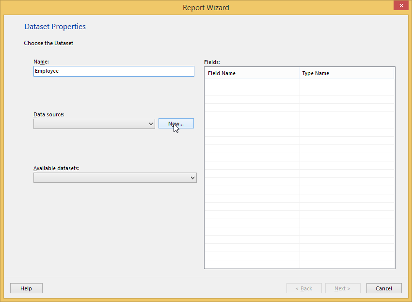
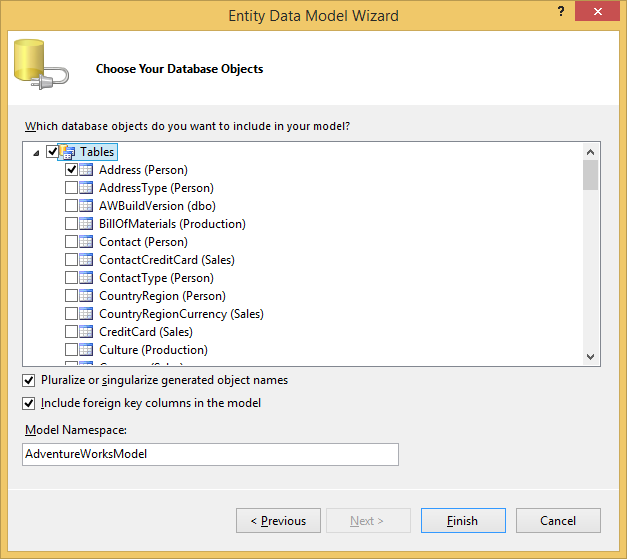
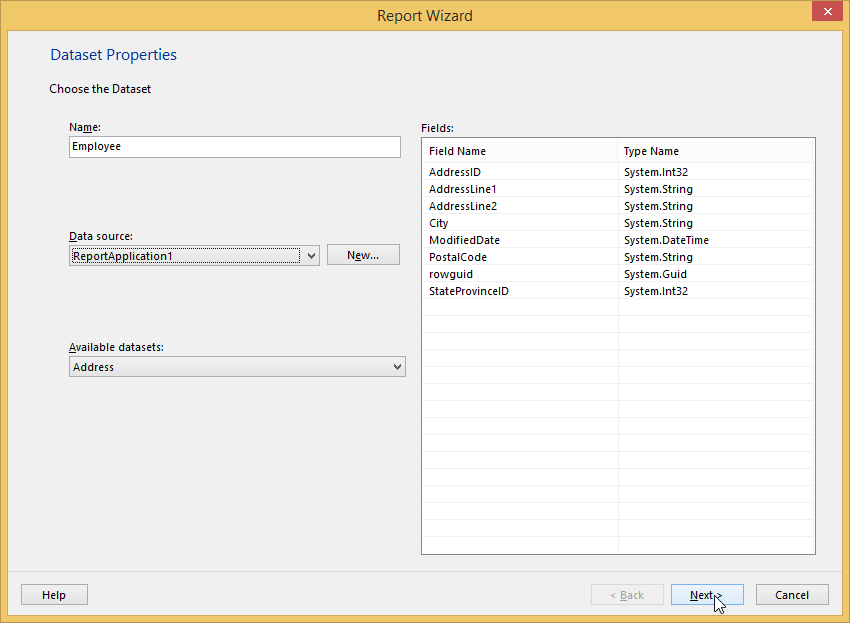
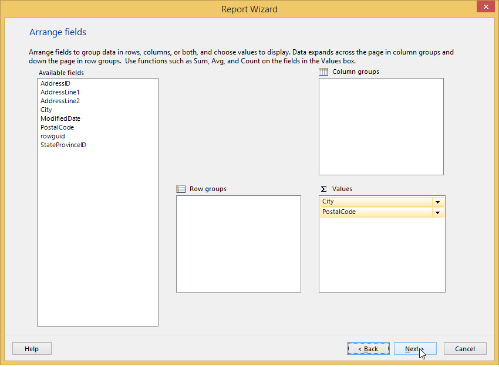
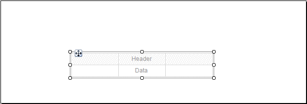

# Create RDLC Report In VS2010 and Show It in Report Viewer

This section covers the steps to create RDLC report in VS2010 and shows the created RDLC report in the Report viewer.

1. Create a new WPF application with .Net Framework 4. The Solution Explorer dialog opens.

   N> In the following example, the new WPF application is created in the name of ReportsApplication8.

2. To add a new RDLC report in the WPF application, right-click on the newly added WPF application in the Solution Explorer 
   dialog.
	
   
   
   Add option in Solution Explorer
   {:.caption}
   
3. Select Add, and then click New Item. The Add New Item dialog opens.

4. To create a dataset for the RDLC report, click Reporting under Visual C# Items.

5. Click Report, and then click Add. 

6. The Report Wizard opens.

   
   
   Add New Item window
   {:.caption}
   
   
   Report Wizard
   {:.caption}

7. Enter a dataset name in Name field.To choose a data source for the dataset, click New on the right of Data source drop-down 
   combo box. The Data Source Configuration Wizard opens.
   
   

   Choose a Data Source Type
   {:.caption}
   
8. Click Database under Where will the application get data from? and then click Next.

   
   
   Choose a Database Model
   {:.caption}
   
9. Click Entity Data Model under What type of database model do you want to use?

10.Click Next. The Entity Data Model Wizard opens.

   

   Choose Model Contents
   {:.caption}
   
11.Click Generate from database under what should the model contain? 

12.Click Next.

   
   
   Choose Your Data Connection
   {:.caption}
   
13.Select a data connection from Which data connection should your application use to connect to the database? drop-down combo 
   box.
   
   N> You can create a new data connection by clicking New Connection.

14.Click Next.

   

   Choose Your Database Objects
   {:.caption}
   
15.Select the required object and click Next. The Data Source Configuration Wizard opens.

   

   Choose a Data Source Type
   {:.caption}
   
16.Select Object under Where will the application get data from? 

17.Click Next.

   
   
   Select the Data objects
   {:.caption}
   
18.Select the object under What objects do you want to bind to? 

19.Click Finish. The Report Wizard shows the details of the dataset under Fields.

   
   
   Report Wizard with added fields
   {:.caption}
   
20.Click Next.

   N> The fields are added under the dataset in Data Sources window.
   
   
   
   Data Sources with added fields
   {:.caption}
   
21.On Toolbox window, in Report Items, select Table.

   

   Table option in Toolbox
   {:.caption}
   
22.Draw a table on the WPF Designer window.

   
   
   WPF Designer window with table
   {:.caption}
   
23.Drag the dataset field on the Table.

   

   Table with dataset fields
   {:.caption}
 
24.To add Report Viewer in the WPF application, select ReportViewer under Reporting.

   
   
   ReportViewer option in Toolbox
   {:.caption}
   
   N> The following window is shown in the WPF Designer window.
   
   

   WPF Designer window with Report Viewer
   {:.caption}
   
25.Set the ReportPath and the ProcessingMode as local in the Report Viewer.


<Window x:Class="WpfApplication15.MainWindow"

        xmlns="http://schemas.microsoft.com/winfx/2006/xaml/presentation"

        xmlns:x="http://schemas.microsoft.com/winfx/2006/xaml"

        Title="MainWindow" Height="350" Width="525" xmlns:syncfusion="http://schemas.syncfusion.com/wpf">

    <Grid >

        <syncfusion:ReportViewer Name="reportViewer1" ProcessingMode="Local" ReportPath="..\..\SampleReport.rdlc" />

    </Grid>

</Window>


26.Set the DataSource information in the code to view the report in the Report Viewer.


public MainWindow()

{

    InitializeComponent();

    this.Loaded += new RoutedEventHandler(MainWindow_Loaded);

}

void MainWindow_Loaded(object sender, RoutedEventArgs e)

{

    this.reportViewer1.DataSources.Clear();

    this.reportViewer1.DataSources.Add(new Syncfusion.Windows.Reports.ReportDataSource()

    {

                Name = "DataSet1",

                Value = new AdventureWorksEntities().Addresses.Take(100)

   });

    this.reportViewer1.RefreshReport();

}


27.Run the application. The following output is displayed.
   
	
   Report Viewer with RDLC reports
   {:.caption}
	