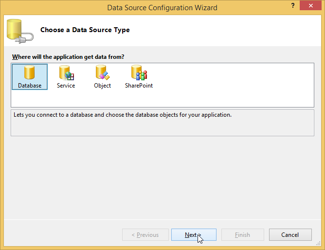
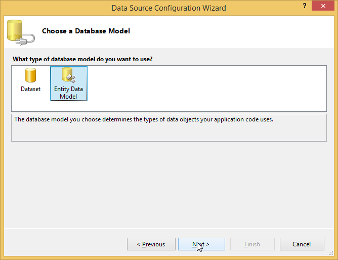
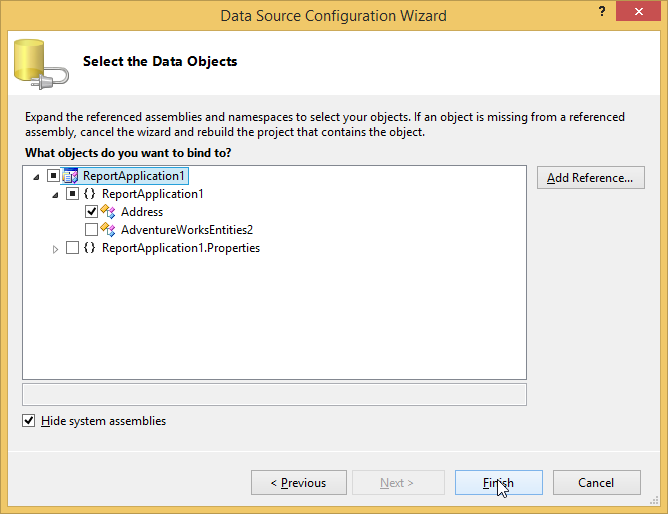
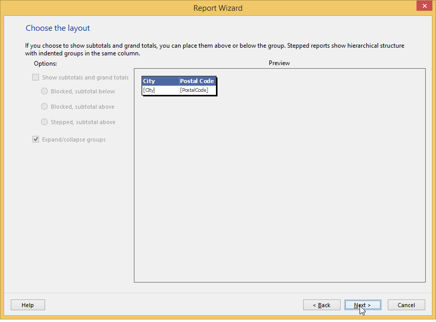

# Create RDLC Report In VS2010 and Show It in Report Viewer

This section covers the steps to create RDLC report in VS2010 and shows the created RDLC report in the Report viewer.

1. Create a new WPF application with .Net Framework 4. The Solution Explorer dialog opens.
   
2. To add a new RDLC report in the WPF application, right-click on the newly added WPF application in the Solution Explorer.

3. Select Add, and then click New Item. 

   

4. Then Add New Item dialog opens.

5. To create a dataset for the RDLC report, click Reporting under Visual C# Items.

6. Click Report, and then click Add. 

   

7. The Report Wizard opens.

8. Enter a dataset name in Name field.To choose a data source for the dataset, click New on the right of Data source drop-down combo box. 

   

9. Then Data Source Configuration Wizard opens.

10. Click Database under Where will the application get data from? and then click Next.

    

11. Click Entity Data Model under What type of database model do you want to use? and click Next.

    

12. Then Entity Data Model Wizard opens.

13. Click Generate from database under what should the model contain? and click Next.

    

14. Select a data connection from Which data connection should your application use to connect to the database? drop-down combo box. Click Next.

    

15. Select the required object and click Next. The Data Source Configuration Wizard opens.

    

16. Select Object under Where will the application get data from? and click Next.

    

17. Select the object under What objects do you want to bind to? and click Finish. 

    

18. The Report Wizard shows the details of the dataset under Fields and Click Next.

    

19. Arrange the available fields to row groups, column groups and values field. Click Next.

    

20. Choose the layout design in the next window and click Next.

    	

21. In the next window, choose the style and click Finish.

    
	
22. On Toolbox window, in Report Items, select Table.

    

23. Draw a table on the WPF Designer window.

    

24. Drag the dataset field on the Table.

    

25. To add Report Viewer in the WPF application, select ReportViewer under Reporting.

    

26. Set the ReportPath and the ProcessingMode as local in the Report Viewer.

    ~~~xml
    <Window x:Class="WpfApplication15.MainWindow"
        xmlns="http://schemas.microsoft.com/winfx/2006/xaml/presentation"
        xmlns:x="http://schemas.microsoft.com/winfx/2006/xaml"
        Title="MainWindow" Height="350" Width="525" xmlns:syncfusion="http://schemas.syncfusion.com/wpf">
        <Grid>
            <syncfusion:ReportViewer Name="viewer" ProcessingMode="Local" ReportPath="..\..\ProductCatalog.rdlc" />
        </Grid>
    </Window>
    ~~~

27. Set the DataSource information in the code to view the report in the Report Viewer.

    ~~~csharp
    public MainWindow()
    {
        InitializeComponent();
        this.Loaded += new RoutedEventHandler(MainWindow_Loaded);
    }
    void MainWindow_Loaded(object sender, RoutedEventArgs e)
    {
        this.viewer.DataSources.Clear();
        this.viewer.DataSources.Add(new Syncfusion.Windows.Reports.ReportDataSource()
        {
            Name = "Employee",
            Value = new AdventureWorksEntities().Addresses.Take(100)
        });
        this.viewer.RefreshReport();
    }
    ~~~

28. Run the application. The following output is displayed.

    