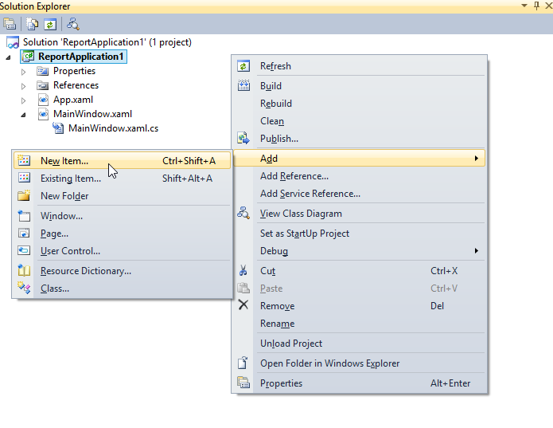
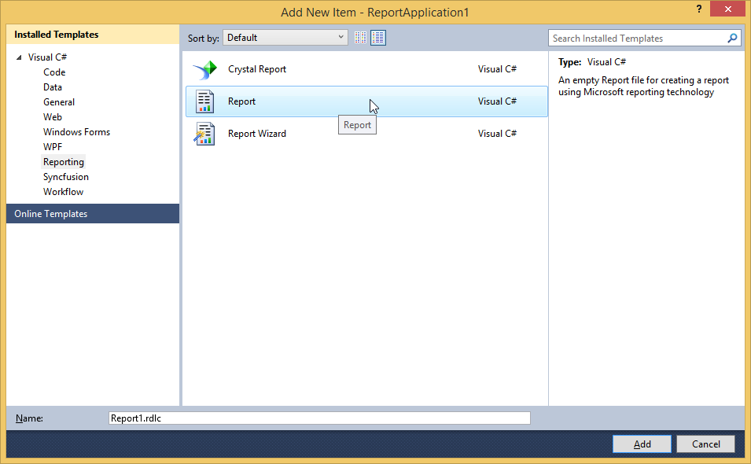
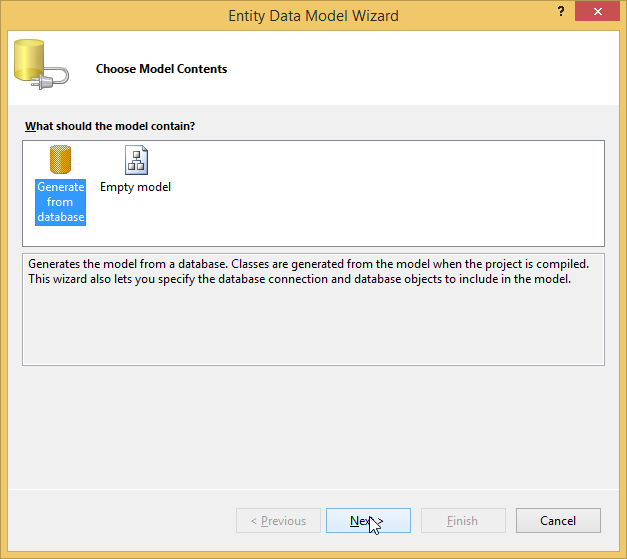
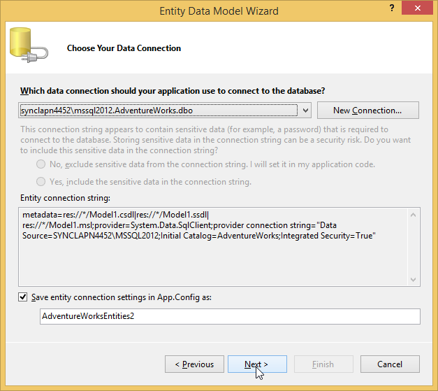
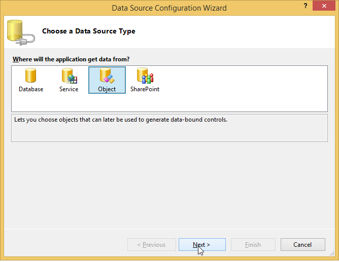
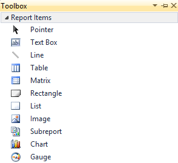
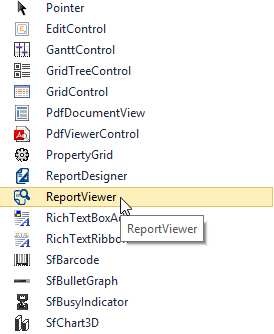

### Create RDLC Report In VS2010 and Show It in Report Viewer

This section covers the steps to create RDLC report in VS2010 and shows the created RDLC report in the Report viewer.

1. Create a new WPF application with .Net Framework 4. The Solution Explorer dialog opens.
> Note: In the following example, the new WPF application is created in the name of ReportsApplication8.

2. To add a new RDLC report in the WPF application, right-click on the newly added WPF application in the Solution Explorer dialog.

3. Select Add, and then click New Item. The Add New Item dialog opens.
4. To create a dataset for the RDLC report, click Reporting under Visual C# Items.
5. Click Report, and then click Add. 
6. The Report Wizard opens.

1. Enter a dataset name in Name field.To choose a data source for the dataset, click New on the right of Data source drop-down combo box. The Data Source Configuration Wizard opens.

  

2. Click Database under Where will the application get data from? and then click Next.

  

3. Click Entity Data Model under What type of database model do you want to use?
4. Click Next. The Entity Data Model Wizard opens.

  

5. Click Generate from database under what should the model contain? 
6. Click Next.

7. Select a data connection from Which data connection should your application use to connect to the database? drop-down combo box.

> Note: You can create a new data connection by clicking New Connection.

8. Click Next.

  

9. Select the required object and click Next. The Data Source Configuration Wizard opens.

  

10. Select Object under Where will the application get data from? 
11. Click Next.

  

12. Select the object under What objects do you want to bind to? 
13. Click Finish. The Report Wizard shows the details of the dataset under Fields.

  

14. Click Next.

> Note: The fields are added under the dataset in Data Sources window.

  

15. On Toolbox window, in Report Items, select Table.

  

16. Draw a table on the WPF Designer window.

  

17. Drag the dataset field on the Table.

  

18. To add Report Viewer in the WPF application, select ReportViewer under Reporting.

  

> Note: The following window is shown in the WPF Designer window.

  

19. Set the ReportPath and the ProcessingMode as local in the Report Viewer.



<Window x:Class="WpfApplication15.MainWindow"

        xmlns="http://schemas.microsoft.com/winfx/2006/xaml/presentation"

        xmlns:x="http://schemas.microsoft.com/winfx/2006/xaml"

        Title="MainWindow" Height="350" Width="525" xmlns:syncfusion="http://schemas.syncfusion.com/wpf">

    <Grid >

        <syncfusion:ReportViewer Name="reportViewer1" ProcessingMode="Local" ReportPath="..\..\SampleReport.rdlc" />

    </Grid>

</Window>



20. Set the DataSource information in the code to view the report in the Report Viewer.



public MainWindow()

{

    InitializeComponent();

    this.Loaded += new RoutedEventHandler(MainWindow_Loaded);

}

void MainWindow_Loaded(object sender, RoutedEventArgs e)

{

    this.reportViewer1.DataSources.Clear();

    this.reportViewer1.DataSources.Add(new Syncfusion.Windows.Reports.ReportDataSource()

    {

                Name = "DataSet1",

                Value = new AdventureWorksEntities().Addresses.Take(100)

   });

    this.reportViewer1.RefreshReport();

}



21. Run the application. The following output is displayed.

  

