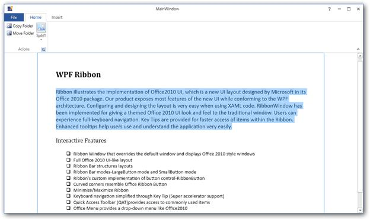

# Add command to RibbonLauncherButton

Ribbon instance now provides command support for RibbonBar LauncherButton. It provides the following options.

* Setting LauncherButton Command
* Setting LauncherButton CommandTarget
* Setting LauncherButton CommandParameter

## Set RibbonBar LauncherButton Command

Command for RibbonBar LauncherButton can be set by using `LauncherCommand` attached property. The following code example illustrates this.



[XAML]

<syncfusion:Ribbon  VerticalAlignment="Top" >

<syncfusion:RibbonTab  Caption="Home" IsChecked="False">

<syncfusion:RibbonBar  Header="Acions"  IsLauncherButtonVisible="True" syncfusion:RibbonBar.LauncherCommand="EditingCommands.IncreaseFontSize" syncfusion:RibbonBar.LauncherCommandTarget="{Binding ElementName=Editor}">

<syncfusion:RibbonButton SizeForm="Small"  Label="Copy Folder"/>

<syncfusion:RibbonButton SizeForm="Small" Label="Move Folder"/>

<syncfusion:SplitButton  Label=" Split1 "   SizeForm="Large" >

<syncfusion:RibbonButton SizeForm="Small"  Label="Mark to Download"/>

<syncfusion:RibbonButton SizeForm="Small"  Label="UnMark to Download"/>

</syncfusion:SplitButton>

</syncfusion:RibbonBar>

</syncfusion:RibbonTab>

<syncfusion:RibbonTab  Caption="Insert" />

</syncfusion:Ribbon>



The font size for the selected text is increased when launcher button is clicked

