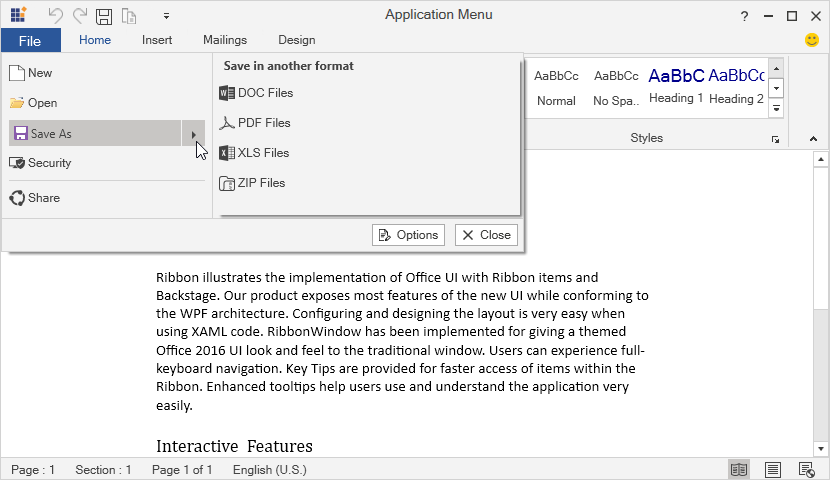

# Application Menu in WPF Ribbon

The [`ApplicationMenu`](https://help.syncfusion.com/cr/wpf/Syncfusion.Windows.Tools.Controls.ApplicationMenu.html) can be added by using [`ApplicationMenu`](https://help.syncfusion.com/cr/wpf/Syncfusion.Windows.Tools.Controls.Ribbon.html#Syncfusion_Windows_Tools_Controls_Ribbon_ApplicationMenu) property of Ribbon. To show the [`ApplicationMenu`](https://help.syncfusion.com/cr/wpf/Syncfusion.Windows.Tools.Controls.ApplicationMenu.html), click the **FILE** button in Ribbon like in Microsoft Outlook.

The [`IsPopupOpen`](https://help.syncfusion.com/cr/wpf/Syncfusion.Windows.Tools.Controls.ApplicationMenu.html#Syncfusion_Windows_Tools_Controls_ApplicationMenu_IsPopupOpen) boolean property is used to show the [`ApplicationMenu`](https://help.syncfusion.com/cr/wpf/Syncfusion.Windows.Tools.Controls.ApplicationMenu.html) while launching itself.

N> The [`BackStage`](https://help.syncfusion.com/cr/wpf/Syncfusion.Windows.Tools.Controls.Ribbon.html#Syncfusion_Windows_Tools_Controls_Ribbon_BackStage) is not applicable when the ApplicationMenu is needed.

## Adding MenuItems in ApplicationMenu

[`MenuItems`](https://help.syncfusion.com/cr/wpf/Syncfusion.Windows.Tools.Controls.ApplicationMenu.html#Syncfusion_Windows_Tools_Controls_ApplicationMenu_MenuItems) are displayed in right of the [`ApplicationMenu`](https://help.syncfusion.com/cr/wpf/Syncfusion.Windows.Tools.Controls.ApplicationMenu.html). Different [`MenuItems`](https://help.syncfusion.com/cr/wpf/Syncfusion.Windows.Tools.Controls.ApplicationMenu.html#Syncfusion_Windows_Tools_Controls_ApplicationMenu_MenuItems) are added to an application menu using its [`MenuItems`](https://help.syncfusion.com/cr/wpf/Syncfusion.Windows.Tools.Controls.ApplicationMenu.html#Syncfusion_Windows_Tools_Controls_ApplicationMenu_MenuItems) property.

## Adding ApplicationItems in ApplicationMenu

[`ApplicationItems`](https://help.syncfusion.com/cr/wpf/Syncfusion.Windows.Tools.Controls.ApplicationMenu.html#Syncfusion_Windows_Tools_Controls_ApplicationMenu_ApplicationItems) are displayed in bottom of the [`ApplicationMenu`](https://help.syncfusion.com/cr/wpf/Syncfusion.Windows.Tools.Controls.ApplicationMenu.html). Different [`ApplicationItems`](https://help.syncfusion.com/cr/wpf/Syncfusion.Windows.Tools.Controls.ApplicationMenu.html#Syncfusion_Windows_Tools_Controls_ApplicationMenu_ApplicationItems) are added to an application menu using its [`ApplicationItems`](https://help.syncfusion.com/cr/wpf/Syncfusion.Windows.Tools.Controls.ApplicationMenu.html#Syncfusion_Windows_Tools_Controls_ApplicationMenu_ApplicationItems) property.

 

 

<syncfusion:RibbonWindow
    x:Class="ApplicationMenu.MainWindow"
    xmlns="http://schemas.microsoft.com/winfx/2006/xaml/presentation"
    xmlns:x="http://schemas.microsoft.com/winfx/2006/xaml"
    xmlns:syncfusion="http://schemas.syncfusion.com/wpf"
    xmlns:syncfusionskin="clr-namespace:Syncfusion.SfSkinManager;assembly=Syncfusion.SfSkinManager.WPF"
    Width="900"
    Height="600"
    syncfusionskin:SfSkinManager.Theme="{syncfusionskin:SkinManagerExtension ThemeName=Office2019Colorful}"
    WindowStartupLocation="CenterScreen">
    <Grid>
        <Grid.RowDefinitions>
            <RowDefinition Height="Auto" />
            <RowDefinition Height="*" />
        </Grid.RowDefinitions>
        <Grid>
            <syncfusion:Ribbon x:Name="_ribbon" VerticalAlignment="Top">
                <syncfusion:Ribbon.ApplicationMenu>
                    <syncfusion:ApplicationMenu
                        Name="_applicationMenu"
                        Width="38"
                        Height="38"
                        syncfusion:Ribbon.KeyTip="F"
                        IsBelowAppButton="True"
                        IsPopupOpen="False">
                        <syncfusion:RibbonButton
                            Width="200"
                            Height="30"
                            Label="New"
                            SizeForm="Small" />
                        <syncfusion:RibbonButton
                            Width="200"
                            Height="30"
                            Label="Open"
                            SizeForm="Small" />
                        <syncfusion:SplitMenuButton
                            Width="200"
                            Height="30"
                            Label="Save As">
                            <syncfusion:ApplicationMenuGroup Header="Save in another format" IconBarEnabled="False">
                                <syncfusion:RibbonButton
                                    Height="30"
                                    Label="DOC Files"
                                    SizeForm="Small" />
                                <syncfusion:RibbonButton
                                    Height="30"
                                    Label="PDF Files"
                                    SizeForm="Small" />
                                <syncfusion:RibbonButton
                                    Height="30"
                                    Label="XLS Files"
                                    SizeForm="Small" />
                                <syncfusion:RibbonButton
                                    Height="30"
                                    Label="ZIP Files"
                                    SizeForm="Small" />
                            </syncfusion:ApplicationMenuGroup>
                        </syncfusion:SplitMenuButton>
                        <syncfusion:RibbonButton
                            Width="200"
                            Height="30"
                            Label="Security"
                            SizeForm="Small" />
                        <Separator />
                        <syncfusion:RibbonButton
                            Width="200"
                            Height="30"
                            Label="Share"
                            SizeForm="Small" />
                        <syncfusion:ApplicationMenu.MenuItems>
                            <TextBlock MinWidth="300" FontWeight="Bold">Create New Outlook Item</TextBlock>
                            <Separator />
                            <syncfusion:SimpleMenuButton Label="Recent Document lists" />
                            <syncfusion:SimpleMenuButton Label="Document lists" />
                        </syncfusion:ApplicationMenu.MenuItems>
                        <syncfusion:ApplicationMenu.ApplicationItems>
                            <syncfusion:ButtonAdv
                                Background="Transparent"
                                Label="Options"
                                SizeMode="Normal" />
                            <syncfusion:ButtonAdv
                                Background="Transparent"
                                Label="Close"
                                SizeMode="Normal" />
                        </syncfusion:ApplicationMenu.ApplicationItems>
                    </syncfusion:ApplicationMenu>
                </syncfusion:Ribbon.ApplicationMenu>
                <syncfusion:RibbonTab Caption="HOME" IsChecked="True">
                    <syncfusion:RibbonBar Name="New" Header="New">
                        <syncfusion:RibbonButton Label="New Email" SizeForm="Large" />
                        <syncfusion:DropDownButton Label="New Items" SizeForm="Large">
                            <syncfusion:DropDownMenuItem Header="E-mail Message" />
                            <syncfusion:DropDownMenuItem Header="Appointment" />
                            <syncfusion:DropDownMenuItem Header="Meeting" />
                            <syncfusion:DropDownMenuItem Header="Contact" />
                            <syncfusion:DropDownMenuItem Header="Task" />
                        </syncfusion:DropDownButton>
                    </syncfusion:RibbonBar>
                    <syncfusion:RibbonBar Name="Delete" Header="Delete">
                        <syncfusion:RibbonButton Label="Ignore" />
                        <syncfusion:SplitButton Label="Clean Up">
                            <syncfusion:DropDownMenuItem Header="Clean Up Folder" />
                            <syncfusion:DropDownMenuItem Header="Clean Up Conversation" />
                            <syncfusion:DropDownMenuItem Header="Clean Up Folder/SubFolder" />
                        </syncfusion:SplitButton>
                        <syncfusion:SplitButton
                            Width="76"
                            Margin="0,0,12,0"
                            Label="Junk" />
                        <syncfusion:RibbonButton Label="Delete" SizeForm="Large" />
                    </syncfusion:RibbonBar>
                    <syncfusion:RibbonBar Name="Respond" Header="Respond">
                        <syncfusion:RibbonButton Label="Reply" SizeForm="Large" />
                        <syncfusion:RibbonButton Label="Reply All" SizeForm="Large" />
                        <syncfusion:RibbonButton Label="Forward" SizeForm="Large" />
                        <syncfusion:RibbonButton Label="Meeting" />
                        <syncfusion:SplitButton
                            Width="68"
                            Margin="-2,0,6,0"
                            Label="IM" />
                        <syncfusion:SplitButton
                            Width="68"
                            Margin="-2,0,6,0"
                            Label="More" />
                    </syncfusion:RibbonBar>
                    <syncfusion:RibbonBar Name="QuickSteps" Header="Quick Steps">
                        <syncfusion:RibbonGallery
                            Width="160"
                            ItemHeight="20"
                            ItemWidth="70"
                            VisualMode="InRibbon">
                            <syncfusion:RibbonGalleryItem Content="Move to?" />
                            <syncfusion:RibbonGalleryItem Content="Team Email" />
                            <syncfusion:RibbonGalleryItem Content="ReplyDelete" />
                            <syncfusion:RibbonGalleryItem Content="To Manager" />
                            <syncfusion:RibbonGalleryItem Content="Done" />
                            <syncfusion:RibbonGalleryItem Content="Create New" />
                        </syncfusion:RibbonGallery>
                    </syncfusion:RibbonBar>
                    <syncfusion:RibbonBar Name="Find" Header="Find">
                        <syncfusion:RibbonComboBox Width="160" Label="Filter Email">
                            <ComboBoxItem>Person1@mail.com</ComboBoxItem>
                            <ComboBoxItem>Person2@mail.com</ComboBoxItem>
                            <ComboBoxItem>Person3@mail.com</ComboBoxItem>
                        </syncfusion:RibbonComboBox>
                    </syncfusion:RibbonBar>
                </syncfusion:RibbonTab>
                <syncfusion:RibbonTab Caption="SEND/RCEIVE" IsChecked="False" />
                <syncfusion:RibbonTab Caption="FOLDER" IsChecked="False" />
                <syncfusion:RibbonTab Caption="VIEW" IsChecked="False" />
                <syncfusion:Ribbon.QuickAccessToolBar>
                    <syncfusion:QuickAccessToolBar>
                        <syncfusion:RibbonButton SizeForm="ExtraSmall" />
                        <syncfusion:RibbonButton SizeForm="ExtraSmall" />
                        <syncfusion:QuickAccessToolBar.QATMenuItems>
                            <syncfusion:RibbonButton Label="Send" />
                            <syncfusion:RibbonButton Label="Forward" />
                            <syncfusion:RibbonButton Label="ReplyAll" />
                            <syncfusion:RibbonButton Label="Delete" />
                            <syncfusion:RibbonButton Label="Print" />
                        </syncfusion:QuickAccessToolBar.QATMenuItems>
                    </syncfusion:QuickAccessToolBar>
                </syncfusion:Ribbon.QuickAccessToolBar>
            </syncfusion:Ribbon>
        </Grid>
    </Grid>
</syncfusion:RibbonWindow>

 

 

  