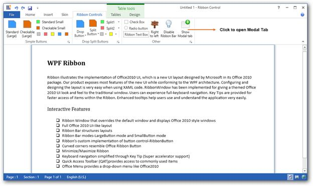
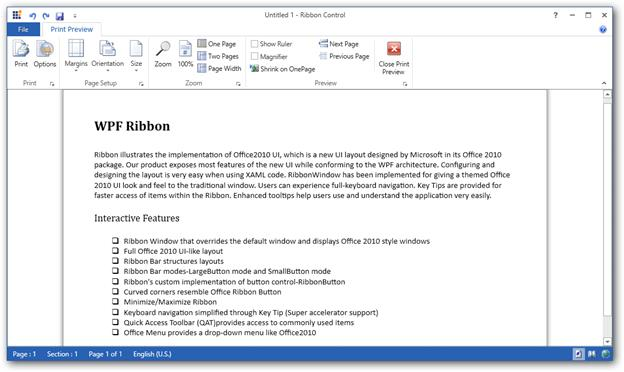

# Creating Ribbon Model Tab

Modal Tab in Ribbon Control are used to display a collection of commands other than the commands which are found in the core tabs. At this point, the core tabs will be disabled.

## Use Case Scenarios

Print Preview is a Modal Tab which displays Print Preview related commands

## Adding Modal Tabs to an Application

To add RibbonTabs as ModalTabs in an application,use `ModalTabCollection` property of the Ribbon. This is illustrated in the code given below.



[XAML]

<syncfusion:Ribbon.ModalTabCollection  >

<syncfusion:ModalTabCollection >

<syncfusion:RibbonTab Caption="Print Preview" x:Name="printpreviewtab">

<syncfusion:RibbonBar Header="Sample Bar">

<syncfusion:RibbonButton Label="Close Tab"/>

</syncfusion:RibbonBar>

</syncfusion:RibbonTab>

</syncfusion:ModalTabCollection>

</syncfusion:Ribbon.ModalTabCollection>



## How to handle Modal Tabs in Ribbon?

The `ShowModalTab` and `CloseModalTabs` method handle the visibility of the Modal Tabs in the Ribbon control. Any ModalTab from the ModalTabCollection can be displayed whenever required.

To show specific Modal Tab in ribbon, call `ShowModalTab` method.This can be done from any event of core Ribbon Tab control

This is illustrated in the code given below.



[C#]

private void ShowModalTabBtn_Click(object sender, RoutedEventArgs e) 

{ 

this.MyRibbon.ShowModalTab("printpreviewtab"); 

}



`CloseModalTabs` method will close the currently opened Modal Tab in Ribbon control. This method should be called in any event of currently displaying Modal Tab element.This is illustrated in the code given below.



[C#]

private void CloseModalTabBtn_Click(object sender, RoutedEventArgs e) 

{ 

this.MyRibbon.CloseModalTabs(); 

}



