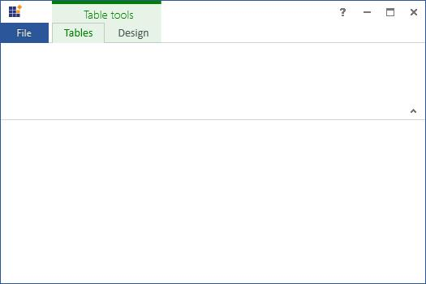

# Grouping RibbonTabs using ContextTabGroups

ContextualTabGroups are used to group the RibbonTabs for easy Navigation. This ContextTabGroups will appear when a user enable their context. 

## Creating ContextTabGroup 

This ContextTabGroup can also be kept hidden and shown while required cases like in Word Document’s TABLETOOLS ContextTabGroups which will get displayed automatically, while selecting the table.  The following code snippet used to create a ContextTabGroup



[XAML]

<syncfusion:Ribbon.ContextTabGroups>

<syncfusion:ContextTabGroup Label="Table tools" IsGroupVisible="True" BackColor="Green">

<syncfusion:RibbonTab Caption="Tables" IsChecked="True" />

<syncfusion:RibbonTab Caption="Design" IsChecked="False" />

</syncfusion:ContextTabGroup>

</syncfusion:Ribbon.ContextTabGroups>



## Multiple ContextTabs

To differentiate one ContextTabGroup with one another, change its `BackColor` property of the ContextTabGroup , Since a ContextTabGroup Support to have multiple context Tab.



[XAML]

<syncfusion:Ribbon.ContextTabGroups>

<syncfusion:ContextTabGroup Label="Table Tools" BackColor="Green" IsGroupVisible="True">

<syncfusion:RibbonTab Caption="Tables" IsChecked="False" />

<syncfusion:RibbonTab Caption="Design" IsChecked="False" />

</syncfusion:ContextTabGroup>

<syncfusion:ContextTabGroup Label="Table Grid" BackColor="Red" IsGroupVisible="True">

<syncfusion:RibbonTab Caption="Tables" IsChecked="False" />

<syncfusion:RibbonTab Caption="Design" IsChecked="False" />

</syncfusion:ContextTabGroup>

</syncfusion:Ribbon.ContextTabGroups>



## ContextTabGroup Heading

The `Label` property of the ContextTabGroup is used to define the Heading for the ContextTabGroup. 



[XAML]

<syncfusion:Ribbon.ContextTabGroups>

<syncfusion:ContextTabGroup Label="Table tools" BackColor="Green" IsGroupVisible="True">

<syncfusion:RibbonTab Caption="Tables" IsChecked="False" />

<syncfusion:RibbonTab Caption="Design" IsChecked="False" />

</syncfusion:ContextTabGroup>

</syncfusion:Ribbon.ContextTabGroups>



## Changing the visibility at run time

ContextTabgroup visibility can also be changed at the runtime. To change the visibility, enable `IsGroupVisible` property of the ContextTabGroup



[XAML]

<syncfusion:Ribbon  VerticalAlignment="Top" >

<syncfusion:Ribbon.ContextTabGroups>

<syncfusion:ContextTabGroup x:Name="tableContextTabGroup" Label="Table tools" BackColor="Red"  >

<syncfusion:RibbonTab Caption="Tables" IsChecked="False" >

</syncfusion:RibbonTab>

<syncfusion:RibbonTab Caption="Design" IsChecked="False" >

</syncfusion:RibbonTab>

</syncfusion:ContextTabGroup>

</syncfusion:Ribbon.ContextTabGroups>

</syncfusion:Ribbon>





[C#]

private void Button_Click(object sender, RoutedEventArgs e)

{

tableContextTabGroup.IsGroupVisible = true;

}



The output of the above code is illustrated in the following screenshot

After the Button is clicked, the ContextTabGroup visibility will change as follows

