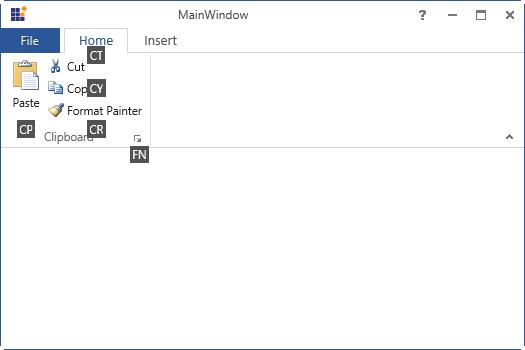
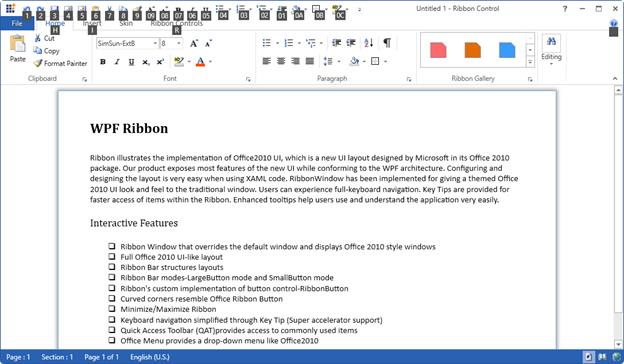
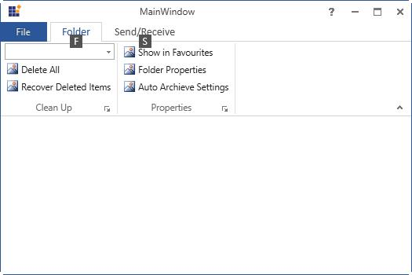
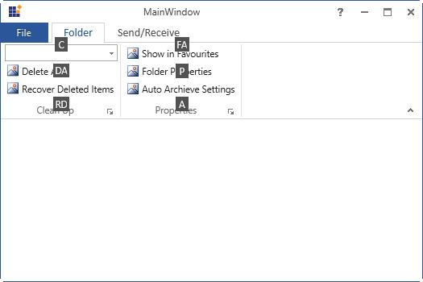
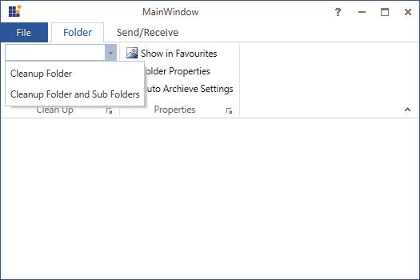
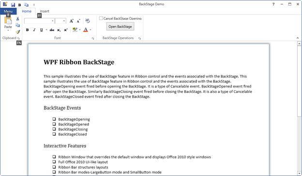
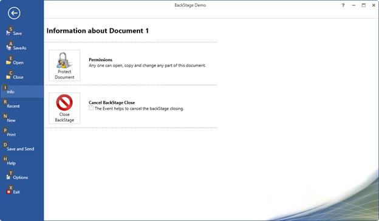

# KeyBoard access using KeyTip

To invoke its command by pressing corresponding KeyTip, Ribbon control provides KeyTip support to access the Ribbonitem using Keyboard. On pressing Alt key, KeyTips for all the RibbonItem will get displayed. 

## Adding KeyTip to the Ribbon items

RibbonControl provides with an attached property called KeyTip that helps to set the KeyTip for the Ribbonitem. It also let to set the KetTip for the RibbonTab,Launcher Button,and for the controls which are needed to add in the Ribbon Instance like RibboButton,SplitButton…etc



[XAML]

<syncfusion:Ribbon Name="_ribbon" VerticalAlignment="Top">

<syncfusion:RibbonTab Caption="Home"  syncfusion:Ribbon.KeyTip="H" >

<syncfusion:RibbonBar Header="Clipboard" syncfusion:Ribbon.KeyTip="FN" >

<syncfusion:RibbonButton Label="Paste" SizeForm="Large"

LargeIcon="/Resources/Paste32.png"   

syncfusion:Ribbon.KeyTip="CP"/>  

<syncfusion:RibbonButton  Label="Cut" SizeForm="Small"  

SmallIcon="/Resources/Cut16.png"  syncfusion:Ribbon.KeyTip="CT"/>

<syncfusion:RibbonButton  Label="Copy" SizeForm="Small"  SmallIcon="/Resources/Copy16.png"  

syncfusion:Ribbon.KeyTip="CY" />    

<syncfusion:RibbonButton  Label="Format Painter" SizeForm="Small"  

SmallIcon="/Resources/FormatPainter16.png"  

syncfusion:Ribbon.KeyTip="CR" />

</syncfusion:RibbonBar>

</syncfusion:RibbonTab>

<syncfusion:RibbonTab Caption="Insert" syncfusion:Ribbon.KeyTip="I" IsChecked="True" />

</syncfusion:Ribbon>



## KeyTip for QAT items

KeyTip for the QAT items will get displayed by default by pressing Alt Key.The KeyTip will set  in the order like…1,2,3,4,5,6,7,8,9,09,08,07…….01,0A,0B……etc.



[XAML]

<syncfusion:Ribbon.QuickAccessToolBar>

<syncfusion:QuickAccessToolBar>

<syncfusion:QuickAccessToolBar.QATMenuItems>

<syncfusion:RibbonButton Label="Save" syncfusion:RibbonCommandManager.SynchronizedItem="Save" />

<syncfusion:RibbonButton Label="Quick Print" syncfusion:RibbonCommandManager.SynchronizedItem="Quick Print"/>

<syncfusion:RibbonButton Label="Print Preview" syncfusion:RibbonCommandManager.SynchronizedItem="Print Preview"/>

<syncfusion:RibbonButton Label="Undo" syncfusion:RibbonCommandManager.SynchronizedItem="Undo"  />

<syncfusion:RibbonButton Label="Redo" syncfusion:RibbonCommandManager.SynchronizedItem="Redo" />

<syncfusion:RibbonButton Label="Paste" syncfusion:RibbonCommandManager.SynchronizedItem="Paste"/>

</syncfusion:QuickAccessToolBar.QATMenuItems>

<syncfusion:RibbonButton Label="Undo" SmallIcon="/Resources/Undo16.png" SizeForm="ExtraSmall"   

ToolTip="Undo" syncfusion:RibbonCommandManager.SynchronizedItem="Undo" />

<syncfusion:RibbonButton Label="Redo" SmallIcon="/Resources/Redo16.png" SizeForm="ExtraSmall"

ToolTip="Redo" syncfusion:RibbonCommandManager.SynchronizedItem="Redo"/>

<syncfusion:RibbonButton Command="ApplicationCommands.Save" SizeForm="ExtraSmall"

syncfusion:RibbonCommandManager.SynchronizedItem="Save" SmallIcon="/Resources/Save16.png"/>

</syncfusion:QuickAccessToolBar>

</syncfusion:Ribbon.QuickAccessToolBar>



## How to access particular item in Ribbon using KeyTip?

The below example illustrates how to access particular Ribbonitem using KeyTip



[XAML]

<syncfusion:Ribbon  VerticalAlignment="Top" >

<syncfusion:RibbonTab syncfusion:Ribbon.KeyTip="F"  Caption="Folder" IsChecked="True" >

<syncfusion:RibbonBar  Header="Clean Up"  >

<syncfusion:RibbonComboBox  syncfusion:Ribbon.KeyTip="C" Label="CleanUp">

<syncfusion:RibbonComboBoxItem  Content="Cleanup Folder"/>

<syncfusion:RibbonComboBoxItem Content="Cleanup Folder and Sub Folders"/>

</syncfusion:RibbonComboBox>

<syncfusion:RibbonButton syncfusion:Ribbon.KeyTip="DA"  SizeForm="Small"  Label="Delete All"/>

<syncfusion:RibbonButton syncfusion:Ribbon.KeyTip="RD"  SizeForm="Small"   Label="Recover Deleted Items"/>

</syncfusion:RibbonBar >

<syncfusion:RibbonBar  Name="_ribbonBar"   Header="Properties"  >

<syncfusion:RibbonButton syncfusion:Ribbon.KeyTip="FA"  SizeForm="Small"  Label="Show in Favourites"/>

<syncfusion:RibbonButton syncfusion:Ribbon.KeyTip="P"  SizeForm="Small"  Label="Folder Properties"/>

<syncfusion:RibbonButton syncfusion:Ribbon.KeyTip="A"  SizeForm="Small"  Label="Auto Archieve Settings"/>

</syncfusion:RibbonBar>

</syncfusion:RibbonTab>

<syncfusion:RibbonTab syncfusion:Ribbon.KeyTip="S"   Caption="Send/Receive" IsChecked="False" />

</syncfusion:Ribbon>



The below screenshot displays the steps involved to access RibbonComboBox. When Alt key is pressed, KeyTip for the RibbonTab will be displayed. Then choose the desired RibbonTab with the KeyTip

In the Next Step, all the KeyTips under RibbonTab will get displayed 

Finally, Press the RibbonComboBox KeyTip to access it

## How does BackStage can be accessed using KeyTip?

The backstage feature of the Ribbon control provides KeyTip support to display KeyTips on pressing the Alt key. It is also possible to set KeyTip for the BackStage elements which includes BackStageCommandButton, BackStageTabItem



[XAML]

<syncfusion:Ribbon.BackStage>

<syncfusion:Backstage x:Name="_ribbonBackStage" syncfusion:Ribbon.KeyTip="B">

<syncfusion:BackStageCommandButton Header="Save" syncfusion:Ribbon.KeyTip="S"   Command="Save" Icon="/Resources/Save16.png"/>

<syncfusion:BackStageCommandButton Header="Save As" syncfusion:Ribbon.KeyTip="A"  Command="SaveAs"  Icon="/Resources/Save16.png"/>

<syncfusion:BackstageTabItem syncfusion:Ribbon.KeyTip="I" Header="Info"/>

<syncfusion:BackstageTabItem syncfusion:Ribbon.KeyTip="R" Header="Recent"/>

</syncfusion:Backstage>

</syncfusion:Ribbon.BackStage>



In the below screenshot, “B” is set as KeyTip for the Backstage. So when the user press “B”, it will automatically open the BackStage

The following screenshot display the KeyTip for the BackStageCommand and BackStageTabItem

