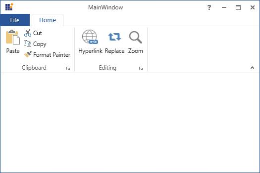
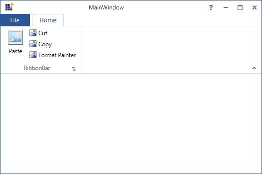

# Patterns and Practices

## Ribbon with MVVM

For better control customization MVVM pattern can be followed. The following code illustrate a simple MVVM pattern with Ribbon control

###Model





	public class CustomRibbonTab
    {
        public string TabHeader { get; set; }
        public ObservableCollection<CustomRibbonBar> CustomRibbonBars { get; set; }
        public CustomRibbonTab()
        {
            CustomRibbonBars = new ObservableCollection<CustomRibbonBar>();
        }
    }
    
    public class CustomRibbonBar
    {
        public string BarHeader { get; set; }
        public ObservableCollection<CustomRibbonItem> CustomRibbonItems { get; set; }
        public CustomRibbonBar()
        {
            CustomRibbonItems = new ObservableCollection<CustomRibbonItem>();
        }
    }

    public class CustomRibbonItem
    {
        public CustomRibbonItem()
        {
            IsSplitButton = false;
            IsBoolean = true;
        }

        public string ItemHeader
        {
            get;
            set;
        }

        public string Image { get; set; }
        public bool IsBoolean { get; set; }
        public bool IsLarge { get; set; }
        public bool IsSplitButton { get; set; }
    }





Public Class CustomRibbonTab

    Public Property TabHeader() As String
    Public Property CustomRibbonBars() As ObservableCollection(Of CustomRibbonBar)

    Public Sub New()

        CustomRibbonBars = New ObservableCollection(Of CustomRibbonBar)()

    End Sub

End Class

Public Class CustomRibbonBar

    Public Property BarHeader() As String
    Public Property CustomRibbonItems() As ObservableCollection(Of CustomRibbonItem)

    Public Sub New()

        CustomRibbonItems = New ObservableCollection(Of CustomRibbonItem)()

    End Sub

End Class

Public Class CustomRibbonItem

    Public Sub New()

        IsSplitButton = False
        IsBoolean = True

    End Sub

    Public Property ItemHeader() As String
    Public Property Image() As String
    Public Property IsBoolean() As Boolean
    Public Property IsLarge() As Boolean
    Public Property IsSplitButton() As Boolean

End Class





###ViewModel





	public class ViewModel
    {
        public ObservableCollection<CustomRibbonTab> CustomRibbonTabs { get; set; }
        public ViewModel()
        {
            CustomRibbonTabs = new ObservableCollection<CustomRibbonTab>();
            PopulateRibbonTabs();
        }
        void PopulateRibbonTabs()
        {
            CustomRibbonTab Tab1 = new CustomRibbonTab() { TabHeader = "Home" };
            PopulateRibbonHomeBars(Tab1);
            CustomRibbonTabs.Add(Tab1);
        }

        //Home Tab

        void PopulateRibbonHomeBars(CustomRibbonTab Tab)
        {
            CustomRibbonBar Bar1 = new CustomRibbonBar() { BarHeader = "Clipboard" };
            PopuplateRibbonNewItems(Bar1);

            CustomRibbonBar Bar2 = new CustomRibbonBar() { BarHeader = "Editing" };
            PopuplateRibbonEditingItems(Bar2);

            Tab.CustomRibbonBars.Add(Bar1);
            Tab.CustomRibbonBars.Add(Bar2);
        }

        void PopuplateRibbonNewItems(CustomRibbonBar Bar)
        {
            CustomRibbonItem Item1 = new CustomRibbonItem() { ItemHeader = "Paste", IsLarge = true, Image = "Paste32.png" };
            CustomRibbonItem Item2 = new CustomRibbonItem() { ItemHeader = "Cut", Image = "Cut16.png" };
            CustomRibbonItem Item3 = new CustomRibbonItem() { ItemHeader = "Copy", Image = "Copy16.png" };
            CustomRibbonItem Item4 = new CustomRibbonItem() { ItemHeader = "Format Painter", Image = "FormatPainter16.png" };

            Bar.CustomRibbonItems.Add(Item1);
            Bar.CustomRibbonItems.Add(Item2);
            Bar.CustomRibbonItems.Add(Item3);
            Bar.CustomRibbonItems.Add(Item4);
        }

        private void PopuplateRibbonEditingItems(CustomRibbonBar Bar)
        {
            CustomRibbonItem Item1 = new CustomRibbonItem() { ItemHeader = "Hyperlink", IsLarge = true, Image = "hyperlink32.png" };
            CustomRibbonItem Item2 = new CustomRibbonItem() { ItemHeader = "Replace", IsLarge = true, Image = "replace_32.png" };
            CustomRibbonItem Item3 = new CustomRibbonItem() { ItemHeader = "Zoom", IsLarge = true, Image = "Zoom_32x32.png" };

            Bar.CustomRibbonItems.Add(Item1);
            Bar.CustomRibbonItems.Add(Item2);
            Bar.CustomRibbonItems.Add(Item3);
        }

    }





	Public Class ViewModel

    Public Property CustomRibbonTabs() As ObservableCollection(Of CustomRibbonTab)
    Public Sub New()

        CustomRibbonTabs = New ObservableCollection(Of CustomRibbonTab)()
        PopulateRibbonTabs()

    End Sub

    Private Sub PopulateRibbonTabs()

        Dim Tab1 As New CustomRibbonTab() With {.TabHeader = "Home"}
        PopulateRibbonHomeBars(Tab1)
        CustomRibbonTabs.Add(Tab1)

    End Sub

    'Home Tab

    Private Sub PopulateRibbonHomeBars(ByVal Tab As CustomRibbonTab)

        Dim Bar1 As New CustomRibbonBar() With {.BarHeader = "Clipboard"}
        PopuplateRibbonNewItems(Bar1)

        Dim Bar2 As New CustomRibbonBar() With {.BarHeader = "Editing"}
        PopuplateRibbonEditingItems(Bar2)

        Tab.CustomRibbonBars.Add(Bar1)
        Tab.CustomRibbonBars.Add(Bar2)

    End Sub

    Private Sub PopuplateRibbonNewItems(ByVal Bar As CustomRibbonBar)

        Dim Item1 As New CustomRibbonItem() With {
            .ItemHeader = "Paste",
            .IsLarge = True,
            .Image = "Paste32.png"
        }
        Dim Item2 As New CustomRibbonItem() With {
            .ItemHeader = "Cut",
            .Image = "Cut16.png"
        }
        Dim Item3 As New CustomRibbonItem() With {
            .ItemHeader = "Copy",
            .Image = "Copy16.png"
        }
        Dim Item4 As New CustomRibbonItem() With {
            .ItemHeader = "Format Painter",
            .Image = "FormatPainter16.png"
        }

        Bar.CustomRibbonItems.Add(Item1)
        Bar.CustomRibbonItems.Add(Item2)
        Bar.CustomRibbonItems.Add(Item3)
        Bar.CustomRibbonItems.Add(Item4)

    End Sub

    Private Sub PopuplateRibbonEditingItems(ByVal Bar As CustomRibbonBar)

        Dim Item1 As New CustomRibbonItem() With {
            .ItemHeader = "Hyperlink",
            .IsLarge = True,
            .Image = "hyperlink32.png"
        }
        Dim Item2 As New CustomRibbonItem() With {
            .ItemHeader = "Replace",
            .IsLarge = True,
            .Image = "replace_32.png"
        }
        Dim Item3 As New CustomRibbonItem() With {
            .ItemHeader = "Zoom",
            .IsLarge = True,
            .Image = "Zoom_32x32.png"
        }

        Bar.CustomRibbonItems.Add(Item1)
        Bar.CustomRibbonItems.Add(Item2)
        Bar.CustomRibbonItems.Add(Item3)

    End Sub
	End Class





####MainWindow.xaml





<syncfusion:RibbonWindow x:Class="RibbonSample_in_MVVM.MainWindow"

xmlns="http://schemas.microsoft.com/winfx/2006/xaml/presentation"

xmlns:x="http://schemas.microsoft.com/winfx/2006/xaml" syncfusion:SkinStorage.VisualStyle="Office2013"

xmlns:syncfusion="http://schemas.syncfusion.com/wpf"

xmlns:local="clr-namespace:RibbonSample_in_MVVM"

Title="MainWindow" Height="350" Width="525">

<Window.Resources>

<ResourceDictionary>

<ResourceDictionary.MergedDictionaries>

<ResourceDictionary Source="/Syncfusion.Tools.WPF;component/Framework/Ribbon/Themes/Office2013Style.xaml" />

</ResourceDictionary.MergedDictionaries>

<local:BooltoSizeformConverter x:Key="sizeform"/>

<local:ItemDataTemplateSelector x:Key="selector"/>

<local:ImageConverter x:Key="image"/>

<DataTemplate x:Key="Ribbonbutton">

<syncfusion:RibbonButton Label="{Binding ItemHeader}" SizeForm="{Binding IsLarge, Converter={StaticResource sizeform}}"  LargeIcon="{Binding Image,Converter={StaticResource image}}" SmallIcon="{Binding Image,Converter={StaticResource image}}"/>

</DataTemplate>

<DataTemplate x:Key="Splitbutton">

<syncfusion:SplitButton Label="{Binding ItemHeader}" SizeForm="{Binding IsLarge, Converter={StaticResource sizeform}}"  LargeIcon="{Binding Image,Converter={StaticResource image}}" SmallIcon="{Binding Image,Converter={StaticResource image}}"/>

</DataTemplate>

</ResourceDictionary>

</Window.Resources>

<Window.DataContext>

<local:ViewModel/>

</Window.DataContext>

<Grid>

<syncfusion:Ribbon 

x:Name="_ribbon"  VerticalAlignment="Top"   

ItemsSource="{Binding CustomRibbonTabs}" >

<syncfusion:Ribbon.ItemContainerStyle>

</Setter.Value>

</Setter>

</Style>

</syncfusion:Ribbon.ItemContainerStyle>

</syncfusion:Ribbon>

</Grid>

</syncfusion:RibbonWindow>





####Converter.cs





	public class BooltoSizeformConverter : IValueConverter
    {
        public object Convert(object value, Type targetType, object parameter, System.Globalization.CultureInfo culture)
        {
            if (value.Equals(true))
            {
                return "Large";
            }
            else
            {
                return "Small";
            }
        }
        
        public object ConvertBack(object value, Type targetType, object parameter, System.Globalization.CultureInfo culture)
        {
            throw new NotImplementedException();
        }
    }

    public class ItemDataTemplateSelector : DataTemplateSelector
    {
        public override DataTemplate SelectTemplate(object item, DependencyObject container)
        {
            FrameworkElement element = container as FrameworkElement;
            if (element != null && item != null)
            {
                if (item is CustomRibbonItem && (item as CustomRibbonItem).IsSplitButton)
                {
                    return element.FindResource("Splitbutton") as DataTemplate;
                }
                else
                {
                    return element.FindResource("Ribbonbutton") as DataTemplate;
                }
            }
            return null;
        }
    }

    public class ImageConverter : IValueConverter
    {
        public object Convert(object value, Type targetType, object parameter, System.Globalization.CultureInfo culture)
        {
            if (value != null)
            {
                string str = value.ToString();
                return "../Images/" + str;
            }
            else
            {
                return value;
            }
        }

        public object ConvertBack(object value, Type targetType, object parameter, System.Globalization.CultureInfo culture)
        {
            throw new System.NotImplementedException();
        }
    }





Public Class BooltoSizeformConverter
    Implements IValueConverter

    Public Function Convert(ByVal value As Object, ByVal targetType As Type, ByVal parameter As Object, ByVal culture As System.Globalization.CultureInfo) As Object

        If value.Equals(True) Then
            Return "Large"
        Else
            Return "Small"
        End If

    End Function

    Public Function ConvertBack(ByVal value As Object, ByVal targetType As Type, ByVal parameter As Object, ByVal culture As System.Globalization.CultureInfo) As Object
        Throw New NotImplementedException()
    End Function

End Class

Public Class ItemDataTemplateSelector
    Inherits DataTemplateSelector

    Public Overrides Function SelectTemplate(ByVal item As Object, ByVal container As DependencyObject) As DataTemplate

        Dim element As FrameworkElement = TryCast(container, FrameworkElement)

        If element IsNot Nothing AndAlso item IsNot Nothing Then

            If TypeOf item Is CustomRibbonItem AndAlso (TryCast(item, CustomRibbonItem)).IsSplitButton Then
                Return TryCast(element.FindResource("Splitbutton"), DataTemplate)
            Else
                Return TryCast(element.FindResource("Ribbonbutton"), DataTemplate)
            End If

        End If
        Return Nothing

    End Function

End Class

Public Class ImageConverter
    Implements IValueConverter

    Public Function Convert(ByVal value As Object, ByVal targetType As Type, ByVal parameter As Object, ByVal culture As System.Globalization.CultureInfo) As Object

        If value IsNot Nothing Then

            Dim str As String = value.ToString()
            Return "../Images/" & str

        Else
            Return value
        End If

    End Function

    Public Function ConvertBack(ByVal value As Object, ByVal targetType As Type, ByVal parameter As Object, ByVal culture As System.Globalization.CultureInfo) As Object
        Throw New System.NotImplementedException()
    End Function

	End Class





## Practice with PRISM

Ribbon control provides PRISM support. The following steps explin about creating simple sample project in the PRISM.

1.Create new WPF project and add the following references to the solution project.
		
   Microsoft.Practices.Composite.dll
   Microsoft.Practices.Composite.Presentation.dll
   Microsoft.Practices.Composite.UnityExtensions.dll
   Microsoft.Practices.ServiceLocation.dll
   Microsoft.Praactices.Unity.dll

2.Rename MainWindow to Shell in the Project	 
3.Add new class called Bootstrapper.cs to initialize the prism application.
	

	


 	class Bootstrapper : UnityBootstrapper
    {
        protected override DependencyObject CreateShell()
        {
            Shell shell = new Shell();
            shell.Show();
            return shell;
        }
        protected override IModuleCatalog GetModuleCatalog()
        {
            ModuleCatalog catalog = new ModuleCatalog();
            catalog.AddModule(typeof(HomeTabModule.HomeTabModules));
            return catalog;
        }
    }





Friend Class Bootstrapper
Inherits UnityBootstrapper

Protected Overrides Function CreateShell() As DependencyObject
    
    Dim shell As New Shell()
    shell.Show()
    Return shell
    
End Function

Protected Overrides Function GetModuleCatalog() As IModuleCatalog
    
    Dim catalog As New ModuleCatalog()
    catalog.AddModule(GetType(HomeTabModule.HomeTabModules))
    Return catalog
    
End Function

End Class





4.Override Onstartup method in the App.xaml.cs to execute Bootstrapper when the application starts
	 




    public partial class App : Application
    {
        protected override void OnStartup(StartupEventArgs e)
        {
            base.OnStartup(e);
            Bootstrapper bootstrapper = new Bootstrapper();
            bootstrapper.Run();
        }
    }





	Partial Public Class App
    Inherits Application

    Protected Overrides Sub OnStartup(ByVal e As StartupEventArgs)
	
        MyBase.OnStartup(e)
        Dim bootstrapper As New Bootstrapper()
        bootstrapper.Run()
		
    End Sub
	End Class





5.Next step is to create regions in the shell. To do this, first add the following namespace in the shell Window

		

		

		xmlns:Cal="http://www.codeplex.com/CompositeWPF"

		
		
		
	In the below code, a region called “Tabs” has been created to load RibbonTab Module views
		
		

	<syncfusion:RibbonWindow x:Class="RibbonDemoSample.Shell"

	xmlns="http://schemas.microsoft.com/winfx/2006/xaml/presentation"

	xmlns:x="http://schemas.microsoft.com/winfx/2006/xaml"

	xmlns:Cal="http://www.codeplex.com/CompositeWPF" syncfusion:SkinStorage.VisualStyle="Office2013"

	xmlns:syncfusion="http://schemas.syncfusion.com/wpf"

	Title="MainWindow" Height="350" Width="525">

	<Grid>

	<syncfusion:Ribbon Cal:RegionManager.RegionName="Tabs"  VerticalAlignment="Top">

	</syncfusion:Ribbon>

	</Grid>

	</syncfusion:RibbonWindow>

	

	

6.Adding Module to the project
	 
Right click the Solution project, point to “Add” and then click “NewProject”. The new Window called AddNewProject gets open. Select “ClassLibrary” from Visual C# then rename the project with desired name and click Ok. Now a new Module has been created in the Solution Project.

 Now add following assemblies to the Module project

    * PresentationCore.dll
    * PresentationFramework.dll
    * WindowsBase.dll

   Also add following Prism assemblies

    * Microsoft.Practices.Composite.dll
    * Microsoft.Practices.Composite.Presentation.dll
    * Microsoft.Practices.Composite.UnityExtensions.dll
    * Microsoft.Practices.ServiceLocation.dll
    * Microsoft.Praactices.Unity.dll

7.In the Shell project, add the reference to the “HomeTabModule” project by registering with ModuleCatalog instance in the GetModuleCatalog method





	class Bootstrapper : UnityBootstrapper
    {
        protected override DependencyObject CreateShell()
        {
            Shell shell = new Shell();
            shell.Show();
            return shell;
        }

        protected override IModuleCatalog GetModuleCatalog()
        {
            ModuleCatalog catalog = new ModuleCatalog();
            catalog.AddModule(typeof(HomeTabModule.HomeTabModules));
            return catalog;
        }
    }





	Friend Class Bootstrapper
    Inherits UnityBootstrapper

    Protected Overrides Function CreateShell() As DependencyObject

        Dim shell As New Shell()
        shell.Show()
        Return shell

    End Function

    Protected Overrides Function GetModuleCatalog() As IModuleCatalog

        Dim catalog As New ModuleCatalog()
        catalog.AddModule(GetType(HomeTabModule.HomeTabModules))
        Return catalog

    End Function
	End Class





8.Adding Views to the Module





	<syncfusion:RibbonTab x:Class="HomeTabModule.HomeTab"

	xmlns="http://schemas.microsoft.com/winfx/2006/xaml/presentation"

	xmlns:x="http://schemas.microsoft.com/winfx/2006/xaml"

	xmlns:mc="http://schemas.openxmlformats.org/markup-compatibility/2006" 

	xmlns:d="http://schemas.microsoft.com/expression/blend/2008" 

	xmlns:syncfusion="http://schemas.syncfusion.com/wpf"

	mc:Ignorable="d" 

	d:DesignHeight="300" d:DesignWidth="300" Caption="Home" IsChecked="True" >

	<syncfusion:RibbonBar>

	<syncfusion:RibbonBar.Resources>

	<ResourceDictionary Source="/Syncfusion.Tools.WPF;component/Framework/Ribbon/Themes/Office2013Style.xaml" />

	</syncfusion:RibbonBar.Resources>

	<syncfusion:RibbonBar.Style>

	

	</syncfusion:RibbonBar.Style>

	<syncfusion:RibbonButton Width="44"

	Margin="3,0,3,3"

	Label="Paste"

	SizeForm="Large"

	syncfusion:Ribbon.KeyTip="CP"

	syncfusion:RibbonCommandManager.SynchronizedItem="Paste">

	<syncfusion:RibbonButton.ToolTip>

	<syncfusion:ScreenTip Description="Paste (Ctrl+V)">

	<TextBlock Width="130"

	HorizontalAlignment="Left"

	Foreground="#FF4C4C4C"

	Text="Paste the contents of clipboard."

	TextWrapping="Wrap" />

	</syncfusion:ScreenTip>

	</syncfusion:RibbonButton.ToolTip>

	</syncfusion:RibbonButton>

	<syncfusion:RibbonButton HorizontalAlignment="Left"

	Label="Cut"

	SizeForm="Small"

	syncfusion:Ribbon.KeyTip="CT">

	<syncfusion:RibbonButton.ToolTip>

	<syncfusion:ScreenTip Description="Cut (Ctrl+X)">

	<TextBlock Width="130"

	HorizontalAlignment="Left"

	Text="Cut the selection and put it on the clipboard."

	TextWrapping="Wrap" />

	</syncfusion:ScreenTip>

	</syncfusion:RibbonButton.ToolTip>

	</syncfusion:RibbonButton>

	<syncfusion:RibbonButton HorizontalAlignment="Left"

	Label="Copy"

	SizeForm="Small"

	syncfusion:Ribbon.KeyTip="CY">

	<syncfusion:RibbonButton.ToolTip>

	<syncfusion:ScreenTip Description="Copy (Ctrl+C)">

	<TextBlock Width="130"

	HorizontalAlignment="Left"

	Foreground="#FF4C4C4C"

	Text="Copy the selection and put it on the clipboard."

	TextWrapping="Wrap" />

	</syncfusion:ScreenTip>

	</syncfusion:RibbonButton.ToolTip>

	</syncfusion:RibbonButton>

	<syncfusion:RibbonButton Label="Format Painter"

	SizeForm="Small"

	syncfusion:Ribbon.KeyTip="CR">

	<syncfusion:RibbonButton.ToolTip>

	<syncfusion:ScreenTip Description="Format painter (Ctrl+Shift+C)" HelpText="Press F1 for more help.">

	<TextBlock Width="175"

	HorizontalAlignment="Left"

	Foreground="#FF4C4C4C"

	TextWrapping="Wrap">

	<Run Text="Copy formatting from one place and apply it to another." />

	<LineBreak />

	<LineBreak />

	<Run Text="Double-click this button to apply the same formatting to multiple places in the document." />

	</TextBlock>

	</syncfusion:ScreenTip>

	</syncfusion:RibbonButton.ToolTip>

	</syncfusion:RibbonButton>

	</syncfusion:RibbonBar>

	</syncfusion:RibbonTab>





9.Add a region to the shell

After creating View for the Module, register the view as Module using the below code.





	public class HomeTabModules : IModule
    {
        private readonly IRegionManager regionManager;
        public HomeTabModules(IRegionManager regionManager)
        {
            this.regionManager = regionManager;
        }

        public void Initialize()
        {
            regionManager.Regions["Tabs"].Add(new HomeTab());
        }
    }





	Public Class HomeTabModules
    Implements IModule

    Private ReadOnly regionManager As IRegionManager

    Public Sub New(ByVal regionManager As IRegionManager)

        Me.regionManager = regionManager

    End Sub

    Public Sub Initialize()

        regionManager.Regions("Tabs").Add(New HomeTab())

    End Sub
	End Class





Now run the project. RibbonTabModule get added as one of the Module in the Shell. Similarly you can add the any number of Modules based on the complexity of the project.

