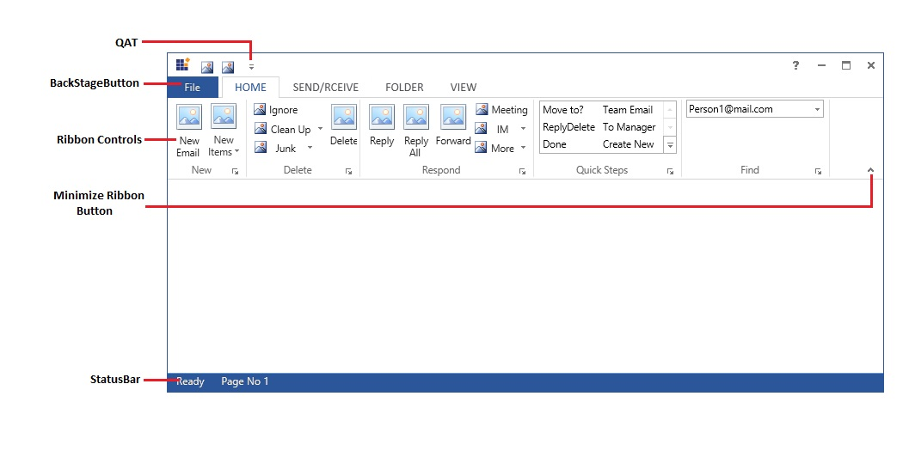
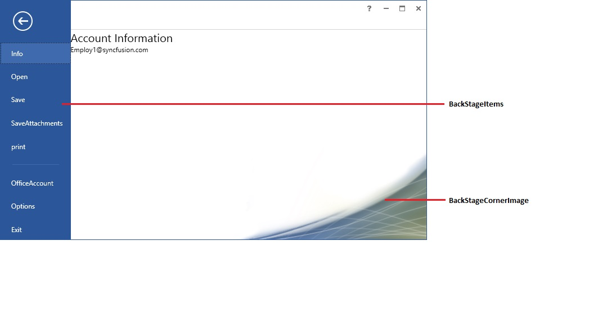

## Overview

### Control Structures

Components of Ribbon controls are

* Ribbon Controls
* Backstage Button - Used to Show/Hide the BackStage.
* Quick Access Toolbar (QAT) - QAT holds the frequently accessed items.
* Minimize RibbonButton-Used to change the state of Ribbon.
* RibbonStatusBar-Display the StatusBar Items.

You can find Ribbon Components in Below Screen shot:

### Backstage

Components of BackStage view of Ribbon controls are

* BackStage Items - It includes BackStageCommandButton and BackStage TabItem.
* BackStage corner image.

You can find BackStage Components in Below Screen shot.

### Key Features

* Provides a ribbon window that overrides the default window and can set visual styles of ribbon window to different theme styles.
* Provides full layout like Microsoft Outlook UI.
* Icon is available at ribbon like in Microsoft Outlook.
* QuickAccessToolbar provides placing of frequently used items. 
* RibbonTab is available to add different Tabs like in Microsoft Outlook.
* RibbonBar is available to structure the layouts.
* Ribbon has a custom implementation of button control as Ribbon Button. That has curved corners, which resembles the same as the Outlook ribbon button.
* Can minimize / maximize the ribbon.
* Keyboard navigation made easy through KeyTips like in Microsoft Outlook.
* RibbonStatusBar provides placing of StatusBar items. 

