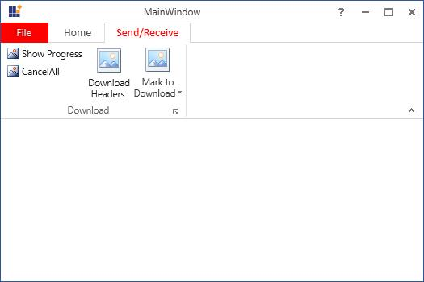

## Styling and Templates

The Ribbon control ships with a number of built-in themes such as Office 2007 Silver, Blue, Black, Blend, Office 2003, Shiny Red, and Shiny Blue. 

### Visual Styles
To override the themes to the Ribbon control’s style, first add ResourceDictionary in the sample and then define new style with the BasedOn property.When the Resource Dictionary is added, all the properties of the base style can be acquired, and then override them as desired. The same procedure can be used for overriding the other styles.Here, an example is illustrated to set the BackStageColor for the Ribbon by customizing the RibbonStyle using the BasedOn property.

**Syntax** **for** **ResourceDictionary**



[XAML]

<ResourceDictionary Source="/Syncfusion.Tools.WPF;Component/FrameWork/Ribbon/themes/Office2013Style.xaml">
</ResourceDictionary>



**Syntax** **for** **BasedOn**



[XAML]

BasedOn="{StaticResource <StyleName><ControlName>Style}"





[XAML]

<syncfusion:RibbonWindow x:Class="RibbonVisualStyleSample.MainWindow"

xmlns="http://schemas.microsoft.com/winfx/2006/xaml/presentation"

xmlns:x="http://schemas.microsoft.com/winfx/2006/xaml"

Title="MainWindow" Height="350" Width="525" xmlns:syncfusion="http://schemas.syncfusion.com/wpf" syncfusion:SkinStorage.VisualStyle="Office2013"

>

<syncfusion:RibbonWindow.Resources>

<ResourceDictionary>

<ResourceDictionary.MergedDictionaries>

<ResourceDictionary Source="/Syncfusion.Tools.WPF;Component/FrameWork/Ribbon/themes/Office2013Style.xaml"/>

</ResourceDictionary.MergedDictionaries>

</ResourceDictionary>

</syncfusion:RibbonWindow.Resources>

<Grid>

<syncfusion:Ribbon x:Name="ribbon" VerticalAlignment="Top"  Style="{StaticResource RibbonStyle}">

<syncfusion:RibbonTab  Caption="Home" IsChecked="False">

<syncfusion:RibbonBar Header="Respond" >

<syncfusion:RibbonButton  SizeForm="Large" Label="Large"/>

<syncfusion:RibbonButton SizeForm="Small" Label="Small"/>

<syncfusion:RibbonButton SizeForm="Small" Label="Forward"/>

</syncfusion:RibbonBar>

</syncfusion:RibbonTab>

<syncfusion:RibbonTab Caption="Send/Receive" IsChecked="True">

<syncfusion:RibbonBar Header="Download">

<syncfusion:RibbonButton SizeForm="Small" Label="Show Progress"/>

<syncfusion:RibbonButton SizeForm="Small" Label="CancelAll"/>

<syncfusion:RibbonButton SizeForm="Large" Label="Download Headers"/>

<syncfusion:DropDownButton SizeForm="Large" Label="Mark to Download" ></syncfusion:DropDownButton>

</syncfusion:RibbonBar>

</syncfusion:RibbonTab>

</syncfusion:Ribbon>

</Grid>

</syncfusion:RibbonWindow>



