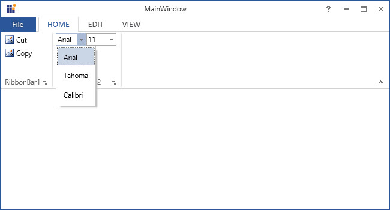

# RibbonComboBox

RibbonComboBox control is used to display the list of items, as ComboBox.

## Add ComboBoxItems

ComboBoxItems are the items with `Header` property that is used to set header.





<syncfusion:Ribbon Name="_ribbon" HorizontalAlignment="Stretch" VerticalAlignment="Top">

<syncfusion:RibbonTab Name="_ribbonTab1" Caption="HOME" IsChecked="True">

<syncfusion:RibbonBar Name="_ribbonBar1" Header="RibbonBar1">

<syncfusion:RibbonButton Label="Cut"/>

<syncfusion:RibbonButton Label="Copy"/>

</syncfusion:RibbonBar>

<syncfusion:RibbonBar Name="_ribbonBar2" Width="150" Header="RibbonBar2">     

<syncfusion:ButtonPanel>

     <syncfusion:RibbonComboBox SelectedItem="Arial" Width="80">

         <syncfusion:RibbonComboBoxItem>Arial</syncfusion:RibbonComboBoxItem>

         <syncfusion:RibbonComboBoxItem>Tahoma</syncfusion:RibbonComboBoxItem>

         <syncfusion:RibbonComboBoxItem>Calibri</syncfusion:RibbonComboBoxItem>

     </syncfusion:RibbonComboBox>

     <syncfusion:RibbonComboBox SelectedItem="12" Width="50">

          <syncfusion:RibbonComboBoxItem>11</syncfusion:RibbonComboBoxItem>

          <syncfusion:RibbonComboBoxItem>12</syncfusion:RibbonComboBoxItem>

          <syncfusion:RibbonComboBoxItem>13</syncfusion:RibbonComboBoxItem>

     </syncfusion:RibbonComboBox>

</syncfusion:ButtonPanel>

</syncfusion:RibbonBar>         

</syncfusion:RibbonTab>

<syncfusion:RibbonTab Caption="EDIT"  IsChecked="False"/>

<syncfusion:RibbonTab Caption="VIEW"  IsChecked="False"/>

</syncfusion:Ribbon>





Create instance for `RibbonComboBox` and add it to RibbonBar Items in Code behind





ButtonPanel _buttonPanel = new ButtonPanel();

RibbonComboBox _ribbonComboBox1 = new RibbonComboBox() { Width=80};

RibbonComboBox _ribbonComboBox2 = new RibbonComboBox() { Width=50};

RibbonComboBoxItem comboBoxItem1 = new RibbonComboBoxItem() { Content = "Arial" };

RibbonComboBoxItem comboBoxItem2 = new RibbonComboBoxItem() { Content = "Calibri" };

RibbonComboBoxItem comboBoxItem3 = new RibbonComboBoxItem() { Content = "Tahoma" };

RibbonComboBoxItem comboBoxItem4 = new RibbonComboBoxItem() { Content = "11" };

RibbonComboBoxItem comboBoxItem5 = new RibbonComboBoxItem() { Content = "12" };

RibbonComboBoxItem comboBoxItem6 = new RibbonComboBoxItem() { Content = "13" };     

_ribbonComboBox.Items.Add(comboBoxItem1);

_ribbonComboBox.Items.Add(comboBoxItem2);

_ribbonComboBox.Items.Add(comboBoxItem3);

_RibbonComboBox1.Items.Add(comboBoxItem4);

_ribbonComboBox1.Items.Add(comboBoxItem5);

_ribbonComboBox1.Items.Add(comboBoxItem6);

_buttonPanel.Children.Add(_ribbonComboBox1);

_buttonPanel.Children.Add(_ribbonComboBox2);

_ribbonBar2.Items.Add(_buttonPanel);





Dim _buttonPanel As New ButtonPanel()

Dim _ribbonComboBox1 As New RibbonComboBox() With {.Width=80}

Dim _ribbonComboBox2 As New RibbonComboBox() With {.Width=50}

Dim comboBoxItem1 As New RibbonComboBoxItem() With {.Content = "Arial"}

Dim comboBoxItem2 As New RibbonComboBoxItem() With {.Content = "Calibri"}

Dim comboBoxItem3 As New RibbonComboBoxItem() With {.Content = "Tahoma"}

Dim comboBoxItem4 As New RibbonComboBoxItem() With {.Content = "11"}

Dim comboBoxItem5 As New RibbonComboBoxItem() With {.Content = "12"}

Dim comboBoxItem6 As New RibbonComboBoxItem() With {.Content = "13"}

_ribbonComboBox.Items.Add(comboBoxItem1)

_ribbonComboBox.Items.Add(comboBoxItem2)

_ribbonComboBox.Items.Add(comboBoxItem3)

_RibbonComboBox1.Items.Add(comboBoxItem4)

_ribbonComboBox1.Items.Add(comboBoxItem5)

_ribbonComboBox1.Items.Add(comboBoxItem6)

_buttonPanel.Children.Add(_ribbonComboBox1)

_buttonPanel.Children.Add(_ribbonComboBox2)

_ribbonBar2.Items.Add(_buttonPanel)





