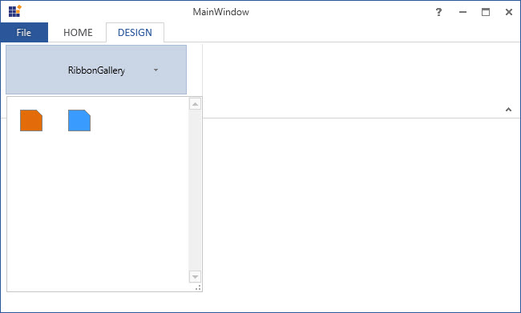
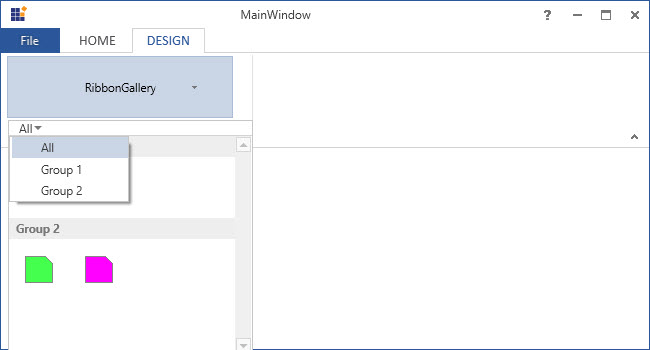
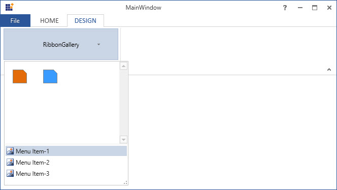

# RibbonGallery

RibbonGallery provides `VisualMode` property, that helps to display items in two different ways.

## Ribbon mode

To display items as a normal gallery control in the ribbon, set `VisualMode` property as `InRibbon mode`





<syncfusion:RibbonGallery Width="230" VisualMode="InRibbon" Label="RibbonGallery" LargeIcon="Word.png"/>





## DropDown mode

To display items as DropDown in the ribbon, set `VisualMode` property as `DropDown mode`





<syncfusion:RibbonGallery VisualMode="DropDown" Label="RibbonGallery" LargeIcon="Word.png" >





## Ribbon gallery item

Ribbon control provides `RibbonGalleryItem` that add as items in RibbonGallery.





<syncfusion:Ribbon Name="_ribbon" HorizontalAlignment="Stretch" VerticalAlignment="Top">          
<syncfusion:RibbonTab Caption="HOME" IsChecked="False"/>                
<syncfusion:RibbonTab IsChecked="True" Caption="DESIGN">
<syncfusion:RibbonBar Header="RibbonBar">
<syncfusion:RibbonGallery Name="_ribbonGallery" Width="230" VisualMode="InRibbon" Label="RibbonGallery" LargeIcon="Word.png" >
<syncfusion:RibbonGalleryItem>
<Image Source="OrangeLarge.png"/>
</syncfusion:RibbonGalleryItem>
<syncfusion:RibbonGalleryItem  >
<Image Source="BlueLarge.png"/>
</syncfusion:RibbonGalleryItem>
</syncfusion:RibbonGallery>
</syncfusion:RibbonBar>
</syncfusion:RibbonTab>
/syncfusion:Ribbon>





Add RibbonGalleryItem in code behind.





Image _image1 = new Image() { Source =new BitmapImage(new Uri(@"OrangeLarge.png", UriKind.RelativeOrAbsolute)) };
Image _image2 = new Image() { Source = new BitmapImage(new Uri(@"BlueLarge.png", UriKind.RelativeOrAbsolute)) };
RibbonGalleryItem _ribbonGalleryItem1 = new RibbonGalleryItem() {Content=_image1};
RibbonGalleryItem _ribbonGalleryItem2 = new RibbonGalleryItem() { Content = _image2 };
_ribbonGallery.Items.Add(_ribbonGalleryItem1);
_ribbonGallery.Items.Add(_ribbonGalleryItem2);




Dim _image1 As New Image() With {.Source = New BitmapImage(New Uri("OrangeLarge.png", UriKind.RelativeOrAbsolute))}
Dim _image2 As New Image() With {.Source = New BitmapImage(New Uri("BlueLarge.png", UriKind.RelativeOrAbsolute))}
Dim _ribbonGalleryItem1 As New RibbonGalleryItem() With {.Content=_image1}
Dim _ribbonGalleryItem2 As New RibbonGalleryItem() With {.Content = _image2}
_ribbonGallery.Items.Add(_ribbonGalleryItem1)
_ribbonGallery.Items.Add(_ribbonGalleryItem2)





## Ribbon gallery group

Ribbon Gallery Group is a collection of Ribbon Gallery Items. The items are grouped in the Ribbon Gallery control based on some classifications.

### Gallery filter

`GalleryGroupFilters` are used to view particular group. The `FilterIndexes` property is used to specify the indexes of the filters.





<syncfusion:Ribbon Name="_ribbon" HorizontalAlignment="Stretch" VerticalAlignment="Top">
<syncfusion:RibbonTab Caption="HOME" IsChecked="False"/>
<syncfusion:RibbonTab Caption="DESIGN" IsChecked="True">
<syncfusion:RibbonBar Width="250" Header="RibbonBar">
<syncfusion:RibbonGallery Name="_ribbonGallery" Width="230" VisualMode="DropDown" Label="RibbonGallery">
<syncfusion:RibbonGallery.GalleryFilters>
<syncfusion:RibbonGalleryFilter Label="All"/>
<syncfusion:RibbonGalleryFilter Label="Group 1"/>
<syncfusion:RibbonGalleryFilter Label="Group 2"/>
</syncfusion:RibbonGallery.GalleryFilters>
<syncfusion:RibbonGallery.GalleryGroups>
<syncfusion:RibbonGalleryGroup Name="_ribbonGalleryGroup1" Label="Group 1" syncfusion:RibbonGallery.FilterIndexes="0, 1">
<syncfusion:RibbonGalleryItem Name="_ribbonGalleryItem1" Margin="5">
<Image Source="OrangeLarge.png" Stretch="None" />
</syncfusion:RibbonGalleryItem>
<syncfusion:RibbonGalleryItem Name="_ribbonGalleryItem2" Margin="5" >
<Image Source="BlueLarge.png" Stretch="None"/>
</syncfusion:RibbonGalleryItem>
</syncfusion:RibbonGalleryGroup>
<syncfusion:RibbonGalleryGroup  Name="_ribbonGalleryGroup2"  Label="Group 2" syncfusion:RibbonGallery.FilterIndexes="0, 2">
<syncfusion:RibbonGalleryItem Name="_RibbonGalleryItem3"  Margin="5">
<Image Source="GreenLarge.png" Stretch="None"/>
</syncfusion:RibbonGalleryItem>
<syncfusion:RibbonGalleryItem Name="_RibbonGalleryItem4" Margin="5" >
<Image Source="PinkLarge.png" Stretch="None" />
</syncfusion:RibbonGalleryItem>
</syncfusion:RibbonGalleryGroup>
</syncfusion:RibbonGallery.GalleryGroups>
</syncfusion:RibbonGallery>
</syncfusion:RibbonBar>
</syncfusion:RibbonTab>
</syncfusion:Ribbon>





## Add custom menu items

In the expanded Gallery items (in both the Visual Mode), can add custom menu items to the bottom of the Ribbon Gallery control, using the `MenuItem` property of RibbonGallery.





<syncfusion:Ribbon Name="_ribbon" HorizontalAlignment="Stretch" VerticalAlignment="Top">           
<syncfusion:RibbonTab Caption="HOME" IsChecked="True"/>
<syncfusion:RibbonTab IsChecked="False" Caption="DESIGN">
<syncfusion:RibbonBar Width="250" Header="RibbonBar">
<syncfusion:RibbonGallery Name="_ribbonGallery" Width="230" VisualMode="InRibbon" Label="RibbonGallery" LargeIcon="Word.png" >
<syncfusion:RibbonGalleryItem  Margin="5">
<Image Source="OrangeLarge.png"/>
</syncfusion:RibbonGalleryItem>
<syncfusion:RibbonGalleryItem  Margin="5">
<Image Source="PinkLarge.png"/>
</syncfusion:RibbonGalleryItem>
<syncfusion:RibbonGallery.MenuItems>
<syncfusion:RibbonButton SizeForm = "Small" Label="Menu Item-1"/>
<syncfusion:RibbonButton SizeForm = "Small" Label="Menu Item-2"/>
<syncfusion:RibbonButton SizeForm = "Small" Label="Menu Item-3"/>
</syncfusion:RibbonGallery.MenuItems>              
</syncfusion:RibbonGallery>
</syncfusion:RibbonBar>
</syncfusion:RibbonTab>
</syncfusion:Ribbon>





Custom Menu items of RibbonGallery added by creating instance of RibbonButton and add it to MenuItems property of RibbonGallery in code behind. SplitButton or MenuButton can also added instead of RibbonButton.





RibbonButton _ribbonButton1 = new RibbonButton() { SizeForm = SizeForm.Small, Label = "Menu Item-1" };
RibbonButton _ribbonButton2 = new RibbonButton() { SizeForm = SizeForm.Small, Label = "Menu Item-2" };
RibbonButton _ribbonButton3 = new RibbonButton() { SizeForm = SizeForm.Small, Label = "Menu Item-3" };
_ribbonGallery.MenuItems.Add(_ribbonButton1);
_ribbonGallery.MenuItems.Add(_ribbonButton2);
_ribbonGallery.MenuItems.Add(_ribbonButton3);





Dim _ribbonButton1 As New RibbonButton() With {
	.SizeForm = SizeForm.Small,
	.Label = "Menu Item-1"
}
Dim _ribbonButton2 As New RibbonButton() With {
	.SizeForm = SizeForm.Small,
	.Label = "Menu Item-2"
}
Dim _ribbonButton3 As New RibbonButton() With {
	.SizeForm = SizeForm.Small,
	.Label = "Menu Item-3"
}
_ribbonGallery.MenuItems.Add(_ribbonButton1)
_ribbonGallery.MenuItems.Add(_ribbonButton2)
_ribbonGallery.MenuItems.Add(_ribbonButton3)





