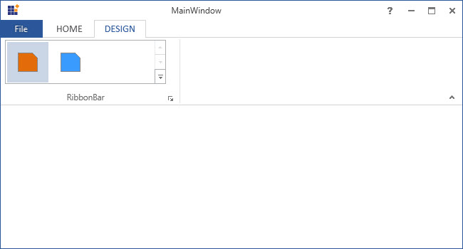
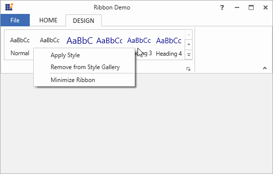

# Ribbon Gallery in WPF Ribbon

RibbonGallery provides `VisualMode` property, that helps to display items in two different ways.

## Ribbon mode

To display items as a normal gallery control in the ribbon, set `VisualMode` property as `InRibbon mode`





<syncfusion:RibbonGallery Width="230" VisualMode="InRibbon" Label="RibbonGallery" LargeIcon="Word.png"/>





## DropDown mode

To display items as DropDown in the ribbon, set `VisualMode` property as `DropDown mode`





<syncfusion:RibbonGallery VisualMode="DropDown" Label="RibbonGallery" LargeIcon="Word.png" >





## Add Gallery to the simplified layout

### Add Gallery in InRibbon visual mode

When the simplified layout is enabled, the RibbonGallery can be added and displayed in a single line in [`InRibbon`](https://help.syncfusion.com/cr/cref_files/wpf/Syncfusion.Tools.Wpf~Syncfusion.Windows.Tools.RibbonGalleryVisualMode.html) VisualMode as shown below. To know more about the simplified layout, refer [here](https://help.syncfusion.com/wpf/ribbon/simplifiedlayout).





<syncfusion:RibbonWindow x:Class="RibbonButton_IconTemp.Window1"
        xmlns="http://schemas.microsoft.com/winfx/2006/xaml/presentation"
        xmlns:x="http://schemas.microsoft.com/winfx/2006/xaml"
        xmlns:d="http://schemas.microsoft.com/expression/blend/2008"
        xmlns:mc="http://schemas.openxmlformats.org/markup-compatibility/2006"
        xmlns:local="clr-namespace:RibbonButton_IconTemp" xmlns:skin="clr-namespace:Syncfusion.SfSkinManager;assembly=Syncfusion.SfSkinManager.WPF"
        mc:Ignorable="d" xmlns:syncfusion="http://schemas.syncfusion.com/wpf"
        skin:SfSkinManager.VisualStyle="MaterialLight"
        Title="Untitled 1 - Ribbon Control" Height="450" Width="800">
    <Grid x:Name="grid">
        <syncfusion:Ribbon VerticalAlignment="Top" EnableSimplifiedLayoutMode="True" LayoutMode="Simplified">
            <syncfusion:RibbonTab Caption="HOME"  IsChecked="True">
                <syncfusion:RibbonBar Header="Options">
                    <syncfusion:RibbonGallery  VisualMode="InRibbon" Label="Styles" MediumIcon="/Resources/Finalmark20.png" >
                        <syncfusion:RibbonGalleryItem CheckOnClick="True">
                            <StackPanel>
                                <TextBlock
                                        Margin="0,9,0,0"
                                        Text="AaBbCc"
                                        TextAlignment="Center" />
                                <TextBlock
                                        Margin="0,11,0,0"
                                        Text="Normal"
                                        TextAlignment="Center" />
                            </StackPanel>
                        </syncfusion:RibbonGalleryItem>
                        <syncfusion:RibbonGalleryItem CheckOnClick="True">
                            <StackPanel>
                                <TextBlock
                                        Margin="0,9,0,0"
                                        Text="AaBbCc"
                                        TextAlignment="Center" />
                                <TextBlock
                                        Margin="0,11,0,0"
                                        Text="No Spa.."
                                        TextAlignment="Center" />
                            </StackPanel>
                        </syncfusion:RibbonGalleryItem>
                        <syncfusion:RibbonGalleryItem CheckOnClick="True">
                            <StackPanel>
                                <TextBlock
                                        Margin="0,5,0,0"
                                        FontSize="18"
                                        Foreground="DarkBlue"
                                        Text="AaBbCc"
                                        TextAlignment="Center" />
                                <TextBlock
                                        Margin="0,6,0,0"
                                        Text="Heading 1"
                                        TextAlignment="Center" />
                            </StackPanel>
                        </syncfusion:RibbonGalleryItem>
                    </syncfusion:RibbonGallery>
                </syncfusion:RibbonBar>
            </syncfusion:RibbonTab>
        </syncfusion:Ribbon>
    </Grid>
</syncfusion:RibbonWindow>





### Add Gallery in DropDown visual mode

When the simplified layout is enabled, the RibbonGallery can be added and displayed in a single line in [`DropDown`](https://help.syncfusion.com/cr/cref_files/wpf/Syncfusion.Tools.Wpf~Syncfusion.Windows.Tools.RibbonGalleryVisualMode.html) VisualMode as shown below. To know more about the simplified layout, refer [here](https://help.syncfusion.com/wpf/ribbon/simplifiedlayout).





<syncfusion:RibbonWindow x:Class="RibbonButton_IconTemp.Window1"
        xmlns="http://schemas.microsoft.com/winfx/2006/xaml/presentation"
        xmlns:x="http://schemas.microsoft.com/winfx/2006/xaml"
        xmlns:d="http://schemas.microsoft.com/expression/blend/2008"
        xmlns:mc="http://schemas.openxmlformats.org/markup-compatibility/2006"
        xmlns:local="clr-namespace:RibbonButton_IconTemp" xmlns:skin="clr-namespace:Syncfusion.SfSkinManager;assembly=Syncfusion.SfSkinManager.WPF"
        mc:Ignorable="d" xmlns:syncfusion="http://schemas.syncfusion.com/wpf"
        skin:SfSkinManager.VisualStyle="MaterialLight"
        Title="Untitled 1 - Ribbon Control" Height="450" Width="800">
    <Grid x:Name="grid">
        <syncfusion:Ribbon VerticalAlignment="Top" EnableSimplifiedLayoutMode="True" LayoutMode="Simplified">
            <syncfusion:RibbonTab Caption="HOME"  IsChecked="True">
                <syncfusion:RibbonBar Header="Options">
                    <syncfusion:RibbonGallery  VisualMode="DropDown" Label="Styles" MediumIcon="/Resources/Finalmark20.png" Width="85">
                        <syncfusion:RibbonGalleryItem CheckOnClick="True">
                            <StackPanel>
                                <TextBlock
                                        Margin="0,9,0,0"
                                        Text="AaBbCc"
                                        TextAlignment="Center" />
                                <TextBlock
                                        Margin="0,11,0,0"
                                        Text="Normal"
                                        TextAlignment="Center" />
                            </StackPanel>
                        </syncfusion:RibbonGalleryItem>
                        <syncfusion:RibbonGalleryItem CheckOnClick="True">
                            <StackPanel>
                                <TextBlock
                                        Margin="0,9,0,0"
                                        Text="AaBbCc"
                                        TextAlignment="Center" />
                                <TextBlock
                                        Margin="0,11,0,0"
                                        Text="No Spa.."
                                        TextAlignment="Center" />
                            </StackPanel>
                        </syncfusion:RibbonGalleryItem>
                        <syncfusion:RibbonGalleryItem CheckOnClick="True">
                            <StackPanel>
                                <TextBlock
                                        Margin="0,5,0,0"
                                        FontSize="18"
                                        Foreground="DarkBlue"
                                        Text="AaBbCc"
                                        TextAlignment="Center" />
                                <TextBlock
                                        Margin="0,6,0,0"
                                        Text="Heading 1"
                                        TextAlignment="Center" />
                            </StackPanel>
                        </syncfusion:RibbonGalleryItem>
                    </syncfusion:RibbonGallery>
                </syncfusion:RibbonBar>
            </syncfusion:RibbonTab>
        </syncfusion:Ribbon>
    </Grid>
</syncfusion:RibbonWindow>





### Arranging between layouts

When arranging in simplified layout alone, the **Margin**, **Width** and **Height** values of the RibbonGallery can be ignored as it will be resized automatically to the standard width and height. If the RibbonGallery is to be shown in both normal and simplified layout, the **Margin**, **Width** and **Height** properties can be set for normal layout alone using triggers.





<syncfusion:RibbonGallery syncfusion:SimplifiedLayoutSettings.DisplayMode="Normal,Simplified" >
    <syncfusion:RibbonGalleryItem Content="Item 1"/>
    <syncfusion:RibbonGalleryItem Content="Item 2"/>
    <syncfusion:RibbonGallery.Style>
        
    </syncfusion:RibbonGallery.Style>
</syncfusion:RibbonGallery >  





## Ribbon gallery item

Ribbon control provides `RibbonGalleryItem` that add as items in RibbonGallery.





<syncfusion:Ribbon Name="_ribbon" HorizontalAlignment="Stretch" VerticalAlignment="Top">          
<syncfusion:RibbonTab Caption="HOME" IsChecked="False"/>                
<syncfusion:RibbonTab IsChecked="True" Caption="DESIGN">
<syncfusion:RibbonBar Header="RibbonBar">
<syncfusion:RibbonGallery Name="_ribbonGallery" Width="230" VisualMode="InRibbon" Label="RibbonGallery" LargeIcon="Word.png" >
<syncfusion:RibbonGalleryItem>
<Image Source="OrangeLarge.png"/>
</syncfusion:RibbonGalleryItem>
<syncfusion:RibbonGalleryItem  >
<Image Source="BlueLarge.png"/>
</syncfusion:RibbonGalleryItem>
</syncfusion:RibbonGallery>
</syncfusion:RibbonBar>
</syncfusion:RibbonTab>
/syncfusion:Ribbon>





Add RibbonGalleryItem in code behind.





Image _image1 = new Image() { Source =new BitmapImage(new Uri(@"OrangeLarge.png", UriKind.RelativeOrAbsolute)) };
Image _image2 = new Image() { Source = new BitmapImage(new Uri(@"BlueLarge.png", UriKind.RelativeOrAbsolute)) };
RibbonGalleryItem _ribbonGalleryItem1 = new RibbonGalleryItem() {Content=_image1};
RibbonGalleryItem _ribbonGalleryItem2 = new RibbonGalleryItem() { Content = _image2 };
_ribbonGallery.Items.Add(_ribbonGalleryItem1);
_ribbonGallery.Items.Add(_ribbonGalleryItem2);




Dim _image1 As New Image() With {.Source = New BitmapImage(New Uri("OrangeLarge.png", UriKind.RelativeOrAbsolute))}
Dim _image2 As New Image() With {.Source = New BitmapImage(New Uri("BlueLarge.png", UriKind.RelativeOrAbsolute))}
Dim _ribbonGalleryItem1 As New RibbonGalleryItem() With {.Content=_image1}
Dim _ribbonGalleryItem2 As New RibbonGalleryItem() With {.Content = _image2}
_ribbonGallery.Items.Add(_ribbonGalleryItem1)
_ribbonGallery.Items.Add(_ribbonGalleryItem2)





## Ribbon gallery group

Ribbon Gallery Group is a collection of Ribbon Gallery Items. The items are grouped in the Ribbon Gallery control based on some classifications.

### Gallery filter

`GalleryGroupFilters` are used to view particular group. The `FilterIndexes` property is used to specify the indexes of the filters.





<syncfusion:Ribbon Name="_ribbon" HorizontalAlignment="Stretch" VerticalAlignment="Top">
<syncfusion:RibbonTab Caption="HOME" IsChecked="False"/>
<syncfusion:RibbonTab Caption="DESIGN" IsChecked="True">
<syncfusion:RibbonBar Width="250" Header="RibbonBar">
<syncfusion:RibbonGallery Name="_ribbonGallery" Width="230" VisualMode="DropDown" Label="RibbonGallery">
<syncfusion:RibbonGallery.GalleryFilters>
<syncfusion:RibbonGalleryFilter Label="All"/>
<syncfusion:RibbonGalleryFilter Label="Group 1"/>
<syncfusion:RibbonGalleryFilter Label="Group 2"/>
</syncfusion:RibbonGallery.GalleryFilters>
<syncfusion:RibbonGallery.GalleryGroups>
<syncfusion:RibbonGalleryGroup Name="_ribbonGalleryGroup1" Label="Group 1" syncfusion:RibbonGallery.FilterIndexes="0, 1">
<syncfusion:RibbonGalleryItem Name="_ribbonGalleryItem1" Margin="5">
<Image Source="OrangeLarge.png" Stretch="None" />
</syncfusion:RibbonGalleryItem>
<syncfusion:RibbonGalleryItem Name="_ribbonGalleryItem2" Margin="5" >
<Image Source="BlueLarge.png" Stretch="None"/>
</syncfusion:RibbonGalleryItem>
</syncfusion:RibbonGalleryGroup>
<syncfusion:RibbonGalleryGroup  Name="_ribbonGalleryGroup2"  Label="Group 2" syncfusion:RibbonGallery.FilterIndexes="0, 2">
<syncfusion:RibbonGalleryItem Name="_RibbonGalleryItem3"  Margin="5">
<Image Source="GreenLarge.png" Stretch="None"/>
</syncfusion:RibbonGalleryItem>
<syncfusion:RibbonGalleryItem Name="_RibbonGalleryItem4" Margin="5" >
<Image Source="PinkLarge.png" Stretch="None" />
</syncfusion:RibbonGalleryItem>
</syncfusion:RibbonGalleryGroup>
</syncfusion:RibbonGallery.GalleryGroups>
</syncfusion:RibbonGallery>
</syncfusion:RibbonBar>
</syncfusion:RibbonTab>
</syncfusion:Ribbon>





## Add custom menu items

In the expanded Gallery items (in both the Visual Mode), can add custom menu items to the bottom of the Ribbon Gallery control, using the `MenuItem` property of RibbonGallery.





<syncfusion:Ribbon Name="_ribbon" HorizontalAlignment="Stretch" VerticalAlignment="Top">           
<syncfusion:RibbonTab Caption="HOME" IsChecked="True"/>
<syncfusion:RibbonTab IsChecked="False" Caption="DESIGN">
<syncfusion:RibbonBar Width="250" Header="RibbonBar">
<syncfusion:RibbonGallery Name="_ribbonGallery" Width="230" VisualMode="InRibbon" Label="RibbonGallery" LargeIcon="Word.png" >
<syncfusion:RibbonGalleryItem  Margin="5">
<Image Source="OrangeLarge.png"/>
</syncfusion:RibbonGalleryItem>
<syncfusion:RibbonGalleryItem  Margin="5">
<Image Source="PinkLarge.png"/>
</syncfusion:RibbonGalleryItem>
<syncfusion:RibbonGallery.MenuItems>
<syncfusion:RibbonButton SizeForm = "Small" Label="Menu Item-1"/>
<syncfusion:RibbonButton SizeForm = "Small" Label="Menu Item-2"/>
<syncfusion:RibbonButton SizeForm = "Small" Label="Menu Item-3"/>
</syncfusion:RibbonGallery.MenuItems>              
</syncfusion:RibbonGallery>
</syncfusion:RibbonBar>
</syncfusion:RibbonTab>
</syncfusion:Ribbon>





Custom Menu items of RibbonGallery added by creating instance of RibbonButton and add it to MenuItems property of RibbonGallery in code behind. SplitButton or MenuButton can also added instead of RibbonButton.





RibbonButton _ribbonButton1 = new RibbonButton() { SizeForm = SizeForm.Small, Label = "Menu Item-1" };
RibbonButton _ribbonButton2 = new RibbonButton() { SizeForm = SizeForm.Small, Label = "Menu Item-2" };
RibbonButton _ribbonButton3 = new RibbonButton() { SizeForm = SizeForm.Small, Label = "Menu Item-3" };
_ribbonGallery.MenuItems.Add(_ribbonButton1);
_ribbonGallery.MenuItems.Add(_ribbonButton2);
_ribbonGallery.MenuItems.Add(_ribbonButton3);





Dim _ribbonButton1 As New RibbonButton() With {
	.SizeForm = SizeForm.Small,
	.Label = "Menu Item-1"
}
Dim _ribbonButton2 As New RibbonButton() With {
	.SizeForm = SizeForm.Small,
	.Label = "Menu Item-2"
}
Dim _ribbonButton3 As New RibbonButton() With {
	.SizeForm = SizeForm.Small,
	.Label = "Menu Item-3"
}
_ribbonGallery.MenuItems.Add(_ribbonButton1)
_ribbonGallery.MenuItems.Add(_ribbonButton2)
_ribbonGallery.MenuItems.Add(_ribbonButton3)





## Add custom context menu

The context menu is a type of menu that appears when a right-click operation is performed on the target. The ribbon gallery and its items allow to add a custom context menu with user-defined menu items set to the [`ContextMenu`](https://help.syncfusion.com/cr/wpf/Syncfusion.Tools.Wpf~Syncfusion.Windows.Tools.Controls.RibbonGallery_members.html) property. This will override the built-in context menu of the ribbon gallery and its items.



<!-- A custom context menu with user-defined menu items -->
<syncfusion:RibbonWindow.Resources>
    <syncfusion:RibbonContextMenu x:Key="galleryContextMenu" ItemsSource="{Binding}">
        <syncfusion:RibbonMenuItem Header="Apply Style" Command="{Binding DataContext.ApplyStyleCommand}" IconBarEnabled="True"/>
        <syncfusion:RibbonMenuItem Header="Remove from Style Gallery" Command="{Binding DataContext.RemoveItemCommand}" IconBarEnabled="True"/>
        <Separator />
        <syncfusion:RibbonMenuItem Header="Minimize Ribbon" Command="{Binding DataContext.MinimizeRibbonCommand}" IconBarEnabled="True" />
    </syncfusion:RibbonContextMenu>
</syncfusion:RibbonWindow.Resources>

<!-- Replace the custom context menu with the built-in context menu of the ribbon gallery -->
<syncfusion:Ribbon Name="_ribbon" HorizontalAlignment="Stretch" VerticalAlignment="Top">
    <syncfusion:RibbonTab Caption="HOME" IsChecked="False"/>
    <syncfusion:RibbonTab IsChecked="True" Caption="DESIGN">
        <syncfusion:RibbonBar Header="RibbonBar">
            <syncfusion:RibbonGallery x:Name="gallery" ContextMenu="{DynamicResource galleryContextMenu}"
                                      Width="380" SizeForm="Large" Height="67"  ItemHeight="60"  ItemWidth="60" MenuIconBarEnabled="True">
                <syncfusion:RibbonGalleryItem Margin="2" CheckOnClick="False">
                    <StackPanel>
                        <TextBlock TextAlignment="Center" Margin="0,9,0,0" Text="AaBbCc"/>
                        <TextBlock TextAlignment="Center" Margin="0,11,0,0" Text="Normal"/>
                    </StackPanel>
                </syncfusion:RibbonGalleryItem>
                <syncfusion:RibbonGalleryItem Margin="2" CheckOnClick="False">
                    <StackPanel>
                        <TextBlock TextAlignment="Center" Margin="0,9,0,0" Text="AaBbCc"/>
                        <TextBlock TextAlignment="Center" Margin="0,11,0,0" Text="No Spa.."/>
                    </StackPanel>
                </syncfusion:RibbonGalleryItem>
                <syncfusion:RibbonGalleryItem Margin="2" CheckOnClick="False">
                    <StackPanel>
                        <TextBlock FontSize="18" Foreground="DarkBlue" TextAlignment="Center" Margin="0,5,0,0" Text="AaBbCc"/>
                        <TextBlock TextAlignment="Center" Margin="0,6,0,0" Text="Heading 1"/>
                    </StackPanel>
                </syncfusion:RibbonGalleryItem>
                <syncfusion:RibbonGalleryItem Margin="2" CheckOnClick="False">
                    <StackPanel>
                        <TextBlock FontSize="16" Foreground="DarkBlue" TextAlignment="Center" Margin="0,6,0,0" Text="AaBbCc"/>
                        <TextBlock TextAlignment="Center" Margin="0,8,0,0" Text="Heading 2"/>
                    </StackPanel>
                </syncfusion:RibbonGalleryItem>
                <syncfusion:RibbonGalleryItem Margin="2" CheckOnClick="False">
                    <StackPanel>
                        <TextBlock FontSize="14" Foreground="DarkBlue" TextAlignment="Center" Margin="0,7,0,0" Text="AaBbCc"/>
                        <TextBlock TextAlignment="Center" Margin="0,9,0,0" Text="Heading 3"/>
                    </StackPanel>
                </syncfusion:RibbonGalleryItem>
                <syncfusion:RibbonGalleryItem Margin="2" CheckOnClick="False">
                    <StackPanel>
                        <TextBlock FontSize="15" Foreground="DarkBlue" TextAlignment="Center" Margin="0,7,0,0" Text="AaBbCc"/>
                        <TextBlock TextAlignment="Center" Margin="0,9,0,0" Text="Heading 4"/>
                    </StackPanel>
                </syncfusion:RibbonGalleryItem>
            </syncfusion:RibbonGallery>
        </syncfusion:RibbonBar>
    </syncfusion:RibbonTab>
</syncfusion:Ribbon>




/// 

/// Command for "ApplyStyle" option in the context menu.
/// 

public DelegateCommand ApplyStyleCommand
{
    get
    {
        return new DelegateCommand(ApplyStyleCommandAction);
    }
}

/// 

/// Action that occurs when "ApplyStyle" menu item is selected from the context menu.
/// 

private void ApplyStyleCommandAction(object param)
{
    SelectionForeground = new SolidColorBrush(Color.FromRgb(0, 0, 0));
    SelectionFontSize = 14;
    foreach (Paragraph paragraph in paragraphs)
    {
        paragraph.LineHeight = 20;
        paragraph.Foreground = new SolidColorBrush(Color.FromRgb(0, 0, 0));
        paragraph.FontSize = 14;
    }
}

/// 

/// Command for "RemoveItem" option in the context menu.
/// 

public DelegateCommand RemoveItemCommand
{
    get
    {
        return new DelegateCommand(RemoveItemCommandAction);
    }
}

/// 

/// Action that occurs when "RemoveItem" is selected from the context menu.
/// 

private void RemoveItemCommandAction(object param)
{
    if (gallery.Items.Count > 0)
        gallery.Items.RemoveAt(0);
}

/// 

/// Command for "MinimizeRibbon" option in the context menu.
/// 

public DelegateCommand MinimizeRibbonCommand
{
    get
    {
        return new DelegateCommand(MinimizeRibbonCommandAction);
    }
}

/// 

/// Action that occurs when "MinimizeRibbon" item is selected from the context menu.
/// 

private void MinimizeRibbonCommandAction(object param)
{
    this.Ribbon.RibbonState = RibbonState.Hide;
}

/// 

/// A class that defines the interface for the command.
/// 

public class DelegateCommand : ICommand
{
    private readonly Action<object> _execute;
    /// 

    /// Raises when changes occur and specifies whether or not the command should be executed.
    /// 

    public event EventHandler CanExecuteChanged;

    /// 

    /// Constructor of the Delegate command
    /// 

    /// <param name="execute"></param>
    public DelegateCommand(Action<object> execute)
    {
        _execute = execute;
    }

    /// 

    ///  Defines the method that determines whether the command can execute in its current state.
    /// 

    public bool CanExecute(object parameter)
    {
        return true;
    }

    /// 

    ///  Defines the method to be called when the command is invoked.
    /// 

    public void Execute(object parameter)
    {
        _execute(parameter);
    }

    /// 

    /// Defines the method to be called when changes occur that affect the command.
    /// 

    public void RaiseCanExecuteChanged()
    {
        if (CanExecuteChanged != null)
        {
            CanExecuteChanged(this, EventArgs.Empty);
        }
    }
}




