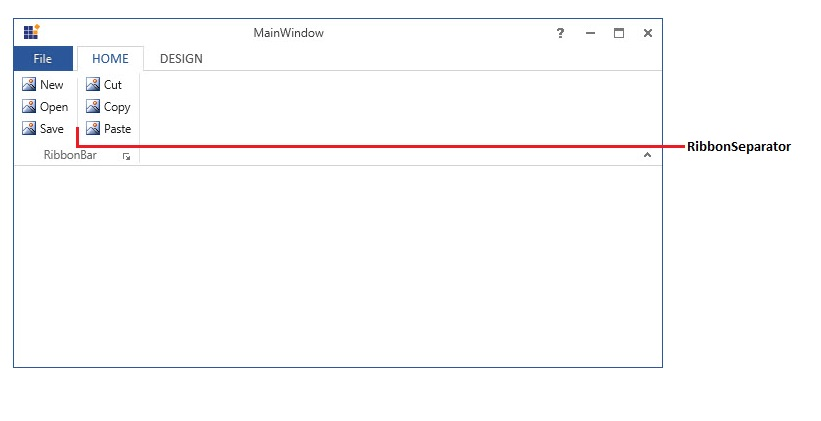

# RibbonSeparator in WPF Ribbon

`RibbonSeparator` used to separate the similar set of Ribbon elements in Ribbon. It can separate RibbonButtons according to their purpose. 

## Add Separator to the RibbonBar





<syncfusion:Ribbon Name="_ribbon" HorizontalAlignment="Stretch" VerticalAlignment="Top">
<syncfusion:RibbonTab Caption="HOME" IsChecked="True">
<syncfusion:RibbonBar>
<syncfusion:RibbonButton Label="New"/>
<syncfusion:RibbonButton Label="Open"/>
<syncfusion:RibbonButton Label="Save"/>
<syncfusion:RibbonSeparator/>
<syncfusion:RibbonButton Label="Cut"/>
<syncfusion:RibbonButton Label="Copy"/>
<syncfusion:RibbonButton Label="Paste"/>
</syncfusion:RibbonBar>
</syncfusion:RibbonTab>
<syncfusion:RibbonTab IsChecked="False" Caption="DESIGN"></syncfusion:RibbonTab>
</syncfusion:Ribbon>     





RibbonSeparator instance can be added as item to the group of other items through code behind.





RibbonSeparator _ribbonSeparator = new RibbonSeparator();
RibbonButton _ribbonButton1 = new RibbonButton() { Label = "New" };
RibbonButton _ribbonButton2 = new RibbonButton() { Label = "Open" };
RibbonButton _ribbonButton3 = new RibbonButton() { Label = "Save" };
RibbonButton _ribbonButton4 = new RibbonButton() { Label = "Cut" };
RibbonButton _ribbonButton5 = new RibbonButton() { Label = "Copy" };
RibbonButton _ribbonButton6 = new RibbonButton() { Label = "Paste" };
_ribbonBar.Items.Add(_ribbonButton1);
_ribbonBar.Items.Add(_ribbonButton2);
_ribbonBar.Items.Add(_ribbonButton3);
_ribbonBar.Items.Add(_ribbonSeparator);
_ribbonBar.Items.Add(_ribbonButton4);
_ribbonBar.Items.Add(_ribbonButton5);
_ribbonBar.Items.Add(_ribbonButton6);





Dim _ribbonSeparator As New RibbonSeparator()
Dim _ribbonButton1 As New RibbonButton() With {.Label = "New"}
Dim _ribbonButton2 As New RibbonButton() With {.Label = "Open"}
Dim _ribbonButton3 As New RibbonButton() With {.Label = "Save"}
Dim _ribbonButton4 As New RibbonButton() With {.Label = "Cut"}
Dim _ribbonButton5 As New RibbonButton() With {.Label = "Copy"}
Dim _ribbonButton6 As New RibbonButton() With {.Label = "Paste"}
_ribbonBar.Items.Add(_ribbonButton1)
_ribbonBar.Items.Add(_ribbonButton2)
_ribbonBar.Items.Add(_ribbonButton3)
_ribbonBar.Items.Add(_ribbonSeparator)
_ribbonBar.Items.Add(_ribbonButton4)
_ribbonBar.Items.Add(_ribbonButton5)
_ribbonBar.Items.Add(_ribbonButton6)





## Add Separator to the simplified layout

When the simplified layout is enabled, the RibbonSeparator can be added and displayed in a single line as shown below. To know more about the simplified layout, refer [here](https://help.syncfusion.com/wpf/ribbon/simplifiedlayout).





<syncfusion:RibbonWindow x:Class="RibbonButton_IconTemp.MainWindow"
        xmlns="http://schemas.microsoft.com/winfx/2006/xaml/presentation"
        xmlns:x="http://schemas.microsoft.com/winfx/2006/xaml"
        xmlns:d="http://schemas.microsoft.com/expression/blend/2008"
        xmlns:mc="http://schemas.openxmlformats.org/markup-compatibility/2006"
        xmlns:local="clr-namespace:RibbonButton_IconTemp"
        xmlns:syncfusion="http://schemas.syncfusion.com/wpf"
        xmlns:skin="clr-namespace:Syncfusion.SfSkinManager;assembly=Syncfusion.SfSkinManager.WPF"
        mc:Ignorable="d" skin:SfSkinManager.VisualStyle="MaterialLight"
        Title="Untitled 1 - Ribbon Control" Height="450" Width="800">
    <Grid x:Name="grid">
        <syncfusion:Ribbon VerticalAlignment="Top" EnableSimplifiedLayoutMode="True" LayoutMode="Simplified">
            <syncfusion:RibbonTab Caption="Home" IsChecked="True">
                <syncfusion:RibbonBar Header="Clipboard">
                    <syncfusion:RibbonButton Label="Paste" SizeForm="Large" MediumIcon="/Resources/Paste20.png"  />
                    <syncfusion:RibbonSeparator/>
                    <syncfusion:RibbonButton Label="Cut" SizeForm="Small" MediumIcon="/Resources/Cut_20.png"  />
                </syncfusion:RibbonBar>
            </syncfusion:RibbonTab>
        </syncfusion:Ribbon>
    </Grid>
</syncfusion:RibbonWindow>





Ribbon ribbon = new Ribbon();
ribbon.VerticalAlignment = VerticalAlignment.Top;
ribbon.EnableSimplifiedLayoutMode = true;
ribbon.LayoutMode = LayoutMode.Simplified;
// Creating new tabs
RibbonTab homeTab = new RibbonTab();
homeTab.Caption = "Home";
homeTab.IsChecked = true;

// Creating new bar
RibbonBar clipboardBar = new RibbonBar();
clipboardBar.Header = "Clipboard";
// Creating items
RibbonButton pasteButton = new RibbonButton();
pasteButton.Label = "Paste";
pasteButton.SizeForm = SizeForm.Large;
pasteButton.MediumIcon = new BitmapImage(new Uri(@"/Resources/Paste20.png", UriKind.RelativeOrAbsolute));

RibbonSeparator ribbonSeparator = new RibbonSeparator();

RibbonButton cutButton = new RibbonButton();
cutButton.Label = "Cut";
cutButton.SizeForm = SizeForm.Small;
cutButton.MediumIcon = new BitmapImage(new Uri(@"/Resources/Cut_20.png", UriKind.RelativeOrAbsolute));
// Adding items to the bar
clipboardBar.Items.Add(pasteButton);
clipboardBar.Items.Add(ribbonSeparator);
clipboardBar.Items.Add(cutButton);
// Adding bar to the tab
homeTab.Items.Add(clipboardBar);
ribbon.Items.Add(homeTab);
grid.Children.Add(ribbon);
SfSkinManager.SetVisualStyle(this, VisualStyles.MaterialLight);





When arranging in simplified layout alone, the **Margin**, **Width** and **Height** values of the RibbonSeparator can be ignored as it will be resized automatically to the standard width and height. If the RibbonSeparator is to be shown in both normal and simplified layout, the **Margin**, **Width** and **Height** properties can be set for normal layout alone using triggers.





<syncfusion:RibbonSeparator syncfusion:SimplifiedLayoutSettings.DisplayMode="Normal,Simplified" >
    <syncfusion:RibbonSeparator.Style>
        
    </syncfusion:RibbonSeparator.Style>
</syncfusion:RibbonSeparator >





