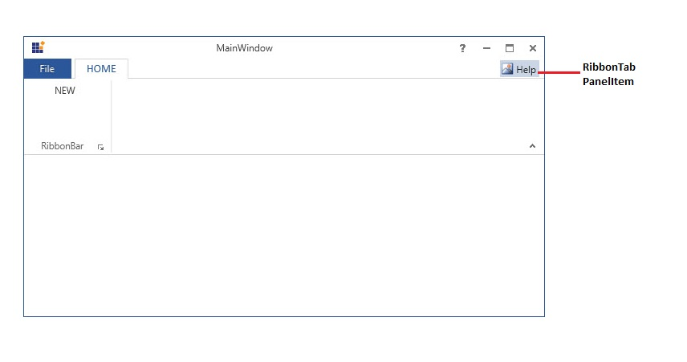

# Ribbon TabPanelItem in WPF Ribbon

`RibbonTabPanelItem` is used to display items below application Close button and above the `RibbonBar` content area. It is usually aligned in the right side of the Ribbon and we can place desire items like emoji's, help button etc., in this Tab panel. 

Ribbon control supports TabPanelItem for both normal and simplified layout, where the simplified layout is designed to display the most commonly used Ribbon commands in a single line interface, allowing more screen space for compact viewing of the content. To know more about the simplified layout, refer [here](https://help.syncfusion.com/wpf/ribbon/simplifiedlayout).





<syncfusion:Ribbon Name="_ribbon" HorizontalAlignment="Stretch" VerticalAlignment="Top">
<syncfusion:RibbonTab Name="_ribbonTab" Caption="HOME"  IsChecked="True">
<syncfusion:RibbonBar Name="_ribbonBar">
<syncfusion:RibbonMenuItem  Header="NEW" Width="100"></syncfusion:RibbonMenuItem>
</syncfusion:RibbonBar>
</syncfusion:RibbonTab>
<syncfusion:Ribbon.TabPanelItem>
<syncfusion:RibbonButton SizeForm="Small" Label="Help"/>
</syncfusion:Ribbon.TabPanelItem>
</syncfusion:Ribbon>





Create instance of RibbonButton and assign it to TabPanelItem property of Ribbon through code behind.





RibbonButton _ribbonButton = new RibbonButton() { Label="Help"};
_ribbon.TabPanelItem = _ribbonButton;





Dim _ribbonButton As New RibbonButton() With {.Label="Help"}
_ribbon.TabPanelItem = _ribbonButton


 


