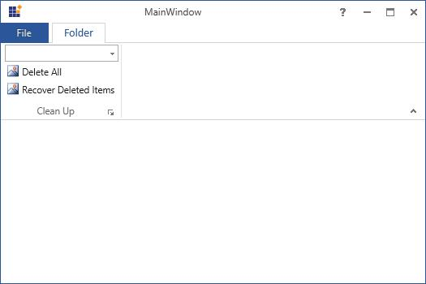

# Show HelpButton in RibbonWindow

The HelpButton displays the information about the application.To enable this HelpButton in `Office2013` theme, set `ShowHelpButton` as `True` 



[XAML]

<syncfusion:RibbonWindow

xmlns="http://schemas.microsoft.com/winfx/2006/xaml/presentation"

xmlns:x="http://schemas.microsoft.com/winfx/2006/xaml"

xmlns:syncfusion="http://schemas.syncfusion.com/wpf" x:Class="RibbonButtonPanel.MainWindow"

Title="MainWindow" Height="350" Width="525" syncfusion:SkinStorage.VisualStyle="Office2013" ShowHelpButton="True" x:Name="RibbonWindow"/>



To set the HelpButton at the right of the RibbonWindow for the themes except Office2013, use `TabPanelItem` property of the Ribbon

The TabPanelItem is located at the right corner below the main window close button in the following screen shot.

This following code snippet explains how to create and configure TabPanelItem.



[XAML]

<syncfusion:Ribbon.TabPanelItem>

<syncfusion:RibbonButton SizeForm="ExtraSmall" SmallIcon="help16.png" />

</syncfusion:Ribbon.TabPanelItem>



