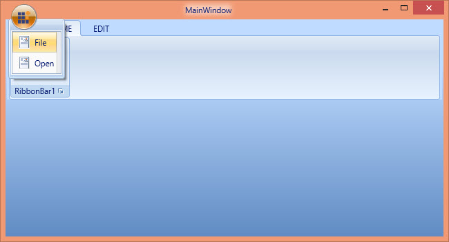

# SimpleMenuButton

The difference between `SimpleMenuButton` and the other menu button is that it cannot have a sub menu. And it can be used with ApplicationMenu. 





<syncfusion:Ribbon Name="_Ribbon1" HorizontalAlignment="Stretch" VerticalAlignment="Top">

<syncfusion:RibbonTab Name="_RibbonTab1" Caption="HOME"  IsChecked="False">

<syncfusion:RibbonBar Name="_RibbonBar1" Header="RibbonBar1"/>

</syncfusion:RibbonTab>

<syncfusion:RibbonTab Caption="EDIT"  IsChecked="False"/>

<syncfusion:Ribbon.ApplicationMenu>

<syncfusion:ApplicationMenu Name="_ApplicationMenu" Width="38" Height="38" syncfusion:Ribbon.KeyTip="F" IsPopupOpen="False" ApplicationButtonImage="syncfusion.png">

<syncfusion:SimpleMenuButton Label="File" Icon="Document32.png"/>

<syncfusion:SimpleMenuButton Label="Open" Icon="Document32.png"/>

</syncfusion:ApplicationMenu>

</syncfusion:Ribbon.ApplicationMenu>

</syncfusion:Ribbon>





Create instance of SimpleMenuButton and add it to ApplicationMenu Items through code behind.





SimpleMenuButton _SimpleMenuButton = new SimpleMenuButton() { Label = "File", Width = 100 };

SimpleMenuButton _SimpleMenuButton1 = new SimpleMenuButton() { Label = "Open", Width = 100 };

_ApplicationMenu.Items.Add(_SimpleMenuButton);

_ApplicationMenu.Items.Add(_SimpleMenuButton1);





Dim _SimpleMenuButton As New SimpleMenuButton() With {
	.Label = "File",
	.Width = 100
}

Dim _SimpleMenuButton1 As New SimpleMenuButton() With {
	.Label = "Open",
	.Width = 100
}

_ApplicationMenu.Items.Add(_SimpleMenuButton)

_ApplicationMenu.Items.Add(_SimpleMenuButton1)





