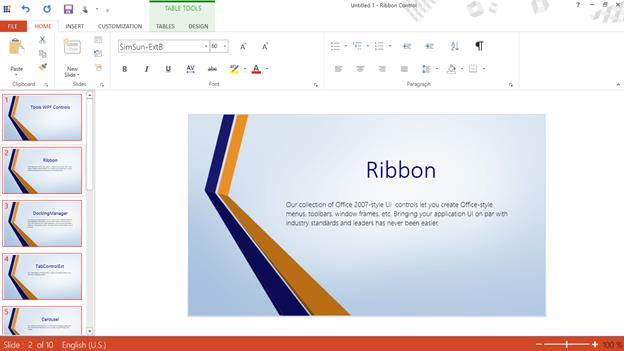

# Touch Support

Ribbon control have touch support and it provides Touch UI which is easy to access the element in Ribbon. 

### How to enable touch in RibbonWindow?

To enable touch in the RibbonWindow, set `EnableTouch` property of the SkinStorage as `True`. The following code snippet illustrates this





<syncfusion:RibbonWindow

xmlns="http://schemas.microsoft.com/winfx/2006/xaml/presentation"

xmlns:x="http://schemas.microsoft.com/winfx/2006/xaml"

xmlns:syncfusion="http://schemas.syncfusion.com/wpf" x:Class="RibbonButtonPanel.MainWindow"

Title="MainWindow" Height="350" Width="525" syncfusion:SkinStorage.VisualStyle="Office2013"  x:Name="_ribbonWindow" syncfusion:SkinStorage.EnableTouch="True"/>









SkinStorage.SetEnableTouch(_ribbonWindow, true);





SkinStorage.SetEnableTouch(_ribbonWindow, True)





