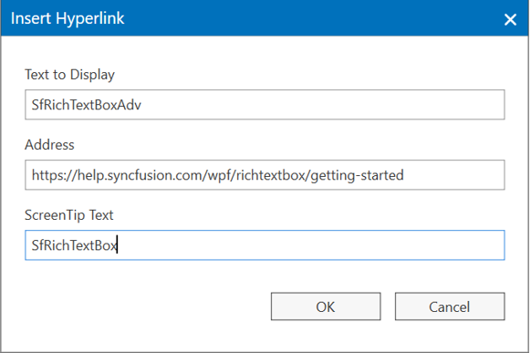

# Hyperlink in WPF RichTextBox

The SfRichTextBoxAdv supports hyperlink field similar to the Microsoft Word. You can link part of the document content to Internet or file location, mail address or any text.
The following code example illustrates how to insert a hyperlink field.


<RichTextBoxAdv:ParagraphAdv>
    <RichTextBoxAdv:FieldBeginAdv></RichTextBoxAdv:FieldBeginAdv>
    <RichTextBoxAdv:SpanAdv Text=" HYPERLINK &quot;http://www.syncfusion.com&quot; "></RichTextBoxAdv:SpanAdv>
    <RichTextBoxAdv:FieldSeparatorAdv></RichTextBoxAdv:FieldSeparatorAdv>
    <RichTextBoxAdv:SpanAdv Text="Syncfusion">
        <RichTextBoxAdv:SpanAdv.CharacterFormat>
            <RichTextBoxAdv:CharacterFormat Underline="Single" FontColor="#ff0563c1"/>
        </RichTextBoxAdv:SpanAdv.CharacterFormat>
    </RichTextBoxAdv:SpanAdv>
    <RichTextBoxAdv:FieldEndAdv></RichTextBoxAdv:FieldEndAdv>
</RichTextBoxAdv:ParagraphAdv>



// Appends the field start.
paragraphAdv.Inlines.Add(new FieldBeginAdv());
// Appends the field code.
SpanAdv fieldCode = new SpanAdv();
string url = "www.syncfusion.com";
fieldCode.Text = " HYPERLINK \"" + url + "\" ";
paragraphAdv.Inlines.Add(fieldCode);
// Appends the field separator
paragraphAdv.Inlines.Add(new FieldSeparatorAdv());
// Appends the field result.
SpanAdv fieldResult = new SpanAdv();
fieldResult.Text = "Syncfusion";
fieldResult.CharacterFormat.Underline = Underline.Single;
fieldResult.CharacterFormat.FontColor = Color.FromArgb(0xff, 0x05, 0x63, 0xc1);
paragraphAdv.Inlines.Add(fieldResult);
// Appends the field end.
paragraphAdv.Inlines.Add(new FieldEndAdv());



' Appends the field start.
paragraphAdv.Inlines.Add(New FieldBeginAdv())
' Appends the field code.
Dim fieldCode As New SpanAdv()
Dim url As String = "www.syncfusion.com"
fieldCode.Text = (Convert.ToString(" HYPERLINK """) & url) + """ "
paragraphAdv.Inlines.Add(fieldCode)
' Appends the field separator
paragraphAdv.Inlines.Add(New FieldSeparatorAdv())
' Appends the field result.
Dim fieldResult As New SpanAdv()
fieldResult.Text = "Syncfusion"
fieldResult.CharacterFormat.Underline = Underline.[Single]
fieldResult.CharacterFormat.FontColor = Color.FromArgb(&Hff, &H5, &H63, &Hc1)
paragraphAdv.Inlines.Add(fieldResult)
' Appends the field end.
paragraphAdv.Inlines.Add(New FieldEndAdv())




The following code example illustrates how to insert hyperlink field into SfRichTextBoxAdv Document through UI command.


<Button Content="Insert Hyperlink" Command="RichTextBoxAdv:SfRichTextBoxAdv.InsertHyperlinkCommand" CommandTarget="{Binding ElementName=richTextBoxAdv}" CommandParameter="www.google.com"/>





## Hyperlink ScreenTip

In SfRichTextBoxAdv control ToolTip (ScreenTip) shows some information or navigation link, when the mouse hovers over that hyperlink and it disappears when the mouse is moved away from that hyperlink. By default, it shows navigation link of that hyperlink and you can set the text you want to use for your ScreenTip.

<table><tr><td>Without ScreenTip</td><td>With ScreenTip</td></tr><tr><td></td><td></td></tr></table>

The following code example illustrates how to insert a hyperlink field with ScreenTip.


<RichTextBoxAdv:ParagraphAdv>
    <RichTextBoxAdv:FieldBeginAdv></RichTextBoxAdv:FieldBeginAdv>
    <RichTextBoxAdv:SpanAdv Text=" HYPERLINK &quot;\http://www.syncfusion.com&quot; \o SfRichTextBox "></RichTextBoxAdv:SpanAdv>
    <RichTextBoxAdv:FieldSeparatorAdv></RichTextBoxAdv:FieldSeparatorAdv>
    <RichTextBoxAdv:SpanAdv Text="SfRichTextBoxAdv">
        <RichTextBoxAdv:SpanAdv.CharacterFormat>
            <RichTextBoxAdv:CharacterFormat Underline="Single" FontColor="#ff0563c1"/>
        </RichTextBoxAdv:SpanAdv.CharacterFormat>
    </RichTextBoxAdv:SpanAdv>
    <RichTextBoxAdv:FieldEndAdv></RichTextBoxAdv:FieldEndAdv>
</RichTextBoxAdv:ParagraphAdv>



ParagraphAdv paragraphAdv = new ParagraphAdv();
// Appends the field start.
paragraphAdv.Inlines.Add(new FieldBeginAdv());
// Appends the field code.
SpanAdv fieldCode = new SpanAdv();
string url = "www.syncfusion.com";
string screenTip = "SfRichTextBox";
fieldCode.Text = " HYPERLINK \"" + url + "\" \\o \"" + screenTip + "\" ";
paragraphAdv.Inlines.Add(fieldCode);
// Appends the field separator
paragraphAdv.Inlines.Add(new FieldSeparatorAdv());
// Appends the field result.
SpanAdv fieldResult = new SpanAdv();
fieldResult.Text = "SfRichTextBoxAdv";
fieldResult.CharacterFormat.Underline = Underline.Single;
fieldResult.CharacterFormat.FontColor = Color.FromArgb(0xff, 0x05, 0x63, 0xc1);
paragraphAdv.Inlines.Add(fieldResult);
// Appends the field end.
paragraphAdv.Inlines.Add(new FieldEndAdv());
richTextBoxAdv.Document.Sections[0].Blocks.Add(paragraphAdv);



' Appends the field start.
paragraphAdv.Inlines.Add(New FieldBeginAdv())
' Appends the field code.
Dim fieldCode As New SpanAdv()
Dim url As String = "www.syncfusion.com"
Dim screenTip As String = "SfRichTextBox"
fieldCode.Text = (Convert.ToString(" HYPERLINK """) & url) + """ ""o """ + (screenTip) + """ "
paragraphAdv.Inlines.Add(fieldCode)
' Appends the field separator
paragraphAdv.Inlines.Add(New FieldSeparatorAdv())
' Appends the field result.
Dim fieldResult As New SpanAdv()
fieldResult.Text = "SfRichTextBoxAdv"
fieldResult.CharacterFormat.Underline = Underline.[Single]
fieldResult.CharacterFormat.FontColor = Color.FromArgb(&Hff, &H5, &H63, &Hc1)
paragraphAdv.Inlines.Add(fieldResult)
' Appends the field end.
paragraphAdv.Inlines.Add(New FieldEndAdv())




The following code example illustrates how to insert hyperlink field with ScreenTip into SfRichTextBoxAdv Document through UI command.


<Button Content="Insert Hyperlink" Command="RichTextBoxAdv:SfRichTextBoxAdv.InsertHyperlinkCommand" CommandTarget="{Binding ElementName=richTextBoxAdv}" CommandParameter="www.syncfusion.com"/>



SfRichTextBoxAdv.InsertHyperlinkCommand.Execute(new string[3] { "www.syncfusion.com", "SfRichTextBoxAdv", "SfRichTextBox" }, richTextBoxAdv);




The following section illustrates how to insert hyperlink field with ScreenTip in SfRichTextBoxAdv Document through built-in hyperlink dialog UI command like Microsoft Word application.
1.	Open insert hyperlink dialog.


<Button Content="Insert Hyperlink" Command="RichTextBoxAdv:SfRichTextBoxAdv.InsertHyperlinkCommand" CommandTarget="{Binding ElementName=richTextBoxAdv}"/>



2.	Enter the display text, URL link and ScreenTip text.
3.	Click on OK to close the dialog box.

N> ScreenTip option is supported from V18.4.0.30

## Hyperlink Navigation

The SfRichTextBoxAdv supports event to identify whenever hyperlink navigation is requested. This allows you to easily customize the hyperlink navigation functionality.
The following code example demonstrates how to customize hyperlink navigation functionality for the SfRichTextBoxAdv instance.


// Hooks the event handler for RequestNavigate event.
richTextBoxAdv.RequestNavigate += RichTextBoxAdv_RequestNavigate;

/// 

/// Handles the RequestNavigate event of the richTextBoxAdv control.
/// 

/// <param name="obj">The source of the event.</param>
/// <param name="args">The <see cref="RequestNavigateEventArgs"/> instance containing the event data.</param>
private void RichTextBoxAdv_RequestNavigate(object obj, Syncfusion.Windows.Controls.RichTextBoxAdv.RequestNavigateEventArgs args)
{
    if (args.Hyperlink.LinkType == HyperlinkType.Webpage || args.Hyperlink.LinkType == HyperlinkType.Email)
        Process.Start(new ProcessStartInfo(new Uri(args.Hyperlink.NavigationLink).AbsoluteUri));
    else if (args.Hyperlink.LinkType == HyperlinkType.File && File.Exists(args.Hyperlink.NavigationLink))
         Process.Start(args.Hyperlink.NavigationLink);
}

// Unhooks the event handler for RequestNavigate event.
richTextBoxAdv.RequestNavigate -= RichTextBoxAdv_RequestNavigate;



' Hooks the event handler for RequestNavigate event.
AddHandler richTextBoxAdv.RequestNavigate, AddressOf RichTextBoxAdv_RequestNavigate

''' 

''' Handles the RequestNavigate event of the richTextBoxAdv control.
''' 

''' <param name="obj">The source of the event.</param>
''' <param name="args">The <see cref="RequestNavigateEventArgs"/> instance containing the event data.</param>
Private Sub RichTextBoxAdv_RequestNavigate(obj As Object, args As Syncfusion.Windows.Controls.RichTextBoxAdv.RequestNavigateEventArgs)
	If args.Hyperlink.LinkType = HyperlinkType.Webpage OrElse args.Hyperlink.LinkType = HyperlinkType.Email Then
		Process.Start(New ProcessStartInfo(New Uri(args.Hyperlink.NavigationLink).AbsoluteUri))
	ElseIf args.Hyperlink.LinkType = HyperlinkType.File AndAlso File.Exists(args.Hyperlink.NavigationLink) Then
		Process.Start(args.Hyperlink.NavigationLink)
	End If
End Sub

' Unhooks the event handler for RequestNavigate event.
RemoveHandler richTextBoxAdv.RequestNavigate, AddressOf RichTextBoxAdv_RequestNavigate



