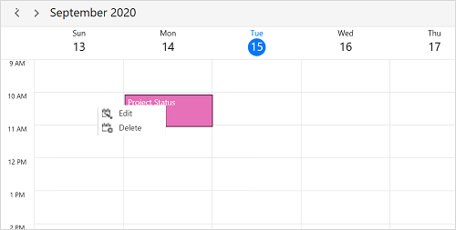

# Context Menu Commands in WPF Scheduler (SfScheduler)

The WPF Scheduler will have support to define a context menu for appointments, time slots, and month cells. It also will have built-in `RoutedUICommands` support for handling the context menu to add, edit, and delete appointments. There are two types of ContextMenu.

* CellContextMenu
* AppointmentContextMenu

## Cell context menu

You can set the context menu for time slot and month cells by using `SfScheduler.CellContextMenu` property. CellContextMenu will be appeared only on time slot or month cells.

>**NOTE**
The menu items which binds the `SchedulerCommands.Edit` and `SchedulerCommands.Delete` built-in commands will be disabled in CellContextMenu.
The DataContext for the context menu is `SchedulerContextMenuInfo` Command parameter of menu item should bound to context menu's data context when using the commands in `SchedulerCommands`.



<syncfusion:SfScheduler x:Name="Schedule" ViewType="Week">
<syncfusion:SfScheduler.CellContextMenu>
<ContextMenu>
<MenuItem Command="{Binding Source={x:Static Member=syncfusion:SchedulerCommands.Add}}" CommandParameter ="{Binding}" CommandTarget="{Binding ElementName=Schedule}" Header="Add">
</MenuItem>
</ContextMenu>
</syncfusion:SfScheduler.CellContextMenu>
</syncfusion:SfScheduler>




## Appointment context menu

You can set the context menu for schedule appointments by using `SfScheduler.AppointmentContextMenu` property. AppointmentContextMenu will be displayed only on appointments.

>**NOTE**
The menu item which binds the `SchedulerCommands.Add` command will be disabled in AppointmentContextMenu.
The DataContext for the context menu is `SchedulerContextMenuInfo` Command parameter of menu item should bound to context menu's data context when using the commands in `SchedulerCommands`.



<syncfusion:SfScheduler x:Name="Schedule" ViewType="Week">
<syncfusion:SfScheduler.AppointmentContextMenu>
<ContextMenu>
<MenuItem Command="{Binding Source={x:Static Member=syncfusion:SchedulerCommands.Edit}}"
                    CommandParameter ="{Binding}" CommandTarget="{Binding ElementName=Schedule}"
                    Header="Edit">
</MenuItem>
<MenuItem Command="{Binding Source={x:Static Member=syncfusion:SchedulerCommands.Delete}}"
CommandParameter ="{Binding}"
Header="Delete">
</MenuItem>
</ContextMenu>
</syncfusion:SfScheduler.AppointmentContextMenu>
</syncfusion:SfScheduler>




## Events

### SchedulerContextMenuOpening

`SchedulerContextMenuOpening` event occurs while opening the context menu in SfScheduler. 

`SchedulerContextMenuOpeningEventArgs` has the following members which provides the information about `SchedulerContextMenuOpening` event.

* `MenuInfo` – Returns the `SchedulerContextMenuInfo` which contains the information about date time, appointment of the element opens the context menu.`AppointmentContextMenu` and `CellContextMenu` received this information as DataContext.. 

* `MenuType` – Gets the element type for which the context menu opens.

* `ContextMenu` – It represents shortcut context menu which is being opened.
