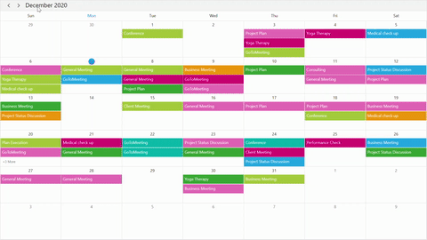

# Load On Demand in WPF Scheduler (SfScheduler)
The scheduler supports to loading appointment on demand with loading indicator and it improves the loading performance when you have appointments range for multiple years.

## QueryAppointments event
The [QueryAppointments](https://help.syncfusion.com/cr/wpf/Syncfusion.UI.Xaml.Scheduler.SfScheduler.html#Syncfusion_UI_Xaml_Scheduler_SfScheduler_QueryAppointments) event is used to load appointments in on-demand for the visible date range. You might start and stop the loading indicator animation before and after the appointments loaded using the [ShowBusyIndicator](https://help.syncfusion.com/cr/wpf/Syncfusion.UI.Xaml.Scheduler.SfScheduler.html#Syncfusion_UI_Xaml_Scheduler_SfScheduler_ShowBusyIndicator).
The [QueryAppointmentsEventArgs](https://help.syncfusion.com/cr/wpf/Syncfusion.UI.Xaml.Scheduler.QueryAppointmentsEventArgs.html) has the following members which provide information for the `QueryAppointments` event.

[VisibleDateRange](https://help.syncfusion.com/cr/wpf/Syncfusion.UI.Xaml.Scheduler.DateRange.html) - Gets the current visible date range of scheduler that is used to load the appointments.



<syncfusion:SfScheduler x:Name="Scheduler"
                        ViewType="Month" QueryAppointments="Scheduler_QueryAppointments">
</syncfusion:SfScheduler>


Scheduler.QueryAppointments += Scheduler_QueryAppointments;
private void Scheduler_QueryAppointments(object sender, QueryAppointmentsEventArgs e)
{
 Scheduler.ShowBusyIndicator = true;
 Scheduler.ItemsSource = this.GenerateSchedulerAppointments(e.VisibleDateRange);
 Scheduler.ShowBusyIndicator = false;
}

private IEnumerable GenerateSchedulerAppointments(DateRange dateRange)
{
  Random ran = new Random();
  int daysCount = (dateRange.ActualEndDate - dateRange.ActualStartDate).Days;
  var appointments = new ObservableCollection<SchedulerModel>();
      
  for (int i = 0; i < 50; i++)
  {
    var startTime = dateRange.ActualStartDate.AddDays(ran.Next(0, daysCount + 1)).AddHours(ran.Next(0, 24));
    appointments.Add(new SchedulerModel
    {
    From = startTime,
    To = startTime.AddHours(1),
    EventName = subjectCollection[ran.Next(0, subjectCollection.Count)],
    Color = brush[ran.Next(0, brush.Count)],
    });
  }
  return appointments;
}



The [QueryAppointments](https://help.syncfusion.com/cr/wpf/Syncfusion.UI.Xaml.Scheduler.SfScheduler.html#Syncfusion_UI_Xaml_Scheduler_SfScheduler_QueryAppointments) will be raised once any one of the following action will be taken.

 * Once the [ViewChanged](https://help.syncfusion.com/cr/wpf/Syncfusion.UI.Xaml.Scheduler.SfScheduler.html#Syncfusion_UI_Xaml_Scheduler_SfScheduler_ViewChanged) event is raised, the `QueryAppointments` will be raised.

* If the appointment has been added, removed, or changed (Resize, drag, and drop) in the current time visible date range, then the `QueryAppointments` event will not be triggered. Since the appointments for that visible date range have been loaded already.

* The `QueryAppointments` event is triggered when the Schedule [ResourceCollection](https://help.syncfusion.com/cr/wpf/Syncfusion.UI.Xaml.Scheduler.SfScheduler.html#Syncfusion_UI_Xaml_Scheduler_SfScheduler_ResourceCollection) is updated to load appointments based on the changed resource collection.

* The `QueryAppointments` event will be triggered when the [ResourceGroupType](https://help.syncfusion.com/cr/wpf/Syncfusion.UI.Xaml.Scheduler.SfScheduler.html#Syncfusion_UI_Xaml_Scheduler_SfScheduler_ResourceGroupType) is changed.

## Load On Demand command
The Scheduler notifies by [LoadOnDemandCommand](https://help.syncfusion.com/cr/wpf/Syncfusion.UI.Xaml.Scheduler.SfScheduler.html#Syncfusion_UI_Xaml_Scheduler_SfScheduler_LoadOnDemandCommand) when the user changes the visible date range. You can get a visible date range from the [QueryAppointmentsEventArgs](https://help.syncfusion.com/cr/wpf/Syncfusion.UI.Xaml.Scheduler.QueryAppointmentsEventArgs.html). The default value for this `ICommand` is null. The `QueryAppointmentsEventArgs` passed as a command parameter.

You can define a ViewModel class that implements command and handle it by the CanExecute and Execute methods to check and execute on-demand loading. In execute method, you can perform the following operations,
* You can start and stop the loading indicator animation before and after the appointments loaded using the [ShowBusyIndicator](https://help.syncfusion.com/cr/wpf/Syncfusion.UI.Xaml.Scheduler.SfScheduler.html#Syncfusion_UI_Xaml_Scheduler_SfScheduler_ShowBusyIndicator).
* Once got appointment collection, you can load into the scheduler itemsource.



<syncfusion:SfScheduler x:Name="Scheduler"
                        ViewType="Month" 
                        ShowBusyIndicator="{Binding ShowBusyIndicator}"
                        LoadOnDemandCommand="{Binding LoadOnDemandCommand}"
                        ItemsSource="{Binding Events}">
</syncfusion:SfScheduler>



public class LoadOnDemandViewModel : NotificationObject
  {
    public ICommand LoadOnDemandCommand { get; set; }
    private IEnumerable events;
    public IEnumerable Events
      {
        get { return events; }
        set
          {
            events = value;
            this.RaisePropertyChanged("Events");
          }
      }

    private bool showBusyIndicator;
    public bool ShowBusyIndicator
    {
      get { return showBusyIndicator; }
      set
          {
            showBusyIndicator = value;
            this.RaisePropertyChanged("ShowBusyIndicator");
          }
    }
    public SchedulerViewModel()
    {
       this.LoadOnDemandCommand = new DelegateCommand(ExecuteOnDemandLoading, CanExecuteOnDemandLoading);
    }
       
    public event PropertyChangedEventHandler PropertyChanged;
    public async void ExecuteOnDemandLoading(object parameter)
    {
      this.ShowBusyIndicator = true;
      await Task.Delay(1000);
      await Application.Current.MainWindow.Dispatcher.BeginInvoke(DispatcherPriority.ApplicationIdle, new Action(() =>
            {
                this.Events = this.GenerateSchedulerAppointments((parameter as QueryAppointmentsEventArgs).VisibleDateRange);
            }));
      this.ShowBusyIndicator = false;
    }

    private bool CanExecuteOnDemandLoading(object sender)
    {
      return true;
    }

    private IEnumerable GenerateSchedulerAppointments(DateRange dateRange)
    {
      Random ran = new Random();
      int daysCount = (dateRange.ActualEndDate - dateRange.ActualStartDate).Days;
      var appointments = new ObservableCollection<SchedulerModel>();
      for (int i = 0; i < 50; i++)
      {
        var startTime = dateRange.ActualStartDate.AddDays(ran.Next(0, daysCount + 1)).AddHours(ran.Next(0, 24));appointments.Add(new SchedulerModel
        {
          From = startTime,
          To = startTime.AddHours(1),
          EventName = subjectCollection[ran.Next(0, subjectCollection.Count)],
          Color = brush[ran.Next(0, brush.Count)],
        });
      }
      return appointments;
    }
  }



The [LoadOnDemandCommand](https://help.syncfusion.com/cr/wpf/Syncfusion.UI.Xaml.Scheduler.SfScheduler.html#Syncfusion_UI_Xaml_Scheduler_SfScheduler_LoadOnDemandCommand) will be invoked once any one of the following actions will be taken.

* Once the [ViewChanged](https://help.syncfusion.com/cr/wpf/Syncfusion.UI.Xaml.Scheduler.SfScheduler.html#Syncfusion_UI_Xaml_Scheduler_SfScheduler_ViewChanged) event is raised, the `LoadOnDemandCommand` will also be raised.

* If the appointment has been added, removed, or changed (Resize, drag, and drop) in the current time visible date range, then the `LoadOnDemandCommand` will not be triggered. Since the appointments for that visible date range have been loaded already.

* The `LoadOnDemandCommand` is triggered when the Schedule [ResourceCollection](https://help.syncfusion.com/cr/wpf/Syncfusion.UI.Xaml.Scheduler.SfScheduler.html#Syncfusion_UI_Xaml_Scheduler_SfScheduler_ResourceCollection) is updated to load the appointments based on the changed resource collection.

* The `LoadOnDemandCommand` will be triggered when the [ResourceGroupType](https://help.syncfusion.com/cr/wpf/Syncfusion.UI.Xaml.Scheduler.SfScheduler.html#Syncfusion_UI_Xaml_Scheduler_SfScheduler_ResourceGroupType) is changed.

## Load On Demand for recurring appointment
The scheduler will add the occurrences of recurrence series based on the visible date range, you can use the [RecurrenceHelper.GetRecurrenceDateTimeCollection](https://help.syncfusion.com/cr/wpf/Syncfusion.UI.Xaml.Scheduler.RecurrenceHelper.html#Syncfusion_UI_Xaml_Scheduler_RecurrenceHelper_GetRecurrenceDateTimeCollection_System_String_System_DateTime_System_Nullable_System_DateTime__System_Nullable_System_DateTime__) to compare and load the recurrence appointment on demand in the ItemsSource.

* The recurrence appointment should be added to the Scheduler [ItemsSource](https://help.syncfusion.com/cr/wpf/Syncfusion.UI.Xaml.Scheduler.SfScheduler.html#Syncfusion_UI_Xaml_Scheduler_SfScheduler_ItemsSource) until the date of recurrence ends.

* If [RecurrenceRule](https://help.syncfusion.com/cr/wpf/Syncfusion.UI.Xaml.Scheduler.ScheduleAppointment.html#Syncfusion_UI_Xaml_Scheduler_ScheduleAppointment_RecurrenceRule) added with count or end date, you can use the [RecurrenceHelper.GetRecurrenceDateTimeCollection](https://help.syncfusion.com/cr/wpf/Syncfusion.UI.Xaml.Scheduler.RecurrenceHelper.html#Syncfusion_UI_Xaml_Scheduler_RecurrenceHelper_GetRecurrenceDateTimeCollection_System_String_System_DateTime_System_Nullable_System_DateTime__System_Nullable_System_DateTime__) method to get the recurrence date collection and compare recursive dates in the current visible date range. Then add the recurrence appointment in the scheduler [ItemsSource](https://help.syncfusion.com/cr/wpf/Syncfusion.UI.Xaml.Scheduler.SfScheduler.html#Syncfusion_UI_Xaml_Scheduler_SfScheduler_ItemsSource) If the recursive dates are in the current visible date range.

* If the `RecurrenceRule` is added without an end date, then the recurrence appointment should be added in the scheduler `ItemsSource` when all the visible dates changed from the recurrence start date.

N> [View sample in GitHub](https://github.com/SyncfusionExamples/load-on-demand-appointments-wpf-scheduler)