# Month View in WPF Scheduler (SfScheduler)
The month view of the scheduler displays  days of a specific month and current month, by default initially. The current date color is differentiated from other dates of the current month.

## Month agenda view
The scheduler month view displays a divided agenda view that is used to show the selected date’s appointments below the month. You can show the agenda view by setting the [ShowAgendaView](https://help.syncfusion.com/cr/wpf/Syncfusion.UI.Xaml.Scheduler.MonthViewSettings.html#Syncfusion_UI_Xaml_Scheduler_MonthViewSettings_ShowAgendaView) property to `true` in the [MonthViewSettings](https://help.syncfusion.com/cr/wpf/Syncfusion.UI.Xaml.Scheduler.MonthViewSettings.html).



<syncfusion:SfScheduler x:Name="Schedule"
                        ViewType="Month" >
    <syncfusion:SfScheduler.MonthViewSettings>
        <syncfusion:MonthViewSettings ShowAgendaView="True"/>
    </syncfusion:SfScheduler.MonthViewSettings>
</syncfusion:SfScheduler>


this.Schedule.ViewType = SchedulerViewType.Month;
this.Schedule.MonthViewSettings.ShowAgendaView = true;



>**NOTE**
* An agenda view displays text as **No Selected Date** until a date is selected
* If there is no appointment on a selected day, the agenda view displays the text as **No Events**.

### Agenda view height
You can customize the month agenda view height from the Scheduler by using the [AgendaViewHeight](https://help.syncfusion.com/cr/wpf/Syncfusion.UI.Xaml.Scheduler.MonthViewSettings.html#Syncfusion_UI_Xaml_Scheduler_MonthViewSettings_AgendaViewHeight) property of MonthViewSettings. By default, the agenda view will occupy 30% of the Scheduler height.



<syncfusion:SfScheduler x:Name="Schedule"
                        ViewType="Month" >
    <syncfusion:SfScheduler.MonthViewSettings>
        <syncfusion:MonthViewSettings AppointmentDisplayMode="Indicator"
        ShowAgendaView="True"
        AgendaViewHeight="300"/>
    </syncfusion:SfScheduler.MonthViewSettings>
</syncfusion:SfScheduler>   


this.Schedule.ViewType = SchedulerViewType.Month;
this.Schedule.MonthViewSettings.AppointmentDisplayMode = AppointmentDisplayMode.Indicator;
this.Schedule.MonthViewSettings.ShowAgendaView = true;
this.Schedule.MonthViewSettings.AgendaViewHeight = 300;



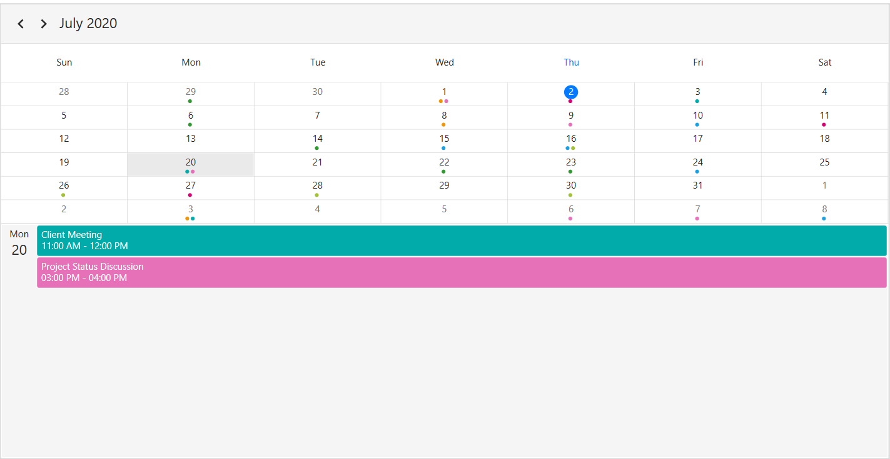

## Appointment display mode
You can handle the Scheduler month view appointment display by using the [AppointmentDisplayMode](https://help.syncfusion.com/cr/wpf/Syncfusion.UI.Xaml.Scheduler.MonthViewSettings.html#Syncfusion_UI_Xaml_Scheduler_MonthViewSettings_AppointmentDisplayMode) property of `MonthViewSettings`. By default, the `AppointmentDisplayMode` is set to `Appointment` Using the `AppointmentDisplayMode`, you can set the month view appointments display as follows.
* `None`:  Appointment will not be displayed.
* `Indicator`:  Appointment will be denoted as the circle.
* `Appointment`:  Appointment subject will be displayed in the month cell.



<syncfusion:SfScheduler x:Name="Schedule"
                        ViewType="Month" >
       <syncfusion:SfScheduler.MonthViewSettings>
            <syncfusion:MonthViewSettings AppointmentDisplayMode="Appointment"/>
       </syncfusion:SfScheduler.MonthViewSettings>
</syncfusion:SfScheduler>


this.Schedule.ViewType = SchedulerViewType.Month; 
this.Schedule.MonthViewSettings.AppointmentDisplayMode = AppointmentDisplayMode.Appointment;



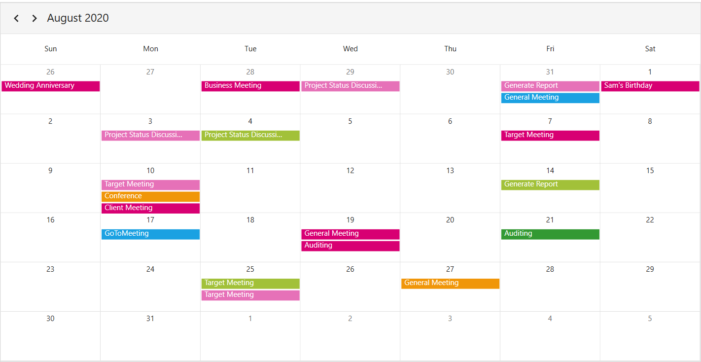

## Appointment display count
You can customize the number of appointments displayed in a month cell using the [AppointmentDisplayCount](https://help.syncfusion.com/cr/wpf/Syncfusion.UI.Xaml.Scheduler.MonthViewSettings.html#Syncfusion_UI_Xaml_Scheduler_MonthViewSettings_AppointmentDisplayCount) property of `MonthViewSettings` in Scheduler. By default, the appointment display count is 3.



<syncfusion:SfScheduler x:Name="Schedule"
                        ViewType="Month" >
    <syncfusion:SfScheduler.MonthViewSettings>
        <syncfusion:MonthViewSettings AppointmentDisplayMode="Indicator"    AppointmentDisplayCount="4"
        />
    </syncfusion:SfScheduler.MonthViewSettings>
</syncfusion:SfScheduler>


this.Schedule.ViewType = SchedulerViewType.Month;
this.Schedule.MonthViewSettings.AppointmentDisplayMode = AppointmentDisplayMode.Indicator;
this.Schedule.MonthViewSettings.AppointmentDisplayCount = 4;



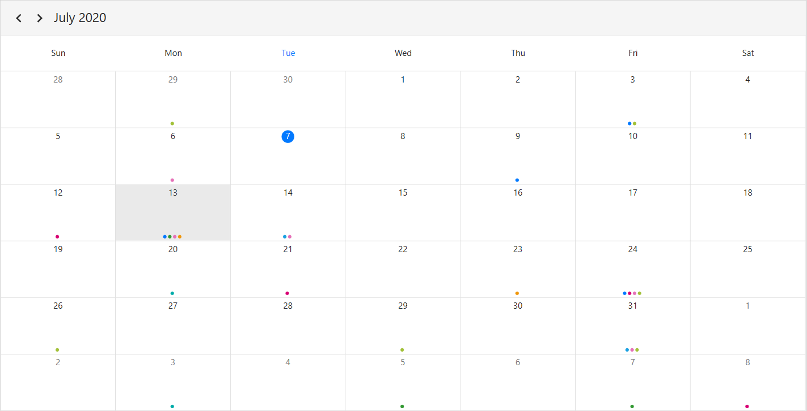

## Month navigation direction
The month view of a Scheduler can be navigated in both horizontal and vertical directions. You can change the direction of navigation using the [MonthNavigationDirection](https://help.syncfusion.com/cr/wpf/Syncfusion.UI.Xaml.Scheduler.MonthViewSettings.html#Syncfusion_UI_Xaml_Scheduler_MonthViewSettings_MonthNavigationDirection) property of `MonthViewSettings`. By default, the month navigation direction is set to `Horizontal`.



<syncfusion:SfScheduler x:Name="Schedule"
                        ViewType="Month" >
    <syncfusion:SfScheduler.MonthViewSettings>
        <syncfusion:MonthViewSettings MonthNavigationDirection="Vertical"/>
    </syncfusion:SfScheduler.MonthViewSettings>
 </syncfusion:SfScheduler>


this.Schedule.ViewType = SchedulerViewType.Month;
this.Schedule.MonthViewSettings.MonthNavigationDirection = MonthNavigationDirection.Vertical;



## Date format
You can customize the date format of the scheduler month view by using the [DateFormat](https://help.syncfusion.com/cr/wpf/Syncfusion.UI.Xaml.Scheduler.MonthViewSettings.html#Syncfusion_UI_Xaml_Scheduler_MonthViewSettings_DateFormat) property of `MonthViewSettings`. By default, the month date format is `d`.



<syncfusion:SfScheduler x:Name="Schedule"
                        ViewType="Month" >
    <syncfusion:SfScheduler.MonthViewSettings>
        <syncfusion:MonthViewSettings DateFormat="dd"/>
    </syncfusion:SfScheduler.MonthViewSettings>
</syncfusion:SfScheduler>


this.Schedule.ViewType = SchedulerViewType.Month;
this.Schedule.MonthViewSettings.DateFormat = "dd";



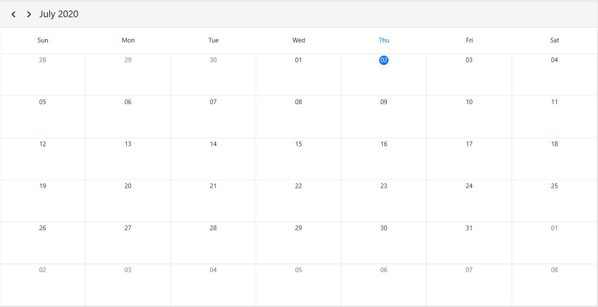

## View header
You can customize the default appearance of view header in month view by setting `ViewHeaderDayFormat`, `DateFormat` ,`ViewHeaderHeight` and `ViewHeaderTemplate` of TimelineViewSettings.

### View header text formatting
You can customize the day format of the Scheduler view header by using the [ViewHeaderDayFormat](https://help.syncfusion.com/cr/wpf/Syncfusion.UI.Xaml.Scheduler.ViewSettingsBase.html#Syncfusion_UI_Xaml_Scheduler_ViewSettingsBase_ViewHeaderDayFormat) property of `MonthViewSettings`. By default, the month view header day format is `ddd`.



<syncfusion:SfScheduler x:Name="Schedule"
                        ViewType="Month" >
    <syncfusion:SfScheduler.MonthViewSettings>
        <syncfusion:MonthViewSettings ViewHeaderDayFormat="dddd"/>
    </syncfusion:SfScheduler.MonthViewSettings>
</syncfusion:SfScheduler>


this.Schedule.ViewType = SchedulerViewType.Month;
this.Schedule.MonthViewSettings.ViewHeaderDayFormat = "dddd";



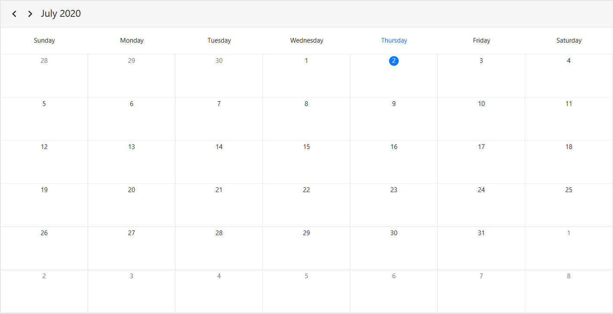

### View header height
You can customize the view header height by using the [ViewHeaderHeight](https://help.syncfusion.com/cr/wpf/Syncfusion.UI.Xaml.Scheduler.ViewSettingsBase.html#Syncfusion_UI_Xaml_Scheduler_ViewSettingsBase_ViewHeaderHeight) property of `MonthViewSettings`. By default, the `ViewHeaderHeight` is set to 50.



<syncfusion:SfScheduler x:Name="Schedule"
                        ViewType="Month" >
    <syncfusion:SfScheduler.MonthViewSettings>
        <syncfusion:MonthViewSettings ViewHeaderHeight="100"/>
    </syncfusion:SfScheduler.MonthViewSettings>
</syncfusion:SfScheduler>


this.Schedule.ViewType = SchedulerViewType.Month;
this.Schedule.MonthViewSettings.ViewHeaderHeight = 100;



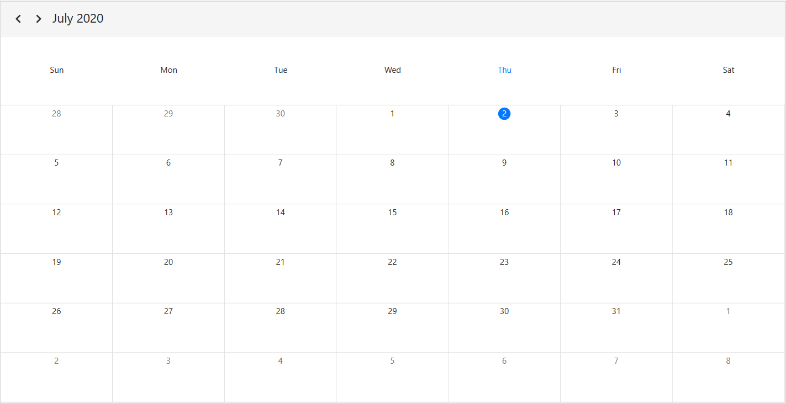

### View header appearance customization
You can customize the default appearance of the month view header by using the [ViewHeaderTemplate](https://help.syncfusion.com/cr/wpf/Syncfusion.UI.Xaml.Scheduler.ViewSettingsBase.html#Syncfusion_UI_Xaml_Scheduler_ViewSettingsBase_ViewHeaderTemplate) property of `MonthViewSettings`.



<Window.Resources>
    
</Window.Resources>
<syncfusion:SfScheduler x:Name="Schedule"
                        ViewType="Month" >
    <syncfusion:SfScheduler.MonthViewSettings>
        <syncfusion:MonthViewSettings>
            <syncfusion:MonthViewSettings.ViewHeaderTemplate>
                <DataTemplate>
                    <TextBlock FontFamily="Segoe UI"
                                FontSize="20"
                                FontStyle="Italic"
                                Foreground="Red"
                                Background="AntiqueWhite"
                                Text="{Binding DayText}"/>
                </DataTemplate>
            </syncfusion:MonthViewSettings.ViewHeaderTemplate>
        </syncfusion:MonthViewSettings>
    </syncfusion:SfScheduler.MonthViewSettings>
</syncfusion:SfScheduler>



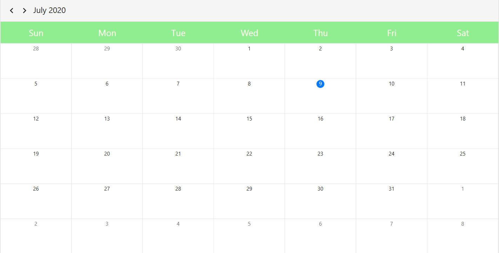

## Leading and Trailing days visibility
You can customize the leading and trailing days’_ visibility of the scheduler month view by using the [LeadingDaysVisibility](https://help.syncfusion.com/cr/wpf/Syncfusion.UI.Xaml.Scheduler.MonthViewSettings.html#Syncfusion_UI_Xaml_Scheduler_MonthViewSettings_LeadingDaysVisibility) and the [TrailingDaysVisibility](https://help.syncfusion.com/cr/wpf/Syncfusion.UI.Xaml.Scheduler.MonthViewSettings.html#Syncfusion_UI_Xaml_Scheduler_MonthViewSettings_TrailingDaysVisibility) property of `MonthViewSettings.` By default, the `LeadingDaysVisibility` and `TrailingDaysVisibility` is set to `Visible`.



<syncfusion:SfScheduler x:Name="Schedule"
                        ViewType="Month" >
    <syncfusion:SfScheduler.MonthViewSettings>
        <syncfusion:MonthViewSettings
         LeadingDaysVisibility="Collapsed"
         TrailingDaysVisibility="Collapsed"/>
    </syncfusion:SfScheduler.MonthViewSettings>
</syncfusion:SfScheduler>


this.Schedule.ViewType = SchedulerViewType.Month;
this.Schedule.MonthViewSettings.LeadingDaysVisibility = Collapsed.
this.Schedule.MonthViewSettings.TrailingDaysVisibility = Collapsed.Collapsed;



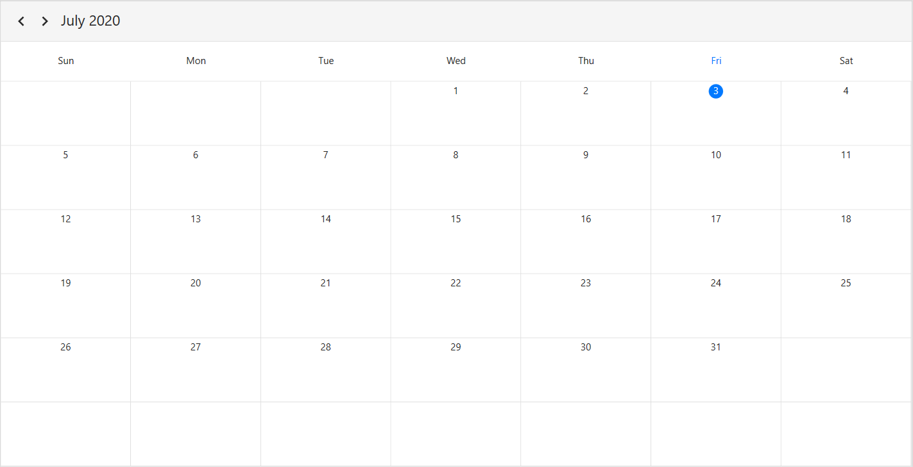

## Blackout dates
You can disable the interaction for certain dates in the scheduler month view by adding those specific dates to the [BlackoutDates](https://help.syncfusion.com/cr/wpf/Syncfusion.UI.Xaml.Scheduler.SfScheduler.html?tabs=tabid-1#Syncfusion_UI_Xaml_Scheduler_SfScheduler_BlackoutDates) collection property of the `SfScheduler.` Using this, you can allocate or restrict specific dates for the predefined events.



this.Schedule.ViewType = SchedulerViewType.Month;
this.Schedule.BlackoutDates = GetBlackoutDates();

private ObservableCollection<DateTime> GetBlackoutDates()
        {
            var blackoutDateCollection = new ObservableCollection<DateTime>()
            {
                DateTime.Now.Date.AddDays(1),
                DateTime.Now.Date.AddDays(2),
                DateTime.Now.Date.AddDays(3),
                DateTime.Now.Date.AddDays(4),
                DateTime.Now.Date.AddDays(5)
            };
            return blackoutDateCollection;
        }



### Customize blackout dates appearance 
 You can customize the blacked out dates (trailing, leading, normal days, and current date) by using the setting style.



<Window.Resources>
    
</Window.Resources>



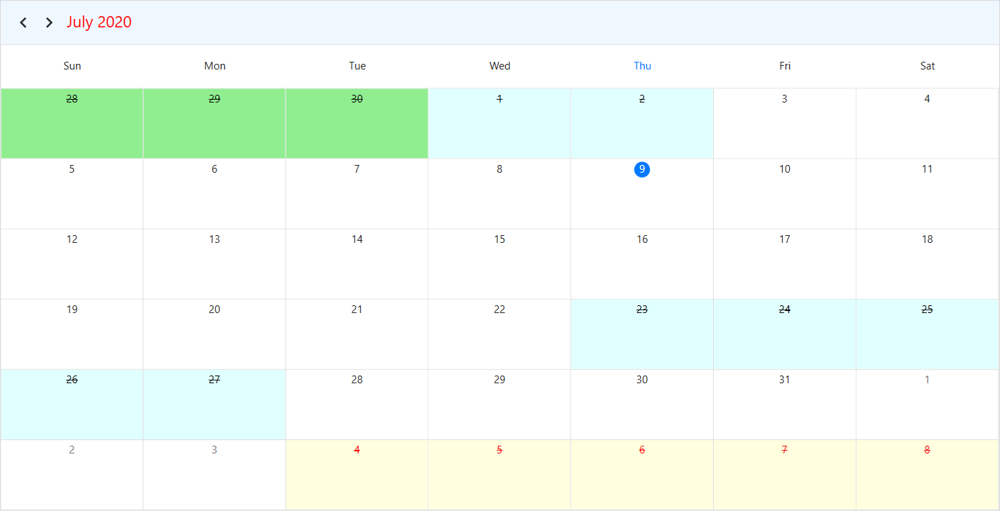

## Show week number
You can display the week number of a year in the scheduler month view by setting the [ShowWeekNumber](https://help.syncfusion.com/cr/wpf/Syncfusion.UI.Xaml.Scheduler.MonthViewSettings.html#Syncfusion_UI_Xaml_Scheduler_MonthViewSettings_ShowWeekNumber) property of `MonthViewSettings` to `true`. By default, it is set to `false`.



<syncfusion:SfScheduler x:Name="Schedule"
                        ViewType="Month" >
    <syncfusion:SfScheduler.MonthViewSettings>
        <syncfusion:MonthViewSettings ShowWeekNumber="True"/>
    </syncfusion:SfScheduler.MonthViewSettings>
</syncfusion:SfScheduler>


this.Schedule.ViewType = SchedulerViewType.Month;
this.Schedule.MonthViewSettings.ShowWeekNumber = true;



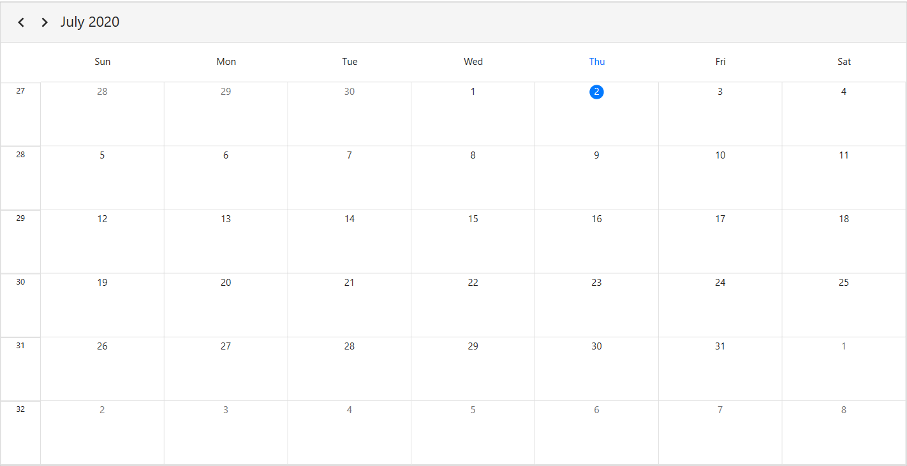

## Customize week number template
You can customize the default appearance of a week number template in month view by using the [WeekNumberTemplate](https://help.syncfusion.com/cr/wpf/Syncfusion.UI.Xaml.Scheduler.MonthViewSettings.html#Syncfusion_UI_Xaml_Scheduler_MonthViewSettings_WeekNumberTemplate) property of `MonthViewSettings`.



<syncfusion:SfScheduler x:Name="Schedule"
                        ViewType="Month" >
    <syncfusion:SfScheduler.MonthViewSettings>
                <syncfusion:MonthViewSettings ShowWeekNumber="True">
                    <syncfusion:MonthViewSettings.WeekNumberTemplate>
                        <DataTemplate>
                             <Grid >
                                <Label  Foreground="Red"
                                        Content="{Binding}"
                                        VerticalAlignment="Center"
                                        HorizontalAlignment="Center"/>
                            </Grid>
                        </DataTemplate>
                    </syncfusion:MonthViewSettings.WeekNumberTemplate>
                </syncfusion:MonthViewSettings>
    </syncfusion:SfScheduler.MonthViewSettings>
</syncfusion:SfScheduler>



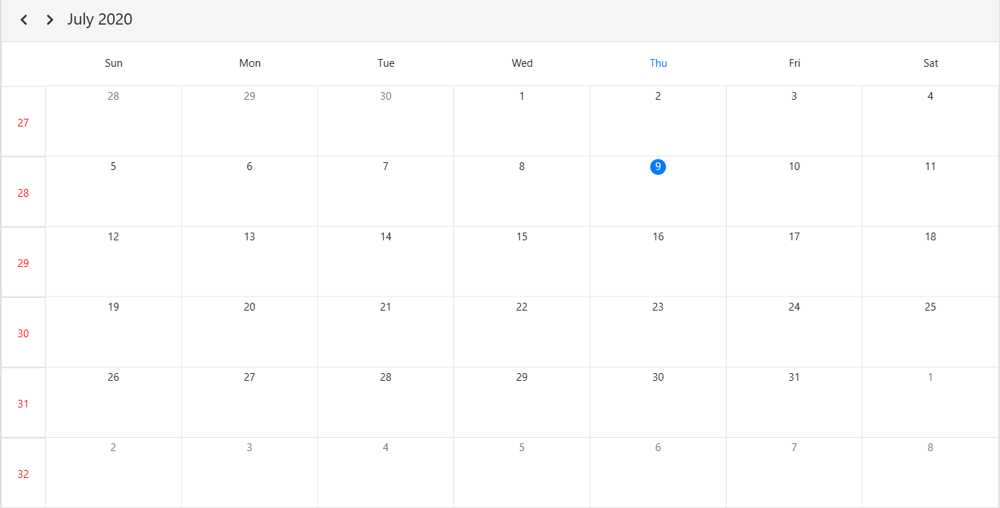

## Customize month cell appearance 

### Using the DataTemplate 
You can customize the default appearance of the month cell by using the [MonthCellTemplate](https://help.syncfusion.com/cr/wpf/Syncfusion.UI.Xaml.Scheduler.MonthViewSettings.html#Syncfusion_UI_Xaml_Scheduler_MonthViewSettings_MonthCellTemplate) property of `MonthViewSettings`.



<syncfusion:SfScheduler x:Name="Schedule"
                        ViewType="Month">
    <syncfusion:SfScheduler.MonthViewSettings>
        <syncfusion:MonthViewSettings>
             <syncfusion:MonthViewSettings.MonthCellTemplate>
                <DataTemplate>
                    <Border Background="BlueViolet">
                        <TextBlock HorizontalAlignment="Center" Foreground="White" Text="{Binding DateTime.Day}"/>
                    </Border>
                </DataTemplate>
             </syncfusion:MonthViewSettings.MonthCellTemplate>
        </syncfusion:MonthViewSettings>
    </syncfusion:SfScheduler.MonthViewSettings>
</syncfusion:SfScheduler>



### Using the DataTemplateSelector 
You can customize the default appearance of the month cell by using the [MonthCellTemplateSelector](https://help.syncfusion.com/cr/wpf/Syncfusion.UI.Xaml.Scheduler.MonthViewSettings.html#Syncfusion_UI_Xaml_Scheduler_MonthViewSettings_MonthCellTemplateSelector) property of `MonthViewSettings`.
The `DataTemplateSelector` can choose a DataTemplate at runtime based on the value of a data-bound to Scheduler month cell using the MonthCellTemplate. It lets you choose a different data template for each month's cell, customizing the appearance of a particular month cell based on certain conditions.



<Window.Resources>
        <local:MonthCellTemplateSelector x:Key="monthCellTemplateSelector"/>
</Window.Resources>   
<syncfusion:SfScheduler x:Name="Schedule" 
                        ViewType="Month"
                        ItemsSource="{Binding Appointments}">          
    <syncfusion:SfScheduler.MonthViewSettings>
        <syncfusion:MonthViewSettings AppointmentDisplayMode="Indicator" 
                                      MonthCellTemplateSelector="{StaticResource monthCellTemplateSelector}">
        </syncfusion:MonthViewSettings>
    </syncfusion:SfScheduler.MonthViewSettings>
</syncfusion:SfScheduler>     


 public class MonthCellTemplateSelector : DataTemplateSelector
    {
        public MonthCellTemplateSelector()
        {
            var mainWindow = App.Current.MainWindow as Window;
            this.MonthAppointmentTemplate = mainWindow.Resources["monthAppointmentTemplate"] as DataTemplate;
            this.MonthCellDatesTemplate = mainWindow.Resources["monthCellTemplate"] as DataTemplate;
        }

        public DataTemplate MonthAppointmentTemplate { get; set; }
        public DataTemplate MonthCellDatesTemplate { get; set; }
        public override DataTemplate SelectTemplate(object item, DependencyObject container)
        {
            var appointments = item as List<ScheduleAppointment>;
            var cell = container as MonthCell;
            if (cell.DateTime.Date == DateTime.Now.Date)
                cell.Foreground = Brushes.Black;

            if (appointments == null || appointments.Count == 0)
            {
                cell.DataContext = cell;
                return MonthCellDatesTemplate;
            }
            else
            {
                MonthCellViewModel monthCellViewModel = new MonthCellViewModel();
                monthCellViewModel.Foreground = cell.Foreground;
                monthCellViewModel.DateText = cell.DateText;
                monthCellViewModel.MonthCellAppointments = appointments;
                cell.DataContext = monthCellViewModel;
                return MonthAppointmentTemplate;
            }
        }
    }



## Customize month view appointments

### Using the DataTemplate
You can customize the default appearance of the month cell appointment by using the [AppointmentTemplate](https://help.syncfusion.com/cr/wpf/Syncfusion.UI.Xaml.Scheduler.ViewSettingsBase.html#Syncfusion_UI_Xaml_Scheduler_ViewSettingsBase_AppointmentTemplate) property of `MonthViewSettings`.

 

<syncfusion:SfScheduler x:Name="Schedule" ViewType="Month" ItemsSource="{Binding Appointments}">
            <syncfusion:SfScheduler.MonthViewSettings>
                <syncfusion:MonthViewSettings>
                    <syncfusion:MonthViewSettings.AppointmentTemplate>
                        <DataTemplate>
                        <TextBlock 
                        Background="{Binding Data.BackgroundColor}"
                        Text="{Binding Data.EventName}" 
                        HorizontalAlignment="Stretch"
                        TextTrimming="CharacterEllipsis"
                        Foreground="{Binding Data.ForegroundColor}"        
                        TextWrapping="Wrap"
                        FontStyle="Italic" />
                        </DataTemplate>
                    </syncfusion:MonthViewSettings.AppointmentTemplate>
                </syncfusion:MonthViewSettings>
            </syncfusion:SfScheduler.MonthViewSettings>
</syncfusion:SfScheduler>



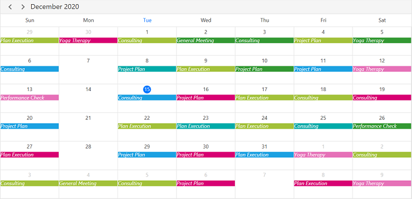

### Using the DataTemplateSelector
You can customize the default appearance of the month view appointments by using the [AppointmentTemplateSelector](https://help.syncfusion.com/cr/wpf/Syncfusion.UI.Xaml.Scheduler.ViewSettingsBase.html#Syncfusion_UI_Xaml_Scheduler_ViewSettingsBase_AppointmentTemplateSelector) property of `MonthViewSettings`.
The `DataTemplateSelector` can choose a DataTemplate at runtime based on the value of a data-bound to Scheduler month appointments using the `AppointmentTemplate`. It lets you choose a different data template for each month's cell, customizing the appearance of a particular appointment based on certain conditions.



<Window.Resources>
    <local:MonthViewAppointmentTemplateSelector x:Key="appointmentTemplateSelector">
        <local:MonthViewAppointmentTemplateSelector.CurrentDayAppointmentTemplate>
             <DataTemplate>
                <Border>
                    <TextBlock Text="{Binding Subject}" 
                                FontStyle="Italic" 
                                Foreground="Red" 
                                TextWrapping="Wrap" 
                                TextTrimming="WordEllipsis"/>
                </Border>
            </DataTemplate>
        </local:MonthViewAppointmentTemplateSelector.CurrentDayAppointmentTemplate>
        <local:MonthViewAppointmentTemplateSelector.DefaultAppointmentTemplate>
            <DataTemplate>
                <TextBlock Text="{Binding Subject}"
                            TextWrapping="Wrap" 
                            TextTrimming="WordEllipsis"/>
            </DataTemplate>
        </local:MonthViewAppointmentTemplateSelector.DefaultAppointmentTemplate>
    </local:MonthViewAppointmentTemplateSelector>
</Window.Resources>

<syncfusion:SfScheduler x:Name="Schedule"
                        ViewType="Month" >
    <syncfusion:SfScheduler.MonthViewSettings>
        <syncfusion:MonthViewSettings AppointmentTemplateSelector="{StaticResource appointmentTemplateSelector}"/>
    </syncfusion:SfScheduler.MonthViewSettings>
</syncfusion:SfScheduler>



public class MonthViewAppointmentTemplateSelector : DataTemplateSelector
{
    public DataTemplate CurrentDayAppointmentTemplate { get; set; }
    public DataTemplate DefaultAppointmentTemplate { get; set; }

    public override DataTemplate SelectTemplate(object item, DependencyObject container)
    {
            var app = item as ScheduleAppointment;
            if (app.StartTime.Date == DateTime.Today.Date)
                return this.CurrentDayAppointmentTemplate;
            else
                return this.DefaultAppointmentTemplate;
    }
}



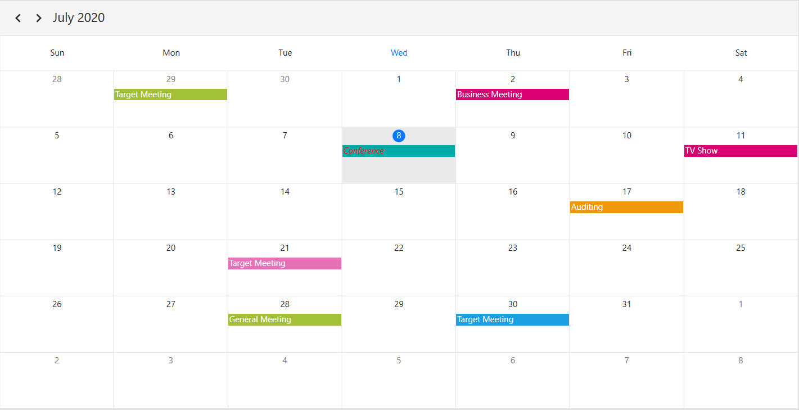