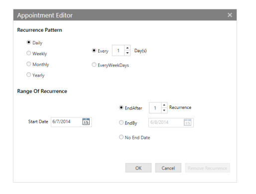

# WPF Scheduler (SfScheduler) Overview

The WPF Scheduler control is used to schedule and manage appointments through an intuitive user interface, similar to the Outlook calendar.

## Key features

**Built-in Views** — Scheduler provides five different types of views such as Day, WorkWeek, Week, Timeline, and Month.

**Events** - Appointments contain information on events scheduled at specific times. In addition to default appointments, the users can use their own collections to connect a business entity to an appointment by mapping their fields, such as start time, end time, subject, notes, and recurrence.

**Recurrence Events** — Easily configure recurring events on a daily, weekly, monthly, or yearly basis. You can also skip or change the occurrence of a recurring appointment.

**Appointment Mapping** - Scheduler control supports to map any collection that implements the IEnumerable interface to populate appointments.

**Appointment Editor** - You can easily create, edit, or delete appointments using the built-in appointment editor.

**Timezone** - Display appointments created in various time zones in the system time zone. Appointment start and end times are also automatically adjusted and displayed based on the daylight savings time.

**First day of the week** - Customize the first day of the week as needed. The default first day is Sunday.

**Flexible working days** - Customize the workdays in a workweek so that the remaining days will be hidden from view.

**Appearance Customization** — Provide a unique look to your scheduler with the event appearance customization.

**Localization** — Display the current date and time by following the globalized date and time formats, and localize all available static texts in the scheduler.

## Key Features

### Appointment Editor

The Appointments Editor to be used to create or edit various types of appointments with a specific time or location or using "All Day Events" without a specific time or location on your schedule. Appointment Editor can customize several feature of appointment such as applying reminder and adding recurrence to an appointment. It’s also simple to reschedule the added appointments by editing the Star Time and End Time of appointments.

### Built-in Views

Schedule provides 4 different types of viewing the calendar, 

* Day
* Week 
* Month
* TimeLine

### Multi-Resource Support

The Schedule control allows you to define resources that can be assigned to appointments. Resources let you associate additional information with your appointments. The schedule can group appointments based on the resources associated with them.

### Recurrence Appointment

You can schedule recurring appointments to repeat daily, weekly, monthly, or yearly. You can customize recurring appointment schedules that repeat for daily, weekly, monthly, or yearly.

### Remainders

You can use reminder to organize your appointments in your schedule. Schedule reminds you the particular appointment in the specified time. The remainder time can be set using the ReminderTime property of ScheduleAppointment.

### Rich User Experience

The Schedule control allows you to perform various operations. You can easily drag and drop the appointments from one timeslot to another timeslot. Appointment resizing operation can also be performed as per required start and end time of schedule in an interactive manner and also appointment can be modified though Appointment Editor.

### Appointment Mapping

The AppointmentMapping attributes are used to map the properties in the underlying data source to the Schedule appointments. The various attributes of the AppointmentMapping property are as follows.  

* Subject
* Location 
* StartTime 
* EndTime

