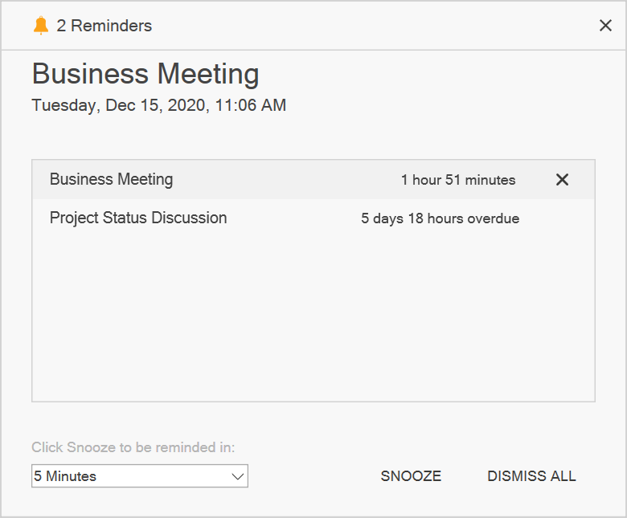

# Reminder in WPF Scheduler (SfScheduler)
Scheduler alerts you for particular appointment with reminder window when enable the `EnableReminder` property. Reminder window supports to `Dismiss` or `DismissAll` or set the `SnoozeTime` for reminder appointments.

## Setting reminder for an appointment
Reminder can be set by setting the `EnableReminder` property is `true`.The reminder time can be set using the `Reminders` property of ScheduleAppointment.



<syncfusion:SfScheduler x:Name="Scheduler"
                        ViewType="Week"
                         EnableReminder="True" >
</syncfusion:SfScheduler>



## Configuring scheduler reminder
You can configure appointment reminders with ScheduleReminder.
`SchedulerReminder` has the following properties for reminder alert,

* `ReminderTimeInterval` - Gets or sets the time interval that decides to open the reminder alert window before the appointment’s start time.
* `ReminderAlertTime` - Gets the reminder time that decides when to show a reminder alert of the appointment.
* `Appointment` - Gets the appointment details for which the reminder is created.
* `Data` - Gets the reminder data object associated with `SchedulerReminder`.
* `IsDismissed` - Gets or sets whether the reminder is dismissed. 
* `IsSnoozed` - Gets or sets whether the reminder is snoozed.



 ScheduleAppointmentCollection scheduleAppointments = new ScheduleAppointmentCollection();
scheduleAppointments.Add(new ScheduleAppointment
{
    StartTime = DateTime.Now.Date.AddHours(9),
    EndTime = DateTime.Now.Date.AddHours(10),
    Subject = "Appointment",
    Reminders = new ObservableCollection<SchedulerReminder>()
                {
                    new SchedulerReminder(){ReminderTimeInterval = new TimeSpan(5, 0, 0, 0)},
                    new SchedulerReminder(){ReminderTimeInterval = new TimeSpan(10, 0, 0, 0)}
                },
});



## Create a custom binding for reminder   
Reminders supports to map your custom object with `ScheduleAppointment.Reminders`.



/// 

/// Represents custom data properties.
/// 

public class Meeting
{
    public string EventName { get; set; }
    public DateTime From { get; set; }
    public DateTime To { get; set; }
    public ObservableCollection<CustomReminder> Alerts { get; set; }
}



`ReminderMapping` provides the mapping information about `SchedulerReminder` properties to `Data` object.ReminderMapping has the following properties for reminder alert,

* `ReminderTimeInterval` - Maps the property name of custom class, which is equivalent for `SchedulerReminder.ReminderTimeInterval`.
* `IsDismissed` -  Maps the property name of custom class, which is equivalent for `SchedulerReminder.IsDismissed`.



/// 

/// Represents custom data properties.
/// 

public class CustomReminder : INotifyPropertyChanged
{
    private TimeSpan reminderTimeInterval;
    private bool dissmis;
    public TimeSpan ReminderInterval
    {
        get { return reminderTimeInterval; }
        set
        {
            reminderTimeInterval = value;
            this.RaisePropertyChange("ReminderInterval");
        }
    }
    public bool Dismiss
        {
        get { return dissmis; }
        set
        {
            dissmis = value;
            this.RaisePropertyChange("Dismiss");
        }
    }

    public event PropertyChangedEventHandler PropertyChanged;

    private void RaisePropertyChange(string propName)
    {
        this.PropertyChanged?.Invoke(this, new PropertyChangedEventArgs(propName));
    }
}




You can map those properties of `Meeting` class with our [SfScheduler](https://help.syncfusion.com/cr/wpf/Syncfusion.UI.Xaml.Scheduler.SfScheduler.html) control by using [AppointmentMapping](https://help.syncfusion.com/cr/wpf/Syncfusion.UI.Xaml.Scheduler.AppointmentMapping.html) and also map `CustomReminder` properties with `SchedulerReminder` by using `ReminderMapping`.



<scheduler:SfScheduler
x:Name="scheduler" ViewType="Week" 
EnableReminder="True" >
    <scheduler:SfScheduler.AppointmentMapping>
        <scheduler:AppointmentMapping
         StartTime="From"
         EndTime="To"
         Subject="EventName"
         Reminders="Alerts">
        <scheduler:AppointmentMapping.ReminderMapping>
        <scheduler:ReminderMapping IsDismissed="Dismiss"
        ReminderTimeInterval="ReminderInterval"/>
        </scheduler:AppointmentMapping.ReminderMapping>
        </scheduler:AppointmentMapping>
    </scheduler:SfScheduler.AppointmentMapping>
</scheduler:SfScheduler>


ObservableCollection<Meeting> Meetings = new ObservableCollection<Meeting>();
Meetings.Add(new Meeting
{
    From = DateTime.Now.Date.AddHours(9),
    To = DateTime.Now.Date.AddHours(10),
    EventName = "Appointment",
    Alerts = new ObservableCollection<CustomReminder>()
    {
        new CustomReminder() { ReminderInterval = new TimeSpan(5, 0, 0) },
        new CustomReminder() { ReminderInterval = new TimeSpan(10, 0, 0) }
     }
});



## Handling Reminder events
### ReminderAlertOpening event
Scheduler notifies by `ReminderAlertOpening` event when appearing the reminder window. `ReminderAlertOpeningEventArgs` has following properties.
* `Reminders` - Gets a list of reminders that are used to display the appointment reminders in the reminder alert window.
* [Cancel](https://docs.microsoft.com/en-us/dotnet/api/system.componentmodel.canceleventargs.cancel?view=netcore-3.1) - To avoid reminder window opening by enabling this property.



scheduler.ReminderAlertOpening += Scheduler_ReminderAlertOpening;

private void Scheduler_ReminderAlertOpening(object sender, ReminderAlertOpeningEventArgs e)
{
    var reminders = e.Reminders;
    var appointment = e.Reminders[0].Appointment;
}

