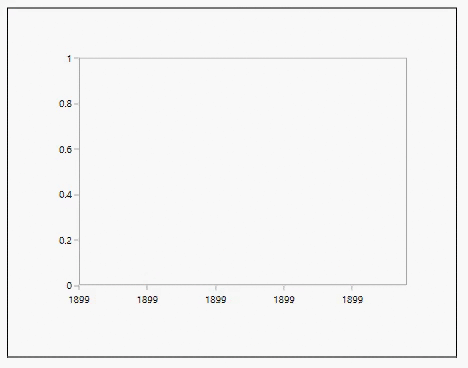
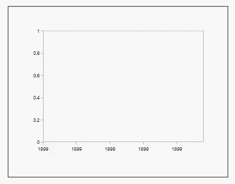

# Animation

SfChart allows you to animate the chart series on loading, and whenever the ItemsSource changes. Animation in chart can be enabled by setting the EnableAnimation property as True and defining the corresponding animation speed with AnimationDuration property.

The following types of series support Animation.

* Line
* Column
* Bar
* Area
* Scatter
* Bubble
* Spline
* Spline area
* Stacking column
* Stacking bar
* Stacking area
* Pie

The following APIs are used to customize the Animation.

* [`EnableAnimation`](http://help.syncfusion.com/cr/cref_files/wpf/Syncfusion.SfChart.WPF~Syncfusion.UI.Xaml.Charts.ChartSeriesBase~EnableAnimation.html)-Represents a boolean value to enable the animation for series.
* [`AnimationDuration`](http://help.syncfusion.com/cr/cref_files/wpf/Syncfusion.SfChart.WPF~Syncfusion.UI.Xaml.Charts.ChartSeriesBase~AnimationDuration.html)-Represents a TimeSpan value which sets animation speed for the chart.

The following example shows the Animation feature for chart series.





<syncfusion:SfChart>

<syncfusion:ColumnSeries EnableAnimation="True" AnimationDuration="00:00:03" 

XBindingPath="Category" YBindingPath="Count" ItemsSource="{Binding}"/>

</syncfusion:SfChart>





ColumnSeries columnSeries = new ColumnSeries()
{

        ItemsSource = new ViewModel().Data,

        XBindingPath = "Category",

        YBindingPath = "Count",

        EnableAnimation = true,

        AnimationDuration = new TimeSpan(00, 00, 03)

};

chart.Series.Add(columnSeries);





**Column** **Series**

**SplineArea** **Series**

**Scatter** **Series**

