# Interactive Features

SfChart provides interactive features such as zooming, selection, and tracking data points.

The following interactive features are supported in SfChart.

* ToolTip
* TrackBall
* Visual Data Editing
* Zoom and Pan
* Selection
* Resizing Scrollbar
* CrossHair

## ToolTip

The ToolTip feature allows you to display any information over a [`ChartSeries`](http://help.syncfusion.com/cr/cref_files/wpf/sfchart/Syncfusion.SfChart.WPF~Syncfusion.UI.Xaml.Charts.ChartSeries.html#). It is used in conjunction with the pointer. It appears when the mouse hovers over any chart segment. It is set to display the metadata of the particular segment or data point.

By default, a small box containing the data points y values are displayed as the ToolTip. The y values vary depending on the [`ChartSeries`](http://help.syncfusion.com/cr/cref_files/wpf/sfchart/Syncfusion.SfChart.WPF~Syncfusion.UI.Xaml.Charts.ChartSeries.html#). For example, a single y value is usually displayed in Column and [`BarSeries`](http://help.syncfusion.com/cr/cref_files/wpf/sfchart/Syncfusion.SfChart.WPF~Syncfusion.UI.Xaml.Charts.BarSeries.html#). In the [`FinancialSeries`](http://help.syncfusion.com/cr/cref_files/wpf/sfchart/Syncfusion.SfChart.WPF~Syncfusion.UI.Xaml.Charts.FinancialSeriesBase.html#), high, low, open, and close values are displayed in ToolTip. 

The tooltip will be visible if you enable ShowTooltip property as in the below code snippet.





<syncfusion:ColumnSeries  ShowTooltip="True"                                                  

ItemsSource="{Binding Demands}" 

XBindingPath="Demand"  YBindingPath="Year2010"/>

<syncfusion:ColumnSeries ItemsSource="{Binding Demands}" 

ShowTooltip="True"                           

XBindingPath="Demand"  YBindingPath="Year2011"/>           





ColumnSeries series1 = new ColumnSeries()
{

    ItemsSource = new ViewModel().Demands,

    XBindingPath = "Demand",

    YBindingPath = "Year2010",

    ShowTooltip = true

};

ColumnSeries series2 = new ColumnSeries()
{

    ItemsSource = new ViewModel().Demands,

    XBindingPath = "Demand",

    YBindingPath = "Year2011",

    ShowTooltip = true

};

chart.Series.Add(series1);

chart.Series.Add(series2);





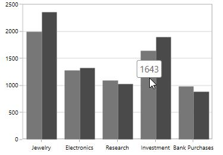

### Aligning the ToolTip

The tooltip can be aligned with respect to the cursor position using [`HorizontalAlignment`](http://help.syncfusion.com/cr/cref_files/wpf/sfchart/Syncfusion.SfChart.WPF~Syncfusion.UI.Xaml.Charts.ChartTooltip_members.html#) and [`VerticalAlignment`](http://help.syncfusion.com/cr/cref_files/wpf/sfchart/Syncfusion.SfChart.WPF~Syncfusion.UI.Xaml.Charts.ChartTooltip_members.html#) properties.

**HorizontalAlignment**

The following code example illustrates the positioning of tooltip to left of the cursor.





<syncfusion:ColumnSeries ShowTooltip="True" ItemsSource="{Binding Demands}"  

syncfusion:ChartTooltip.HorizontalAlignment="Left"

XBindingPath="Demand"  YBindingPath="Year2010" />

<syncfusion:ColumnSeries ItemsSource="{Binding Demands}" 

syncfusion:ChartTooltip.HorizontalAlignment="Left" ShowTooltip="True"

XBindingPath="Demand"  YBindingPath="Year2011"/>





ColumnSeries series1 = new ColumnSeries()
{

    ItemsSource = new ViewModel().Demands,

    XBindingPath = "Demand",

    YBindingPath = "Year2010",

    ShowTooltip = true
    
};

ChartTooltip.SetHorizontalAlignment(series1, HorizontalAlignment.Left);

ColumnSeries series2 = new ColumnSeries()
{

    ItemsSource = new ViewModel().Demands,

    XBindingPath = "Demand",

    YBindingPath = "Year2011",

    ShowTooltip = true

};

ChartTooltip.SetHorizontalAlignment(series2, HorizontalAlignment.Left);

chart.Series.Add(series1);

chart.Series.Add(series2);





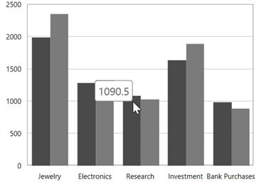

N> By default the horizontal alignment is center for the tooltip.

**VerticalAlignment**

The following code example illustrates the positioning of tooltip to bottom of the cursor.





<syncfusion:ColumnSeries ShowTooltip="True" ItemsSource="{Binding Demands}"  

syncfusion:ChartTooltip.VerticalAlignment="Bottom"

XBindingPath="Demand" YBindingPath="Year2010" />

<syncfusion:ColumnSeries ItemsSource="{Binding Demands}"

syncfusion:ChartTooltip.VerticalAlignment="Bottom"

ShowTooltip="True" XBindingPath="Demand"  YBindingPath="Year2011"/>





ColumnSeries series1 = new ColumnSeries()
{

    ItemsSource = new ViewModel().Demands,

    XBindingPath = "Demand",

    YBindingPath = "Year2010",

    ShowTooltip = true
    
};

ChartTooltip.SetVerticalAlignment(series1, VerticalAlignment.Bottom);

ColumnSeries series2 = new ColumnSeries()
{

    ItemsSource = new ViewModel().Demands,

    XBindingPath = "Demand",

    YBindingPath = "Year2011",

    ShowTooltip = true

};

ChartTooltip.SetVerticalAlignment(series2, VerticalAlignment.Bottom);

chart.Series.Add(series1);

chart.Series.Add(series2);





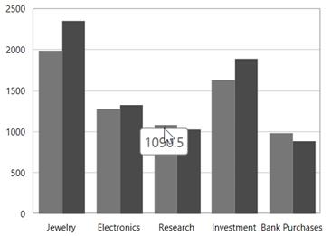

**ToolTipMargin**

You can also set the distance for the margin to be positioned from the cursor using ToolTipMargin property as in the below code snippet.





<syncfusion:ColumnSeries Label="2010" ShowTooltip="True"

ItemsSource="{Binding Demands}"   Interior="#777777"

syncfusion:ChartTooltip.TooltipMargin="25"

XBindingPath="Demand" YBindingPath="Year2010" />

<syncfusion:ColumnSeries Label="2011"  ItemsSource="{Binding Demands}"

Interior="#4A4A4A"

syncfusion:ChartTooltip.TooltipMargin="25"

ShowTooltip="True" XBindingPath="Demand"  YBindingPath="Year2011"/>





ColumnSeries series1 = new ColumnSeries()
{

    ItemsSource = new ViewModel().Demands,

    XBindingPath = "Demand",

    YBindingPath = "Year2010",

    ShowTooltip = true,

    Interior = new SolidColorBrush(Color.FromRgb(0x77, 0x77, 0x77)),

    Label = "2010"

};

ChartTooltip.SetTooltipMargin(series1, new Thickness(25));

ColumnSeries series2 = new ColumnSeries()
{

    ItemsSource = new ViewModel().Demands,

    XBindingPath = "Demand",

    YBindingPath = "Year2011",

    ShowTooltip = true,

    Interior = new SolidColorBrush(Color.FromRgb(0x4A, 0x4A, 0x4A)),

    Label = "2011"

};

ChartTooltip.SetTooltipMargin(series2, new Thickness(25));

chart.Series.Add(series1);

chart.Series.Add(series2);





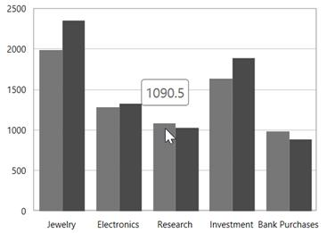

N>By default the VerticalAlignment of the Tooltip is Top

**VerticalOffset** **and** **HorizontalOffset**

The tooltip can be positioned at a particular distance from the cursor horizontally using [`HorizontalOffset`](http://help.syncfusion.com/cr/cref_files/wpf/sfchart/Syncfusion.SfChart.WPF~Syncfusion.UI.Xaml.Charts.ChartTooltip~SetHorizontalOffset.html#) and vertically using [`VerticalOffset`](http://help.syncfusion.com/cr/cref_files/wpf/sfchart/Syncfusion.SfChart.WPF~Syncfusion.UI.Xaml.Charts.ChartTooltip~SetVerticalOffset.html#) properties.





<syncfusion:ColumnSeries ShowTooltip="True"

ItemsSource="{Binding Demands}" 

syncfusion:ChartTooltip.HorizontalOffset="40"

syncfusion:ChartTooltip.VerticalOffset="40"

XBindingPath="Demand" YBindingPath="Year2010" />

<syncfusion:ColumnSeries ItemsSource="{Binding Demands}"

syncfusion:ChartTooltip.HorizontalOffset="40"

syncfusion:ChartTooltip.VerticalOffset="40" ShowTooltip="True"

XBindingPath="Demand"  YBindingPath="Year2011"/>





ColumnSeries series1 = new ColumnSeries()
{

    ItemsSource = new ViewModel().Demands,

    XBindingPath = "Demand",

    YBindingPath = "Year2010",

    ShowTooltip = true,

    Interior = new SolidColorBrush(Color.FromRgb(0x77, 0x77, 0x77)),

    Label = "2010"

};

ChartTooltip.SetHorizontalOffset(series1, 40);

ChartTooltip.SetVerticalOffset(series1, 40);

ColumnSeries series2 = new ColumnSeries()
{

    ItemsSource = new ViewModel().Demands,

    XBindingPath = "Demand",

    YBindingPath = "Year2011",

    ShowTooltip = true,

    Interior = new SolidColorBrush(Color.FromRgb(0x4A, 0x4A, 0x4A)),

    Label = "2011"

};

ChartTooltip.SetHorizontalOffset(series2, 40);

ChartTooltip.SetVerticalOffset(series2, 40);

chart.Series.Add(series1);

chart.Series.Add(series2);





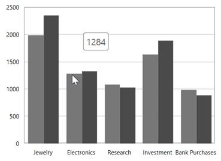

### ToolTip Duration

This property [`ShowDuration`](http://help.syncfusion.com/cr/cref_files/wpf/sfchart/Syncfusion.SfChart.WPF~Syncfusion.UI.Xaml.Charts.ChartTooltip~SetShowDuration.html#) in [`ChartToolTip`](http://help.syncfusion.com/cr/cref_files/wpf/sfchart/Syncfusion.SfChart.WPF~Syncfusion.UI.Xaml.Charts.ChartTooltip.html#) sets the duration time for tooltip to be displayed in milliseconds.

The following code example demonstrates the duration of the tooltip set as 5 seconds.





<syncfusion:ColumnSeries ShowTooltip="True"  

syncfusion:ChartTooltip.ShowDuration="5000"                                          

ItemsSource="{Binding Demands}" Interior="#777777"                                     

XBindingPath="Demand"  YBindingPath="Year2010">                                   

</syncfusion:ColumnSeries>





ColumnSeries series = new ColumnSeries()
{

    ItemsSource = new ViewModel().Demands,

    XBindingPath = "Demand",

    YBindingPath = "Year2010",

    ShowTooltip = true,

    Interior = new SolidColorBrush(Color.FromRgb(0x77, 0x77, 0x77)),

    Label = "2010"

};

ChartTooltip.SetShowDuration(series, 5000);

chart.Series.Add(series);





N> The tooltip by default will be displayed for 1000 milliseconds.

**Show** **Delay**

ToolTip also has support for delay the time to display by setting [`SetInitialShowDelay`](http://help.syncfusion.com/cr/cref_files/wpf/sfchart/Syncfusion.SfChart.WPF~Syncfusion.UI.Xaml.Charts.ChartTooltip~SetInitialShowDelay.html#) property in milliseconds.

The following code example demonstrates the tooltip will be delayed for 1 second at the before display.





<syncfusion:ColumnSeries Label="2010" ShowTooltip="True"  

syncfusion:ChartTooltip.InitialShowDelay="1000"                                          

ItemsSource="{Binding Demands}" Interior="#777777"                                     

XBindingPath="Demand"  YBindingPath="Year2010" />                                   





ColumnSeries series = new ColumnSeries()
{

    ItemsSource = new ViewModel().Demands,

    XBindingPath = "Demand",

    YBindingPath = "Year2010",

    ShowTooltip = true,

    Interior = new SolidColorBrush(Color.FromRgb(0x77, 0x77, 0x77)),

    Label = "2010"

};

ChartTooltip.SetInitialShowDelay(series, 1000);

chart.Series.Add(series);





### Animation for ToolTip

You can also provide animation effects for tooltip by setting [`EnableAnimation`](http://help.syncfusion.com/cr/cref_files/wpf/sfchart/Syncfusion.SfChart.WPF~Syncfusion.UI.Xaml.Charts.ChartTooltip~SetEnableAnimation.html#) property as true as shown in the below code snippet.





<syncfusion:ColumnSeries Label="2010" ShowTooltip="True"  

syncfusion:ChartTooltip.EnableAnimation="True"                                          

ItemsSource="{Binding Demands}" Interior="#777777"                                     

XBindingPath="Demand"  YBindingPath="Year2010">                                   

</syncfusion:ColumnSeries>





ColumnSeries series = new ColumnSeries()
{

    ItemsSource = new ViewModel().Demands,

    XBindingPath = "Demand",

    YBindingPath = "Year2010",

    ShowTooltip = true,

    Interior = new SolidColorBrush(Color.FromRgb(0x77, 0x77, 0x77)),

    Label = "2010"

};

ChartTooltip.SetEnableAnimation(series, true);

chart.Series.Add(series);





### Customizing the Tooltip

[`ToolTipTemplate`](http://help.syncfusion.com/cr/cref_files/wpf/sfchart/Syncfusion.SfChart.WPF~Syncfusion.UI.Xaml.Charts.ChartSeriesBase~TooltipTemplate.html#) property allows you to customize the default appearance of the tooltip as illustrated in the below code snippet.





<syncfusion:ColumnSeries ShowTooltip="True"

ItemsSource="{Binding Demands}"

TooltipTemplate="{StaticResource tooltip}"

XBindingPath="Demand" YBindingPath="Year2010" />

<syncfusion:ColumnSeries  ItemsSource="{Binding Demands}"

TooltipTemplate="{StaticResource tooltip}"

ShowTooltip="True" XBindingPath="Demand"  YBindingPath="Year2011"/>





ColumnSeries series1 = new ColumnSeries()
{

    ItemsSource = new ViewModel().Demands,

    XBindingPath = "Demand",

    YBindingPath = "Year2010",

    Label = "2010",

    ShowTooltip = true,

    TooltipTemplate = chart.Resources["tooltipTemplate"] as DataTemplate,

    Interior = new SolidColorBrush(Color.FromRgb(0x77, 0x77, 0x77))

};

ColumnSeries series2 = new ColumnSeries()
{

    ItemsSource = new ViewModel().Demands,

    XBindingPath = "Demand",

    YBindingPath = "Year2011",

    Label = "2011",

    ShowTooltip = true,

    TooltipTemplate = chart.Resources["tooltipTemplate"] as DataTemplate,

    Interior = new SolidColorBrush(Color.FromRgb(0x77, 0x77, 0x77))

};

chart.Series.Add(series1);

chart.Series.Add(series2);





## TrackBall

[`ChartTrackBallBehavior`](http://help.syncfusion.com/cr/cref_files/wpf/sfchart/Syncfusion.SfChart.WPF~Syncfusion.UI.Xaml.Charts.ChartTrackBallBehavior.html#) enables you to track a data point closer to the cursor position. The x values are determined from the position of the vertical line in the axis and y values are determined from the points touching the vertical line in the series.

### Adding TrackBall to the SfChart

You can create an instance [`ChartTrackBallBehavior`](http://help.syncfusion.com/cr/cref_files/wpf/sfchart/Syncfusion.SfChart.WPF~Syncfusion.UI.Xaml.Charts.ChartTrackBallBehavior.html#) and add it to the Behaviors collection.





<syncfusion:SfChart.Behaviors>

<syncfusion:ChartTrackBallBehavior>                                                  

</syncfusion:ChartTrackBallBehavior>

</syncfusion:SfChart.Behaviors>





SfChart chart = new SfChart();

ChartTrackBallBehavior behavior = new ChartTrackBallBehavior();

chart.Behaviors.Add(behavior);





To view the TrackBall in the particular Axis you have to enable the ShowTrackBallInfo property in that axis as in the below code snippet.





<syncfusion:SfChart.PrimaryAxis>

<syncfusion:CategoryAxis  ShowTrackBallInfo="True" />

</syncfusion:SfChart.PrimaryAxis>





ChartTrackBallBehavior behavior = new ChartTrackBallBehavior();

chart.Behaviors.Add(behavior);

chart.PrimaryAxis = new CategoryAxis()
{

    ShowTrackBallInfo = true

};





The default appearance of the trackball in primary axis (CategoryAxis).

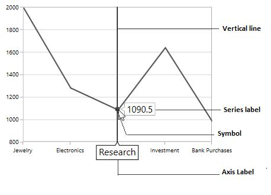

The Trackball is composed of the following parts.

1. Vertical Line

2. Symbol

3. Axis Label

4. Series Label

### Vertical Line

The vertical line in the trackball is visible when you initialize the TrackBallBehavior.If you want to collapse the visibility of the trackball line then you have to set ShowLine to false.

The following code snippet illustrates the collapsing the visibility of trackball line.





<syncfusion:SfChart.Behaviors>

<syncfusion:ChartTrackBallBehavior ShowLine="False" />

</syncfusion:SfChart.Behaviors>





ChartTrackBallBehavior behavior = new ChartTrackBallBehavior()
{

    ShowLine = false

};

chart.Behaviors.Add(behavior);





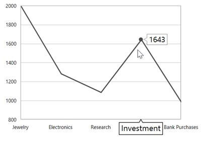

**Customization** **of** **TrackBall** **Line**

SfChart allows you to customize the appearance of  trackball vertical line using [`LineStyle`](http://help.syncfusion.com/cr/cref_files/wpf/sfchart/Syncfusion.SfChart.WPF~Syncfusion.UI.Xaml.Charts.ChartTrackBallBehavior~LineStyle.html#) property.

The following code snippet illustrates the customization of trackball line.





<syncfusion:SfChart x:Name="chart">

    <syncfusion:SfChart.Resources>

        

    </syncfusion:SfChart.Resources>

    <syncfusion:SfChart.Behaviors>

        <syncfusion:ChartTrackBallBehavior LineStyle="{StaticResource lineStyle}"/>

    </syncfusion:SfChart.Behaviors>
            
</syncfusion:SfChart>





ChartTrackBallBehavior trackball = new ChartTrackBallBehavior()
{

    LineStyle = chart.Resources["lineStyle"] as Style

};

chart.Behaviors.Add(trackball);





### Symbol

By default the trackball symbol is displayed as ellipse, to change the default style of the symbol using [`ChartTrackBallStyle`](http://help.syncfusion.com/cr/cref_files/wpf/sfchart/Syncfusion.SfChart.WPF~Syncfusion.UI.Xaml.Charts.ChartTrackBallBehavior~ChartTrackBallStyle.html#) property.





<syncfusion:SfChart x:Name="chart">

    <syncfusion:SfChart.Resources>

        

    </syncfusion:SfChart.Resources>

    <syncfusion:SfChart.Behaviors>

        <syncfusion:ChartTrackBallBehavior ChartTrackBallStyle="{StaticResource trackballStyle}"/>

    </syncfusion:SfChart.Behaviors>

</syncfusion:SfChart>





SfChart chart = new SfChart();

ChartTrackBallBehavior trackball = new ChartTrackBallBehavior()
{

    ChartTrackBallStyle = chart.Resources["trackballStyle"] as Style

};

chart.Behaviors.Add(trackball);





### Axis Label

The axis label will be viewed when the ShowTrackBallInfo property is set to true. If you want to collapse the visibility of axis label in trackball then you have to set ShowTrackballInfo as false.

N>By default the value of ShowTrackBallInfo is false.

**Alignment** **of** **Axis** **Label**

The alignment of the axis label while moving trackball can be defined using [`AxisLabelAlignment`](http://help.syncfusion.com/cr/cref_files/wpf/sfchart/Syncfusion.SfChart.WPF~Syncfusion.UI.Xaml.Charts.ChartTrackBallBehavior~AxisLabelAlignment.html#) property.

Auto –Axis label is aligned in Near/Far positions based on the trackball movement.

Far-Axis label is positioned far from the position of trackball.

Near- Axis label is near to the position of trackball.

Center-Axis label is aligned to the center of the trackball. By default the axis label will positioned in center.

**Far**





<syncfusion:SfChart.Behaviors>

<syncfusion:ChartTrackBallBehavior AxisLabelAlignment="Far">

</syncfusion:ChartTrackBallBehavior>

</syncfusion:SfChart.Behaviors>





ChartTrackBallBehavior behavior = new ChartTrackBallBehavior()
{

    AxisLabelAlignment = ChartAlignment.Far

};

chart.Behaviors.Add(behavior);





**Near**





<syncfusion:SfChart.Behaviors>

<syncfusion:ChartTrackBallBehavior AxisLabelAlignment="Near"  >       

</syncfusion:ChartTrackBallBehavior>

</syncfusion:SfChart.Behaviors>





ChartTrackBallBehavior behavior = new ChartTrackBallBehavior()
{

    AxisLabelAlignment = ChartAlignment.Near

};

chart.Behaviors.Add(behavior);





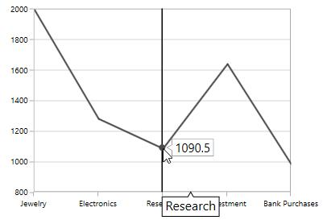

**Customization** **of** **Axis** **Label**

You can change the default appearance of the axis label in trackball using [`TrackballLabelTemplate`](http://help.syncfusion.com/cr/cref_files/wpf/sfchart/Syncfusion.SfChart.WPF~Syncfusion.UI.Xaml.Charts.ChartAxis~TrackBallLabelTemplate.html#) property in ChartAxis as in the below code snippet.





 <syncfusion:SfChart x:Name="chart">

    <syncfusion:SfChart.Resources>

        <DataTemplate x:Key="labelTemplate">

            <Border CornerRadius="4" BorderThickness="1" BorderBrush="Black"
                            
                    Background="BlueViolet" Margin="8">

                    <TextBlock Foreground="White" Text="{Binding ValueX}"/>

            </Border>

        </DataTemplate>

    </syncfusion:SfChart.Resources>

    <syncfusion:SfChart.Behaviors>

            <syncfusion:ChartTrackBallBehavior />

    </syncfusion:SfChart.Behaviors>

    <syncfusion:SfChart.PrimaryAxis>

            <syncfusion:CategoryAxis ShowTrackBallInfo="True" 
                                         
                                     LabelTemplate="{StaticResource labelTemplate}"/>

    </syncfusion:SfChart.PrimaryAxis>

</syncfusion:SfChart>





SfChart chart = new SfChart();

chart.PrimaryAxis = new NumericalAxis()
{

    ShowTrackBallInfo = true,

    TrackBallLabelTemplate = chart.Resources["labelTemplate"] as DataTemplate

};





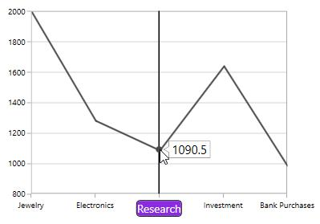

### Series Label

When the trackball is hovered over you can view the label is also displayed over the series in addition the axis label.

**ShowTrackballInfo**

`ShowTrackballInfo` property of [`Cartesian Series`](https://help.syncfusion.com/cr/cref_files/wpf/sfchart/Syncfusion.SfChart.WPF~Syncfusion.UI.Xaml.Charts.CartesianSeries.html) allows user to enable or disable the [`trackball`](https://help.syncfusion.com/wpf/sfchart/interactive-features#trackball) label for corresponding series. By default, `ShowTrackballInfo` property is true. The property can be set as shown in the below code example:





 <syncfusion:SfChart >
            <syncfusion:SplineSeries Interior="#4a4a4a"/>    
            <syncfusion:SplineSeries Interior="#7f7f7f" ShowTrackballInfo="False"/>
            <syncfusion:SplineSeries Interior="#bcbcbc"/>
 </syncfusion:SfChart>
 




  SplineSeries series1 = new SplineSeries()
  {
      Interior = new SolidColorBrush(Color.FromArgb(0, 0x4a, 0x4a, 0x4a))
  };
  chart.Series.Add(series1);
  SplineSeries series2 = new SplineSeries()
  {
      Interior = new SolidColorBrush(Color.FromArgb(0, 0x7f, 0x7f, 0x7f)),
      ShowTrackballInfo = false
  };
  chart.Series.Add(series2);
  SplineSeries series3 = new SplineSeries()
  {
      Interior = new SolidColorBrush(Color.FromArgb(0, 0xbc, 0xbc, 0xbc))
  };
  chart.Series.Add(series3);





**Alignment** **of** **Series** **Label**

The trackball label displayed over the series can be aligned using [`LabelHorizontalAlignment`](http://help.syncfusion.com/cr/cref_files/wpf/sfchart/Syncfusion.SfChart.WPF~Syncfusion.UI.Xaml.Charts.ChartTrackBallBehavior~LabelHorizontalAlignment.html#) and [`LabelVerticalAlignment`](http://help.syncfusion.com/cr/cref_files/wpf/sfchart/Syncfusion.SfChart.WPF~Syncfusion.UI.Xaml.Charts.ChartTrackBallBehavior~LabelVerticalAlignment.html#) properties. By default the series label will be horizontally aligned to the left and vertically to the top.

The following code snippet illustrates the aligning the series label to the center of the trackball.





<syncfusion:SfChart.Behaviors>

<syncfusion:ChartTrackBallBehavior LabelHorizontalAlignment="Center" 

LabelVerticalAlignment="Center">

</syncfusion:ChartTrackBallBehavior>

</syncfusion:SfChart.Behaviors>





ChartTrackBallBehavior behavior = new ChartTrackBallBehavior()
{

    LabelHorizontalAlignment = ChartAlignment.Center,

    LabelVerticalAlignment = ChartAlignment.Center

};

chart.Behaviors.Add(behavior);





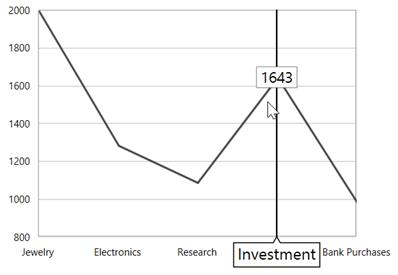

**LabelDisplayMode**

When there is a multiple series, by default the trackball series label will be displayed only for the nearest point. If you want to display all the y values with respect to the x value then the [`LabelDisplayMode`](http://help.syncfusion.com/cr/cref_files/wpf/sfchart/Syncfusion.SfChart.WPF~Syncfusion.UI.Xaml.Charts.ChartTrackBallBehavior~LabelDisplayMode.html#) property is set to FloatAllPoints .

**FloatAllPoints**





<syncfusion:SfChart.Behaviors>

<syncfusion:ChartTrackBallBehavior LabelDisplayMode="FloatAllPoints" >

</syncfusion:ChartTrackBallBehavior>

</syncfusion:SfChart.Behaviors>





ChartTrackBallBehavior behavior = new ChartTrackBallBehavior()
{

    LabelDisplayMode = TrackballLabelDisplayMode.FloatAllPoints

};

chart.Behaviors.Add(behavior);





**NearestPoint**





<syncfusion:SfChart.Behaviors>

<syncfusion:ChartTrackBallBehavior LabelDisplayMode="NearestPoint" >

</syncfusion:ChartTrackBallBehavior>

</syncfusion:SfChart.Behaviors>





ChartTrackBallBehavior behavior = new ChartTrackBallBehavior()
{

    LabelDisplayMode = TrackballLabelDisplayMode.NearestPoint

};

chart.Behaviors.Add(behavior);





[`TrackBallLabelTemplate`](http://help.syncfusion.com/cr/cref_files/wpf/sfchart/Syncfusion.SfChart.WPF~Syncfusion.UI.Xaml.Charts.ChartSeriesBase~TrackBallLabelTemplate.html#) property in [`ChartSeries`](http://help.syncfusion.com/cr/cref_files/wpf/sfchart/Syncfusion.SfChart.WPF~Syncfusion.UI.Xaml.Charts.ChartSeriesBase.html#) allows you to customize the appearance of series label in trackball.





  <syncfusion:SfChart x:Name="chart">

        <syncfusion:SfChart.Resources>

            <DataTemplate x:Key="labelTemplate">

                <Border CornerRadius="5" BorderThickness="1" 
                            
                        BorderBrush="Black" Background="BlueViolet" Margin="8">

                    <TextBlock Foreground="White" Text="{Binding ValueY}"/>

                </Border>

            </DataTemplate>

         </syncfusion:SfChart.Resources>

        <syncfusion:SfChart.Behaviors>

                <syncfusion:ChartTrackBallBehavior />

        </syncfusion:SfChart.Behaviors>

        <syncfusion:ColumnSeries Label="2010"  Interior="#4A4A4A"     

                                 ItemsSource="{Binding Demands}" 

                                 XBindingPath="Demand" 
                                     
                                 YBindingPath="Year2010"/>
          
</syncfusion:SfChart>





SfChart chart = new SfChart();

ChartTrackBallBehavior trackball = new ChartTrackBallBehavior();

chart.Behaviors.Add(trackball);

ColumnSeries series = new ColumnSeries()
{

    ItemsSource = new ViewModel().Demands,

    XBindingPath = "Demand",

    YBindingPath = "Year2010",

    TrackBallLabelTemplate = chart.Resources["labelTemplate"] as DataTemplate,

    Interior = new SolidColorBrush(Color.FromRgb(0x4A, 0x4A, 0x4A))

};

chart.Series.Add(series);





**Applying** **Palette** **to** **the** **Series** **Label**

Palette or Interior color of the Series is applied to the series label by setting [`UseSeriesPalette`](http://help.syncfusion.com/cr/cref_files/wpf/sfchart/Syncfusion.SfChart.WPF~Syncfusion.UI.Xaml.Charts.ChartTrackBallBehavior~UseSeriesPalette.html#) to True as shown in the below code snippet.





<syncfusion:SfChart.Behaviors>

<syncfusion:ChartTrackBallBehavior UseSeriesPalette="True" >

</syncfusion:ChartTrackBallBehavior>

</syncfusion:SfChart.Behaviors>





ChartTrackBallBehavior behavior = new ChartTrackBallBehavior()
{

     UseSeriesPalette = true

};

chart.Behaviors.Add(behavior);





### Events

The following events are available in ChartTrackBallBehavior,

* `PositionChanging` - Occurs when [`trackball`](https://help.syncfusion.com/wpf/sfchart/interactive-features#trackball) position changing from current mouse position to new mouse position.
* `PositionChanged` - Occurs when [`trackball`](https://help.syncfusion.com/wpf/sfchart/interactive-features#trackball) position changed from current mouse position to new mouse position.

## Visual Data Editing

SfChart has a feature that allows you to edit an entire series or a single data point at run time by dragging the single point or the series as a whole.

### Segment Dragging

Segment Dragging defines the dragging a particular point or segment based on the series type. The segment dragging can be enabled using [`EnableSegmentDragging`](http://help.syncfusion.com/cr/cref_files/wpf/sfchart/Syncfusion.SfChart.WPF~Syncfusion.UI.Xaml.Charts.XySegmentDraggingBase~EnableSegmentDragging.html#) property as true.

**LineSeries**





<syncfusion:LineSeries Label="2010" EnableSegmentDragging="True"

XBindingPath="Demand"   Interior="#777777"

ItemsSource="{Binding Demands}"                                   

YBindingPath="Year2010">

</syncfusion:LineSeries>





LineSeries series = new LineSeries()
{

    ItemsSource = new ViewModel().Demands,

    XBindingPath = "Demand",

    YBindingPath = "Year2010",

    EnableSegmentDragging = true,

    Interior = new SolidColorBrush(Color.FromRgb(0x77, 0x77, 0x77)),

    Label = "2010"

};

chart.Series.Add(series)





**ColumnSeries**





<syncfusion:ColumnSeries Label="2010" EnableDragTooltip="True" EnableSegmentDragging="True"

XBindingPath="Demand"   Interior="#777777"

ItemsSource="{Binding Demands}"                                   

YBindingPath="Year2010">

</syncfusion:ColumnSeries>





ColumnSeries series = new ColumnSeries()
{

    ItemsSource = new ViewModel().Demands,

    XBindingPath = "Demand",

    YBindingPath = "Year2010",

    EnableSegmentDragging = true,

    EnableDragTooltip = true,

    Interior = new SolidColorBrush(Color.FromRgb(0x77, 0x77, 0x77)),

    Label = "2010"

};

chart.Series.Add(series)





### Series Dragging

SfChart provides support to drag the LineSeries and SplineSeries. This allows the series to move to a new position by dragging. To enable the series dragging, you have to set [`EnableSeriesDragging`](http://help.syncfusion.com/cr/cref_files/wpf/sfchart/Syncfusion.SfChart.WPF~Syncfusion.UI.Xaml.Charts.XySeriesDraggingBase~EnableSeriesDragging.html#) property to true.

The following code snippet explains the series dragging feature in LineSeries





<syncfusion:LineSeries Label="2010" EnableDragTooltip="True" EnableSeriesDragging="True"

XBindingPath="Demand"   Interior="#777777" ItemsSource="{Binding Demands}"

YBindingPath="Year2010"/>





LineSeries series = new LineSeries()
{

    ItemsSource = new ViewModel().Demands,

    XBindingPath = "Demand",

    YBindingPath = "Year2010",

    EnableSeriesDragging = true,

    EnableDragTooltip = true ,

    Interior = new SolidColorBrush(Color.FromRgb(0x77, 0x77, 0x77)),

    Label = "2010"

};

chart.Series.Add(series);





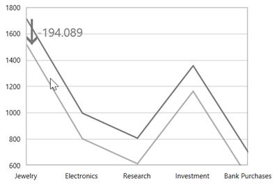

N>In line and Spline Series if segment and series dragging is enabled, the series dragging is having higher priority over segment dragging.

### Adding ToolTip for Dragging

While the series or segment is dragged by default you can view the tooltip showing the new y value. To disable the tooltip while dragging you have to set the EnableDragToolTip as false.





<syncfusion:LineSeries Label="2010"  EnableSegmentDragging="True" EnableDragTooltip="False"

XBindingPath="Demand"   Interior="#777777"

Focusable="False"

ItemsSource="{Binding Demands}"                                   

</syncfusion:LineSeries>





LineSeries series = new LineSeries()
{

    ItemsSource = new ViewModel().Demands,

    XBindingPath = "Demand",

    YBindingPath = "Year2010",

    EnableSeriesDragging = true,

    EnableDragTooltip = true ,

    Focusable = false,

    Interior = new SolidColorBrush(Color.FromRgb(0x77, 0x77, 0x77)),

    Label = "2010"

};

chart.Series.Add(series);





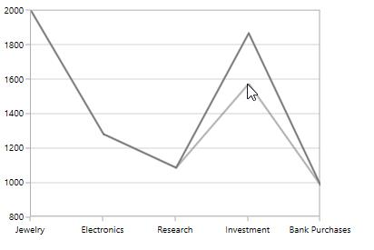

**DragTooltipTemplate**

[`DragTooltipTemplate`](http://help.syncfusion.com/cr/cref_files/wpf/sfchart/Syncfusion.SfChart.WPF~Syncfusion.UI.Xaml.Charts.XySegmentDraggingBase~DragTooltipTemplate.html#)  property allows you to customize the default appearance of the tooltip while dragging.





<syncfusion:SfChart x:Name="chart">

    <syncfusion:SfChart.Resources>

        <DataTemplate x:Key="tooltipTemplate">

            <Border CornerRadius="4" BorderBrush="Black"
                            
                    BorderThickness="1" Background="CadetBlue">

                <TextBlock  FontSize="12" Text="{Binding NewValue}" 
                                    
                            Width="35" Foreground="White"></TextBlock>

            </Border>

        </DataTemplate>

    </syncfusion:SfChart.Resources>

    <syncfusion:LineSeries Label="2010" EnableSegmentDragging="True" 
                                   
                           Interior="#777777"
                                   
                           Focusable="False" 

                           XBindingPath="Demand" 
                                   
                           ItemsSource="{Binding Demands}"          
                                   
                           YBindingPath="Year2010"
                                   
                           DragTooltipTemplate="{StaticResource tooltipTemplate }">

    </syncfusion:LineSeries>
            
</syncfusion:SfChart>





ColumnSeries series = new ColumnSeries()
{

    ItemsSource = new ViewModel().Demands,

    XBindingPath = "Demand",

    YBindingPath = "Year2010",

    Focusable = false,

    EnableSegmentDragging = true,

    DragTooltipTemplate = chart.Resources["tooltipTemplate"] as DataTemplate,

    Interior = new SolidColorBrush(Color.FromRgb(0x77, 0x77, 0x77))

};

chart.Series.Add(series);





**Rounding** **Off** **the** **Dragged** **Value**

To round off the dragged values, you have to set the [`SnapToPoint`](http://help.syncfusion.com/cr/cref_files/wpf/sfchart/Syncfusion.SfChart.WPF~Syncfusion.UI.Xaml.Charts.XySegmentDraggingBase~SnapToPoint.html#) and [`RoundToDecimal`](http://help.syncfusion.com/cr/cref_files/wpf/sfchart/Syncfusion.SfChart.WPF~Syncfusion.UI.Xaml.Charts.XySegmentDraggingBase~RoundToDecimal.html#) properties. The following code snippet explains rounding the dragged y value to 2 decimal digits.





<syncfusion:SplineSeries   EnableSegmentDragging="True"

SnapToPoint="Round" RoundToDecimal="2" YBindingPath = "Year2010"

UpdateSource="True" XBindingPath="Demand"   Interior="#777777"

ItemsSource="{Binding Demands}"                                   

</syncfusion:SplineSeries>





SplineSeries series = new SplineSeries()
{

    ItemsSource = new ViewModel().Demands,

    XBindingPath = "Demand",

    YBindingPath = "Year2010",

    EnableSegmentDragging = true,

    UpdateSource = true ,

    RoundToDecimal = 2,

    SnapToPoint = SnapToPoint.Round,

    Interior = new SolidColorBrush(Color.FromRgb(0x77, 0x77, 0x77))

};

chart.Series.Add(series);





### Updating the Dragged Values to the Source

When dragging the series or segment at run time, to update the underlying data based on the values you have to set the [`UpdateSource`](http://help.syncfusion.com/cr/cref_files/wpf/sfchart/Syncfusion.SfChart.WPF~Syncfusion.UI.Xaml.Charts.XySegmentDraggingBase~UpdateSource.html#) property to true as in the below code snippet.





<syncfusion:SplineSeries   EnableSegmentDragging="True" UpdateSource="True"

XBindingPath="Demand"   Interior="#777777"

ItemsSource="{Binding Demands}"                                   

YBindingPath="Year2010">

</syncfusion:SplineSeries>





SplineSeries series = new SplineSeries()
{

    ItemsSource = new ViewModel().Demands,

    XBindingPath = "Demand",

    YBindingPath = "Year2010",

    EnableSegmentDragging = true,

    UpdateSource = true ,

    Interior = new SolidColorBrush(Color.FromRgb(0x77, 0x77, 0x77))

};

chart.Series.Add(series);





### Drag Cancel using KeyModifiers

While you are dragging you can set the KeyModifiers to cancel the drag by setting [`DragCancelKeyModifier`](http://help.syncfusion.com/cr/cref_files/wpf/sfchart/Syncfusion.SfChart.WPF~Syncfusion.UI.Xaml.Charts.XySegmentDraggingBase~DragCancelKeyModifiers.html#) property as in the below code snippet.





<syncfusion:SplineSeries  

EnableSegmentDragging="True" 

DragCancelKeyModifiers="Alt"  

UpdateSource="True"

XBindingPath="Demand"                                   

ItemsSource="{Binding Demands}"                                   

YBindingPath="Year2010">

</syncfusion:SplineSeries>





SplineSeries series = new SplineSeries()
{

    ItemsSource = new ViewModel().Demands,

    XBindingPath = "Demand",

    YBindingPath = "Year2010",

    EnableSegmentDragging = true,

    DragCancelKeyModifiers = ModifierKeys.Alt,

    UpdateSource = true ,

    Interior = new SolidColorBrush(Color.FromRgb(0x77, 0x77, 0x77))

};

chart.Series.Add(series);





### Events

Series with visual data editing has support for following events,

* [`DragStart`](http://help.syncfusion.com/cr/cref_files/wpf/sfchart/Syncfusion.SfChart.WPF~Syncfusion.UI.Xaml.Charts.XySegmentDraggingBase~DragStart_EV.html#)- Occurs when segment/series drag started. 
* [`DragDelta`](http://help.syncfusion.com/cr/cref_files/wpf/sfchart/Syncfusion.SfChart.WPF~Syncfusion.UI.Xaml.Charts.XySegmentDraggingBase~DragDelta_EV.html#)- Occurs when segment/series dragging.
* [`DragEnd`](http://help.syncfusion.com/cr/cref_files/wpf/sfchart/Syncfusion.SfChart.WPF~Syncfusion.UI.Xaml.Charts.XySegmentDraggingBase~DragEnd_EV.html#)- Occurs when segment/series drag end. 
* [`PreviewDragEnd`](http://help.syncfusion.com/cr/cref_files/wpf/sfchart/Syncfusion.SfChart.WPF~Syncfusion.UI.Xaml.Charts.XySegmentDraggingBase~PreviewDragEnd_EV.html#)- Occurs before drag end triggered. 
* [`SegmentEnter`](http://help.syncfusion.com/cr/cref_files/wpf/sfchart/Syncfusion.SfChart.WPF~Syncfusion.UI.Xaml.Charts.XySegmentDraggingBase~SegmentEnter_EV.html#)- Occurs when mouse enters in segment. 

## Zoom and Pan

SfChart allows you to zoom the chart area with the help of the zoom feature. This behavior is mostly used to view the data point in the specific area, when there are a number of data points inside the chart.

Zooming and panning provides you to take a close-up look of the data point plotted in the series

### Adding Zooming/Panning to the SfChart

You can create an instance ChartZoomPanBehavior and add it to the Behaviors collection.





<syncfusion:SfChart.Behaviors>

<syncfusion:ChartZoomPanBehavior >                                             

</syncfusion:ChartZoomPanBehavior>

</syncfusion:SfChart.Behaviors>





ChartZoomPanBehavior zooming = new ChartZoomPanBehavior();

chart.Behaviors.Add(zooming);





### Zooming the ChartArea

**Zooming** **by** **setting** **ZoomFactor** **and** **ZoomPosition**

[`ZoomFactor`](http://help.syncfusion.com/cr/cref_files/wpf/sfchart/Syncfusion.SfChart.WPF~Syncfusion.UI.Xaml.Charts.ChartAxisBase2D~ZoomFactor.html#) defines the percentage of visible range from the total range of axis values. [`ZoomPosition`](http://help.syncfusion.com/cr/cref_files/wpf/sfchart/Syncfusion.SfChart.WPF~Syncfusion.UI.Xaml.Charts.ChartAxisBase2D~ZoomPosition.html#) defines the ranges of values that need to be displayed as a result of [`ZoomFactor`](http://help.syncfusion.com/cr/cref_files/wpf/sfchart/Syncfusion.SfChart.WPF~Syncfusion.UI.Xaml.Charts.ChartAxisBase2D~ZoomFactor.html#). 

The following code example demonstrates the zooming the chart axis by setting zoom position and zoom factor.





<syncfusion:SfChart.PrimaryAxis>

<syncfusion:CategoryAxis 

ShowGridLines="False"

ZoomFactor="0.3" ZoomPosition="0.1" />

</syncfusion:SfChart.PrimaryAxis>





chart.PrimaryAxis = new CategoryAxis()
{

    ShowGridLines = false,

    ZoomFactor = 0.1,

    ZoomPosition = 0.3

};





**Mouse** **Wheel** **Zooming**

Zooming can be performed by mouse wheel action by setting [`EnableMouseWheelZooming`](http://help.syncfusion.com/cr/cref_files/wpf/sfchart/Syncfusion.SfChart.WPF~Syncfusion.UI.Xaml.Charts.ChartZoomPanBehavior~EnableMouseWheelZooming.html#) property to true.





<syncfusion:SfChart.Behaviors>

<syncfusion:ChartZoomPanBehavior EnableMouseWheelZooming="True" >                                              

</syncfusion:ChartZoomPanBehavior>

</syncfusion:SfChart.Behaviors>





ChartZoomPanBehavior zooming = new ChartZoomPanBehavior()
{

    EnableMouseWheelZooming = true

};

chart.Behaviors.Add(zooming);





**Pinch** **Zooming**

If you want to zoom using fingers by touch, then you have to set [`EnablePinchZooming](http://help.syncfusion.com/cr/cref_files/wpf/sfchart/Syncfusion.SfChart.WPF~Syncfusion.UI.Xaml.Charts.ChartZoomPanBehavior~EnablePinchZooming.html# "") property to true as shown in the below code snippet.





<syncfusion:SfChart.Behaviors>

<syncfusion:ChartZoomPanBehavior EnablePinchZooming="True" >                                              

</syncfusion:ChartZoomPanBehavior>

</syncfusion:SfChart.Behaviors>





ChartZoomPanBehavior zooming = new ChartZoomPanBehavior()
{

    EnablePinchZooming = true

};

chart.Behaviors.Add(zooming);





**Zooming** **Relative** **to** **Cursor**

To enable the zooming relative to cursor position you can set [`ZoomRelativeToCursor`](http://help.syncfusion.com/cr/cref_files/wpf/sfchart/Syncfusion.SfChart.WPF~Syncfusion.UI.Xaml.Charts.ChartZoomPanBehavior~ZoomRelativeToCursor.html#) property to true. This support is applicable only for mouse wheel zooming.





<syncfusion:SfChart.Behaviors>

<syncfusion:ChartZoomPanBehavior ZoomRelativeToCursor="True" >                                              

</syncfusion:ChartZoomPanBehavior>

</syncfusion:SfChart.Behaviors>





ChartZoomPanBehavior zooming = new ChartZoomPanBehavior()
{

    ZoomRelativeToCursor = true

};

chart.Behaviors.Add(zooming);





**SelectionZooming**

SelectionZooming helps us to zoom a particular area by selecting the region using  rectangle.To enable the selection ,you have to set [`EnableSelectionZooming`](http://help.syncfusion.com/cr/cref_files/wpf/sfchart/Syncfusion.SfChart.WPF~Syncfusion.UI.Xaml.Charts.ChartZoomPanBehavior~EnableSelectionZooming.html#) property to true.

The following code snippet demonstrated selection zooming.





<syncfusion:SfChart.Behaviors>

<syncfusion:ChartZoomPanBehavior EnableSelectionZooming="True" >                                              

</syncfusion:ChartZoomPanBehavior>

</syncfusion:SfChart.Behaviors>





ChartZoomPanBehavior zooming = new ChartZoomPanBehavior()
{

    EnableSelectionZooming = true

};

chart.Behaviors.Add(zooming);





**Customization** **of** **Selection** **Rectangle**

Selection Rectangle can be customized by setting the following properties 

* [`Fill`](http://help.syncfusion.com/cr/cref_files/wpf/sfchart/Syncfusion.SfChart.WPF~Syncfusion.UI.Xaml.Charts.ChartZoomPanBehavior~Fill.html#)-Represents the brush filled in selection rectangle. 
* [`Stroke`](http://help.syncfusion.com/cr/cref_files/wpf/sfchart/Syncfusion.SfChart.WPF~Syncfusion.UI.Xaml.Charts.ChartZoomPanBehavior~Stroke.html#)- Represents the outer line color of selection rectangle.
* [`StrokeThickness`](http://help.syncfusion.com/cr/cref_files/wpf/sfchart/Syncfusion.SfChart.WPF~Syncfusion.UI.Xaml.Charts.ChartZoomPanBehavior~StrokeThickness.html#)- Represents the selection rectangle outer line thickness. 

The following code example demonstrates the customization of selection rectangle





<syncfusion:SfChart.Behaviors>

<syncfusion:ChartZoomPanBehavior EnableSelectionZooming="True" 

Fill="LightBlue" Stroke="Blue" StrokeThickness="2" >                                              

</syncfusion:ChartZoomPanBehavior>

</syncfusion:SfChart.Behaviors>





ChartZoomPanBehavior zooming = new ChartZoomPanBehavior()
{

    EnableSelectionZooming = true,

    Fill = new SolidColorBrush(Colors.LightBlue),

    Stroke = new SolidColorBrush(Colors.Blue),

    StrokeThickness = 2

};

chart.Behaviors.Add(zooming);





**Zooming** **Mode**

The zooming can be done both horizontally and vertically. The zooming direction is defined using [`ZoomMode`](http://help.syncfusion.com/cr/cref_files/wpf/sfchart/Syncfusion.SfChart.WPF~Syncfusion.UI.Xaml.Charts.ChartZoomPanBehavior~ZoomMode.html#) property.

Zooming along X axis





<syncfusion:SfChart.Behaviors>

<syncfusion:ChartZoomPanBehavior EnableSelectionZooming="True" ZoomMode="X">                                              

</syncfusion:ChartZoomPanBehavior>

</syncfusion:SfChart.Behaviors>





ChartZoomPanBehavior zooming = new ChartZoomPanBehavior()
{

    EnableSelectionZooming = true,

    ZoomMode = ZoomMode.X

};

chart.Behaviors.Add(zooming);





Zooming along Y axis





<syncfusion:SfChart.Behaviors>

<syncfusion:ChartZoomPanBehavior EnableSelectionZooming="True" ZoomMode="Y">                                              

</syncfusion:ChartZoomPanBehavior>

</syncfusion:SfChart.Behaviors>





ChartZoomPanBehavior zooming = new ChartZoomPanBehavior()
{

    EnableSelectionZooming = true,

    ZoomMode = ZoomMode.Y

};

chart.Behaviors.Add(zooming);





**Maximum** **Zoom** **Level**

You can also limit the zooming by setting [`MaximumZoomLevel`](http://help.syncfusion.com/cr/cref_files/wpf/sfchart/Syncfusion.SfChart.WPF~Syncfusion.UI.Xaml.Charts.ChartZoomPanBehavior~MaximumZoomLevel.html#) property as shown in the below code snippet.





<syncfusion:SfChart.Behaviors>

<syncfusion:ChartZoomPanBehavior EnableSelectionZooming="True" MaximumZoomLevel="100">                                              

</syncfusion:ChartZoomPanBehavior>

</syncfusion:SfChart.Behaviors>





ChartZoomPanBehavior zooming = new ChartZoomPanBehavior()
{

    EnableSelectionZooming = true,

    MaximumZoomLevel = 100

};

chart.Behaviors.Add(zooming);





### Zooming Toolbar

Zooming Toolbar encompassed with buttons for performing actions like Zoom In/Out, Reset, Pan, etc. You can add the zooming toolbar to the chart area by setting [`EnableZoomingToolBar`](http://help.syncfusion.com/cr/cref_files/wpf/sfchart/Syncfusion.SfChart.WPF~Syncfusion.UI.Xaml.Charts.ChartZoomPanBehavior~EnableZoomingToolBar.html#) property to True.





<syncfusion:SfChart.Behaviors>

<syncfusion:ChartZoomPanBehavior EnableZoomingToolBar="True">                                              

</syncfusion:ChartZoomPanBehavior>

</syncfusion:SfChart.Behaviors>





ChartZoomPanBehavior zooming = new ChartZoomPanBehavior()
{

    EnableZoomingToolBar = true

};

chart.Behaviors.Add(zooming);





The following image depicts the default view of the zooming toolbar.

**Positioning** **the** **zooming** **toolbar**

Zooming Toolbar can be positioned using the [`HorizontalPosition`](http://help.syncfusion.com/cr/cref_files/wpf/sfchart/Syncfusion.SfChart.WPF~Syncfusion.UI.Xaml.Charts.ChartZoomPanBehavior~HorizontalPosition.html#) and [`VerticalPosition`](http://help.syncfusion.com/cr/cref_files/wpf/sfchart/Syncfusion.SfChart.WPF~Syncfusion.UI.Xaml.Charts.ChartZoomPanBehavior~VerticalPosition.html#) properties.The following code demonstrates the positioning of the toolbar.





<syncfusion:SfChart.Behaviors>

<syncfusion:ChartZoomPanBehavior EnableZoomingToolBar="True" HorizontalPosition="Left" VerticalPosition="Bottom">                                              

</syncfusion:ChartZoomPanBehavior>

</syncfusion:SfChart.Behaviors>





ChartZoomPanBehavior zooming = new ChartZoomPanBehavior()
{

    EnableZoomingToolBar = true,

    HorizontalPosition = HorizontalAlignment.Left,

    VerticalPosition = VerticalAlignment.Bottom

};

chart.Behaviors.Add(zooming);





**Customization** **of** **Zooming** **Toolbar**

Zooming Toolbar can be customized using the following API’s

* [`ToolBarBackground`](http://help.syncfusion.com/cr/cref_files/wpf/sfchart/Syncfusion.SfChart.WPF~Syncfusion.UI.Xaml.Charts.ChartZoomPanBehavior~ToolBarBackground.html#)- Represents the zooming toolkit background.
* [`ToolBarItems`](http://help.syncfusion.com/cr/cref_files/wpf/sfchart/Syncfusion.SfChart.WPF~Syncfusion.UI.Xaml.Charts.ChartZoomPanBehavior~ToolBarItems.html#)- Collection value that contains zooming toolkit items. 
* [`ToolBarItemMargin`](http://help.syncfusion.com/cr/cref_files/wpf/sfchart/Syncfusion.SfChart.WPF~Syncfusion.UI.Xaml.Charts.ChartZoomPanBehavior~ToolBarItemMargin.html#)-Represents the margin for the toolbar item.
* [`ToolBarItemWidth`](http://help.syncfusion.com/cr/cref_files/wpf/sfchart/Syncfusion.SfChart.WPF~Syncfusion.UI.Xaml.Charts.ChartZoomPanBehavior~ToolBarItemWidth.html#) -Represents the width of the toolbar item
* [`ToolBarItemHeight`](http://help.syncfusion.com/cr/cref_files/wpf/sfchart/Syncfusion.SfChart.WPF~Syncfusion.UI.Xaml.Charts.ChartZoomPanBehavior~ToolBarItemHeight.html#)-Represents the height of the toolbar item





<syncfusion:SfChart.Behaviors>

<syncfusion:ChartZoomPanBehavior EnableZoomingToolBar="True" ToolBarItemHeight="15" 

ToolBarItemWidth="15" ToolBarBackground="Black" 

ToolBarItems="All" ToolBarItemMargin="10">                                              

</syncfusion:ChartZoomPanBehavior>

</syncfusion:SfChart.Behaviors>





ChartZoomPanBehavior zooming = new ChartZoomPanBehavior()
{

    EnableZoomingToolBar = true,

    ToolBarBackground = new SolidColorBrush(Colors.Black),

    ToolBarItemHeight = 15,

    ToolBarItemWidth = 15,

    ToolBarItemMargin = new Thickness(10),

    ToolBarItems = ZoomToolBarItems.All

};

chart.Behaviors.Add(zooming);





**Orientation** **of** **Zooming** **Toolbar**

Zooming toolbar orientation is horizontal by default.You can change the orientation to vertical by setting 

[`ToolBarOrientation`](http://help.syncfusion.com/cr/cref_files/wpf/sfchart/Syncfusion.SfChart.WPF~Syncfusion.UI.Xaml.Charts.ChartZoomPanBehavior~ToolBarOrientation.html#) property to Vertical.





<syncfusion:SfChart.Behaviors>

<syncfusion:ChartZoomPanBehavior EnableZoomingToolBar="True" 

ToolBarOrientation="Vertical">                                              

</syncfusion:ChartZoomPanBehavior>

</syncfusion:SfChart.Behaviors>





ChartZoomPanBehavior zooming = new ChartZoomPanBehavior()
{

    EnableZoomingToolBar = true,

    ToolBarOrientation = Orientation.Vertical

};

chart.Behaviors.Add(zooming);





### Panning the ChartArea

Panning feature allows moving the visible area of the chart when it is zoomed in. To enable panning, you have to set [`EnablePanning`](http://help.syncfusion.com/cr/cref_files/wpf/sfchart/Syncfusion.SfChart.WPF~Syncfusion.UI.Xaml.Charts.ChartZoomPanBehavior~EnablePanning.html#) property to true.




<syncfusion:SfChart.Behaviors>

<syncfusion:ChartZoomPanBehavior EnableMouseWheelZooming="True" EnablePanning="True">                                              

</syncfusion:ChartZoomPanBehavior>

</syncfusion:SfChart.Behaviors>





ChartZoomPanBehavior zooming = new ChartZoomPanBehavior()
{

    EnableMouseWheelZooming = true,

    EnablePanning = true
     
};

chart.Behaviors.Add(zooming);





The following image demonstrates the cursor panning in the left direction.

### Resetting the Zooming/Panning

SfChart provides support to reset to the default view when you double tap the chart area by setting [`ResetOnDoubleTap`](http://help.syncfusion.com/cr/cref_files/wpf/sfchart/Syncfusion.SfChart.WPF~Syncfusion.UI.Xaml.Charts.ChartZoomPanBehavior~ResetOnDoubleTap.html#) property to true.





<syncfusion:SfChart.Behaviors>

<syncfusion:ChartZoomPanBehavior  ResetOnDoubleTap="True">                                              

</syncfusion:ChartZoomPanBehavior>

</syncfusion:SfChart.Behaviors>





ChartZoomPanBehavior zooming = new ChartZoomPanBehavior()
{

    ResetOnDoubleTap = true
     
};

chart.Behaviors.Add(zooming);





### Events

The following events are available in SfChart for ChartZoomPanBehavior,

* [`ZoomChanging`](http://help.syncfusion.com/cr/cref_files/wpf/sfchart/Syncfusion.SfChart.WPF~Syncfusion.UI.Xaml.Charts.SfChart~ZoomChanging_EV.html#)- Occurs when zoom started in chart area.
* [`ZoomChanged`](http://help.syncfusion.com/cr/cref_files/wpf/sfchart/Syncfusion.SfChart.WPF~Syncfusion.UI.Xaml.Charts.SfChart~ZoomChanged_EV.html#)- Occurs when zooming done in chart area.
* [`SelectionZoomingStart`](http://help.syncfusion.com/cr/cref_files/wpf/sfchart/Syncfusion.SfChart.WPF~Syncfusion.UI.Xaml.Charts.SfChart~SelectionZoomingStart_EV.html#)- Occurs when selection zooming started. 
* [`SelectionZoomingDelta`](http://help.syncfusion.com/cr/cref_files/wpf/sfchart/Syncfusion.SfChart.WPF~Syncfusion.UI.Xaml.Charts.SfChart~SelectionZoomingDelta_EV.html#)- Occurs when selection zooming.
* [`SelectionZoomingEnd`](http://help.syncfusion.com/cr/cref_files/wpf/sfchart/Syncfusion.SfChart.WPF~Syncfusion.UI.Xaml.Charts.SfChart~SelectionZoomingEnd_EV.html#)- Occurs when selection zooming end. 
* [`ResetZooming`](http://help.syncfusion.com/cr/cref_files/wpf/sfchart/Syncfusion.SfChart.WPF~Syncfusion.UI.Xaml.Charts.SfChart~ResetZooming_EV.html#)- Occurs when zooming get reset in chart area.

## Selection:

SfChart supports selection that enables you to select a segment in a series or series itself by using [`ChartSelectionBehavior`](http://help.syncfusion.com/cr/cref_files/wpf/sfchart/Syncfusion.SfChart.WPF~Syncfusion.UI.Xaml.Charts.ChartSelectionBehavior.html#). 

### Adding Selection Behavior to SfChart

You can create an instance [`ChartSelectionBehavior`](http://help.syncfusion.com/cr/cref_files/wpf/sfchart/Syncfusion.SfChart.WPF~Syncfusion.UI.Xaml.Charts.ChartSelectionBehavior.html#) and add it to the Behaviors collection.





<syncfusion:SfChart.Behaviors>

<syncfusion:ChartSelectionBehavior >

</syncfusion:ChartSelectionBehavior>

</syncfusion:SfChart.Behaviors>





ChartSelectionBehavior selection = new ChartSelectionBehavior();

chart.Behaviors.Add(selection);





### SegmentSelection

Segment Selection allows you to highlight a segment in a chart series. To enable a segment selection in a chart series, you have to set the [`EnableSegmentSelection`](http://help.syncfusion.com/cr/cref_files/wpf/sfchart/Syncfusion.SfChart.WPF~Syncfusion.UI.Xaml.Charts.ChartSelectionBehavior~EnableSegmentSelection.html#) property to True.For highlighting a segment the  brush color can be set using [`SegmentSelectionBrush`](http://help.syncfusion.com/cr/cref_files/wpf/sfchart/Syncfusion.SfChart.WPF~Syncfusion.UI.Xaml.Charts.ColumnSeries~SegmentSelectionBrush.html#) property.

**ColumnSeries**





<syncfusion:SfChart.Behaviors>

<syncfusion:ChartSelectionBehavior   EnableSegmentSelection="True" >

</syncfusion:ChartSelectionBehavior>

</syncfusion:SfChart.Behaviors>

<syncfusion:ColumnSeries Label="2011" SegmentSelectionBrush="Green" Interior="#777777"

ItemsSource="{Binding Demands}" XBindingPath="Demand" YBindingPath="Year2011"/>





ChartSelectionBehavior selection = new ChartSelectionBehavior()
{

    EnableSegmentSelection = true

};

chart.Behaviors.Add(selection);

ColumnSeries series = new ColumnSeries()
{

    ItemsSource = new ViewModel().Demands,

    XBindingPath = "Demand",

    YBindingPath = "Year2010",

    Label ="2011",

    SegmentSelectionBrush = new SolidColorBrush(Colors.Green),

    Interior = new SolidColorBrush(Color.FromRgb(0x77, 0x77, 0x77))

};

chart.Series.Add(series);





**SplineSeries**

In Linear type series the segment selection can be viewed by changing the adornments symbol interior.

The following code example demonstrates the spline series segment selection by changing the adornments interior.





<syncfusion:SplineSeries SegmentSelectionBrush="Red"

ItemsSource="{Binding Demands}" Interior="#4A4A4A"

XBindingPath="Demand"

YBindingPath="Year2010">

<syncfusion:SplineSeries.AdornmentsInfo>

<syncfusion:ChartAdornmentInfo ShowMarker="True" Symbol="Ellipse" HighlightOnSelection="True"></syncfusion:ChartAdornmentInfo>

</syncfusion:SplineSeries.AdornmentsInfo>

</syncfusion:SplineSeries>





ChartSelectionBehavior selection = new ChartSelectionBehavior()
{

    EnableSegmentSelection = true

};

chart.Behaviors.Add(selection);

SplineSeries series = new SplineSeries()
{

    ItemsSource = new ViewModel().Demands,

    XBindingPath = "Demand",

    YBindingPath = "Year2010",

    SegmentSelectionBrush = new SolidColorBrush(Colors.Red),

    Interior = new SolidColorBrush(Color.FromRgb(0x4A, 0x4A, 0x4A))

};

ChartAdornmentInfo adornmentInfo = new ChartAdornmentInfo()
{

    ShowMarker = true,

    HighlightOnSelection = true,

    Symbol = ChartSymbol.Ellipse

};

series.AdornmentsInfo = adornmentInfo;

chart.Series.Add(series);





### Series Selection

Series selection is used in case of multiple series when you want to highlight a particular series.Series Selection can be enabled by setting [`EnableSeriesSelection`](http://help.syncfusion.com/cr/cref_files/wpf/sfchart/Syncfusion.SfChart.WPF~Syncfusion.UI.Xaml.Charts.ChartSelectionBehavior~EnableSeriesSelection.html#)  property to True. The [`SeriesSelectionBrush`](http://help.syncfusion.com/cr/cref_files/wpf/sfchart/Syncfusion.SfChart.WPF~Syncfusion.UI.Xaml.Charts.ChartSeriesBase~SeriesSelectionBrush.html#) property is used to set the brush color to highlight the series.

The following code example demonstrates highlighting a series.





<syncfusion:SfChart.Behaviors>

<syncfusion:ChartSelectionBehavior EnableSegmentSelection="False" EnableSeriesSelection="True"/>

</syncfusion:SfChart.Behaviors>   

<syncfusion:ScatterSeries Label="2010"  SeriesSelectionBrush="Green"

ItemsSource="{Binding Demands}" Interior="#4A4A4A"

XBindingPath="Demand"

YBindingPath="Year2010">

</syncfusion:ScatterSeries>

<syncfusion:ScatterSeries Label="2011" SeriesSelectionBrush="Green" Interior="#777777"

ItemsSource="{Binding Demands}" XBindingPath="Demand" 

YBindingPath="Year2011"/>    





ChartSelectionBehavior selection = new ChartSelectionBehavior()
{

    EnableSegmentSelection = true,

    EnableSeriesSelection = true

};

chart.Behaviors.Add(selection);

ScatterSeries series1 = new ScatterSeries()
{

    ItemsSource = new ViewModel().Demands,

    XBindingPath = "Demand",

    YBindingPath = "Year2010",

    Label = "2010",

    SegmentSelectionBrush = new SolidColorBrush(Colors.Green),

    Interior = new SolidColorBrush(Color.FromRgb(0x4A, 0x4A, 0x4A))

};

ScatterSeries series2 = new ScatterSeries()
{

    ItemsSource = new ViewModel().Demands,

    XBindingPath = "Demand",

    YBindingPath = "Year2011",

    Label = "2011",

    SegmentSelectionBrush = new SolidColorBrush(Colors.Green),

    Interior = new SolidColorBrush(Color.FromRgb(0x77, 0x77, 0x77))

};

chart.Series.Add(series1);

chart.Series.Add(series2);





N>By default the segment selection is true, so for selecting series you have to set the EnableSegmentSelection property to false.

### Selection Mode

SfChart provides support to select using mouse move or mouse click. By default the selection will take place in mouse click. The selection mode can be defined using [`SelectionMode`](http://help.syncfusion.com/cr/cref_files/wpf/sfchart/Syncfusion.SfChart.WPF~Syncfusion.UI.Xaml.Charts.ChartSelectionBehavior~SelectionMode.html#) property for segment and series selection.

The following code snippet demonstrates the selection mode using mouse move.





<syncfusion:SfChart.Behaviors>

<syncfusion:ChartSelectionBehavior SelectionMode="MouseMove" EnableSeriesSelection="True">

</syncfusion:ChartSelectionBehavior>

</syncfusion:SfChart.Behaviors>





ChartSelectionBehavior selection = new ChartSelectionBehavior()
{

    SelectionMode = Syncfusion.UI.Xaml.Charts.SelectionMode.MouseMove,

    EnableSeriesSelection = true

};

chart.Behaviors.Add(selection);





### Selection Style

SfChart allows you to select single or multiple segment /series using [`SelectionStyle`](http://help.syncfusion.com/cr/cref_files/wpf/sfchart/Syncfusion.SfChart.WPF~Syncfusion.UI.Xaml.Charts.ChartSelectionBehavior~SelectionStyle.html#) property. By default the SelectionStyle is single.

The following code snippet demonstrates multiple segment selection.





<syncfusion:SfChart.Behaviors>

<syncfusion:ChartSelectionBehavior SelectionStyle="Multiple" EnableSegmentSelection="True">

</syncfusion:ChartSelectionBehavior>

</syncfusion:SfChart.Behaviors>





ChartSelectionBehavior selection = new ChartSelectionBehavior()
{

    SelectionStyle = SelectionStyle.Multiple,

    EnableSegmentSelection = true

};

chart.Behaviors.Add(selection);





### Changing Cursor while Selection

[`SelectionCursor`](http://help.syncfusion.com/cr/cref_files/wpf/sfchart/Syncfusion.SfChart.WPF~Syncfusion.UI.Xaml.Charts.ChartSelectionBehavior~SelectionCursor.html#) property allows you to define the cursor when mouse is hovered over the segment with segment or series selection enabled.

The following code snippet demonstrates hand cursor in segment selection.





<syncfusion:SfChart.Behaviors>

<syncfusion:ChartSelectionBehavior SelectionCursor="Hand"  EnableSegmentSelection="True">

</syncfusion:ChartSelectionBehavior>

</syncfusion:SfChart.Behaviors>





ChartSelectionBehavior selection = new ChartSelectionBehavior()
{

    SelectionCursor = Cursors.Hand,

    EnableSegmentSelection = true

};

chart.Behaviors.Add(selection);





### Adornment Selection:

SfChart provides selection for adornments by defining [`HighlightOnSelection`](http://help.syncfusion.com/cr/cref_files/wpf/sfchart/Syncfusion.SfChart.WPF~Syncfusion.UI.Xaml.Charts.ChartAdornmentInfoBase~HighlightOnSelection.html#) property which allows you to select the segment or series with the corresponding adornments.

**HighlightOnSelection**

**Segment** **Selection**

The following code example demonstrates the segment selection with adornments 





<syncfusion:ColumnSeries Interior="#4A4A4A"

ItemsSource="{Binding Demands}" XBindingPath="Demand"

SegmentSelectionBrush="Green"

YBindingPath="Year2010">

<syncfusion:ColumnSeries.AdornmentsInfo>

<syncfusion:ChartAdornmentInfo UseSeriesPalette="True" ShowConnectorLine="True"

ConnectorHeight="30" ShowLabel="True" HighlightOnSelection="True">

</syncfusion:ChartAdornmentInfo>

</syncfusion:ColumnSeries.AdornmentsInfo>





ChartSelectionBehavior selection = new ChartSelectionBehavior()
{

    EnableSegmentSelection = true

};

chart.Behaviors.Add(selection);

ColumnSeries series = new ColumnSeries()
{

    ItemsSource = new ViewModel().Demands,

    XBindingPath = "Demand",

    YBindingPath = "Year2010",

    SegmentSelectionBrush = new SolidColorBrush(Colors.Green),

    Interior = new SolidColorBrush(Color.FromRgb(0x4A, 0x4A, 0x4A))

};

ChartAdornmentInfo adornmentInfo = new ChartAdornmentInfo()
{

    ShowLabel = true,

    ShowConnectorLine = true,

    HighlightOnSelection = true,

    UseSeriesPalette = true,

    ConnectorHeight = 30

};

series.AdornmentsInfo = adornmentInfo;

chart.Series.Add(series);





**Series** **Selection**

The following code example demonstrates the series selection with adornments 





<syncfusion:SfChart.Behaviors>

<syncfusion:ChartSelectionBehavior EnableSegmentSelection="False" 

EnableSeriesSelection="True"/>

</syncfusion:SfChart.Behaviors>

<syncfusion:SplineSeries ItemsSource="{Binding Demands}" SeriesSelectionBrush="Green"

XBindingPath="Demand" 

YBindingPath="Year2010">

<syncfusion:SplineSeries.AdornmentsInfo>

<syncfusion:ChartAdornmentInfo Symbol="Ellipse"

ShowMarker="True"

HighlightOnSelection="True">                                            

</syncfusion:ChartAdornmentInfo>

</syncfusion:SplineSeries.AdornmentsInfo>

</syncfusion:SplineSeries>

<syncfusion:SplineSeries Label="2010" Interior="#4A4A4A" 

ItemsSource="{Binding Demands}" SeriesSelectionBrush="Green"

XBindingPath="Demand"

YBindingPath="Year2011">

<syncfusion:SplineSeries.AdornmentsInfo>

<syncfusion:ChartAdornmentInfo Symbol="Ellipse"

ShowMarker="True"

HighlightOnSelection="True">

</syncfusion:ChartAdornmentInfo>

</syncfusion:SplineSeries.AdornmentsInfo>

</syncfusion:SplineSeries>





ChartSelectionBehavior selection = new ChartSelectionBehavior()
{

    EnableSegmentSelection = false,

    EnableSeriesSelection = true

};

chart.Behaviors.Add(selection);

SplineSeries series1 = new SplineSeries()
{

    ItemsSource = new ViewModel().Demands,

    XBindingPath = "Demand",

    YBindingPath = "Year2010",

    SeriesSelectionBrush = new SolidColorBrush(Colors.Green)

};

ChartAdornmentInfo adornmentInfo = new ChartAdornmentInfo()
{

    ShowMarker = true,

    Symbol = ChartSymbol.Ellipse

};

series1.AdornmentsInfo = adornmentInfo;

SplineSeries series2 = new SplineSeries()
{

    ItemsSource = new ViewModel().Demands,

    XBindingPath = "Demand",

    YBindingPath = "Year2011",

    SeriesSelectionBrush = new SolidColorBrush(Colors.Green),

    Interior = new SolidColorBrush(Color.FromRgb(0x4A,0x4A,0x4A))

};

ChartAdornmentInfo adornmentInfo1 = new ChartAdornmentInfo()
{

    ShowMarker = true,

    Symbol = ChartSymbol.Ellipse,

    HighlightOnSelection = true

};

series2.AdornmentsInfo = adornmentInfo1;

chart.Series.Add(series1);

chart.Series.Add(series2);





### Events

The following events are available in SfChart for ChartSelectionBehavior,

* [`SelectionChanging`](http://help.syncfusion.com/cr/cref_files/wpf/sfchart/Syncfusion.SfChart.WPF~Syncfusion.UI.Xaml.Charts.ChartBase~SelectionChanging_EV.html#)- Occurs when selection changing in chart area.
* [`SelectionChanged`](http://help.syncfusion.com/cr/cref_files/wpf/sfchart/Syncfusion.SfChart.WPF~Syncfusion.UI.Xaml.Charts.ChartBase~SelectionChanged_EV.html#)- Occurs when selection changed in chart area. 

## Resizable Scrollbar

The resizable scrollbar is a type of scrollbar that can be resized within the track area by adjusting the scrolling thumbs. In the SfChart, a resizable scrollbar is used for zooming and panning across different chart segments.

### Adding ScrollBar to the Axis

[`EnableScrollBar`](http://help.syncfusion.com/cr/cref_files/wpf/sfchart/Syncfusion.SfChart.WPF~Syncfusion.UI.Xaml.Charts.ChartAxisBase2D~EnableScrollBar.html#) property allows you to add the scrollbar for the particular axis. The following code snippet illustrates the scrollbar in the primary axis.





<syncfusion:SfChart.PrimaryAxis>

<syncfusion:CategoryAxis EnableScrollBar="True" />

</syncfusion:SfChart.PrimaryAxis>





chart.PrimaryAxis = new CategoryAxis()
{

    EnableScrollBar = true

};





**Deferred** **Scrolling**

SfChart provides support to suspend the value updates for every thumb values. This can be done using [`DeferredScrolling`](http://help.syncfusion.com/cr/cref_files/wpf/sfchart/Syncfusion.SfChart.WPF~Syncfusion.UI.Xaml.Charts.ChartAxisBase2D~DeferredScrolling.html#) property in chart axis.The following code snippet demonstrates the deferred scrolling.





<syncfusion:SfChart.PrimaryAxis>

<syncfusion:CategoryAxis EnableScrollBar="True" DeferredScrolling="True"/>

</syncfusion:SfChart.PrimaryAxis>





chart.PrimaryAxis = new CategoryAxis()
{

    EnableScrollBar = true,

    DeferredScrolling = true,

};





**Resizing** **the** **scrollbar**

SfChart allows you to resize the scrollbar using [`EnableScrollBarResizing`](http://help.syncfusion.com/cr/cref_files/wpf/sfchart/Syncfusion.SfChart.WPF~Syncfusion.UI.Xaml.Charts.ChartAxisBase2D~EnableScrollBarResizing.html#) property to true. By default the EnableScrollBarResizing property is true. The following code example and image demonstrates scrollbar without resizing option.





<syncfusion:SfChart.PrimaryAxis>

<syncfusion:CategoryAxis EnableScrollBar="True" EnableScrollBarResizing="False"/>

</syncfusion:SfChart.PrimaryAxis>





chart.PrimaryAxis = new CategoryAxis()
{

    EnableScrollBar = true,

    EnableScrollBarResizing = false,

};





### Scrollbar for Touch Mode

Scrollbar provides a touch mode style by enabling [`EnableTouchMode`](http://help.syncfusion.com/cr/cref_files/wpf/sfchart/Syncfusion.SfChart.WPF~Syncfusion.UI.Xaml.Charts.ChartAxisBase2D~EnableTouchMode.html#) property to true as in the below code snippet.





<syncfusion:SfChart.PrimaryAxis>

<syncfusion:CategoryAxis EnableScrollBar="True" EnableTouchMode="True"/>

</syncfusion:SfChart.PrimaryAxis>





chart.PrimaryAxis = new CategoryAxis()
{

    EnableScrollBar = true,

    EnableTouchMode = true

};





**Thumb** **Label**

In touch mode while resizing or dragging the scrollbar to view thumb labels the [`ThumbLabelVisibility`](http://help.syncfusion.com/cr/cref_files/wpf/sfchart/Syncfusion.SfChart.WPF~Syncfusion.UI.Xaml.Charts.ChartAxis~ThumbLabelVisibility.html#) is set to true.

The following code example demonstrates the thumb labels in scrollbar.





<syncfusion:SfChart.PrimaryAxis>

<syncfusion:CategoryAxis EnableScrollBar="True" ThumbLabelVisibility="Visible" EnableTouchMode="True"/>

</syncfusion:SfChart.PrimaryAxis>





chart.PrimaryAxis = new CategoryAxis()
{

    EnableScrollBar = true,

    EnableTouchMode = true,

    ThumbLabelVisibility = Visibility.Visible

};





**ThumbLabelTemplate**

[`ThumbLabelTemplate`](http://help.syncfusion.com/cr/cref_files/wpf/sfchart/Syncfusion.SfChart.WPF~Syncfusion.UI.Xaml.Charts.ChartAxis~ThumbLabelTemplate.html#) property provides the custom template for the scroll bar thumb





<syncfusion:SfChart x:Name="chart">

    <syncfusion:SfChart.Resources>

        <DataTemplate x:Key="labelTemplate">

            <Grid>

                <Border BorderBrush="Black" Background="Pink" 
                                
                        BorderThickness="2">

                    <TextBlock Text="{Binding}" FontSize="15"/>

                </Border>

            </Grid>

        </DataTemplate>

    </syncfusion:SfChart.Resources>

    <syncfusion:SfChart.PrimaryAxis>

        <syncfusion:CategoryAxis EnableTouchMode="True" EnableScrollBar="True"
                                         
                                 ThumbLabelVisibility="Visible"
                                         
                                 ThumbLabelTemplate="{StaticResource labelTemplate}"/>

    </syncfusion:SfChart.PrimaryAxis>

</syncfusion:SfChart>





chart.PrimaryAxis = new CategoryAxis()
{

    EnableTouchMode = true,

    EnableScrollBar = true,

    ThumbLabelVisibility = Visibility.Visible,

    ThumbLabelTemplate = chart.Resources["labelTemplate"] as DataTemplate

};





## CrossHair

ChartCrossHairBehavior is used to view the values at mouse point or touch contact point. By moving these lines horizontally, you can get the X values and by moving these lines vertically, you can get the Y values.

### Adding CrossHairBehavior to SfChart

You can create an instance [`ChartCrossHairBehavior`](http://help.syncfusion.com/cr/cref_files/wpf/sfchart/Syncfusion.SfChart.WPF~Syncfusion.UI.Xaml.Charts.ChartCrossHairBehavior.html#) and add it to the Behaviors collection.





<syncfusion:SfChart.Behaviors>

<syncfusion:ChartCrossHairBehavior />

</syncfusion:SfChart.Behaviors>





ChartCrossHairBehavior behavior = new ChartCrossHairBehavior();

chart.Behaviors.Add(behavior);





To view the axis labels then set the [`ShowTrackBallInfo`](http://help.syncfusion.com/cr/cref_files/wpf/sfchart/Syncfusion.SfChart.WPF~Syncfusion.UI.Xaml.Charts.ChartAxis~ShowTrackBallInfo.html#) property to true as in the below code snippet.





<syncfusion:SfChart.PrimaryAxis>

<syncfusion:CategoryAxis  ShowTrackBallInfo="True"/>

</syncfusion:SfChart.PrimaryAxis>

<syncfusion:SfChart.SecondaryAxis>

<syncfusion:NumericalAxis  ShowTrackBallInfo="True"/>

</syncfusion:SfChart.SecondaryAxis>





ChartCrossHairBehavior behavior = new ChartCrossHairBehavior();

chart.Behaviors.Add(behavior);

chart.PrimaryAxis = new CategoryAxis()
{

    ShowTrackBallInfo = true

};

chart.SecondaryAxis = new NumericalAxis()
{

    ShowTrackBallInfo = true

};





Cross hair is composed of the following parts.

1. Vertical and horizontal line.

2. Axis Labels

### Vertical and Horizontal Line

If you add [`ChartCrossHairBehavior`](http://help.syncfusion.com/cr/cref_files/wpf/sfchart/Syncfusion.SfChart.WPF~Syncfusion.UI.Xaml.Charts.ChartCrossHairBehavior.html#) to chart you can see horizontal and vertical lines.The horizontal and vertical lines can be customized using [`HorizontalLineStyle`](http://help.syncfusion.com/cr/cref_files/wpf/sfchart/Syncfusion.SfChart.WPF~Syncfusion.UI.Xaml.Charts.ChartCrossHairBehavior~HorizontalLineStyle.html#) and [`VerticalLineStyle`](http://help.syncfusion.com/cr/cref_files/wpf/sfchart/Syncfusion.SfChart.WPF~Syncfusion.UI.Xaml.Charts.ChartCrossHairBehavior~VerticalLineStyle.html#) properties.

**HorizontalLineStyle**

The following code snippet demonstrates the line style for horizontal line in cross hair.





<syncfusion:SfChart x:Name="chart">

    <syncfusion:SfChart.Resources>

        
                
    </syncfusion:SfChart.Resources>

    <syncfusion:SfChart.Behaviors>

        <syncfusion:ChartCrossHairBehavior HorizontalLineStyle="{StaticResource lineStyle}"/>

    </syncfusion:SfChart.Behaviors>

</syncfusion:SfChart>





ChartCrossHairBehavior crosshair = new ChartCrossHairBehavior()
{

    HorizontalLineStyle = chart.Resources["lineStyle"] as Style

};

chart.Behaviors.Add(crosshair);





**VerticalLineStyle**





<syncfusion:SfChart x:Name="chart">

    <syncfusion:SfChart.Resources>

        
                
    </syncfusion:SfChart.Resources>

     <syncfusion:SfChart.Behaviors>

                <syncfusion:ChartCrossHairBehavior VerticalLineStyle="{StaticResource lineStyle}"/>

    </syncfusion:SfChart.Behaviors>

</syncfusion:SfChart>





ChartCrossHairBehavior crosshair = new ChartCrossHairBehavior()
{

    VerticalLineStyle = chart.Resources["lineStyle"] as Style

};

chart.Behaviors.Add(crosshair);





### Horizontal axis label

The vertical line in contact with the x axes shows axis label. The horizontal axis label can be aligned using [`HorizontalAxisLabelAlignment`](http://help.syncfusion.com/cr/cref_files/wpf/sfchart/Syncfusion.SfChart.WPF~Syncfusion.UI.Xaml.Charts.ChartCrossHairBehavior~HorizontalAxisLabelAlignment.html#) property.

Axis Label can be aligned by Near, Far, Center, Auto and None Options.

Auto –Axis label is aligned in Near/Far positions based on the movement of vertical line.

Far-Axis label is positioned far from the position of vertical line in cross hair.

Near- Axis label is near to the position of trackball.

Center-Axis label is aligned to the center of the vertical line. By default the axis label will positioned in center.

The following image demonstrates the horizontal axis label positioned center to the vertical line.

**Far**





<syncfusion:SfChart.Behaviors>

<syncfusion:ChartCrossHairBehavior HorizontalAxisLabelAlignment="Far ">

</syncfusion:ChartCrossHairBehavior>

</syncfusion:SfChart.Behaviors>





ChartCrossHairBehavior behavior = new ChartCrossHairBehavior()
{

    HorizontalAxisLabelAlignment = ChartAlignment.Far

};

chart.Behaviors.Add(behavior);





**Near**





<syncfusion:SfChart.Behaviors>

<syncfusion:ChartCrossHairBehavior HorizontalAxisLabelAlignment="Near ">

</syncfusion:ChartCrossHairBehavior>

</syncfusion:SfChart.Behaviors>





ChartCrossHairBehavior behavior = new ChartCrossHairBehavior()
{

    HorizontalAxisLabelAlignment = ChartAlignment.Near

};

chart.Behaviors.Add(behavior);





### Vertical axis label

Vertical axis label is displayed when the horizontal line in contact with x axis.The label can be aligned using [`VerticalAxisLabelAlignment`](http://help.syncfusion.com/cr/cref_files/wpf/sfchart/Syncfusion.SfChart.WPF~Syncfusion.UI.Xaml.Charts.ChartCrossHairBehavior~VerticalAxisLabelAlignment.html#) property.

Axis Label can be aligned by Near, Far, Center, Auto and None Options.

The following image demonstrates the horizontal axis label positioned center to the vertical line.

**Near**





<syncfusion:SfChart.Behaviors>

<syncfusion:ChartCrossHairBehavior VerticalAxisLabelAlignment="Near">

</syncfusion:ChartCrossHairBehavior>

</syncfusion:SfChart.Behaviors>





ChartCrossHairBehavior behavior = new ChartCrossHairBehavior()
{

    VerticalAxisLabelAlignment = ChartAlignment.Near

};

chart.Behaviors.Add(behavior);





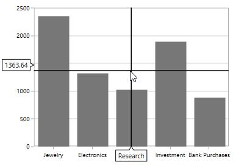

**Far**





<syncfusion:SfChart.Behaviors>

<syncfusion:ChartCrossHairBehavior VerticalAxisLabelAlignment="Far"  >

</syncfusion:ChartCrossHairBehavior>

</syncfusion:SfChart.Behaviors>





ChartCrossHairBehavior behavior = new ChartCrossHairBehavior()
{

    VerticalAxisLabelAlignment = ChartAlignment.Far

};

chart.Behaviors.Add(behavior);





 
