# Interactive Features

Essential Chart provides interactive features such as zooming, segment selection, and tracking data points.

## Tooltip

The ToolTip feature allows you to display any information over a ChartSeries. It is used in conjunction with the pointer. It appears when the mouse hovers over any chart segment. It is set to display the metadata of the particular segment or data point.

By default, a small box containing the data point's y values are displayed as the ToolTip. The y values vary depending on the ChartSeries. For example, a single y value is usually displayed in Column and BarSeries. In the FinancialSeries, high, low, open, and close values are displayed in ToolTip.

_ToolTip API Definitions_

<table>
<tr>
<td>
Property</td><td>
Description</td></tr>
<tr>
<td>
ShowTooltip</td><td>
A Boolean property defined in ChartSeries used to enable or disable the ToolTip.Default value: False</td></tr>
<tr>
<td>
TooltipTemplate</td><td>
Used to set the custom template for the ToolTip. ChartSegment can serve as the DataContext for this template, so users can make use of the values in the chart segment in the ToolTip.</td></tr>
<tr>
<td>
HorizontalAlignment</td><td>
An attached property in ChartSeries used to define the horizontal alignment for the ToolTip.</td></tr>
<tr>
<td>
VerticalAlignment</td><td>
An attached property in ChartSeries used to define the vertical alignment for the ToolTip.</td></tr>
<tr>
<td>
TooltipMargin</td><td>
Similar to the control margin property used to define the margin from its alignment position.</td></tr>
<tr>
<td>
EnableAnimation</td><td>
A Boolean property used to enable or disable animation in the ToolTip. Default value: False</td></tr>
<tr>
<td>
InitialShowDelay</td><td>
This is an attached property that gets or sets the delay time of the Tooltip to load.</td></tr>
<tr>
<td>
ShowDuration</td><td>
This is an attached property that gets or sets the duration of the Tooltip to stay visible.</td></tr>
<tr>
<td>
HorizontalOffset</td><td>
This is an attached property that gets or sets the tooltip offset position in accordance with the HorizontalAlignment property.</td></tr>
<tr>
<td>
VerticalOffset</td><td>
This is an attached property that gets or sets the tooltip offset position in accordance with the VerticalAlignment property.</td></tr>
</table>
> 

> _Note:  By default, the ToolTip is disabled. It must be enabled inorder to use it. Also, if you require an easy animation for the ToolTip, the EnableAnimation property must be set to True._

The following code example can be added to enable and customize the ToolTip feature.

[XAML]

<syncfusion:LineSeries XBindingPath="CompanyName" YBindingPath="CompanyTurnOver" Label="Company Details" ItemsSource="{Binding CompanyDetails}"

                 ShowTooltip="True" syncfusion:ChartTooltip.EnableAnimation="True"            syncfusion:ChartTooltip.HorizontalAlignment="Left" syncfusion:ChartTooltip.VerticalAlignment="Bottom"

                 syncfusion:ChartTooltip.TooltipMargin="3" />

The following screenshot is an example of the ToolTip in a FinancialSeries.

{ 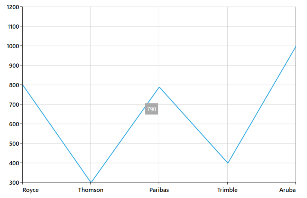 | markdownify }
{:.image }

## CrossHair 

ChartCrossHairBehavior is used to view the values at mouse point or touch contact point. ChartCrossHairBehavior consists of two lines; a horizontal line and a vertical line, perpendicular to each other, fixed at a point. By moving these lines horizontally, you can get the X values; and by moving these lines vertically, you can get the Y values.

Customizing ChartCrossHairBehavior of SfChart

You can modify the behavior of crosshairs, based on your requirement. The appearance of the crosshairs can be customized by HorizontalAxisLabelAlignment, VerticalAxisLabelAlignment, HorizontalLineStyle and VerticalLineStyle properties. 

The properties used in customizing CrossHairBehavior.

_Customizing CrossHairBehavior_

<table>
<tr>
<td>
Property</td><td>
Definition</td></tr>
<tr>
<td>
VerticalAxisLabelAlignment</td><td>
Gets or sets the VerticalAlignment value that represents the alignment of vertical axis label.</td></tr>
<tr>
<td>
HorizontalAxisLabelAlignment</td><td>
Gets or sets the HorizontallAlignment value that represents the alignment of the horizontal axis label.</td></tr>
<tr>
<td>
VerticalLineStyle</td><td>
Gets or sets the Style value that represents the style for the vertical line.</td></tr>
<tr>
<td>
HorizontalLineStyle</td><td>
Gets or sets the Style value that represents the style for the horizontal line.</td></tr>
</table>

Adding CrossHairBehavior to the SfChart

ChartCrossHairBehavior implements the feature of tracking data points in a chart. It defines the values in the X and Y axes, when the cursor is moved along the chart. Adding crosshairs makes the SfChart more interactive. The following steps show you how to add CrossHairBehavior to the SfChart.

[XAML]

         &lt;syncfusion:SfChart.Behaviors&gt;

            &lt;syncfusion:ChartCrossHairBehavior/&gt;

        &lt;/syncfusion:SfChart.Behaviors&gt;

Create an instance for ChartCrossHairBehavior and add this to the Behaviors collection.

To display the movement of X and Y values in the axis set the ShowTrackBallInfo property as True.

[XAML]

&lt;syncfusion:SfChart.PrimaryAxis&gt;

            &lt;syncfusion:CategoryAxis ShowTrackBallInfo="True" /&gt;

        &lt;/syncfusion:SfChart.PrimaryAxis&gt;

        &lt;syncfusion:SfChart.SecondaryAxis&gt;

            &lt;syncfusion:NumericalAxis  ShowTrackBallInfo="True"/&gt;

        &lt;/syncfusion:SfChart.SecondaryAxis&gt;

{ 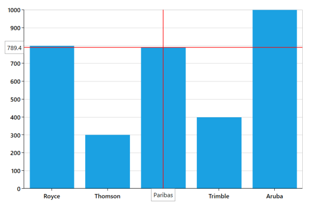 | markdownify }
{:.image }

## TrackBall 

ChartTrackBallBehavior enables you to track a data point closer to the touch position or touch contact point. It consists of only one vertical line moving along the Primary Axis and the series. The x values are determined from the position of the vertical line in the axis and y values are determined from the points touching the vertical line in the series.

Adding TrackBall to the SfChart

You can create an instance for ChartTrackBallBehavior and add it to the Behaviors collection. 

[XAML]

&lt;syncfusion:SfChart.Behaviors&gt;

            &lt;syncfusion:ChartTrackBallBehavior/&gt;

        &lt;/syncfusion:SfChart.Behaviors&gt;

To view the movement of TrackBallBehavior in the Axis, set the ShowTrackBallInfo property as True.

[XAML]

&lt;syncfusion:SfChart.PrimaryAxis&gt;

            &lt;syncfusion:CategoryAxis ShowTrackBallInfo="True"  /&gt;

        &lt;/syncfusion:SfChart.PrimaryAxis&gt;

{ 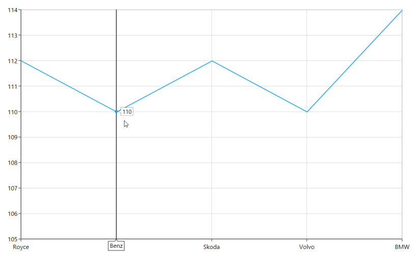 | markdownify }
{:.image }

Customizing the TrackBallBehavior of SfChart

The appearance of the TrackBall can be customized using ChartTrackBallStyle, AxisLabelAlignment, LabelHorizontalAlignment, LabelVerticalAlignment, LineStyle and UseSeriesPalette properties. 

_TrackBall Properties_

<table>
<tr>
<td>
  Property</td><td>
 Definition</td></tr>
<tr>
<td>
VerticalAxisLabelAlignment</td><td>
Gets or sets the VerticalAlignment value that represents the alignment of vertical axis label.</td></tr>
<tr>
<td>
HorizontalAxisLabelAlignment</td><td>
Gets or sets the HorizontalAlignment value that represents the alignment of the horizontal axis label.</td></tr>
<tr>
<td>
VerticalLineStyle</td><td>
Gets or sets the Style value that represents the style for the vertical line.</td></tr>
<tr>
<td>
HorizontalLineStyle</td><td>
Gets or sets the Style value that represents the style for the horizontal line.</td></tr>
<tr>
<td>
TrackBallLabelTemplate</td><td>
Gets or sets the DataTemplate value that represents a data template for the TrackBall.</td></tr>
<tr>
<td>
ChartTrackBallStyle</td><td>
Gets or sets the Style value that represents the style for the Chart TrackBall.</td></tr>
<tr>
<td>
UseSeriesPalette</td><td>
Enables or disables the corresponding chart segment color fill in the trackball label background.</td></tr>
<tr>
<td>
LabelDisplayMode</td><td>
Gets or sets the TrackballLabelDisplayMode for the Chart TrackBall.</td></tr>
</table>

{ 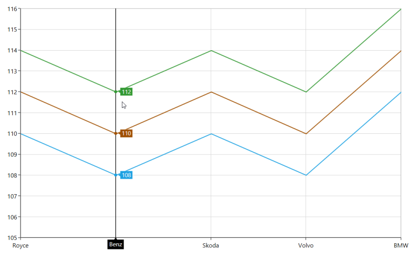 | markdownify }
{:.image }

LabelDisplayMode

This feature allows you to display the label in two different modes. This property takes LabelDisplayMode enum as value.

* NearestPoint – Display the label that is nearer to mouse pointer.
* FloatAllPoints – Display the labels that lies in mouse pointer. 

{ 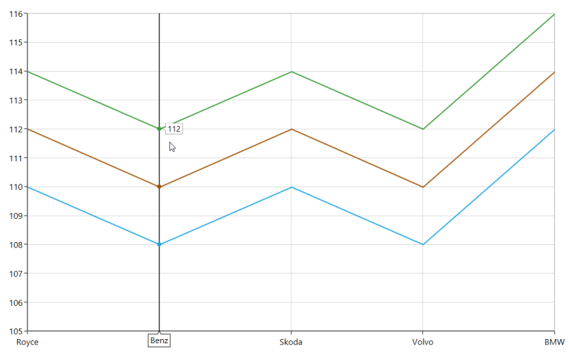 | markdownify }
{:.image }

{ 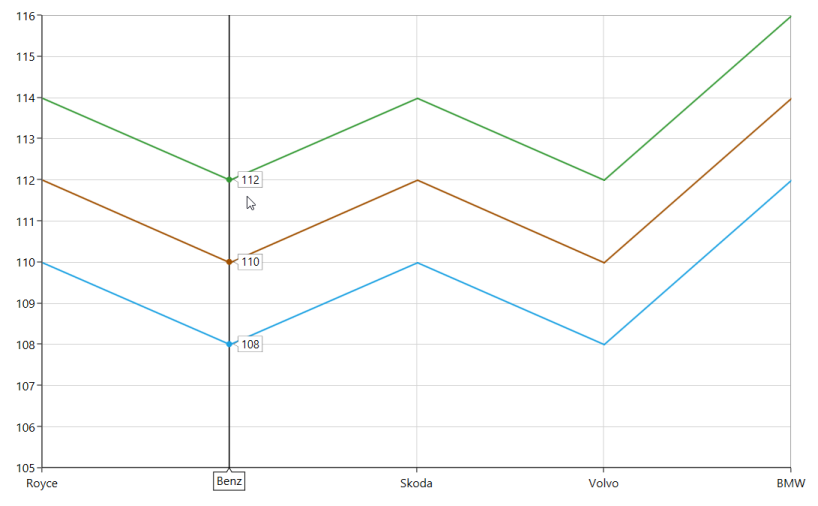 | markdownify }
{:.image }

## Zooming and Panning

SfChart allows you to zoom the chart area with the help of the zoom feature. This behavior is mostly used to view the datapoint in the specific area, when there are a number of data points inside the chart. 

The panning behavior allows moving the visible area of the chart when it is zoomed in. Zooming and panning provides you to take a close-up look of the data point plotted in the series.

Events

SfChart provides the following events while zooming and panning the chart.

_Zooming and Panning Events_

<table>
<tr>
<td>
Events</td><td>
 Description</td></tr>
<tr>
<td>
ZoomChanging</td><td>
Occurs when zooming takes place.</td></tr>
<tr>
<td>
ZoomChanged</td><td>
Occurs when zooming is completed.</td></tr>
<tr>
<td>
SelectionZoomingStart</td><td>
Occurs at the start of the selection zooming.</td></tr>
<tr>
<td>
SelectionZoomingEnd</td><td>
Occurs at the end of the selection zooming.</td></tr>
<tr>
<td>
SelectionZoomingDelta</td><td>
Occurs when selection zooming takes place.</td></tr>
<tr>
<td>
PanChanging</td><td>
Occurs when panning takes place.</td></tr>
<tr>
<td>
PanChanged</td><td>
Occurs when panning is done.</td></tr>
<tr>
<td>
ResetZooming</td><td>
Occurs when zoom is reset on DoubleClick or Double Tap, which is used to reset the zooming levels.</td></tr>
</table>
Enable Zooming

Zooming can be carried out in X, Y and XY axis that can be specified by the ZoomMode property. There are two types of zooming that can take place inside a chart area.

Zooming the Chart using Mouse- You must enable the EnableMouseWheelZooming property to zoom in on the chart using mouse wheel.

[XAML]

&lt;syncfusion:SfChart.Behaviors&gt;

            &lt;syncfusion:ChartZoomPanBehavior EnableMouseWheelZooming="True"/&gt;

        &lt;/syncfusion:SfChart.Behaviors&gt;

Also, there are options for selection zooming, when you want to zoom in on a particular portion inside the chart area, you can zoom by the mouse wheel movement.

[XAML]

&lt;syncfusion:SfChart.Behaviors&gt;

            &lt;syncfusion:ChartZoomPanBehavior EnableSelectionZooming="True"/&gt;

        &lt;/syncfusion:SfChart.Behaviors&gt;

Zooming the Chart in Touch monitor- By enabling the EnablePinchZooming property, you can zoom in on the chart area by touching the screen with your fingers.

[XAML]

&lt;syncfusion:SfChart.SecondaryAxis&gt;

            &lt;syncfusion:NumericalAxis  EnableTouchMode="True"/&gt;

        &lt;/syncfusion:SfChart.SecondaryAxis&gt;

        &lt;syncfusion:SfChart.Behaviors&gt;

            &lt;syncfusion:ChartZoomPanBehavior EnablePinchZooming="True" /&gt;

        &lt;/syncfusion:SfChart.Behaviors&gt;

Zooming relative to the cursor- By enabling the ZoomRelativeToCursor property, you can zoom the chart area relative to cursor current position. This feature has a close view of the required region.

[XAML]

&lt;syncfusion:SfChart.Behaviors&gt;

            &lt;syncfusion:ChartZoomPanBehavior ZoomRelativeToCursor="True"/&gt;

        &lt;/syncfusion:SfChart.Behaviors&gt;

ZoomPosition and ZoomFactor

ZoomFactor defines the percentage of visible range from the total range of axis values, that is, Range Delta * ZoomFactor is the new range of values. For instance, when the Range id from 0 to 100 and ZoomFactor is 0.5, only 50 ranges are displayed, such as 0 to 50 or 50 to 100.

ZoomPosition defines the ranges of values that need to be displayed as a result of ZoomFactor, that is, Range Delta * ZoomPosition is the Start value of the new range and End value is the Start + (Range Delta * ZoomFactor).

For the above scenario, when the ZoomPosition is 0.25 then the VisibleRange is from 25 to 75.

Scrollbar position- The scrollbar is placed in percentage of ZoomPosition in the new range, that is, New Range Delta * ZoomPosition. Thus in this case, the scrollbar gets placed in 37.5 (25 + (50 * 0.25)) and the scrollbar width is set to 25 (since ZoomPosition is 0.25).

The value of ZoomFactor and ZoomPosition must also fall within the value of 0 to 1. These can be set for both the Primary and Secondary Axes.

[XAML]

&lt;syncfusion:SfChart.SecondaryAxis&gt;

            &lt;syncfusion:NumericalAxis ZoomPosition="0.4" ZoomFactor="0.2"/&gt;

        &lt;/syncfusion:SfChart.SecondaryAxis&gt;

{  | markdownify }
{:.image }

Enable Auto Interval on Zooming

The EnableAutoIntervalOnZooming property is used to define whether you need to keep the interval as a constant or not. While zooming, the intervals change, depending on the VisibleRange aspect to zooming, like in the following image. By default, for intervals based on available size and range, automatic calculation is available.

{ 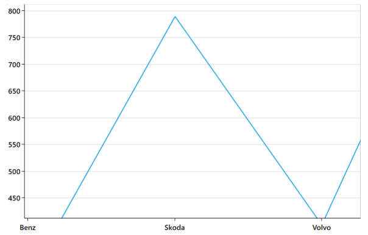 | markdownify }
{:.image }

In some scenarios, you may be required to maintain the interval count as a constant, in order to avoid more gridlines. By disabling this property, you can achieve this requirement as follows.

[XAML]

&lt;syncfusion:SfChart.PrimaryAxis&gt;

            &lt;syncfusion:NumericalAxis Interval="2" FontSize="14" EnableAutoIntervalOnZooming="False"/&gt;

        &lt;/syncfusion:SfChart.PrimaryAxis&gt;

Here, Interval is defined as 2, to maintain this interval on zooming.

{ 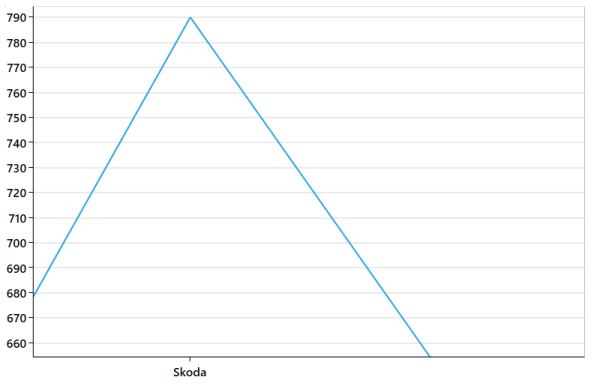 | markdownify }
{:.image }

Panning

You can view the zoomed data or series by panning the chart. This can be done by clicking and dragging the chart area, either horizontally or vertically. Also, the option to enable and disable the panning after zooming is also provided.

[XAML]

&lt;syncfusion:SfChart.Behaviors&gt;

     &lt;syncfusion:ChartZoomPanBehavior EnablePanning="True" /&gt;

&lt;/syncfusion:SfChart.Behaviors&gt;

Zooming Toolbar

SfChart provides an interactive toolbar for zooming and panning. Using this toolbar, you can perform operations like Zoom In, Zoom Out, Reset, Panning and Selection Zooming using the respective toolbar items or icons. 

By default, the Zooming Toolbar has options like ZoomIn, ZoomOut and Reset. Selection Zoom icon and Panning icon are enabled, when the EnableSelectionZooming property is set as “True”. 

_Zooming Toolbar_

<table>
<tr>
<td>
Properties</td><td>
 Description</td></tr>
<tr>
<td>
EnableZoomingToolBar</td><td>
Gets or sets the Boolean value to enable the toolbar.</td></tr>
<tr>
<td>
ToolBarOrientation</td><td>
Gets or sets the orientation for the toolbar.</td></tr>
<tr>
<td>
ToolBarItems</td><td>
Gets or sets the items to be added to the toolbar. It is a flagged enum.</td></tr>
<tr>
<td>
HorizontalPosition</td><td>
Gets or sets the horizontal alignment for toolbar.</td></tr>
<tr>
<td>
VerticalPosition</td><td>
Gets or sets the vertical alignment for toolbar.</td></tr>
<tr>
<td>
ToolBarBackground</td><td>
Gets or sets the toolbar background.</td></tr>
</table>
The following code example can be used to display the zooming tool bar in SfChart.

[XAML]

&lt;chart:SfChart&gt;

    &lt;chart:SfChart.Behaviors&gt;

         &lt;chart:ChartZoomPanBehavior EnableZoomingToolBar="True" ToolBarItems="All" ToolBarOrientation="Horizontal" HorizontalPosition="Left" VerticalPosition="Top" ToolBarBackground="#E6E6E6" EnableSelectionZooming="True"/&gt;

    &lt;/chart:SfChart.Behaviors&gt;

&lt;/chart:SfChart&gt;

[C#]

SfChart chart = new SfChart();

ChartZoomPanBehavior behavior = new ChartZoomPanBehavior();

behavior.EnableZoomingToolBar = true;

behavior.ToolBarItems = ZoomToolBarItems.All;

behavior.HorizontalPosition = HorizontalAlignment.Left;

behavior.VerticalPosition = VerticalAlignment.Top;

behavior.ToolBarOrientation = Orientation.Horizontal;

behavior.ToolBarBackground = new SolidColorBrush(Color.FromArgb(150, 0xE6, 0xE6, 0xE6));

behavior.EnableSelectionZooming = true;

chart.Behaviors.Add(behavior);

{ 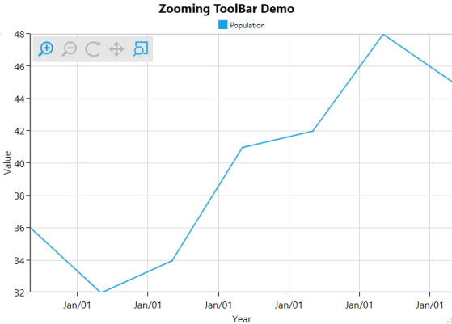 | markdownify }
{:.image }

## Selection

SfChart supports selection that enables you to select a segment in a series or series itself by using ChartSelectionBehavior. To enable selection in a chart, add ChartSelectionBehavior to the SfChart behavior.

You can use the following code example to add selection to the chart.

[XAML]

&lt;syncfusion:SfChart.Behaviors&gt;

&lt;syncfusion:ChartSelectionBehavior/&gt;

&lt;/syncfusion:SfChart.Behaviors&gt;

ChartSelectionBehavior have two types of selection.

* Segment selection - This behavior highlights the particular segment in the series.
* Series selection - This behavior highlights the particular series in the area.

The following property is used to set mode of selection in ChartSelectionBehavior.

_Property Table_

<table>
<tr>
<td>
Property</td><td>
Description</td></tr>
<tr>
<td>
SelectionMode</td><td>
Gets or sets the SelectionMode that specifies on what mouse action selection should occur.</td></tr>
</table>
The following events are used to do some customization based on selection.

_Event Table_

<table>
<tr>
<td>
Event</td><td>
Description</td></tr>
<tr>
<td>
SelectionChanging</td><td>
Occurs when selection changing is started in area.</td></tr>
<tr>
<td>
SelectionChanged</td><td>
Occurs when selection changed is completed in area.</td></tr>
</table>
### Segment selection

Segment selection is used to highlight the particular data point in series.

The following properties are used to configure segment selection.

_Property Table_

<table>
<tr>
<td>
Property</td><td>
Description</td></tr>
<tr>
<td>
SelectedIndex</td><td>
Gets or sets the int value that indicates the selected segment in series.</td></tr>
<tr>
<td>
SegmentSelectionBrush</td><td>
Gets or sets brush value that indicates the selection color of selected segment.</td></tr>
<tr>
<td>
EnableSegmentSelection</td><td>
Gets or sets bool value that enable or disable the segment selection.</td></tr>
</table>
#### SegmentSelectionBrush

This property is used to define the custom brush for the selected segment. You can use the following code example to set SegmentSelectionBrush to the series.

[XAML]

<syncfusion:ColumnSeries Label="2010" ItemsSource="{Binding Demands}"

 XBindingPath="Demand"YBindingPath="Year2010"

SegmentSelectionBrush="Red">

&lt;/syncfusion:ColumnSeries&gt;

{  | markdownify }
{:.image }

#### Selection using SelectedIndex

This feature enables you to select the segment programmatically.

Use the following code example to set SelectedIndex in a SfChart.

[XAML]

&lt;chart:SfChart Name="chart" &gt;

&lt;chart:SfChart.Behaviors&gt;

<chart:ChartSelectionBehavior SelectionMode="MouseClick"

                              EnableSegmentSelection="true" />

&lt;/chart:SfChart.Behaviors&gt;

&lt;chart:ColumnSeries Name="column" SelectedIndex="2"    ItemsSource="{Binding CurrencyDetails}" SegmentSelectionBrush="Green"     XBindingPath="CurrencyName" YBindingPath="CurrencyValue"&gt;

. . .

&lt;/chart:ColumnSeries&gt;

&lt;/chart:SfChart&gt;

The following screenshot illustrates a SfChart with SelectedIndex.

{ 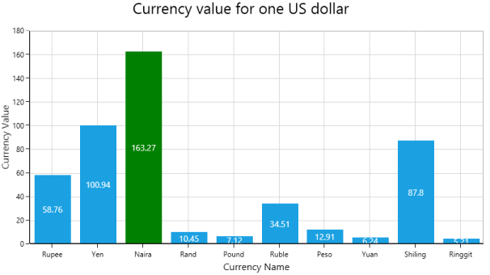 | markdownify }
{:.image }

### Series selection

Series selection support is used to highlight the series programmatically or by user interaction. Also you can able to get a series SelectedIndex, PreviousSelectedIndex value in SelectionChanged event arguments. 

The following properties are used to configure series selection.

<table>
<tr>
<td>
Property</td><td>
Description</td></tr>
<tr>
<td>
EnableSeriesSelection</td><td>
Gets or sets bool value that indicates to enable series selection or not.</td></tr>
<tr>
<td>
SeriesSelectedIndex</td><td>
Gets or sets the int value that indicates the highlighting series in chart.</td></tr>
<tr>
<td>
SeriesSelectionBrush</td><td>
Gets or sets the brush value that indicates the highlighting brush for series.</td></tr>
</table>

Use the following code example to set series selection in a SfChart.

[XAML]

&lt;chart:SfChart SeriesSelectedIndex="1"&gt;

&lt;chart:SfChart.Behaviors&gt;

&lt;chart:ChartSelectionBehavior  EnableSeriesSelection="True" /&gt;

&lt;/chart:SfChart.Behaviors&gt;

<chart:ColumnSeries   XBindingPath="FruitName"  

                      SeriesSelectionBrush="Blue" 

                      YBindingPath="People1"

                      ItemsSource="{Binding Fruits}">

&lt;chart:ColumnSeries.AdornmentsInfo&gt;

<chart:ChartAdornmentInfo   AdornmentsPosition="TopAndBottom"

                            ShowLabel="true"                                                                        

                            HighlightOnSelection="True"/>

&lt;/chart:ColumnSeries.AdornmentsInfo&gt;

&lt;/chart:ColumnSeries&gt;

<chart:ColumnSeries   XBindingPath="FruitName"

                      YBindingPath="People2"

                      SeriesSelectionBrush="Blue"

                      ItemsSource="{Binding Fruits}">

&lt;chart:ColumnSeries3D.AdornmentsInfo&gt;

<chart:ChartAdornmentInfo3D   AdornmentsPosition="TopAndBottom"

                              ShowLabel="true"                                                                        

                              HighlightOnSelection="True"/>

&lt;/chart:ColumnSeries3D.AdornmentsInfo&gt;

&lt;/chart:ColumnSeries&gt;

&lt;/chart:SfChart&gt;

The following screenshot is an example of a SfChart with series selection.

{ 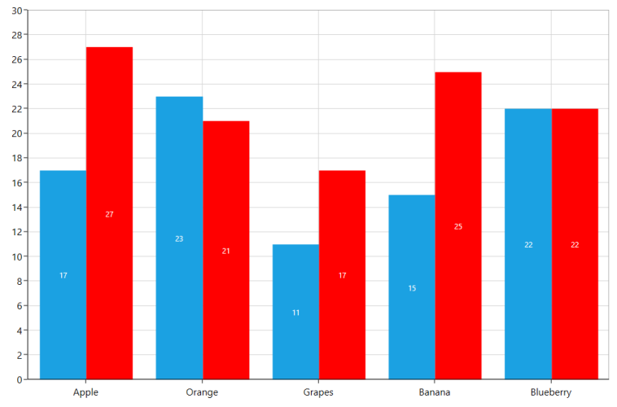 | markdownify }
{:.image }

## Visual Data Editing

You may want to edit the chart data during runtime. SfChart has a feature that allows you to edit an entire series or a single data point dynamically by interacting directly with the chart series, by dragging. 

The following properties can be used to enable and customize dragging.

_Visual Data Editing Properties_

<table>
<tr>
<td>
Property</td><td>
Description</td></tr>
<tr>
<td>
EnableSegmentDragging</td><td>
A Boolean property, used to enable editing a single data point by dragging it to a new position.</td></tr>
<tr>
<td>
EnableSeriesDragging</td><td>
A Boolean property used to enable editing the whole series by dragging the series to a new position. This is applicable for LineSeries and SplineSeries.</td></tr>
<tr>
<td>
EnableDragToolTip</td><td>
Used to enable the ToolTip to show the current dragging value while dragging.</td></tr>
<tr>
<td>
DragTooltipTemplate</td><td>
You can provide a DataTemplate to customize the drag value ToolTip.</td></tr>
<tr>
<td>
SnapToPoint</td><td>
This property is used to customize the edited value. You can set any one of the following options:None – Does not round the edited value.Round – Rounds the edited value to the nearest integer.Floor – Rounds the edited value to the nearest minimum integer.Ceil – Rounds the edited value to the nearest maximum integer.</td></tr>
<tr>
<td>
RoundToDecimal</td><td>
Rounds a decimal value to a specified number of fractional digits. This property is only useful if you set SnapToPoint as Round.</td></tr>
<tr>
<td>
UpdateSource</td><td>
A Boolean property used to determine whether to update the underlying data after editing the data dynamically.</td></tr>
<tr>
<td>
DragCancelKeyModifiers</td><td>
A type of VirtualKeyModifiers, used to cancel dragging.</td></tr>
</table>

The following events are used to interact with dragging.

_Drag Properties_

<table>
<tr>
<td>
Event Name</td><td>
Description</td></tr>
<tr>
<td>
DragStart</td><td>
Occurs when the series or segment receives logical focus and is selected by the mouse.</td></tr>
<tr>
<td>
DragDelta</td><td>
Occurs one or more times as the input device changes position when a series or segment has logical focus and is selected by the mouse.</td></tr>
<tr>
<td>
DragEnd</td><td>
Occurs when series or segment is no longer selected by the mouse.</td></tr>
<tr>
<td>
SegmentEnter</td><td>
Occurs when the input device enters the segment.</td></tr>
</table>
## Segment Drag and Drop

This feature allows you to drag the data points along y-axis. The following series types support this feature.

* Line
* Spline
* Column
* Bar
* Range column

The following code example is used to enable dragging for the ColumnSeries.

[XAML]

&lt;!-- Add the Chart control--&gt;

        &lt;syncfusion:SfChart&gt;

            &lt;!-- Assign the datacontext object for the Chart--&gt;

            &lt; syncfusion:SfChart.DataContext&gt;

                &lt;local:CategoryDataViewModel/&gt;

            &lt;/ syncfusion:SfChart.DataContext&gt;

            &lt;!-- Add a legend to the Chart--&gt;

            &lt; syncfusion:SfChart.Legend&gt;

                &lt; syncfusion:ChartLegend/&gt;

            &lt;/ syncfusion:SfChart.Legend&gt;

            &lt;!-- Add axes to the Chart--&gt;

            &lt; syncfusion:SfChart.PrimaryAxis&gt;

                &lt; syncfusion:CategoryAxis/&gt;

            &lt;/ syncfusion:SfChart.PrimaryAxis&gt;

            &lt; syncfusion:SfChart.SecondaryAxis&gt;

                &lt; syncfusion:NumericalAxis/&gt;

            &lt;/ syncfusion:SfChart.SecondaryAxis&gt;

            &lt;!-- Add ColumnSeries to the Chart--&gt;

            < syncfusion:ColumnSeries Label="Sports" ItemsSource="{Binding CategoricalDatas}" 

                    XBindingPath="Category" YBindingPath="Value" 

                    EnableSegmentDragging="True"/>

        &lt;/ syncfusion:SfChart&gt;

The following screenshot illustrates dragging a data point.

{ 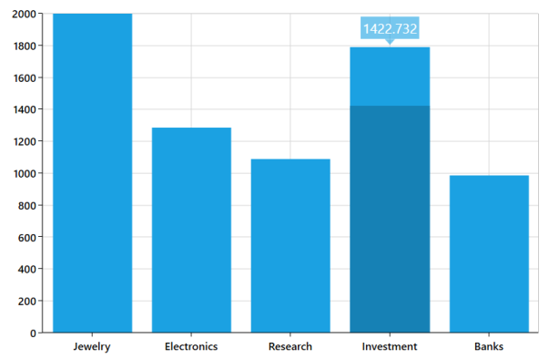 | markdownify }
{:.image }

## Series Drag and Drop

This feature allows you to drag and drop, the whole series along the y-axis. The following series types support this feature.

* Line
* Spline

The following code example is used to enable LineSeries dragging.

[XAML]

&lt;!-- Add the Chart control--&gt;

        &lt;syncfusion:SfChart&gt;

            &lt;!-- Assign the datacontext object for the Chart--&gt;

            &lt;syncfusion:SfChart.DataContext&gt;

                &lt;local:CategoryDataViewModel/&gt;

            &lt;/syncfusion:SfChart.DataContext&gt;

            &lt;! —Add a legend to the Chart--&gt;

            &lt;syncfusion:SfChart.Legend&gt;

                &lt;syncfusion:ChartLegend/&gt;

            &lt;/syncfusion:SfChart.Legend&gt;

            &lt;!-- Add axes to the Chart--&gt;

            &lt;syncfusion:SfChart.PrimaryAxis&gt;

                &lt;syncfusion:CategoryAxis/&gt;

            &lt;/syncfusion:SfChart.PrimaryAxis&gt;

            &lt;syncfusion:SfChart.SecondaryAxis&gt;

                &lt;syncfusion:NumericalAxis/&gt;

            &lt;/syncfusion:SfChart.SecondaryAxis&gt;

         &lt;!-- Add LineSeries to the Chart--&gt;

        <syncfusion:LineSeries Label="Sports" ItemsSource="{Binding CategoricalDatas}"

                   XBindingPath="Category" YBindingPath="Value"

                   EnableSeriesDragging="True"/>

        &lt;/syncfusion:SfChart&gt;

The following screenshot illustrates dragging a LineSeries.

{  | markdownify }
{:.image }

## Resizable Scroll Bar

The resizable scrollbar is a type of scrollbar that can be resized within the track area by adjusting the scrolling thumbs. In the SfChart, a resizable scrollbar is used for zooming and panning across different chart segments.

The following are the customizing APIs of the scrollbar in SfChart.

_ScrollBar Customization_

<table>
<tr>
<td>
Property</td><td>
Description</td></tr>
<tr>
<td>
EnableScrollBar</td><td>
Gets or sets the bool value that represents to enables the scroll bar in the chart axes.</td></tr>
<tr>
<td>
EnableTouchMode</td><td>
Gets or sets the bool value that represents to enables touch mode for the scroll bars in the chart axes.</td></tr>
<tr>
<td>
DeferredScrolling</td><td>
Gets or sets the bool value that represents to enables deferred scrolling and panning.</td></tr>
<tr>
<td>
ThumbLabelVisibility</td><td>
Gets or sets the Visibility value that represents to shows or hides the visible range label view when resizing the thumbs in touch mode.</td></tr>
<tr>
<td>
ThumbLabelTemplate</td><td>
Gets or sets a template for the visible range label view in touch mode.</td></tr>
</table>

[XAML]

&lt;Grid.Resources&gt;

            &lt;DataTemplate x:Key="thumblabeltemplate"&gt;

                &lt;Grid&gt;

                    &lt;Border BorderBrush="Pink" BorderThickness="2"&gt;

                        &lt;TextBlock Text="{Binding}" FontSize="15"&gt;&lt;/TextBlock&gt;

                    &lt;/Border&gt;

                &lt;/Grid&gt;

            &lt;/DataTemplate&gt;

        &lt;/Grid.Resources&gt;

        &lt;syncfusion:NumericalAxis EnableScrollBar="True" DeferredScrolling="True" EnableTouchMode="True" ThumbLabelVisibility="Visible" ThumbLabelTemplate="{StaticResource thumblabeltemplate}" /&gt;

The following screenshots illustrate the SfChart with scrollbar enabled.

{ 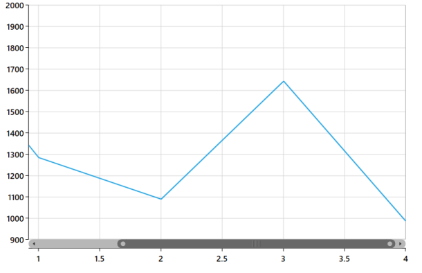 | markdownify }
{:.image }

{  | markdownify }
{:.image }

## Adornment Selection	

SfChart provides data point selection for adornments and the HighlightOnSelection property allows you to select the segment with the corresponding segment adornment. 

> _Note: This property works only when you have enabled the selection for the series, by adding the above behavior._ 

All the series having Selection support, support the Adornment property.

The following example shows the HighlighOnSelection feature for adornment.

[XAML]

&lt;syncfusion:SfChart Margin="10" Name="chart"&gt;

        &lt;syncfusion:SfChart.Behaviors&gt;

            &lt;syncfusion:ChartSelectionBehavior/&gt;

        &lt;/syncfusion:SfChart.Behaviors&gt;

        <syncfusion:FastLineBitmapSeries  XBindingPath="Category" YBindingPath="Value" ItemsSource="{Binding CategoricalDatas}" 

                                              SegmentSelectionBrush="Red" >

            &lt;syncfusion:FastLineBitmapSeries.AdornmentsInfo&gt;

                &lt;syncfusion:ChartAdornmentInfo  ShowLabel="True" UseSeriesPalette="True" HighlightOnSelection="True"/&gt;

            &lt;/syncfusion:FastLineBitmapSeries.AdornmentsInfo&gt;

        &lt;/syncfusion:FastLineBitmapSeries&gt;

    &lt;/syncfusion:SfChart&gt;

The following demonstrate the output for the above screenshots:

{ 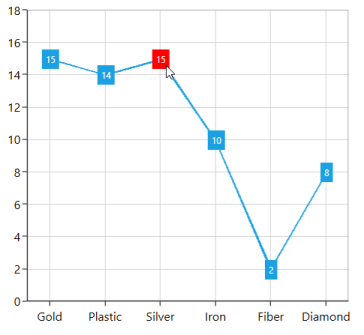 | markdownify }
{:.image }

