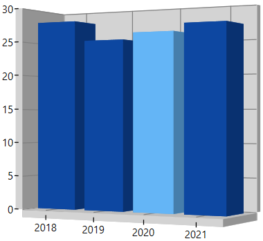
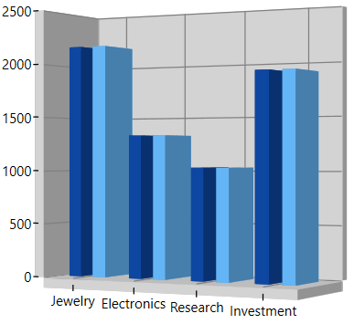

# Interactive Features in WPF Charts (SfChart3D)

3D charts provide interactive features such as dynamic rotation, segment selection, and dynamic segment explode for circular series.

## Dynamic rotation

3D charts allow us to view the best possible view of data dynamically using a mouse or touch device. To enable dynamic rotation, set the [`EnableRotation`](https://help.syncfusion.com/cr/cref_files/wpf/Syncfusion.SfChart.WPF~Syncfusion.UI.Xaml.Charts.SfChart3D~EnableRotation.html) property to true.

The following code example illustrates how to enable the dynamic rotation:




<Syncfusion:SfChart3D EnableRotation="True" x:Name="Chart" Height="500" Width="600"/>



 
## Segment Selection

To enable segment selection in a 3D chart, set the SegmentSelectionBrush property in chart series.

The following code example illustrates how to set the selection brush for individual series. For data refer to the Series category in 3D charts.



    <Syncfusion:SfChart3D EnableRotation="True" x:Name="Chart" Height="500" Width="600">
        <Syncfusion:SfChart3D.PrimaryAxis>
            <Syncfusion:CategoryAxis3D/>
        </Syncfusion:SfChart3D.PrimaryAxis>
        <Syncfusion:SfChart3D.SecondaryAxis>
            <Syncfusion:NumericalAxis3D/>
        </Syncfusion:SfChart3D.SecondaryAxis>

        <Syncfusion:ColumnSeries3D SegmentSelectionBrush="Red" ItemsSource="{Binding UsersList}"
           XBindingPath="TimeStamp" YBindingPath="NoOfUsers">
        </Syncfusion:ColumnSeries3D>
    </Syncfusion:SfChart3D >
	

The following screenshot illustrates the result of the above code example.

## Series Selection

Series selection support is used to highlight the series programmatically or by user interaction. Also you can get a series SelectedIndex, PreviousSelectedIndex value in SelectionChanged event arguments. 

The following code example can be used to set series selection in a SfChart3D.



    <chart:SfChart3D EnableSeriesSelection="True" SeriesSelectedIndex="0">
        <chart:ColumnSeries3D   XBindingPath="FruitName" SeriesSelectionBrush="Blue" YBindingPath="People1"
        ItemsSource="{Binding Fruits}">

        <chart:ColumnSeries3D.AdornmentsInfo>
            <chart:ChartAdornmentInfo3D   AdornmentsPosition="TopAndBottom" ShowLabel="true" HighlightOnSelection="True"/>
            </chart:ColumnSeries3D.AdornmentsInfo>
        </chart:ColumnSeries3D >

        <chart:ColumnSeries3D   XBindingPath="FruitName" YBindingPath="People2" SeriesSelectionBrush="Blue"
        ItemsSource="{Binding Fruits}">

        <chart:ColumnSeries3D.AdornmentsInfo>

            <chart:ChartAdornmentInfo3D  AdornmentsPosition="TopAndBottom" ShowLabel="true"                                    HighlightOnSelection="True"/>
        </chart:ColumnSeries3D.AdornmentsInfo>

        </chart:ColumnSeries3D >
    </chart:SfChart3D >



The following screenshot is an example of a SfChart3D with series selection.

