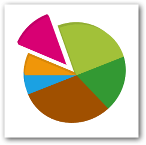

# WPF Chart (SfChart3D) Overview 

3D charts are used to view two-dimensional data in a three-dimensional view, and can be rotated in all 3 dimensions to get the best possible view of the data.

## Key features

* Eight types of chart [`Series`](https://help.syncfusion.com/cr/cref_files/wpf/Syncfusion.SfChart.WPF~Syncfusion.UI.Xaml.Charts.SfChart3D~Series.html).
* Perspective view.
* Data binding.
* Animations.
* Empty point support.
* Dynamic update.
* Dynamic rotation.
* Selection support.

## Dynamic explode

This feature allows users to explode a particular segment in a circular series using [`ExplodeOnMouseClick`](https://help.syncfusion.com/cr/cref_files/wpf/Syncfusion.SfChart.WPF~Syncfusion.UI.Xaml.Charts.PieSeries3D~ExplodeOnMouseClick.html). This can also be achieved by setting the [`ExplodeIndex`](https://help.syncfusion.com/cr/cref_files/wpf/Syncfusion.SfChart.WPF~Syncfusion.UI.Xaml.Charts.CircularSeriesBase3D~ExplodeIndex.html) or [`ExplodeAll`](https://help.syncfusion.com/cr/cref_files/wpf/Syncfusion.SfChart.WPF~Syncfusion.UI.Xaml.Charts.CircularSeriesBase3D~ExplodeAll.html) property. 

The following code example illustrates how to enable dynamic explode for circular series, for data please refer series category in 3D charts.



<Syncfusion:SfChart3D EnableRotation="True" x:Name="Chart" Height="500" Width="600">

<Syncfusion:SfChart3D.PrimaryAxis>

<Syncfusion:CategoryAxis3D/>

</Syncfusion:SfChart3D.PrimaryAxis>

<Syncfusion:SfChart3D.SecondaryAxis>

<Syncfusion:NumericalAxis3D/>

</Syncfusion:SfChart3D.SecondaryAxis>

<Syncfusion:PieSeries3D

ExplodeOnMouseClick="True"

ItemsSource="{Binding UsersList}"

XBindingPath="TimeStamp"

YBindingPath="NoOfUsers">

</Syncfusion:PieSeries3D>

</Syncfusion:SfChart3D >

The following image illustrates the result of the above code sample:

