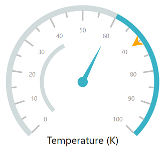

# Getting Started

This section explains the steps required to configure the [`CircularGauge`](https://help.syncfusion.com/cr/cref_files/wpf/gauge/Syncfusion.Gauge.WPF~Syncfusion.Windows.Gauge.CircularGauge.html) and add basic elements to it using various APIs.

## Adding gauge references

Refer to this [article](https://help.syncfusion.com/wpf/add-syncfusion-controls) to know how to add Syncfusion controls to Visual Studio projects in various ways. You can also refer to [this](https://help.syncfusion.com/wpf/control-dependencies) link to know about the assemblies required for adding gauge to your project.

### Initialize gauge

Import  the [`CircularGauge`](https://help.syncfusion.com/cr/cref_files/wpf/gauge/Syncfusion.Gauge.WPF~Syncfusion.Windows.Gauge.CircularGauge.html) namespace to your respective Window as follows.





xmlns:gauge ="clr-namespace:Syncfusion.UI.Xaml.Gauges;assembly=Syncfusion.SfGauge.Wpf"





using Syncfusion.UI.Xaml.Gauges;





You can initialize an empty [`CircularGauge`](https://help.syncfusion.com/cr/cref_files/wpf/gauge/Syncfusion.Gauge.WPF~Syncfusion.Windows.Gauge.CircularGauge.html) control.





        <gauge:SfCircularGauge/>





SfCircularGauge sfCircularGauge = new SfCircularGauge();

this.Content = sfCircularGauge;





### Adding headers

You can assign a unique header to the [`CircularGauge`](https://help.syncfusion.com/cr/cref_files/wpf/gauge/Syncfusion.Gauge.WPF~Syncfusion.Windows.Gauge.CircularGauge.html) by using the `GaugeHeader` property.





    <gauge:SfCircularGauge Height="500" Width="500" HeaderAlignment="Custom" GaugeHeaderPosition="0.36,0.7">

     <gauge:SfCircularGauge.GaugeHeader>

      <TextBlock Text="Temperature (K)" 

      Height="40" Width="150" 

      FontSize="20" Foreground="Black"/>

      </gauge:SfCircularGauge.GaugeHeader>

     </gauge:SfCircularGauge>





SfCircularGauge sfCircularGauge = new SfCircularGauge();

sfCircularGauge.HeaderAlignment = HeaderAlignment.Custom;

sfCircularGauge.GaugeHeaderPosition = new Point(0.36, 0.7);

TextBlock textBlock = new TextBlock();

textBlock.Text = "Temperature (K)";

textBlock.Height = 40;

textBlock.Width = 150;

textBlock.FontSize = 20;

textBlock.Foreground = new SolidColorBrush(Colors.Black);

sfCircularGauge.GaugeHeader = textBlock;





### Configuring scales

You can configure the [`CircularScale`](https://help.syncfusion.com/cr/cref_files/wpf/gauge/Syncfusion.Gauge.WPF~Syncfusion.Windows.Gauge.CircularScale.html) elements by using the following APIs:

* StartAngle
* SweepAngle
* StartValue
* EndValue
* Interval
* TickStroke
* LabelStroke





         <gauge:SfCircularGauge.Scales>

             <gauge:CircularScale/>

       </gauge:SfCircularGauge.Scales>





CircularScale mainscale = new CircularScale();

sfCircularGauge.Scales.Add(mainscale);





### Adding ranges

You can add ranges to the [`CircularGauge`](https://help.syncfusion.com/cr/cref_files/wpf/gauge/Syncfusion.Gauge.WPF~Syncfusion.Windows.Gauge.CircularGauge.html) by creating ranges collection using the [`CircularRange`](https://help.syncfusion.com/cr/cref_files/wpf/gauge/Syncfusion.Gauge.WPF~Syncfusion.Windows.Gauge.CircularRange.html)  property.





     <gauge:SfCircularGauge>

     <gauge:SfCircularGauge.Scales>

             <gauge:CircularScale>

                <gauge:CircularScale.Ranges>

                   <gauge:CircularRange StartValue="0" EndValue="60"/>

                 </gauge:CircularScale.Ranges>
 
             </gauge:CircularScale>

      </gauge:SfCircularGauge.Scales>

      </gauge:SfCircularGauge>





CircularScale mainscale = new CircularScale();

CircularRange circularRange = new CircularRange();

circularRange.StartValue = 0;

circularRange.EndValue = 60;

mainscale.Ranges.Add(circularRange);

sfCircularGauge.Scales.Add(mainscale);





### Adding a needle pointer

Create a `Needle Pointer`, and associate it with a scale that is to be displayed the current value.




 
         <gauge:SfCircularGauge.Scales>

              <gauge:CircularScale>

        <gauge:CircularScale.Pointers>

             <gauge:CircularPointer PointerType="NeedlePointer" Value="60" 

                    NeedleLengthFactor="0.5" NeedlePointerType="Triangle"

                     PointerCapDiameter="20" PointerCapStroke="#39B2C6" />

              </gauge:CircularScale.Pointers>

            </gauge:CircularScale>

        </gauge:SfCircularGauge.Scales>





CircularScale mainscale = new CircularScale();

CircularPointer circularPointer = new CircularPointer();

circularPointer.PointerType = PointerType.NeedlePointer;

circularPointer.NeedleLengthFactor = 0.5;

circularPointer.NeedlePointerType = NeedlePointerType.Triangle;

circularPointer.PointerCapDiameter = 20;

circularPointer.PointerCapStroke = new SolidColorBrush(Color.FromArgb(0xff, 0x39, 0xb2, 0xc6));

circularPointer.Value = 60;

mainscale.Pointers.Add(circularPointer);

sfCircularGauge.Scales.Add(mainscale);





### Adding a range pointer

The `Range Pointer` provides an alternative way to indicate the current value.





     <gauge:SfCircularGauge.Scales>

           <gauge:CircularScale>

               <gauge:CircularScale.Pointers>

                   <gauge:CircularPointer PointerType="RangePointer" Value="40"/>

              </gauge:CircularScale.Pointers>

           </gauge:CircularScale>

          </gauge:SfCircularGauge.Scales>





CircularScale mainscale = new CircularScale();      

CircularPointer circularPointer = new CircularPointer();

circularPointer.PointerType = PointerType.RangePointer;

circularPointer.Value = 40;

mainscale.Pointers.Add(circularPointer);

sfCircularGauge.Scales.Add(mainscale);





### Adding a symbol pointer

The `Symbol Pointer` points to the current value in a scale.





          <gauge:SfCircularGauge.Scales>

              <gauge:CircularScale>

               <gauge:CircularScale.Pointers>

                <gauge:CircularPointer PointerType="SymbolPointer" Value="70" Symbol="InvertedArrow"/>

                 </gauge:CircularScale.Pointers>

                </gauge:CircularScale>

               </gauge:SfCircularGauge.Scales>





CircularScale mainscale = new CircularScale();      

CircularPointer circularPointer = new CircularPointer();

circularPointer.PointerType = PointerType.SymbolPointer;

circularPointer.Value = 70;

circularPointer.Symbol = Symbol.InvertedArrow;

mainscale.Pointers.Add(circularPointer);

sfCircularGauge.Scales.Add(mainscale);





The following code example is the complete code of the previous configurations.





    <Window x:Class="GaWPF.MainWindow"

     xmlns="http://schemas.microsoft.com/winfx/2006/xaml/presentation"

     xmlns:x="http://schemas.microsoft.com/winfx/2006/xaml"

     xmlns:d="http://schemas.microsoft.com/expression/blend/2008"

     xmlns:mc="http://schemas.openxmlformats.org/markup-compatibility/2006"

     xmlns:local="clr-namespace:GaWPF"

     mc:Ignorable="d"

     xmlns:gauge ="clr-namespace:Syncfusion.UI.Xaml.Gauges;assembly=Syncfusion.SfGauge.Wpf">

      <Grid>

        <gauge:SfCircularGauge Height="500" Width="500" HeaderAlignment="Custom" GaugeHeaderPosition="0.36,0.7">

          <gauge:SfCircularGauge.GaugeHeader>

                    <TextBlock Text="Temperature (K)" 

                         Height="40" Width="150" 

                          FontSize="20" Foreground="Black"/>

          </gauge:SfCircularGauge.GaugeHeader>

              <gauge:SfCircularGauge.Scales>

                   <gauge:CircularScale Radius="150" >

               <gauge:CircularScale.Ranges>

                 <gauge:CircularRange StartValue="0" EndValue="60"/>

               </gauge:CircularScale.Ranges>

              <gauge:CircularScale.Pointers>

               <gauge:CircularPointer PointerType="NeedlePointer" Value="60" 

                         NeedleLengthFactor="0.5" NeedlePointerType="Triangle"

                         PointerCapDiameter="20" PointerCapStroke="#39B2C6" />

                    <gauge:CircularPointer PointerType="RangePointer" Value="40"/>

                 <gauge:CircularPointer PointerType="SymbolPointer" Value="70" Symbol="InvertedArrow"/>

                </gauge:CircularScale.Pointers>

                    </gauge:CircularScale>

                 </gauge:SfCircularGauge.Scales>

                  </gauge:SfCircularGauge>

      </Grid>

    </Window>





using System.Windows;

using System.Windows.Controls;

using System.Windows.Media;

using Syncfusion.UI.Xaml.Gauges;

namespace GaWPF

{

public partial class MainWindow : Window

{

public MainWindow()

{

InitializeComponent();

//Initializing circular gauge

SfCircularGauge sfCircularGauge = new SfCircularGauge();

sfCircularGauge.Height = 500;

sfCircularGauge.Width = 500;

//Adding header

sfCircularGauge.HeaderAlignment = HeaderAlignment.Custom;

sfCircularGauge.GaugeHeaderPosition = new Point(0.36, 0.7);

TextBlock textBlock = new TextBlock();

textBlock.Text = "Temperature (K)";

textBlock.Height = 40;

textBlock.Width = 150;

textBlock.FontSize = 20;

textBlock.Foreground = new SolidColorBrush(Colors.Black);

sfCircularGauge.GaugeHeader = textBlock;

//Initializing scales for circular gauge

CircularScale mainscale = new CircularScale();

mainscale.Radius = 150;

//Adding range

CircularRange circularRange = new CircularRange();

circularRange.StartValue = 0;

circularRange.EndValue = 60;

mainscale.Ranges.Add(circularRange);

//Adding needle pointer

CircularPointer circularPointer = new CircularPointer();

circularPointer.PointerType = PointerType.NeedlePointer;

circularPointer.NeedleLengthFactor = 0.5;

circularPointer.NeedlePointerType = NeedlePointerType.Triangle;

circularPointer.PointerCapDiameter = 20;

circularPointer.PointerCapStroke = new SolidColorBrush(Color.FromArgb(0xff, 0x39, 0xb2, 0xc6));

circularPointer.Value = 60;

mainscale.Pointers.Add(circularPointer);

//Adding range pointer

CircularPointer circularPointer1 = new CircularPointer();

circularPointer1.PointerType = PointerType.RangePointer;

circularPointer1.Value = 40;

mainscale.Pointers.Add(circularPointer1);

//Adding symbol pointer

CircularPointer circularPointer2 = new CircularPointer();

circularPointer2.PointerType = PointerType.SymbolPointer;

circularPointer2.Value = 70;

circularPointer2.Symbol = Symbol.InvertedArrow;

mainscale.Pointers.Add(circularPointer2);

sfCircularGauge.Scales.Add(mainscale);

this.Content = sfCircularGauge;

}

}

}





The following screenshot illustrates the result of the previous codes.

You can find the complete getting started sample from this [`link`](http://www.syncfusion.com/downloads/support/directtrac/general/ze/GaugeGettingStarted-260550602).

