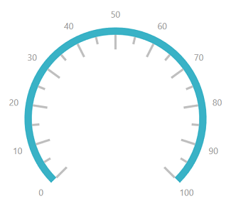

# Labels

Scale labels associate a numeric value with major scale tick marks.

##  Label Customization

The label stroke can be changed using the **LabelStroke** property. The labels can be positioned far away from the ticks by using the **LabelOffset** property.The size of the Labels can be changed by using the **LabelAutoSizeChange** property. 




     <syncfusion:SfCircularGauge x:Name="gauge">
                <syncfusion:SfCircularGauge.Scales >
                    <syncfusion:CircularScale LabelStroke="Red"  LabelAutoSizeChange="True"  LabelOffset="10">                              
                    </syncfusion:CircularScale>
                </syncfusion:SfCircularGauge.Scales>
      </syncfusion:SfCircularGauge>
      




            SfCircularGauge circularGauge = new SfCircularGauge();
            CircularScale _mainscale = new CircularScale();
            _mainscale.LabelStroke = new SolidColorBrush(Colors.Red);
            _mainscale.LabelOffset = 10;
            _mainscale.LabelAutoSizeChange = true;
            circularGauge.Scales.Add(_mainscale);
            this.Grid.Children.Add(circularGauge);
            



## Smart Labels

Smart labels allow you to change the numeric scale type of the labels displayed in a gauge scale. They also help customize labels by adding prefixes or suffixes to the scale labels.

**Enable/Disable Smart Labels**

The **EnableSmartLabels** property is Boolean property that enables or disables the smart label feature of the SfCircularGauge.

## NumericScaleType

The **NumericScaleType** property allows you to set the type of label. The following types can be applied to labels:

* Auto
* Thousands
* Millions
* Billions
* Trillions
* Quadrillions
* Quintillions




       <syncfusion:SfCircularGauge >
            <syncfusion:SfCircularGauge.Scales>
                <syncfusion:CircularScale EnableSmartLabels="False" 
                                          NumericScaleType="Thousands"/>
            </syncfusion:SfCircularGauge.Scales>
        </syncfusion:SfCircularGauge>





            SfCircularGauge circularGauge = new SfCircularGauge();
            CircularScale _mainscale = new CircularScale();
            _mainscale.NumericScaleType = NumericScaleType.Thousands;
            _mainscale.EnableSmartLabels = false;
            circularGauge.Scales.Add(_mainscale);
            this.Grid.Children.Add(circularGauge);




## Number of Fraction Digits

The **NoOfFractionalDigits** property is used to set the number of fractional digits to be displayed in the scale labels.




    <syncfusion:SfCircularGauge >
            <syncfusion:SfCircularGauge.Scales >
                <syncfusion:CircularScale  NoOfFractionalDigit="1" />
            </syncfusion:SfCircularGauge.Scales >
        </syncfusion:SfCircularGauge>





             SfCircularGauge circularGauge = new SfCircularGauge();
            CircularScale _mainscale = new CircularScale();
            _mainscale.NoOfFractionalDigit = 1;
            circularGauge.Scales.Add(_mainscale);
            this.Grid.Children.Add(circularGauge);
            



## Label Postfix and Prefix

You can set the postfix/Prefix values to the scale labels using **LabelPostfix** and **LabelPrefix** Properties respectively.

**LabelPostfix**

This property allows you to set the postfix values to the scale labels. The label postfixes will be visible even if the **EnableSmartLabels** property is set to false. 




    <syncfusion:SfCircularGauge >
    <syncfusion:SfCircularGauge.Scales >
        <syncfusion:CircularScale LabelPostfix="%"/>
                                  
    </syncfusion:SfCircularGauge.Scales >
    </syncfusion:SfCircularGauge>





        SfCircularGauge circularGauge = new SfCircularGauge();
        CircularScale _mainscale = new CircularScale();
        _mainscale.LabelPostfix = "%";      
        circularGauge.Scales.Add(_mainscale);
        this.Grid.Children.Add(circularGauge);
        



**LabelPrefix**

This property allows you to set the prefix values for the scale labels. The label prefixes will be visible even if the **EnableSmartLabels** property is set to false.




    <syncfusion:SfCircularGauge >
            <syncfusion:SfCircularGauge.Scales >
                <syncfusion:CircularScale LabelPrefix="$”/>
            </syncfusion:SfCircularGauge.Scales>
        </syncfusion:SfCircularGauge>




 
       SfCircularGauge circularGauge = new SfCircularGauge();
        CircularScale _mainscale = new CircularScale();
        _mainscale.LabelPrefix = "$";
        circularGauge.Scales.Add(_mainscale);
        this.Grid.Children.Add(circularGauge);




## LabelPosition

The Labels in the scale can be placed inside the scale or outside the scale by selecting one of the options available in the **LabelPosition** property. 

These options are:

1. Inside (Default)
2. Outside
3. Custom
4. Custom




        <syncfusion:SfCircularGauge x:Name="gauge">
            <syncfusion:SfCircularGauge.Scales >
                <syncfusion:CircularScale LabelPosition="Outside">
                </syncfusion:CircularScale>
            </syncfusion:SfCircularGauge.Scales >
        </syncfusion:SfCircularGauge>





     SfCircularGauge circularGauge = new SfCircularGauge();
     CircularScale _mainscale = new CircularScale();
     _mainscale.LabelPosition = LabelPosition.Outside;
      circularGauge.Scales.Add(_mainscale);
      this.Grid.Children.Add(circularGauge);




