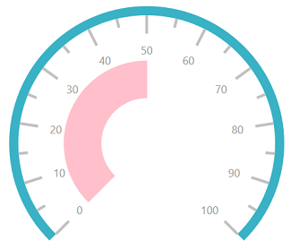
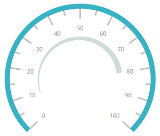
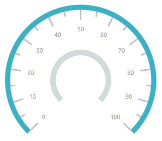
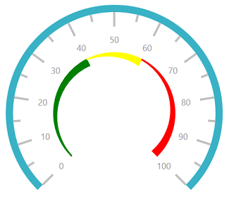

# Ranges 

Range is a visual element, which begins and ends at the specified values within a scale.

## Setting start and end values for range

The start and end values of ranges are set by using the `StartValue` and `EndValue` properties.





    <gauge:SfCircularGauge>
          
    <gauge:SfCircularGauge.Scales>

    <gauge:CircularScale>

    <gauge:CircularScale.Ranges>

    <gauge:CircularRange StartValue="0" EndValue="50"/>

    </gauge:CircularScale.Ranges>

    <gauge:CircularScale.Pointers>

    <gauge:CircularPointer NeedlePointerVisibility="Hidden"/>

    </gauge:CircularScale.Pointers>

    </gauge:CircularScale>

    </gauge:SfCircularGauge.Scales>

    </gauge:SfCircularGauge>





  SfCircularGauge sfCircularGauge = new SfCircularGauge();

  CircularScale mainscale = new CircularScale();

  CircularRange circularRange = new CircularRange();

  circularRange.StartValue = 0;

  circularRange.EndValue = 50;

  mainscale.Ranges.Add(circularRange);

  CircularPointer circularPointer = new CircularPointer();

  circularPointer.NeedlePointerVisibility = Visibility.Hidden;

  mainscale.Pointers.Add(circularPointer);

  sfCircularGauge.Scales.Add(mainscale);





## Range customization

A range’s UI is customized by using the `Stroke`, `StrokeThickness`, and `RangeOffset` properties. First, set the `RangePosition` property to custom, and then set the offset.





    <gauge:SfCircularGauge>
          
    <gauge:SfCircularGauge.Scales>

    <gauge:CircularScale RangePosition="Custom" RangeOffset="0.4">

    <gauge:CircularScale.Ranges>

    <gauge:CircularRange StartValue="0" EndValue="50" Stroke="Pink" StrokeThickness="40"/>

    </gauge:CircularScale.Ranges>

    <gauge:CircularScale.Pointers>

    <gauge:CircularPointer NeedlePointerVisibility="Hidden"/>

    </gauge:CircularScale.Pointers>

    </gauge:CircularScale>

    </gauge:SfCircularGauge.Scales>

    </gauge:SfCircularGauge>





  SfCircularGauge sfCircularGauge = new SfCircularGauge();

  CircularScale mainscale = new CircularScale();

  mainscale.RangePosition = RangePosition.Custom;

  mainscale.RangeOffset = 0.4;

  CircularRange circularRange = new CircularRange();

  circularRange.StartValue = 0;

  circularRange.EndValue = 50;
  
  circularRange.Stroke = new SolidColorBrush(Colors.Pink);

  circularRange.StrokeThickness = 40;

  mainscale.Ranges.Add(circularRange);

  CircularPointer circularPointer = new CircularPointer();

  circularPointer.NeedlePointerVisibility = Visibility.Hidden;

  mainscale.Pointers.Add(circularPointer);

  sfCircularGauge.Scales.Add(mainscale);





## Setting width for range

The appearance of the circular range is customized by setting the `StartWidth` and `EndWidth` properties.





    <gauge:SfCircularGauge >

    <gauge:SfCircularGauge.Scales>

    <gauge:CircularScale  RangePosition="Inside" Radius="200">

    <gauge:CircularScale.Ranges>

    <gauge:CircularRange StartValue="10" EndValue="80" StrokeThickness ="10" StartWidth="1" EndWidth="10"/>

    </gauge:CircularScale.Ranges>

    <gauge:CircularScale.Pointers>
                    
    <gauge:CircularPointer NeedlePointerVisibility="Hidden"/>

    </gauge:CircularScale.Pointers>

    </gauge:CircularScale>

    </gauge:SfCircularGauge.Scales>

    </gauge:SfCircularGauge>





  SfCircularGauge sfCircularGauge = new SfCircularGauge();

  CircularScale mainscale = new CircularScale();

  mainscale.RangePosition = RangePosition.Inside;

  CircularRange circularRange = new CircularRange();

  circularRange.StartValue = 10;

  circularRange.EndValue = 80;

  circularRange.StrokeThickness = 10;

  circularRange.StartWidth = 1;

  circularRange.EndWidth = 10;

  mainscale.Ranges.Add(circularRange);

  CircularPointer circularPointer = new CircularPointer();

  circularPointer.NeedlePointerVisibility = Visibility.Hidden;

  mainscale.Pointers.Add(circularPointer);

  sfCircularGauge.Scales.Add(mainscale);





## Binding range stroke

You can bind the range’s stroke to the tick lines and labels within its range by setting the `BindRangeStrokeToLabels` and `BindRangeStrokeToTicks` properties to true.





    <gauge:SfCircularGauge >

    <gauge:SfCircularGauge.Scales>

    <gauge:CircularScale  BindRangeStrokeToLabels="True" BindRangeStrokeToTicks="True">

    <gauge:CircularScale.Ranges>

    <gauge:CircularRange StartValue="0" EndValue="40" Stroke="Green" StrokeThickness ="10" />

    <gauge:CircularRange StartValue="40" EndValue="60" Stroke="Yellow" StrokeThickness ="10" />

    <gauge:CircularRange StartValue="60" EndValue="100" Stroke="Red" StrokeThickness ="10"/>

    </gauge:CircularScale.Ranges>

    <gauge:CircularScale.Pointers>

    <gauge:CircularPointer NeedlePointerVisibility="Hidden"/>

    </gauge:CircularScale.Pointers>

    </gauge:CircularScale>

    </gauge:SfCircularGauge.Scales>

    </gauge:SfCircularGauge>





SfCircularGauge sfCircularGauge = new SfCircularGauge();

CircularScale mainscale = new CircularScale();

mainscale.BindRangeStrokeToLabels = true;

mainscale.BindRangeStrokeToTicks = true;

CircularRange circularRange = new CircularRange();

circularRange.StartValue = 0;

circularRange.EndValue = 40;

circularRange.Stroke = new SolidColorBrush(Colors.Green);

circularRange.StrokeThickness = 10;

mainscale.Ranges.Add(circularRange);

CircularRange circularRange1 = new CircularRange();

circularRange1.StartValue = 40;

circularRange1.EndValue = 60;

circularRange1.Stroke = new SolidColorBrush(Colors.Yellow);

circularRange1.StrokeThickness = 10;

mainscale.Ranges.Add(circularRange1);

CircularRange circularRange2 = new CircularRange();

circularRange2.StartValue = 60;

circularRange2.EndValue = 100;

circularRange2.Stroke = new SolidColorBrush(Colors.Red);

circularRange2.StrokeThickness = 10;

mainscale.Ranges.Add(circularRange2);

CircularPointer circularPointer = new CircularPointer();

circularPointer.NeedlePointerVisibility = Visibility.Hidden;

mainscale.Pointers.Add(circularPointer);

sfCircularGauge.Scales.Add(mainscale);





## Setting position for range

The range can be placed inside the scale, outside the scale, or on the scale by using the following two ways:

### Range position

You can place the range by selecting one of the options available in the `RangePosition` property.

1.	Inside

2.	Outside

3.	SetAsGaugeRim (Default)

4.	Custom





    <gauge:SfCircularGauge >

    <gauge:SfCircularGauge.Scales>

    <gauge:CircularScale  RangePosition="Outside">

    <gauge:CircularScale.Ranges>

    <gauge:CircularRange StartValue="0" EndValue="40" Stroke="Green" StrokeThickness ="10" />

    <gauge:CircularRange StartValue="40" EndValue="60" Stroke="Yellow" StrokeThickness ="10" />

    <gauge:CircularRange StartValue="60" EndValue="100" Stroke="Red" StrokeThickness ="10"/>
                        
    </gauge:CircularScale.Ranges>

    <gauge:CircularScale.Pointers>

    <gauge:CircularPointer NeedlePointerVisibility="Hidden"/>

    </gauge:CircularScale.Pointers>

    </gauge:CircularScale>

    </gauge:SfCircularGauge.Scales>

    </gauge:SfCircularGauge>





SfCircularGauge sfCircularGauge = new SfCircularGauge();

CircularScale mainscale = new CircularScale();

mainscale.RangePosition = RangePosition.Outside;

CircularRange circularRange = new CircularRange();

circularRange.StartValue = 0;

circularRange.EndValue = 40;

circularRange.Stroke = new SolidColorBrush(Colors.Green);

circularRange.StrokeThickness = 10;

mainscale.Ranges.Add(circularRange);

CircularRange circularRange1 = new CircularRange();

circularRange1.StartValue = 40;

circularRange1.EndValue = 60;

circularRange1.Stroke = new SolidColorBrush(Colors.Yellow);

circularRange1.StrokeThickness = 10;

mainscale.Ranges.Add(circularRange1);

CircularRange circularRange2 = new CircularRange();

circularRange2.StartValue = 60;

circularRange2.EndValue = 100;

circularRange2.Stroke = new SolidColorBrush(Colors.Red);

circularRange2.StrokeThickness = 10;

mainscale.Ranges.Add(circularRange2);

CircularPointer circularPointer = new CircularPointer();

circularPointer.NeedlePointerVisibility = Visibility.Hidden;

mainscale.Pointers.Add(circularPointer);

sfCircularGauge.Scales.Add(mainscale);





### Range offset

You can place the range by using `RangeOffset` property. First, set the `RangePosition` to custom, and then set the `RangeOffset` property.





    <gauge:SfCircularGauge>

    <gauge:SfCircularGauge.Scales>

    <gauge:CircularScale RangePosition="Custom" RangeOffset="0.6">

    <gauge:CircularScale.Ranges>

    <gauge:CircularRange StartValue="0" EndValue="100"/>

    </gauge:CircularScale.Ranges>
                    
    <gauge:CircularScale.Pointers>

    <gauge:CircularPointer NeedlePointerVisibility="Hidden"/>

    </gauge:CircularScale.Pointers>

    </gauge:CircularScale>

    </gauge:SfCircularGauge.Scales>

    </gauge:SfCircularGauge>





SfCircularGauge sfCircularGauge = new SfCircularGauge();

CircularScale mainscale = new CircularScale();

mainscale.RangeOffset = 0.6;

mainscale.RangePosition = RangePosition.Custom;

CircularRange circularRange = new CircularRange();

circularRange.StartValue = 0;

circularRange.EndValue = 100;

mainscale.Ranges.Add(circularRange);

CircularPointer circularPointer = new CircularPointer();

circularPointer.NeedlePointerVisibility = Visibility.Hidden;

mainscale.Pointers.Add(circularPointer);

sfCircularGauge.Scales.Add(mainscale);





## Setting multiple ranges

In addition to the default range, you can add n number of ranges to a scale by using the `Ranges` property.





    <gauge:SfCircularGauge >

    <gauge:SfCircularGauge.Scales>

    <gauge:CircularScale  RangePosition="Inside" Radius="200">

    <gauge:CircularScale.Ranges>

    <gauge:CircularRange StartValue="0" EndValue="40" Stroke="Green" StrokeThickness ="10" StartWidth="1" EndWidth="10"/>

    <gauge:CircularRange StartValue="40" EndValue="60" Stroke="Yellow" StrokeThickness ="10" StartWidth="1" EndWidth="10"/>

    <gauge:CircularRange StartValue="60" EndValue="100" Stroke="Red" StrokeThickness ="10" StartWidth="1" EndWidth="10"/>

    </gauge:CircularScale.Ranges>

    <gauge:CircularScale.Pointers>

    <gauge:CircularPointer NeedlePointerVisibility="Hidden"/>

    </gauge:CircularScale.Pointers>

    </gauge:CircularScale>

    </gauge:SfCircularGauge.Scales>

    </gauge:SfCircularGauge>





SfCircularGauge sfCircularGauge = new SfCircularGauge();

CircularScale mainscale = new CircularScale();

mainscale.RangePosition = RangePosition.Inside;

CircularRange circularRange = new CircularRange();

circularRange.StartValue = 0;

circularRange.EndValue = 40;

circularRange.Stroke = new SolidColorBrush(Colors.Green);

circularRange.StrokeThickness = 10;

circularRange.StartWidth = 1;

circularRange.EndWidth = 10;

mainscale.Ranges.Add(circularRange);

CircularRange circularRange1 = new CircularRange();

circularRange1.StartValue = 40;

circularRange1.EndValue = 60;

circularRange1.Stroke = new SolidColorBrush(Colors.Yellow);

circularRange1.StrokeThickness = 10;

circularRange1.StartWidth = 1;

circularRange1.EndWidth = 10;

mainscale.Ranges.Add(circularRange1);

CircularRange circularRange2 = new CircularRange();

circularRange2.StartValue = 60;

circularRange2.EndValue = 100;

circularRange2.Stroke = new SolidColorBrush(Colors.Red);

circularRange2.StrokeThickness = 10;

circularRange2.StartWidth = 1;

circularRange2.EndWidth = 10;

mainscale.Ranges.Add(circularRange2);

CircularPointer circularPointer = new CircularPointer();

circularPointer.NeedlePointerVisibility = Visibility.Hidden;

mainscale.Pointers.Add(circularPointer);

sfCircularGauge.Scales.Add(mainscale);





