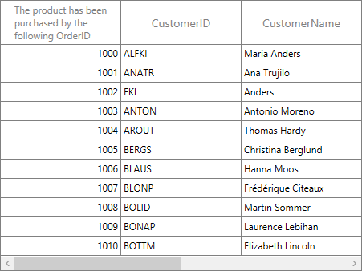
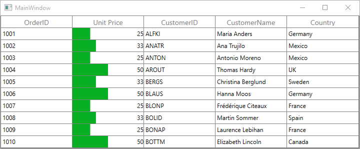
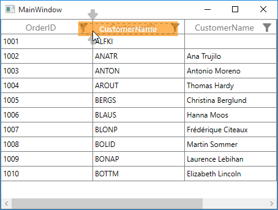
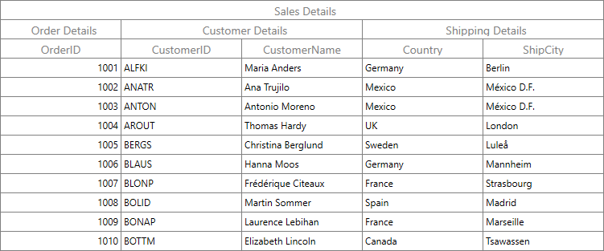
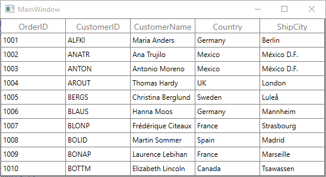
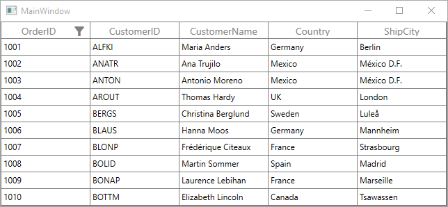

# Columns

SfDataGrid allows you to add or remove columns using [SfDataGrid.Columns](http://help.syncfusion.com/cr/cref_files/wpf/sfdatagrid/Syncfusion.SfGrid.WPF~Syncfusion.UI.Xaml.Grid.SfDataGrid~Columns.html) property. You can choose the columns to be added from built-in column types or you can create your own column and add to the `SfDataGrid.Columns`.

Below are the built-in column types supported in SfDataGrid. Each column has its own properties to handle different types of data.

<table>
<tr>
<th>
Column Type
</th>
<th>
Description
</th>
</tr>
<tr>
<td>
{{'[GridTextColumn](http://help.syncfusion.com/cr/cref_files/wpf/sfdatagrid/Syncfusion.SfGrid.WPF~Syncfusion.UI.Xaml.Grid.GridTextColumn.html)'| markdownify }}
</td>
<td>
Use to display the string data. 
</td>
</tr>
<tr>
<td>
{{'[GridNumericColumn](http://help.syncfusion.com/cr/cref_files/wpf/sfdatagrid/Syncfusion.SfGrid.WPF~Syncfusion.UI.Xaml.Grid.GridNumericColumn.html)'| markdownify }}
</td>
<td>
Use to display the numeric data.
</td>
</tr>
<tr>
<td>
{{'[GridCurrencyColumn](http://help.syncfusion.com/cr/cref_files/wpf/sfdatagrid/Syncfusion.SfGrid.WPF~Syncfusion.UI.Xaml.Grid.GridCurrencyColumn.html)'| markdownify }}
</td>
<td>
Use to display the currency value.
</td>
</tr>
<tr>
<td>
{{'[GridPercentColumn](http://help.syncfusion.com/cr/cref_files/wpf/sfdatagrid/Syncfusion.SfGrid.WPF~Syncfusion.UI.Xaml.Grid.GridPercentColumn.html)'| markdownify }}
</td>
<td>
Use to display the percent value
</td>
</tr>
<tr>
<td>
{{'[GridMaskColumn](http://help.syncfusion.com/cr/cref_files/wpf/sfdatagrid/Syncfusion.SfGrid.WPF~Syncfusion.UI.Xaml.Grid.GridMaskColumn.html)'| markdownify }}
</td>
<td>
Use to display the data to be masked.
</td>
</tr>
<tr>
<td>
{{'[GridTimeSpanColumn](http://help.syncfusion.com/cr/cref_files/wpf/sfdatagrid/Syncfusion.SfGrid.WPF~Syncfusion.UI.Xaml.Grid.GridTimeSpanColumn.html)'| markdownify }}
</td>
<td>
Use to display the time span value
</td>
</tr>
<tr>
<td>
{{'[GridDateTimeColumn](http://help.syncfusion.com/cr/cref_files/wpf/sfdatagrid/Syncfusion.SfGrid.WPF~Syncfusion.UI.Xaml.Grid.GridDateTimeColumn.html)'| markdownify }}
</td>
<td>
Use to display the date time value 
</td>
</tr>
<tr>
<td>
{{'[GridComboBoxColumn](http://help.syncfusion.com/cr/cref_files/wpf/sfdatagrid/Syncfusion.SfGrid.WPF~Syncfusion.UI.Xaml.Grid.GridComboBoxColumn.html)'| markdownify }}
</td>
<td>
Use to display the IEnumerable data using ComboBox.
</td>
</tr>
<tr>
<td>
{{'[GridCheckBoxColumn](http://help.syncfusion.com/cr/cref_files/wpf/sfdatagrid/Syncfusion.SfGrid.WPF~Syncfusion.UI.Xaml.Grid.GridCheckBoxColumn.html)'| markdownify }}
</td>
<td>
Use to display the boolean type data
</td>
</tr>
<tr>
<td>
{{'[GridImageColumn](http://help.syncfusion.com/cr/cref_files/wpf/sfdatagrid/Syncfusion.SfGrid.WPF~Syncfusion.UI.Xaml.Grid.GridImageColumn.html)'| markdownify }}
</td>
<td>
Use to display the image in each row.
</td>
</tr>
<tr>
<td>
{{'[GridHyperlinkColumn](http://help.syncfusion.com/cr/cref_files/wpf/sfdatagrid/Syncfusion.SfGrid.WPF~Syncfusion.UI.Xaml.Grid.GridHyperlinkColumn.html)'| markdownify }}
</td>
<td>
Use to display the Uri data
</td>
</tr>
<tr>
<td>
{{'[GridTemplateColumn](http://help.syncfusion.com/cr/cref_files/wpf/sfdatagrid/Syncfusion.SfGrid.WPF~Syncfusion.UI.Xaml.Grid.GridTemplateColumn.html)'| markdownify }}
</td>
<td>
Use to display the custom template-specified content.
</td>
</tr>
<tr>
<td>
{{'[GridUnboundColumn](http://help.syncfusion.com/cr/cref_files/wpf/sfdatagrid/Syncfusion.SfGrid.WPF~Syncfusion.UI.Xaml.Grid.GridUnBoundColumn.html)'| markdownify }}
</td>
<td>
Use to display custom information of each record.
</td>
</tr>
<tr>
<td>
{{'[GridMultiColumnDropDownList](http://help.syncfusion.com/cr/cref_files/wpf/sfdatagrid/Syncfusion.SfGrid.WPF~Syncfusion.UI.Xaml.Grid.GridMultiColumnDropDownList.html)'| markdownify }}
</td>
<td>
Use to display the IEnumerable data using SfMultiColumnDropdownControl.
</td>
</tr>
</table>

## Defining Columns

You can let the SfDataGrid to create columns or you can manually define columns to be displayed. Below sections explains both ways, 

1. Automatically generating columns
2. Manually define columns

### Automatically generating columns

The automatic column generation based on properties of data object can be enabled or disabled by setting [SfDataGrid.AutoGenerateColumns](http://help.syncfusion.com/cr/cref_files/wpf/sfdatagrid/Syncfusion.SfGrid.WPF~Syncfusion.UI.Xaml.Grid.SfGridBase~AutoGenerateColumns.html). Default value is `true`. 

Columns are generated based on type of property. For example, [GridNumericColumn](http://help.syncfusion.com/cr/cref_files/wpf/sfdatagrid/Syncfusion.SfGrid.WPF~Syncfusion.UI.Xaml.Grid.GridNumericColumn.html) is added for `int` type property. Below are table shows data type and its column type. For remaining types, `GridTextColumn` will be added. 

<table>
<tr>
<th>
Data Type
</th>
<th>
Column
</th>
</tr>
<tr>
<td>
string, object, dynamic
</td>
<td>
GridTextColumn
</td>
</tr>
<tr>
<td>
int, float, double, decimal and also it’s nullable
</td>
<td>
GridNumericColumn
</td>
</tr>
<tr>
<td>
DateTime, DateTimeOffset and also it’s nullable
</td>
<td>
GridDateTimeColumn
</td>
</tr>
<tr>
<td>
Uri, Uri?
</td>
<td>
GridHyperLinkColumn
</td>
</tr>
<tr>
<td>
bool, bool?
</td>
<td>
GridCheckBoxColumn
</td>
</tr>
<tr>
<td>
TimeSpan, TimeSpan?
</td>
<td>
GridTimeSpanColumn
</td>
</tr>
</table>

N> The order of columns in the collection will determine the order of that they will appear in SfDataGrid.

#### AutoGenerateColumns with different modes

Column auto generation is controlled using [SfDataGrid.AutoGenerateColumnsMode](http://help.syncfusion.com/cr/cref_files/wpf/sfdatagrid/Syncfusion.SfGrid.WPF~Syncfusion.UI.Xaml.Grid.SfGridBase~AutoGenerateColumnsMode.html) property.

The `SfDataGrid.AutoGenerateColumnsMode` includes the following modes.

<table>
<tr>
<th>
Mode
</th>
<th>
Behavior
</th>
<th>
When ItemsSource changed
</th>
</tr>
<tr>
<td>
<code>Reset</code>
</td>
<td>
Generates the columns based on the properties defined in the underlying data object.
</td>
<td>
Keeps the columns added manually. 
Clears the columns which are auto generated before and creates new columns based on new ItemsSource.
</td>
</tr>
<tr>
<td>
<code>RetainOld</code>
</td>
<td>
Generates the columns based on the properties defined in the underlying data object if the columns are not defined explicitly. 
</td>
<td>
The same columns will be maintained when changing ItemsSource also. So filtering, sorting and grouping settings will be maintained.
</td>
</tr>
<tr>
<td>
<code>ResetAll</code>
</td>
<td>
Generates the columns based on the properties defined in the underlying data object.
</td>
<td>
Clear all the columns including the columns defined manually and creates new columns based on new ItemsSource.
</td>
</tr>
<tr>
<td>
<code>None</code>
</td>
<td>
Columns will not be generated.
</td>
<td>
Keeps old columns in DataGrid.Columns collection.
</td>
</tr>
</table>

#### Customize auto-generated columns

You can customize or cancel the generated column by handling [AutoGeneratingColumn](http://help.syncfusion.com/cr/cref_files/wpf/sfdatagrid/Syncfusion.SfGrid.WPF~Syncfusion.UI.Xaml.Grid.SfDataGrid~AutoGeneratingColumn_EV.html) event. `AutoGeneratingColumn` event occurs when the individual column is auto-generated for public and non-static property of underlying data object.



this.dataGrid.AutoGeneratingColumn += dataGrid_AutoGeneratingColumn;

void dataGrid_AutoGeneratingColumn(object sender, AutoGeneratingColumnArgs e)
{
}



[AutoGeneratingColumnArgs](http://help.syncfusion.com/cr/cref_files/wpf/sfdatagrid/Syncfusion.SfGrid.WPF~Syncfusion.UI.Xaml.Grid.AutoGeneratingColumnArgs.html) provides the information about the auto-generated column to the `AutoGeneratingColumn` event. [AutoGeneratingColumnArgs.Column](http://help.syncfusion.com/cr/cref_files/wpf/sfdatagrid/Syncfusion.SfGrid.WPF~Syncfusion.UI.Xaml.Grid.AutoGeneratingColumnArgs~Column.html) property returns the newly created column.

##### Cancel column generation for particular property

You can cancel the specific column adding to the DataGrid by handling `AutoGeneratingColumn` event.

In the below code, column generation for `OrderID` property is canceled by setting `Cancel` property to `true`. 



this.dataGrid.AutoGeneratingColumn += dataGrid_AutoGeneratingColumn;

void dataGrid_AutoGeneratingColumn(object sender, AutoGeneratingColumnArgs e)
{
    if (e.Column.MappingName == "OrderID")
        e.Cancel = true;
}



##### Changing column type

You can change the type of column adding to SfDataGrid by setting the instance of column you want to add in `AutoGeneratingColumn` event. 

In the below code, column type for `UnitPrice` property is changed to `GridTextColumn` by setting instance of GridTextColumn to `Column` property. 



this.dataGrid.AutoGeneratingColumn += dataGrid_AutoGeneratingColumn;

void dataGrid_AutoGeneratingColumn(object sender, AutoGeneratingColumnArgs e)
{
    if (e.Column.MappingName == "UnitPrice")
    {
        if (e.Column is GridNumericColumn)
        {
            e.Column = new GridTextColumn() { MappingName = "UnitPrice", HeaderText = "Unit Price" };
        }       
    }
}     



##### Changing property settings

You can change the column properties in `AutoGeneratingColumn` event handler. 



this.dataGrid.AutoGeneratingColumn += dataGrid_AutoGeneratingColumn;

void dataGrid_AutoGeneratingColumn(object sender, AutoGeneratingColumnArgs e)
{
    if(e.Column.MappingName=="OrderID")
    {
        e.Column.AllowEditing = false;
        e.Column.AllowSorting = true;
        e.Column.AllowFiltering = true;
        e.Column.AllowGrouping = false;
        e.Column.AllowFocus = true;
        e.Column.AllowResizing = false;
        e.Column.ColumnSizer = GridLengthUnitType.Auto;
        e.Column.AllowDragging = true;        
    }
}



#### Setting template to auto-generated column

You can set [GridColumn.HeaderTemplate](http://help.syncfusion.com/cr/cref_files/wpf/sfdatagrid/Syncfusion.SfGrid.WPF~Syncfusion.UI.Xaml.Grid.GridColumnBase~HeaderTemplate.html) and [GridColumn.CellTemplate](http://help.syncfusion.com/cr/cref_files/wpf/sfdatagrid/Syncfusion.SfGrid.WPF~Syncfusion.UI.Xaml.Grid.GridColumnBase~CellTemplate.html) properties for auto-generated column in `AutoGeneratingColumn` event handler. 



<Window.Resources>
    <DataTemplate x:Key="headerTemplate">
        <TextBlock Text="The product has been purchased by the following OrderID" TextWrapping="Wrap" />
    </DataTemplate>
</Window.Resources>


this.dataGrid.AutoGeneratingColumn += dataGrid_AutoGeneratingColumn;

void dataGrid_AutoGeneratingColumn(object sender, AutoGeneratingColumnArgs e)
{
    if (e.Column.MappingName == "OrderID")
    {
        e.Column.HeaderTemplate = this.FindResource("headerTemplate") as DataTemplate;
    }
}



Below screenshot shows the customized header template loaded on the header of OrderID column.

#### Data Annotations with AutoGenerateColumns

SfDataGrid support to generate the columns based on built-in [Data Annotation Attributes](https://msdn.microsoft.com/en-us/library/system.componentmodel.dataannotations(v=vs.95).aspx). Data Annotations ignored, when the `AutoGenerateColumns` is set to False.

##### Exclude column

You can skip the column generation using `AutoGenerateField` property or set the `Bindable` attribute to false.



[Display(AutoGenerateField = false, Description = "OrderID field is not generated in UI")]
public int OrderID
{
    get { return orderID; }
    set { orderID = value; }
}



##### Filtering

You can enable filtering automatically for the field using `Display.AutoGenerateFilter` property



[Display(AutoGenerateFilter = true, Description = "Filter enabled for CustomerID column")]
public string CustomerID
{
    get { return customerId; }
    set { customerId = value; }
}



##### Editing 

You can change the value of the property using `Editable` attribute.



[Editable(true)]
public string Country
{
    get { return country; }
    set { country = value; }
}



##### Change the HeaderText of column

You can customize header text of column using `Display.Name` property.



[Display(Name="Name of the Customer",Description="CustomerName is necessary for identification ")]
public string CustomerName
{
    get { return customerName; }
    set { customerName = value; }
}



##### Change the order of the columns

You can change the columns order using `DisplayAttribute.Order` property.



[Display(Order=0)]
public int OrderID
{
    get { return orderID; }
    set { orderID = value; }
}
[Display(Order=-1)]
public string CustomerID
{
    get { return customerId; }
    set { customerId = value; }
}



The OrderID and CustomerID column rearranged based on specified order.

##### Customizing data format 

You can customize the data format using `DataTypeAttribute.DataType` property.



[DataType(DataType.Currency)]        
public double  UnitPrice
{
    get { return unitPrice; }
    set { unitPrice = value; }
}



##### Setting read-only column

You can disable the editing for a column using `ReadOnly` attribute.



[ReadOnly(true)]
public string Country
{
    get { return country; }
    set { country = value; }
}



### Manually defining columns

SfDataGrid control allows you to define the columns manually by adding desired column to the [SfDataGrid.Columns](http://help.syncfusion.com/cr/cref_files/wpf/sfdatagrid/Syncfusion.SfGrid.WPF~Syncfusion.UI.Xaml.Grid.SfDataGrid~Columns.html) collection.



<syncfusion:SfDataGrid  x:Name="dataGrid"
                        AutoGenerateColumns="False"
                        ItemsSource="{Binding Orders}">
    <syncfusion:SfDataGrid.Columns>
        <syncfusion:GridTextColumn HeaderText="Order ID" MappingName="OrderID" />
        <syncfusion:GridTextColumn HeaderText="Customer ID" MappingName="CustomerID" />
        <syncfusion:GridTextColumn HeaderText="Customer Name" MappingName="CustomerName" />
        <syncfusion:GridTextColumn HeaderText="Country" MappingName="Country" />
        <syncfusion:GridNumericColumn HeaderText="Unit Price" MappingName="UnitPrice" />
    </syncfusion:SfDataGrid.Columns>
</syncfusion:SfDataGrid>


this.dataGrid.Columns.Add(new GridTextColumn() { HeaderText = "Order ID", MappingName = "OrderID" });
this.dataGrid.Columns.Add(new GridTextColumn() { HeaderText = "Customer ID", MappingName = "CustomerID" });
this.dataGrid.Columns.Add(new GridTextColumn() { HeaderText = "Customer Name", MappingName = "CustomerName" });
this.dataGrid.Columns.Add(new GridTextColumn() { HeaderText = "Country", MappingName = "Country" });
this.dataGrid.Columns.Add(new GridNumericColumn() { HeaderText = "Unit Price", MappingName = "UnitPrice" });             



You can refer more information about handling the column level operations for manually defined columns in Column types section.

## Column manipulation

You can get the columns (added or auto-generated) from [SfDataGrid.Columns](http://help.syncfusion.com/cr/cref_files/wpf/sfdatagrid/Syncfusion.SfGrid.WPF~Syncfusion.UI.Xaml.Grid.SfDataGrid~Columns.html) property.

### Adding column

You can add column at runtime by adding instance of column to `SfDataGrid.Columns` property.



this.dataGrid.Columns.Add(new GridTextColumn() { HeaderText = "Order ID", MappingName = "OrderID" });



### Accessing column

You can access the column through its column index or `GridColumn.MappingName` from the SfDataGrid.Columns collection.



GridColumn column = this.dataGrid.Columns[1];
//OR
GridColumn column = this.dataGrid.Columns["OrderID"];



### Clearing or Removing Column

You can remove all the columns by clearing the `SfDataGrid.Columns` property.



this.dataGrid.Columns.Clear();



You can remove a column using Remove and RemoveAt methods.



dataGrid.Columns.Remove(column);
//OR
dataGrid.Columns.RemoveAt(1);



You can also remove the column under one stacked column from StackedHeaderRow.



var childColumns = this.dataGrid.StackedHeaderRows[1].StackedColumns[0].ChildColumns.Split(',');
foreach (var name in childColumns)
{
    var column = dataGrid.Columns[name];
    if (column == null)
        continue;
    dataGrid.Columns.Remove(column);
}



## Resizing Columns

SfDataGrid allows to resize the columns like in excel by resizing column header. This can be enabled or disabled by setting [SfDataGrid.AllowResizingColumns](http://help.syncfusion.com/cr/cref_files/wpf/sfdatagrid/Syncfusion.SfGrid.WPF~Syncfusion.UI.Xaml.Grid.SfGridBase~AllowResizingColumns.html) or [GridColumn.AllowResizing](http://help.syncfusion.com/cr/cref_files/wpf/sfdatagrid/Syncfusion.SfGrid.WPF~Syncfusion.UI.Xaml.Grid.GridColumn~AllowResizing.html) property.

N> Resizing considers MinWidth and MaxWidth of column.



<syncfusion:SfDataGrid  x:Name="dataGrid"
                        AllowResizingColumns="True"
                        AutoGenerateColumns="True"
                        ItemsSource="{Binding Orders}" />



You can change the column width by click and dragging the resizing cursor at the edge of column header. The resizing cursor appears when you hover the grid line exists between two columns. 

### Hidden column resizing

SfDataGrid shows indication for hidden columns in column header and also allows end-users to resize the hidden columns when setting [SfDataGrid.AllowResizingHiddenColumns](http://help.syncfusion.com/cr/cref_files/wpf/sfdatagrid/Syncfusion.SfGrid.WPF~Syncfusion.UI.Xaml.Grid.SfGridBase~AllowResizingHiddenColumns.html) property to `true`.

### Disable resizing

You can cancel resizing of particular column by setting [GridColumn.AllowResizing](http://help.syncfusion.com/cr/cref_files/wpf/sfdatagrid/Syncfusion.SfGrid.WPF~Syncfusion.UI.Xaml.Grid.GridColumn~AllowResizing.html) property to `false`. In another way, you can cancel the resizing by handling [SfDataGrid.ResizingColumns](http://help.syncfusion.com/cr/cref_files/wpf/sfdatagrid/Syncfusion.SfGrid.WPF~Syncfusion.UI.Xaml.Grid.SfDataGrid~ResizingColumns_EV.html) event. The `ResizingColumns` event occurs when you start dragging by resizing cursor on headers.
[ResizingColumnsEventArgs](http://help.syncfusion.com/cr/cref_files/wpf/sfdatagrid/Syncfusion.SfGrid.WPF~Syncfusion.UI.Xaml.Grid.ResizingColumnsEventArgs.html) of `ResizingColumns` provides information about the columns’s index and width. 



this.dataGrid.ResizingColumns += dataGrid_ResizingColumns;

void dataGrid_ResizingColumns(object sender, ResizingColumnsEventArgs e)
{    
    if(e.ColumnIndex == 1)            
        e.Cancel = true;         
}



## Column drag and drop

You can allow end-users to rearrange the columns by drag and drop the column headers by setting [SfDataGrid.AllowDraggingColumns](http://help.syncfusion.com/cr/cref_files/wpf/sfdatagrid/Syncfusion.SfGrid.WPF~Syncfusion.UI.Xaml.Grid.SfGridBase~AllowDraggingColumns.html) to `true`.



<syncfusion:SfDataGrid  x:Name="dataGrid"
                        AllowDraggingColumns="True"
                        AutoGenerateColumns="True"
                        ItemsSource="{Binding Orders}" />



You can enable or disable dragging on particular column using [GridColumn.AllowDragging](http://help.syncfusion.com/cr/cref_files/wpf/sfdatagrid/Syncfusion.SfGrid.WPF~Syncfusion.UI.Xaml.Grid.GridColumn~AllowDragging.html) property.



<syncfusion:GridTextColumn  AllowDragging="False"
                            HeaderText="Order ID"
                            MappingName="OrderID" />



### Disable column reordering

You can cancel the particular column dragging by handling [SfDataGrid.QueryColumnDragging](http://help.syncfusion.com/cr/cref_files/wpf/sfdatagrid/Syncfusion.SfGrid.WPF~Syncfusion.UI.Xaml.Grid.SfDataGrid~QueryColumnDragging_EV.html). `QueryColumnDragging` event occurs when you start dragging the column header. [QueryColumnDraggingEventArgs](http://help.syncfusion.com/cr/cref_files/wpf/sfdatagrid/Syncfusion.SfGrid.WPF~Syncfusion.UI.Xaml.Grid.QueryColumnDraggingEventArgs.html) of `QueryColumnDragging` event provides information about the column triggered this event. 

`QueryColumnDraggingEventArgs.From` property returns the index of column triggered this event. `QueryColumnDraggingEventArgs.To` property returns the index where you try to drop the column. `QueryColumnDraggingEventArgs.Reason` returns column dragging details by [QueryColumnDraggingReason](http://help.syncfusion.com/cr/cref_files/wpf/sfdatagrid/Syncfusion.SfGrid.WPF~Syncfusion.UI.Xaml.Grid.QueryColumnDraggingReason.html).  



this.dataGrid.QueryColumnDragging += dataGrid_QueryColumnDragging;

void dataGrid_QueryColumnDragging(object sender, QueryColumnDraggingEventArgs e)
{
    var column = dataGrid.Columns[e.From];
    if (column.MappingName == "CustomerName" && e.Reason == QueryColumnDraggingReason.Dropping)
    {
        e.Cancel = true;
    }
}



### Drag and drop customization 

The drag-and-drop operations can be changed by overriding the virtual methods of [GridColumnDragDropController](http://help.syncfusion.com/cr/cref_files/wpf/sfdatagrid/Syncfusion.SfGrid.WPF~Syncfusion.UI.Xaml.Grid.GridColumnDragDropController.html) class and assigning it to `SfDataGrid.GridColumnDragDropController`. 



this.dataGrid.GridColumnDragDropController = new CustomDragDropController(dataGrid);

public class CustomDragDropController:GridColumnDragDropController
{
    public CustomDragDropController(SfDataGrid dataGrid): base(dataGrid)
    {
    }        

    //Returns whether the popup showed its header or not.
    public override bool CanShowPopup(GridColumn column)
    {
        return base.CanShowPopup(column);
    }

    //Get the corresponding GridRegion at a given point.
    public override GridRegion PointToGridRegion(System.Windows.Point point)
    {
        return base.PointToGridRegion(point);
    }

    //Occurs when the GridColumn.Hidden property value changed.
    protected override void OnColumnHiddenChanged(GridColumn column)
    {
        base.OnColumnHiddenChanged(column);
    }

    //Occurs when the popup content is created.
    protected override System.Windows.UIElement CreatePopupContent(GridColumn column)
    {
        return base.CreatePopupContent(column);
    }

    //Occurs when the popup content is dropped on DataGrid.
    protected override void PopupContentDroppedOnGrid(System.Windows.Point point)
    {
        base.PopupContentDroppedOnGrid(point);
    }

    //Occurs when the popup content is dropped on header row.
    protected override void PopupContentDroppedOnHeaderRow(int oldIndex, int newColumnIndex)
    {
        base.PopupContentDroppedOnHeaderRow(oldIndex, newColumnIndex);
    }

    //Occurs when the popup content is dropped.
    protected override void OnPopupContentDropped(System.Windows.Point point, System.Windows.Point pointOverGrid)
    {
        base.OnPopupContentDropped(point, pointOverGrid);
    }

    //Occurs when the popup content is dropped on GroupDropArea
    protected override void PopupContentDroppedOnGroupDropArea(GridColumn column)
    {
        base.PopupContentDroppedOnGroupDropArea(column);
    }

    //Occurs when the popup content position changed.
    protected override void OnPopupContentPositionChanged(double HorizontalDelta, double VerticalDelta, System.Windows.Point mousePoint, System.Windows.Point mousePointOverGrid)
    {
        base.OnPopupContentPositionChanged(HorizontalDelta, VerticalDelta, mousePoint, mousePointOverGrid);
    }
}



### Disabling drag & drop between frozen and non-frozen columns

By default, the columns re-ordering performed between any column regions of columns. You can cancel the dropping action between the frozen and non-frozen columns by handling [SfDataGrid.QueryColumnDragging](http://help.syncfusion.com/cr/cref_files/wpf/sfdatagrid/Syncfusion.SfGrid.WPF~Syncfusion.UI.Xaml.Grid.SfDataGrid~QueryColumnDragging_EV.html) event.



this.dataGrid.QueryColumnDragging += dataGrid_QueryColumnDragging;

void dataGrid_QueryColumnDragging(object sender, QueryColumnDraggingEventArgs e)
{    
    if (e.Reason == QueryColumnDraggingReason.Dropping)
    {
        var frozencolindex = this.dataGrid.FrozenColumnCount + this.dataGrid.ResolveToStartColumnIndex();

        if (e.From < frozencolindex && e.To > frozencolindex - 1)
            e.Cancel = true;
       
        if (e.From > frozencolindex && e.To < frozencolindex ||(e.From == frozencolindex && e.To < frozencolindex))
            e.Cancel = true;
    }
}



N> `FrozenColumnCount` and `FooterColumnCount` should be lesser than the number of Columns that can be displayed in View.

## Freezing Columns 

You can freeze the columns in view at the left and right side like in excel by setting [SfDataGrid.FrozenColumnCount](http://help.syncfusion.com/cr/cref_files/wpf/sfdatagrid/Syncfusion.SfGrid.WPF~Syncfusion.UI.Xaml.Grid.SfDataGrid~FrozenColumnCount.html) and [SfDataGrid.FooterColumnCount](http://help.syncfusion.com/cr/cref_files/wpf/sfdatagrid/Syncfusion.SfGrid.WPF~Syncfusion.UI.Xaml.Grid.SfDataGrid~FooterColumnCount.html) properties.



<syncfusion:SfDataGrid  x:Name="dataGrid"
                        AutoGenerateColumns="False"
                        FrozenColumnCount="2"
                        ItemsSource="{Binding Orders}"/>



## Stacked Headers

SfDataGrid supports additional unbound header rows known as `stacked header rows` that span across the DataGrid columns using [StackedHeaderRows](http://help.syncfusion.com/cr/cref_files/wpf/sfdatagrid/Syncfusion.SfGrid.WPF~Syncfusion.UI.Xaml.Grid.StackedHeaderRows.html). You can group one or more columns under each stacked header.

Each [StackedHeaderRow](http://help.syncfusion.com/cr/cref_files/wpf/sfdatagrid/Syncfusion.SfGrid.WPF~Syncfusion.UI.Xaml.Grid.StackedHeaderRow.html) contains the [StackedColumns](http://help.syncfusion.com/cr/cref_files/wpf/sfdatagrid/Syncfusion.SfGrid.WPF~Syncfusion.UI.Xaml.Grid.StackedHeaderRow~StackedColumns.html) where each [StackedColumn](http://help.syncfusion.com/cr/cref_files/wpf/sfdatagrid/Syncfusion.SfGrid.WPF~Syncfusion.UI.Xaml.Grid.StackedColumn.html) contains a number of child columns. `StackedColumn.ChildColumns` property returns the columns which are grouped under the stacked header row. `StackedColumn.HeaderText` returns the text that displays in stacked header row.



<syncfusion:SfDataGrid x:Name="dataGrid"         
                       ItemsSource="{Binding Orders}">
    <syncfusion:SfDataGrid.StackedHeaderRows>
        <syncfusion:StackedHeaderRow>
            <syncfusion:StackedHeaderRow.StackedColumns>
                <syncfusion:StackedColumn ChildColumns="OrderID,CustomerID,CustomerName,ShipCity,Country" HeaderText="Sales Details" />
            </syncfusion:StackedHeaderRow.StackedColumns>
        </syncfusion:StackedHeaderRow>
        <syncfusion:StackedHeaderRow>
            <syncfusion:StackedHeaderRow.StackedColumns>
                <syncfusion:StackedColumn ChildColumns="OrderID" HeaderText="Order Details" />
                <syncfusion:StackedColumn ChildColumns="CustomerID,CustomerName" HeaderText="Customer Details" />
                <syncfusion:StackedColumn ChildColumns="ShipCity,Country" HeaderText="Shipping Details" />
            </syncfusion:StackedHeaderRow.StackedColumns>
        </syncfusion:StackedHeaderRow>
    </syncfusion:SfDataGrid.StackedHeaderRows>
</syncfusion:SfDataGrid>


var stackedHeaderRow = new StackedHeaderRow();
stackedHeaderRow.StackedColumns.Add(new StackedColumn() { ChildColumns = "OrderID" + "," + "CustomerID" + "," + "CustomerName" + "," + "ShipCity" + "," + "Country", HeaderText = "Sales Details" });
dataGrid.StackedHeaderRows.Add(stackedHeaderRow);
            
var stackedHeaderRow1 = new StackedHeaderRow();
stackedHeaderRow1.StackedColumns.Add(new StackedColumn() { ChildColumns = "OrderID", HeaderText = "Order Details" });            
stackedHeaderRow1.StackedColumns.Add(new StackedColumn() { ChildColumns = "CustomerID" + "," + "CustomerName", HeaderText = "Customer Details" });
stackedHeaderRow1.StackedColumns.Add(new StackedColumn() { ChildColumns = "ShipCity" + "," + "Country", HeaderText = "Shipping Details" });
dataGrid.StackedHeaderRows.Add(stackedHeaderRow1);



You can also add the stacked headers using `GroupName` property of [Data Annotations Display attributes](https://msdn.microsoft.com/en-us/library/system.componentmodel.dataannotations.displayattribute.aspx). 



public class OrderInfo
{
    private int orderID;
    private string customerId;
    private string country;
    private string customerName;
    private string shippingCity;
        
    public int OrderID
    {
        get { return orderID; }
        set { orderID = value; }
    }

    [Display(GroupName = "Customer Details")]
    public string CustomerID
    {
        get { return customerId; }
        set { customerId = value; }
    }

    [Display(GroupName = "Customer Details")]        
    public string CustomerName
    {
        get { return customerName; }
        set { customerName = value; }
    }

    [Display(GroupName = "Shipping Details")]
    public string Country
    {
        get { return country; }
        set { country = value; }
    }

    [Display(GroupName = "Shipping Details")]
    public string ShipCity
    {
        get { return shippingCity; }
        set { shippingCity = value; }
    }
}



### Adding ChildColumns

You can add the child columns in particular stacked header directly.



var childcolumn = this.dataGrid.StackedHeaderRows[1].StackedColumns[0].ChildColumns;
            this.dataGrid.StackedHeaderRows[1].StackedColumns[0].ChildColumns = childcolumn + "," + "OrderDate" + "," + "Discount";



### Removing ChildColumns

Similarly, you can remove the child columns from particular stacked header directly.



var removingColumns = this.dataGrid.StackedHeaderRows[0].StackedColumns[0].ChildColumns.Split(',').ToList<string>();   
string childColumns = string.Empty;
foreach(var stackedColumnName in removingColumns.ToList())
{
    if (stackedColumnName.Equals("OrderID"))
    {
        removingColumns.Remove(stackedColumnName);
    }
    else
        childColumns = childColumns + stackedColumnName + ",";
}

this.dataGrid.StackedHeaderRows[0].StackedColumns[0].ChildColumns = childColumns;



### Changing stacked header row height

You can change the height of StackedHeaderRows by using [VisualContainer.RowHeights](http://help.syncfusion.com/cr/cref_files/wpf/sfdatagrid/Syncfusion.SfGrid.WPF~Syncfusion.UI.Xaml.Grid.VisualContainer~RowHeights.html) property.



using Syncfusion.UI.Xaml.Grid.Helpers;

var visualcontainer = dataGrid.GetVisualContainer();            
int count = dataGrid.StackedHeaderRows.Count;

for (int i = 0; i < count; i++)
{               
    visualcontainer.RowHeights[i] = 50;
}            
visualcontainer.InvalidateMeasure();



You can also change the height of stacked header rows using [SfDataGrid.QueryRowHeight](http://help.syncfusion.com/cr/cref_files/wpf/sfdatagrid/Syncfusion.SfGrid.WPF~Syncfusion.UI.Xaml.Grid.SfDataGrid~QueryRowHeight_EV.html) event.



using Syncfusion.UI.Xaml.Grid;

this.dataGrid.QueryRowHeight += dataGrid_QueryRowHeight;

void dataGrid_QueryRowHeight(object sender, Syncfusion.UI.Xaml.Grid.QueryRowHeightEventArgs e)
{
    if(e.RowIndex <this.dataGrid.GetHeaderIndex())
    {
        e.Height = 50;
        e.Handled = true;
    }
}



## Column Sizing

SfDataGrid allows you to set the column widths based on certain logic using [SfDataGrid.ColumnSizer](http://help.syncfusion.com/cr/cref_files/wpf/sfdatagrid/Syncfusion.SfGrid.WPF~Syncfusion.UI.Xaml.Grid.SfDataGrid~ColumnSizer.html) or [GridColumn.ColumnSizer](http://help.syncfusion.com/cr/cref_files/wpf/sfdatagrid/Syncfusion.SfGrid.WPF~Syncfusion.UI.Xaml.Grid.GridColumn~ColumnSizer.html) property. Below is the list of predefined column sizing options available.

<table>
<tr>
<th>
Type
</th>
<th>
Column width
</th>
</tr>
<tr>
<td>
<code>Star</code>
</td>
<td>
Divides the total width equally for columns. 
</td>
</tr>
<tr>
<td>
<code>Auto</code>
</td>
<td>
Calculates the width of column based on header and cell contents. So that header and cell content’s are not truncated.  
</td>
</tr>
<tr>
<td>
<code>AutoWithLastColumnFill</code>
</td>
<td>
Applies <code>GridLengthUnitType.Auto</code> width to all the columns except last column which is visible and the remaining width from total width of SfDataGird is set to last column.
</td>
</tr>
<tr>
<td>
<code>AutoLastColumnFill</code>
</td>
<td>
Applies <code>GridLengthUnitType.Auto</code> width to all the columns except last column which is visible and sets the maximum between last column auto spacing width and remaining width to last column.
</td>
</tr>
<tr>
<td>
<code>SizeToCells</code>
</td>
<td>
Calculates the width of column based on cell contents. So that cell content’s are not truncated.  
</td>
</tr>
<tr>
<td>
<code>SizeToHeader</code>
</td>
<td>
Calculates the width of column based on header content. So that header content is not truncated.  
</td>
</tr>
<tr>
<td>
<code>None</code>
</td>
<td>
Default column width or defined width set to column.
</td>
</tr>
</table>

N> ColumnSizer will not work when the column width defined explicitly. ColumnSizer calculates column width based on `MinWidth` and `MaxWidth` properties.

Below code, applies `GridLengthUnitType.Star` to equally set width for `SfDataGrid.Columns`.



<syncfusion:SfDataGrid  x:Name="dataGrid"
                        AutoGenerateColumns="True"
                        ColumnSizer="Star"
                        ItemsSource="{Binding Orders}" />



N> The `GridColumn.ColumnSizer` takes higher priority than the `SfDataGrid.ColumnSizer`.

### Refreshing ColumnSizer at runtime

You can refresh the `ColumnSizer` at runtime by calling [SfDataGrid.GridColumnSizer.Refresh](http://help.syncfusion.com/cr/cref_files/wpf/sfdatagrid/Syncfusion.SfGrid.WPF~Syncfusion.UI.Xaml.Grid.GridColumnSizer~Refresh().html) method.
SfDataGrid support to recalculates the column auto width by calling reset methods of `GridColumnSizer`. [GridColumnSizer.ResetAutoCalculationforAllColumns](http://help.syncfusion.com/cr/cref_files/wpf/sfdatagrid/Syncfusion.SfGrid.WPF~Syncfusion.UI.Xaml.Grid.GridColumnSizer~ResetAutoCalculationforAllColumns.html) method reset widths to all columns. [GridColumnSizer.ResetAutoCalculation](http://help.syncfusion.com/cr/cref_files/wpf/sfdatagrid/Syncfusion.SfGrid.WPF~Syncfusion.UI.Xaml.Grid.GridColumnSizer~ResetAutoCalculation.html) method reset the width to particular column.

N> The `GridColumnSizer.ResetAutoCalculationforAllColumns` or `GridColumnSizer.ResetAutoCalculation` methods applicable for Auto, AutoWithLastColumnFill, AutoLastColumnFill, SizeToCells types.

For example, you can refresh all the column’s width based on the cell contents of newly added records at runtime. 



var viewModel = this.dataGrid.DataContext as ViewModel;
viewModel.Orders.Add(new OrderInfo(11, "BLFKI", "Maria Joseph Anders"));

this.dataGrid.GridColumnSizer.ResetAutoCalculationforAllColumns();
this.dataGrid.GridColumnSizer.Refresh();             



### Resetting column width to apply ColumnSizer

When the width of the column is explicitly defined or column is resized, then column width is not changed based on `GridColumnSizer`. You can reset [GridColumn.Width](http://help.syncfusion.com/cr/cref_files/wpf/sfdatagrid/Syncfusion.SfGrid.WPF~Syncfusion.UI.Xaml.Grid.GridColumnBase~Width.html) by setting `double.NaN` to apply column width based on column sizer.



foreach (var column in dataGrid.Columns)
{
    if (!double.IsNaN(column.Width))
        column.Width = double.NaN;
}
this.dataGrid.GridColumnSizer.Refresh();             



### Customizing built-in column sizing logic

SfDataGrid process column sizing operations in [GridColumnSizer](http://help.syncfusion.com/cr/cref_files/wpf/sfdatagrid/Syncfusion.SfGrid.WPF~Syncfusion.UI.Xaml.Grid.GridColumnSizer.html) class. You can customize the column sizing operations by overriding `GridColumnSizer` and set it to `SfDataGrid.GridColumnSizer`.



this.dataGrid.GridColumnSizer = new GridColumnSizerExt(dataGrid);

public class GridColumnSizerExt:GridColumnSizer
{
    public GridColumnSizerExt(SfDataGrid dataGrid)
        :base(dataGrid)
    {

    }        
    // Calculate Width for column when ColumnSizer is SizeToCells.        
    protected override double CalculateCellWidth(GridColumn column, bool setWidth = true)
    {
        return base.CalculateCellWidth(column, setWidth);
    }
    //Calculate Width for the column when ColumnSizer is SizeToHeader
    protected override double CalculateHeaderWidth(GridColumn column, bool setWidth = true)
    {
        return base.CalculateHeaderWidth(column, setWidth);
    }
}



### Auto width calculation based on font settings

By default, the ColumnSizer calculates column’s width based on fixed `FontSize`, `FontFamily`, `Margin`,`SortIconWidth`, `FilterIconWidth`. You can change the calculation by customized settings.

#### Changing Sort and Filter Icon width

You can change the filter icon and sort icon widths for column width calculation by setting [GridColumnSizer.SortIconWidth](http://help.syncfusion.com/cr/cref_files/wpf/sfdatagrid/Syncfusion.SfGrid.WPF~Syncfusion.UI.Xaml.Grid.GridColumnSizer~SortIconWidth.html) and [GridColumnSizer.FilterIconWidth](http://help.syncfusion.com/cr/cref_files/wpf/sfdatagrid/Syncfusion.SfGrid.WPF~Syncfusion.UI.Xaml.Grid.GridColumnSizer~FilterIconWidth.html) properties.



dataGrid.GridColumnSizer.SortIconWidth = 20;
dataGrid.GridColumnSizer.FilterIconWidth = 20;



#### Changing Font settings for SfDataGrid

You can change the `font settings` for column width calculation by setting [GridColumnSizer.FontSize](http://help.syncfusion.com/cr/cref_files/wpf/sfdatagrid/Syncfusion.SfGrid.WPF~Syncfusion.UI.Xaml.Grid.GridColumnSizer~FontSize.html), [GridColumnSizer.FontFamily](http://help.syncfusion.com/cr/cref_files/wpf/sfdatagrid/Syncfusion.SfGrid.WPF~Syncfusion.UI.Xaml.Grid.GridColumnSizer~FontFamily.html) and [GridColumnSizer.Margin](http://help.syncfusion.com/cr/cref_files/wpf/sfdatagrid/Syncfusion.SfGrid.WPF~Syncfusion.UI.Xaml.Grid.GridColumnSizer~Margin.html) properties.  This settings will be considered for all columns.



this.dataGrid.GridColumnSizer.FontSize = 10.0;
this.dataGrid.GridColumnSizer.FontFamily = new FontFamily("TimesNewRoman");
this.dataGrid.GridColumnSizer.Margin = new Thickness(9, 3, 1, 3);



#### Changing Font settings for one Column

You can change the `font setting` for one column width calculation using [GridColumnSizer.SetFontFamily](http://help.syncfusion.com/cr/cref_files/wpf/sfdatagrid/Syncfusion.SfGrid.WPF~Syncfusion.UI.Xaml.Grid.GridColumnSizer~SetFontFamily.html), [GridColumnSizer.SetFontSize](http://help.syncfusion.com/cr/cref_files/wpf/sfdatagrid/Syncfusion.SfGrid.WPF~Syncfusion.UI.Xaml.Grid.GridColumnSizer~SetFontSize.html) and [GridColumnSizer.SetMargin](http://help.syncfusion.com/cr/cref_files/wpf/sfdatagrid/Syncfusion.SfGrid.WPF~Syncfusion.UI.Xaml.Grid.GridColumnSizer~SetMargin.html) static methods of `GridColumnSizer` to `GridColumn`. 



var gridColumn = this.dataGrid.Columns[0];
GridColumnSizer.SetFontFamily(gridColumn, new FontFamily("TimesNewRoman"));
GridColumnSizer.SetFontSize(gridColumn, 10.0);
GridColumnSizer.SetMargin(gridColumn, new Thickness(9, 3, 1, 3));



You can also change the `font setting` for one column width calculation using [GetFormattedText](http://help.syncfusion.com/cr/cref_files/wpf/sfdatagrid/Syncfusion.SfGrid.WPF~Syncfusion.UI.Xaml.Grid.GridColumnSizer~GetFormattedText.html) method.



this.dataGrid.GridColumnSizer = new ColumnSizerExt(this.dataGrid);

public class ColumnSizerExt : GridColumnSizer
{
    public ColumnSizerExt(SfDataGrid grid) : base(grid)
    {
    }

    protected override FormattedText GetFormattedText(GridColumn column, object record, string displaytext)
    {
        var formattedText = base.GetFormattedText(column, record, displaytext);
        if (column.MappingName.Equals("OrderID"))
        {            
            formattedText.SetFontFamily(new FontFamily("TimesNewRoman"));
            formattedText.SetFontSize(10);
        }
        return formattedText;
    }
}



### Star column sizer ratio support

You can customize the `ColumnSizer.Star` width calculation logic by overriding [SetStarWidth](http://help.syncfusion.com/cr/cref_files/wpf/sfdatagrid/Syncfusion.SfGrid.WPF~Syncfusion.UI.Xaml.Grid.GridColumnSizer~SetStarWidth.html) method of [GridColumnSizer](http://help.syncfusion.com/cr/cref_files/wpf/sfdatagrid/Syncfusion.SfGrid.WPF~Syncfusion.UI.Xaml.Grid.GridColumnSizer.html).

For example, you can calculate the column width, with specified ratios instead of dividing equal width for all columns in Star calculation using `ColumnRatio` attached property.



public static class StarRatio
{
    public static int GetColumnRatio(DependencyObject obj)
    {
        return (int)obj.GetValue(ColumnRatioProperty);
    }

    public static void SetColumnRatio(DependencyObject obj, int value)
    {
        obj.SetValue(ColumnRatioProperty, value);
    }

    public static readonly DependencyProperty ColumnRatioProperty = DependencyProperty.RegisterAttached("ColumnRatio", typeof(int), typeof(StarRatio), new PropertyMetadata(1, null));
}



Below code to define the star width calculation based on the `ColumnRatio`.



//Assign the customized GridColumnSizerExt to SfDataGrid.GridColumnSizer
this.dataGrid.GridColumnSizer = new GridColumnSizerExt(dataGrid);

public class GridColumnSizerExt : GridColumnSizer
{

    public GridColumnSizerExt(SfDataGrid grid)
        : base(grid)
    {

    }

    protected override void SetStarWidth(double remainingColumnWidth, IEnumerable<GridColumn> remainingColumns)
    {
        var removedColumn = new List<GridColumn>();
        var columns = remainingColumns.ToList();
        var totalRemainingStarValue = remainingColumnWidth;
        double removedWidth = 0;
        bool isremoved;

        while (columns.Count > 0)
        {
            isremoved = false;
            removedWidth = 0;
            var columnsCount = 0;

            columns.ForEach((col) =>
            {
                columnsCount += StarRatio.GetColumnRatio(col);
            });

            double starWidth = Math.Floor((totalRemainingStarValue / columnsCount));
            var column = columns.First();
            starWidth *= StarRatio.GetColumnRatio(column);
            double computedWidth = SetColumnWidth(column, starWidth);

            if (starWidth != computedWidth && starWidth > 0)
            {
                isremoved = true;
                columns.Remove(column);
                foreach (var remColumn in removedColumn)
                {
                    if (!columns.Contains(remColumn))
                    {
                        removedWidth += remColumn.ActualWidth;
                        columns.Add(remColumn);
                    }
                }
                removedColumn.Clear();
                totalRemainingStarValue += removedWidth;
            }

            totalRemainingStarValue = totalRemainingStarValue - computedWidth;

            if (!isremoved)
            {
                columns.Remove(column);
                if (!removedColumn.Contains(column))
                    removedColumn.Add(column);
            }
        }
    }
}}



Below code uses the `ColumnRatio` to apply the defined star width for each column.



<syncfusion:SfDataGrid x:Name="dataGrid"
                       ItemsSource="{Binding Orders}"  
                       ColumnSizer="Star"
                       AutoGenerateColumns="False">
  <syncfusion:SfDataGrid.Columns>;
        <syncfusion:GridTextColumn  HeaderText="Order ID"
                                    MappingName="OrderID"
                                    local:StarRatio.ColumnRatio="1" />
        <syncfusion:GridTextColumn  HeaderText="Customer ID"
                                    MappingName="CustomerID"
                                    local:StarRatio.ColumnRatio="2" />
        <syncfusion:GridTextColumn  HeaderText="Customer Name"
                                    MappingName="CustomerName"
                                    local:StarRatio.ColumnRatio="3" />
   </syncfusion:SfDataGrid.Columns>
</syncfusion:SfDataGrid>



### Change the width of GridComboBoxColumn based on it’s ItemsSource

By default, the `ColumnSizer` calculates auto width based on the column content. You can change the auto width calculation for [GridComboBoxColumn](http://help.syncfusion.com/cr/cref_files/wpf/sfdatagrid/Syncfusion.SfGrid.WPF~Syncfusion.UI.Xaml.Grid.GridComboBoxColumn.html) based on its items source by overriding the [CalculateCellWidth](http://help.syncfusion.com/cr/cref_files/wpf/sfdatagrid/Syncfusion.SfGrid.WPF~Syncfusion.UI.Xaml.Grid.GridColumnSizer~CalculateCellWidth.html) virtual method.

Below code creates `CustomColumnSizer` to change the width of `GridComboboxColumn` and set to `SfDataGrid.GridColumnSizer`.



this.dataGrid.GridColumnSizer = new CustomColumnSizer(this.dataGrid);

public class CustomColumnSizer:GridColumnSizer
{
    public CustomColumnSizer(SfDataGrid grid)
        : base(grid)
    {
    }
       
    protected override double CalculateCellWidth(GridColumn column, bool setWidth = true)
    {            
        if (column is GridComboBoxColumn)
        {                                
            double colWidth = double.MaxValue;                               
            var source = (column as GridComboBoxColumn).ItemsSource;                
            string maximumComboItemsText = string.Empty;                
            var clientSize = new Size(colWidth, DataGrid.RowHeight);                
            foreach (var comboItems in source)
           {
                string comboItemText = (string)comboItems;
                if (maximumComboItemsText.Length < comboItemText.Length)
                    maximumComboItemsText = comboItemText;                   
            }                
            var measureSize= MeasureText(clientSize,maximumComboItemsText,column,null,GridQueryBounds.Width);
            return measureSize.Width + SystemParameters.ScrollWidth;
        }                
        else
            return base.CalculateCellWidth(column, setWidth);
    }      
}      



## Binding column properties with ViewModel

SfDataGrid provides MVVM support for binding `GridColumn` properties with ViewModel properties
. 


public class ViewModel
{
    private bool _allowFiltering =true;
    public bool AllowFiltering
    {
        get { return _allowFiltering; }
        set { _allowFiltering = value; }
    }
}



Below code, binds the `ViewModel.AllowFiltering` property to `GridColumn.AllowFiltering` property.



<Window.DataContext>
    <local:ViewModel/>
</Window.DataContext>

<syncfusion:SfDataGrid x:Name="dataGrid" 
                       ItemsSource="{Binding Orders}"                                                                                       
                       AutoGenerateColumns="False">
    <syncfusion:SfDataGrid.Columns>
        <syncfusion:GridTextColumn MappingName="OrderID" AllowFiltering="{Binding AllowFiltering}"/>
    </syncfusion:SfDataGrid.Columns>
</syncfusion:SfDataGrid> 



