# Data Binding

This section explains DataBinding in SfDataGrid, different properties and event available to bind data to SfDataGrid.

### Overview

DataBinding is the master feature of the DataGrid. The DataGrid is bound to an external data source to display the data. DataGrid supports the data sources such as List, Observable Collection, and so on.

The following is the list of properties that supports to Data Binding in various ways.

SfDataGrid.ItemsSource: This Dependency property helps to bind the DataGrid with the collection of objects

SfDataGrid.IsDynamicItemsSource: This Dependency property helps to check whether the bounded items source is dynamic or not. Set this property when you load empty collection of dynamic type.

SfDataGrid.SourceType: This Dependency property decides the type of source collection that is bounded to ItemsSource. This helps to define the SourceType in the following use cases,

1. When you use Inheritance to make collection using derived class and set SourceType as type of Base Class, the Base class property is displayed in the Grid. When you have a collection with two types of object model which is derived form same base class and you can bind the collection to Grid by setting SourceType to to base class type.
2. When you use dynamic collection and set type as particular user defined class, then the properties are displayed in the Grid.

_Note: It is always not neccessary to set SourceType and IsDynamicItemsSource properties._

The following event is associated with Data Binding.

#### ItemsSourceChanged Event

This event rises when the data source for the Grid is changed by using the ItemsSource property. This event receives two arguments namely sender that handles SfDataGrid and GridItemsSourceChangedEventArgs as objects.

The GridItemsSourceChangedEventArgs object contains the following properties:

* OldItemsSource: Gets the value of old data source.
* NewItemsSource: Gets the value of new data source.

You can use this event when you want to handle operations after ItemsSource bound to Grid. You can access SfDataGrid.View property from this event. You can know more about View in the following section.

### View 

DataGrid has the View property of type ICollectionViewAdv interfacethat implements ICollectionView interface. View is responsible for maintain and manipulation data and other advanced operations like Sorting, Grouping, Filtering and etc. When you bind Collection to ItemsSource property of SfDataGrid, then View will be created and maintains the operations on Data such as Grouping, Filtering, Sorting, Insert, Delete, and Modification. Following are some important properties that can be used for various purposes.

_Note: DataGrid creates different types of views derived from ICollectionViewAdv interface based on ItemsSource._

#### _Property Table_

<table>
<tr>
<td>
Property</td><td>
Type</td><td>
Description</td></tr>
<tr>
<td>
Records</td><td>
IRecordsList</td><td>
Maintains the Records that are displayed in View when DataGrid is not Grouped.</td></tr>
<tr>
<td>
TopLevelGroup</td><td>
TopLevelGroup</td><td>
Maintains the Group information when DataGrid is Grouped.</td></tr>
<tr>
<td>
TopLevelGroup.DisplayElements</td><td>
GroupDisplayElements</td><td>
Maintains the Records and Group information that are displayed in View when DataGrid is Grouped.</td></tr>
<tr>
<td>
Filter</td><td>
Predicate&lt;object&gt;</td><td>
Get or sets the method that determines the data is suitable to be displayed in View. </td></tr>
<tr>
<td>
FilterPredicates</td><td>
ObservableCollection&lt;IFilterDefinition&gt;</td><td>
Maintains the FilterPredicates that are created while filtering using Filtering UI. </td></tr>
<tr>
<td>
Groups</td><td>
ReadOnlyObservableCollection&lt;object&gt;</td><td>
Maintains the top-level group information. It returns null value when there are no groups. </td></tr>
<tr>
<td>
GroupDescriptions</td><td>
ObservableCollection&lt;GroupDescription&gt;</td><td>
Maintains the GroupDescription collection information. It describes how the items in the collection are grouped in the view.</td></tr>
<tr>
<td>
SortDescriptions</td><td>
SortDescriptionCollection</td><td>
Maintains the SortDescription collection information. It describes how the items in the collection are sort in the view.</td></tr>
<tr>
<td>
SourceCollection</td><td>
IEnumerable</td><td>
Maintains the underlying source collection.</td></tr>
<tr>
<td>
TableSummaryRows</td><td>
ObservableCollection&lt;ISummaryRow&gt;</td><td>
Maintains the TableSummaryRows collection information. To know more about TableSummaries click here</td></tr>
<tr>
<td>
SummaryRows</td><td>
ObservableCollection&lt;ISummaryRow&gt;</td><td>
Maintains the SummaryRows collection information. To know more about summaries ClickHere</td></tr>
<tr>
<td>
CaptionSummaryRows</td><td>
ISummaryRow</td><td>
Maintains the CaptionSummaryRow information.To know more about CaptionSummaries ClickHere</td></tr>
</table>

The following events are associated with View.

#### RecordPropertyChanged

This event is rised when the DataModel property value is changed, if the DataModel implements the INotifyPropertyChanged interface. The event receives with two arguments namely sender that handles the DataModel and PropertyChangedEventArgs as object.

PropertyChangedEventArgs has below property,

PropertName – It denotes the PropertyName of the changed value.

#### CollectionChanged

This event is raised whenever that is some change in Records / DisplayElements collection. The event receives two arguments namely sender that handles View object and NotifyCollectionChangedEventArgs as object.

NotifyCollectionChangedEventArgs has below properties,

Action - It conatains the current action. (i.e) Add, Remove, Move, Replace, Reset.

NewItems-It conatins the list of new items involved in the change.

OldItems-It contains the list of old items affected by the Action.

NewStartingIndex-It contains the index at which the change occurred.

OldStartingIndex-It contains the index at which the Action occurred.

#### SourceCollectionChanged

This event is raised when you make changes in SourceCollection for example add or remove the collection. The event receives two arguments namely sender that handles GridQueryableCollectionViewWrapper object and NotifyCollectionChangedEventArgs as object.

NotifyCollectionChangedEventArgs has below properties,

Action - It conatains the current action. (i.e) Add, Remove, Move, Replace, Reset.

NewItems-It conatins the list of new items involved in the change.

OldItems-It contains the list of old items affected by the Action.

NewStartingIndex-It contains the index at which the change occurred.

OldStartingIndex-It contains the index at which the Action occurred.

The following is the methods that are associated with View which can be used to defer refresh the view.

#### _Method Table_

<table>
<tr>
<td>
Method Name</td><td>
Description</td></tr>
<tr>
<td>
DeferRefresh</td><td>
Enter the defer cycle so that you can perform all data operations in view and update once. </td></tr>
<tr>
<td>
BeginInit & EndInit</td><td>
When BeginInit method is called it suspends all the updates until EndInit method is called. You can perform all the updation with in these methods and update the view at once.</td></tr>
</table>

_Note: View has properties that already defined in SfDataGrid. It recommended setting those properties via SfDataGrid._

### Complex property Binding

DataGrid control supports to bind Complexproperties to its columns. You can bind complex properties with any level. You can bind more complex binding paths by using DisplayBinding (binding the Data Model in Non-Edit mode) and ValueBinding (binding the Data model in edit mode) properties present in GridColumn. When you set UseBindingValue property in GridColumn to ‘true’ then Sorting, Grouping and Filtering make use of Binding defined in GridColumn instead of reflection in manipulate data. You can set this property when you bind more complex property paths.

For example, OrderInfo class contains the property Customers of “Customer” class type. The Customer object contains two values: CustomerID and Country. You can define the GridColumns for these Complex properties in the “Property.PropertyName” format. 

The following code example illustrates how to create Complex property. For data collection use OrderInfoRepositiory.cs, file.



[CS]

public class OrderInfo

{

    int orderID;

    string customerId;

    string country;

    string customerName;

    string shippingCity;

    Customer customer= new Customer();

    public int OrderID

    {

        get { return orderID; }

        set { orderID = value; }

    }

    public string CustomerID

    {

        get { return customerId; }

        set { customerId = value; }

    }

    public string CustomerName

    {

        get { return customerName; }

        set { customerName = value; }

    }

    public string Country

    {

        get { return country; }

        set { country = value; }

    }

    public string ShipCity

    {

        get { return shippingCity; }

        set { shippingCity = value; }

    }

    public Customer Customers

    {

        get { return customer; }

        set { customer = value; }

    }

    public OrderInfo(int orderId, string customerName, string country, string

    customerId, string shipCity)

    {

        this.OrderID = orderId;

        this.CustomerName = customerName;

        this.Country = country;          

        this.CustomerID = customerId;

        this.Customers.CustomerID = customerId;

        this.Customers.Country = country;

        this.ShipCity = shipCity;

    }

}





[XAML]

<syncfusion:SfDataGrid AutoGenerateColumns="False"

                       ColumnSizer="SizeToHeader"

                       ItemsSource="{Binding OrderInfoCollection}">

    <syncfusion:SfDataGrid.Columns>

        <syncfusion:GridTextColumn MappingName="OrderID" />

        <syncfusion:GridTextColumn MappingName="Customers.CustomerID" />

        <syncfusion:GridTextColumn MappingName="Country" />

        <syncfusion:GridTextColumn MappingName="ShipCity" />

    </syncfusion:SfDataGrid.Columns>

</syncfusion:SfDataGrid>



Execute the above code to render the following output.

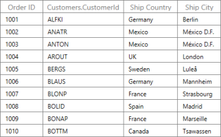

_DataGrid with Complex Property Binding_

_Note: DataGrid control allows you to set Grouping, Sorting, Filtering and Summaries for Complex property-bound columns. Complex property binding in SfDataGrid does not support LiveDataUpdationMode._

### Dynamic Object Binding

DataGrid control provides extensive support to bind the dynamic object data to DataGrid. For more information about dynamic objects, you can refer below msdn links,

* [http://msdn.microsoft.com/en-us/library/vstudio/dd264741.aspx](http://msdn.microsoft.com/en-us/library/vstudio/dd264741.aspx)
* [http://msdn.microsoft.com/en-us/library/dd264736.aspx](http://msdn.microsoft.com/en-us/library/dd264736.aspx)

_Note: Dynamic is not supported in Silverlight hence it is not supported by SfDataGrid also._

The following code example illustrates the dynamic object data creation.



[C#]

public class TestData : List<dynamic>

{

    public TestData()

    {

        string[] gender = new string[] { "Male", "Female" };

        string[] employeeName = new string[]

        {

            "Sean Jacobson",

            "Phyllis Allen",

            "Marvin Allen",

            "Michael Allen",

            "Cecil Allison",

            "Oscar Alpuerto",

            "Sandra Altamirano",

            "Selena Alvarad",

            "Emilio Alvaro",

            "Maxwell Amland",

            "Mae Anderson",

            "Ramona Antrim",

            "Sabria Appelbaum",

            "Hannah Arakawa",

            "Kyley Arbelaez",

        };

        Random r = new Random();

        for (int i = 1; i <= 15; i++)

        {

            dynamic newObj = new ExpandoObject();

            newObj.EmployeeName = employeeName[r.Next(0, 15)];

            newObj.EmployeeId = i + 1000;

            newObj.EmployeeSalary = i * 1000;

            newObj.Gender = gender[r.Next(0, 2)];

            newObj.Value = (double)i;

            Add(newObj);

        }

    }

} 



The following code example illustrates binding dynamic object data to DataGrid.



[XAML]

<Window.DataContext>

    <local:TestData />

</Window.DataContext>

<syncfusion:SfDataGrid x:Name="grid"

                       AutoGenerateColumns="True"

                       ItemsSource="{Binding}" />



The following screenshot displays the output.

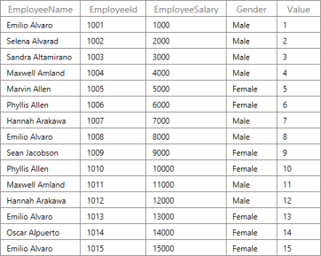

 _DataGrid with Dynamic Object Binding_

_Note: Dynamic Object binding in SfDataGrid does not support LiveDataUpdationMode._

### How To

#### Binding data from WCF service – How to bind and Save the data back to Database

This section explains you how to bind data from WCF Service step-by-step. To create a WCFDataService, you can add a Web project, create an Entity Data Model, and then create the service from the model.

#### To create the Web Project

1. In Visual Studio, select New Project.
2. Add New Project wizard opens.
3. Expand Visual C3 node, select Web node.
4. Now select “ASP.Net Web Application”.
5. Enter name in Name text box then click OK to create project.

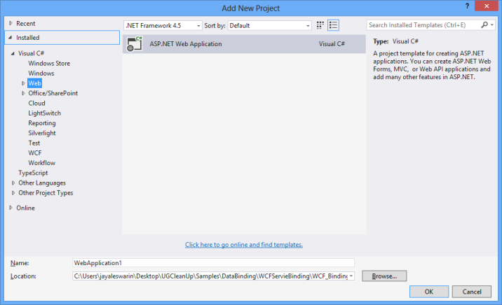

 _Add New Project Wizard_

##### To Create the Entity Data Model

1.To create Entity Data Model, you can add “ADO.Net Entity Data Model” to your web project.    
2.Right-click on your Web application.    
3.Select Add option.  
4.Now Select New Item.   
5.Add New Item wizard appears.    
6.Now Select “ADO.Net Entity Data Model” from the template.   
7.In the Name text box, provide “Northwind”.   
8.Now click Add button.   

    

  _Add New Item Wizard_  

9.When you click Add button, Entity Data Model Wizard opens.   
10.Select Generate from database.  
11.Then select Next button.  
 
   
 _Entity Data Model Wizard_  

12.Choose Your Data Connection page appears.     
13.You can select Northwind sample Database available in the drop-down list.   

    (OR)  

14.Select the NewConnection button to configure a new data connection. For more information, you can refer: [How to: Create Connections to SQL Server Databases](http://msdn.microsoft.com/en-us/library/s4yys16a.aspx).   
15.Select Next button to select tables for use.  
 
 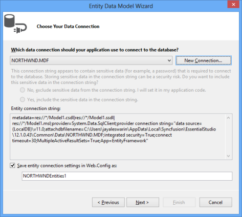  
 _Choose Your Data Connection Page_  

16.Choose Your Database Objects and settings page appears.   
17.Expand Table node.  
18.You can select multiple tables using check boxes.  
19.Now Check Order Details to select that.  

   
 _Choose Your Database Objects and settings Page_  

20.Now select Finish. The entity model diagram is displayed, and a “Northwind.edmx” file is added to your web project.  

##### To create the data service

1. Then you need to create web service for your application to use WCF service. 
2. Right-click on your web project, Select Add option.
3. Now select Add New Item.
4. In Add New Item Wizard, select Web node.
5. Select WCF Data Service 5.6.
6. In Name text box enter NorthwinbdService and then select Add button.

_Add New Item Wizard_

7.In the Code Editor, locate the first TODO: make changes as shown in the following code example.



[C#]

public class NorthwindSercvice : DataService<NORTHWNDEntities>

{

    // This method is called only once to initialize service-wide policies.

    public static void InitializeService(DataServiceConfiguration config)

    {

        // TODO: set rules to indicate which entity sets and service operations are visible, updatable, etc.

        // Examples:

        config.SetEntitySetAccessRule("*", EntitySetRights.AllRead);

        // config.SetServiceOperationAccessRule("MyServiceOperation", ServiceOperationRights.All);

        // config.DataServiceBehavior.MaxProtocolVersion = DataServiceProtocolVersion.V3;

    }

}


“NORTHWNDEntities” is from your Entity Data Model. 

8.This step is important to add service reference to your WPF application. On the menu bar, select Debug, Start Without Debugging to Execute the service. A browser window opens and the XML schema for the service is displayed.

##### To Create the Client Application

To create the ClientApplication, you can add a second project, add a service reference to the project, configure a data source, and create a user interface to display the data from the service.

1.You can create Client Application in your WPF application that is used as Startup project.   
2.Create new WPF application within same name space with Northwindditor as its name.   
3.Add Service Reference to your application.  
4.Right-click on your WPF application reference, select Add Service Reference.   
5.Select Discover button.   
6.List of services made in services panel are acquired.  
7.Select Go to add reference to application.  

   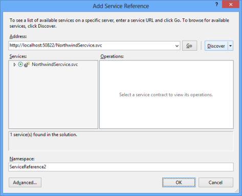  

   _Add Service Reference Wizard_  

8.Enable Data Binding to your service.   
9.On the menu bar, select View, Other Windows, and Data Sources.  
10.In the Data Sources window, select Add New Data Source button.  
11.On Choose a Data Source Type page of the Data Source Configuration Wizard, select Object, and then click the Next button.  
12.On Select the Data Objects page, expand the Northwindditor node, and then expand the Northwindditor.ServiceReference1 node.  
13.Select Order_Detail check box, and then click the Finish button.  
14.Create user interface with your SfDataGrid and set data context.   
15.Add require assemblies to your WPF application.  
16.Set as Startup project.   



[XAML]

<Window x:Class="NorthwindEditor.MainWindow"

        xmlns="http://schemas.microsoft.com/winfx/2006/xaml/presentation"

        xmlns:x="http://schemas.microsoft.com/winfx/2006/xaml"

        xmlns:local="clr-namespace:NorthwindEditor"

        xmlns:syncfusion="http://schemas.syncfusion.com/wpf"

        Title="MainWindow"

        Width="525"

        Height="350">

    <syncfusion:SfDataGrid x:Name="sfdatagrid" AllowEditing="True" />

</Window>



17.Set data context. 
18.In Solution Explorer, open the shortcut menu for the “NorthwindSercvice.svc” file and select View in Browser. Internet Explorer opens and the XML schema for the service is displayed.  
19.Copy the URL from the Internet Explorer address bar.  
20.Use this as http://localhost:50822/NorthwindService.svc/ your service URI.  
21.On the menu bar, select Debug, Start Debugging to execute the application. The customer information is displayed.  



[C#]

this.sfdatagrid.Loaded += sfdatagrid_Loaded;

this.sfdatagrid.AutoGenerateColumns = true;

void sfdatagrid_Loaded(object sender, RoutedEventArgs e)

{

    NORTHWNDEntities northwindEntities = new NORTHWNDEntities(new Uri("http://localhost:50822/NorthwindSercvice.svc/"));

    this.sfdatagrid.ItemsSource = northwindEntities.Order_Details;

}


22.The following screenshot displays the output.  

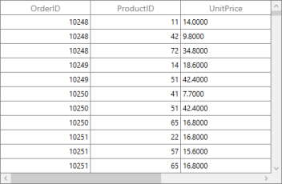

_DataGrid with Customer Deatails_

##### Save Back to Database

You can save the data back to DataBase. You can validate using RowValidating event and then do changes in DataBase. You can add the following code example in RowValidating event. 



[C#]

sfdatagrid.RowValidated += sfdatagrid_RowValidated;

void sfdatagrid_RowValidated(object sender, Syncfusion.UI.Xaml.Grid.RowValidatedEventArgs args)

{

    Order_Details newRecord = args.RowData as Order_Details;

    // Create the DataServiceContext using the service URI.

    NORTHWNDEntities context = new NORTHWNDEntities(new Uri("http://localhost:50822/NorthwindSercvice.svc/"));

    // Get a order to modify using the order ID. 

    Order_Details order = (from order in context.Order_Details

                            where order.OrderID == newRecord.OrderID

                            select order).First();

    // Change some property values.

    order.UnitPrice = newRecord.UnitPrice;

    order.Quantity = newRecord.Quantity;

    try

    {

        // Mark the customer as updated.

        context.UpdateObject(order);                                

        // Send the update to the data service.

        context.SaveChanges();

    }

    catch (DataServiceRequestException ex)

    {

        throw new ApplicationException(

            "An error occurred when saving changes.", ex);

    }

}


After adding, when you edit the value, it gets updated in DataBase.

#### Binding data from ADO.NET -  – How to bind and save the data back to Database

This section explains you how to bind data from ADO.Net data service to SfDataGrid. To use ADO.Net, you need a proper data base connection in SQL or in access or the DataBase that is supported by WPF application as your requirement.

##### To Create a WPF Application

1. In Visual Studio Select New Project from menu File > Add menu items
2. In Add New Project wizard, select WPF Application.
3. In Name text box enter name.
4. Select Add option to create project.
5. Add required assemblies to use SfDataGrid.

##### To Create Database with ADO.Net Provider.

1. On Tools Menu, Select Connect to Database option.
2. Add Connection wizard opens.

_Add Connection Wizard_

3. Make connection as per your availability. 
4. Change option to select your data source.

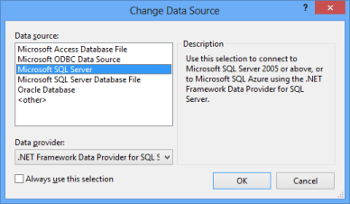

_Change Data Source page_

5. Refresh to select your Server name.

_Modify Connection Page_

6. Select your Database name

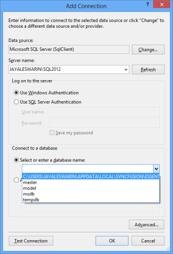

_Add Connection Wizard_

7. Now select Test Connection to check whether connection is successful or not.
8. When Test Connection is successful, you can create itemssource.
9. The Database is added to your server explorer. 

_Server Explorer_

10. Right-click on Database file, select properties. Copy the connection string.

##### To bind data to Grid

1. In MainWindow.cs file add System.Data.SqlClient. 
2. Here your SQL Client provider interacts with Database.
3. To open a connection, you can assign a task for provider.
4. It has SqlDataAdapter to populate data set and updates with DataSource.
5. The following code example illustrates the binded itemssource for a Grid. You can mention the connection string from Database file properties.



[XAML]

<Window x:Class="ADONetAccess.MainWindow"

        xmlns="http://schemas.microsoft.com/winfx/2006/xaml/presentation"

        xmlns:x="http://schemas.microsoft.com/winfx/2006/xaml"

        xmlns:local="clr-namespace:ADONetAccess"

        xmlns:syncfusion="http://schemas.syncfusion.com/wpf"

        Title="MainWindow"

        Width="525"

        Height="350">

    <syncfusion:SfDataGrid x:Name="sfdatagrid"

                           AllowEditing="True"

                           AutoGenerateColumns="True" />

</Window>




[C#]

public partial class MainWindow : Window

{

    DataSet ds = new DataSet();                

    SqlConnection connectionString = new SqlConnection("Data Source=JAYALESWARIN\\SQL2012;Initial Catalog=..\\APPDATA\\LOCAL\\SYNCFUSION\\ESSENTIALSTUDIO\\12.1.0.43\\COMMON\\DATA\\NORTHWND.MDF;Integrated Security=True");       

    SqlDataAdapter adapter= null;

    public MainWindow()

    {

        InitializeComponent();

        BindData();

        sfdatagrid.RowValidated += sfdatagrid_RowValidated;

    }

    private void BindData()

    {

        connectionString.Open();

        adapter = new SqlDataAdapter("Select * from Shippers ", connectionString);

        adapter.Fill(ds, "Shippers");

        sfdatagrid.ItemsSource = ds.Tables["Shippers"];

    }

}



The following screenshot displays the output.

_Data Grid with Binded Data from ADO.NET_

##### Save Back to Database

You can save the data back to Database. You can validate using RowValidating event and then do changes in Database. You can add the following code example in RowValidating event. 



[C#]

sfdatagrid.RowValidated += sfdatagrid_RowValidated;

void sfdatagrid_RowValidated(object sender, Syncfusion.UI.Xaml.Grid.RowValidatedEventArgs args)

{

    adapter.UpdateCommand = new SqlCommand("UPDATE Shippers SET CompanyName = @CompanyName " + "," + "Phone = @Phone " +

    "WHERE ShipperID = @ShipperID", connectionString);

    adapter.UpdateCommand.Parameters.Add("@CompanyName", SqlDbType.NVarChar, 40, "CompanyName");

    adapter.UpdateCommand.Parameters.Add("@Phone", SqlDbType.NVarChar, 24, "Phone");

    SqlParameter parameter = adapter.UpdateCommand.Parameters.Add("@ShipperID", SqlDbType.Int, 4);

    parameter.SourceColumn = "ShipperID";

    parameter.SourceVersion = DataRowVersion.Original;

    DataTable shippersTable = new DataTable();

    shippersTable.Clear();

    adapter.Fill(shippersTable);

    DataRow shippersRow = shippersTable.Rows[args.RowIndex - 1];

    shippersRow["CompanyName"] = (args.RowData as DataRowView).Row.ItemArray[1];

    shippersRow["Phone"] = (args.RowData as DataRowView).Row.ItemArray[2];

    adapter.Update(shippersTable);         

}



After adding, when you edit the value, it gets updated in Database.

#### Entity framework – How to bind and save the data back to Database

This section explains you how to bind data and save back to Database using Entityframework step-by-step. To use Entityframework, you can create a WPF application and require an ADO.Net Entity Data Model.

##### To Create a WPF Application

1. In Visual Studio Select New Project from menu File > Add menu items
2. In Add New Project wizard, select WPF Application.
3. In name text box enter name.
4. Choose Add option to create project.

##### To create Entity Data Model

1. Right-click on your application and select Add option.
2. Now select New Item. Add New Item Wizard opens.
3. From Data node, select “ADO.Net Entity Data Model”. 
4. In the name text box enter EntityBindingFramework and then select Add.

_Add New Item Wizard_

5. Configure Database wizard appears. 
6. Select Generate from database.
7. Select Next button.

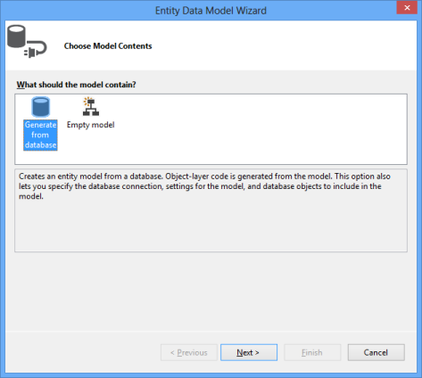

_Entity Data Model Wizard_

8. Choose Your Data Connection page appears. 
9. You can select Northwind sample Database available in the drop-down list. 

(OR)

10. Select the NewConnection button to configure a new data connection. For more information, you can refer: [How to: Create Connections to SQL Server Databases](http://msdn.microsoft.com/en-us/library/s4yys16a.aspx). 
11. Select Next button to select tables for use.

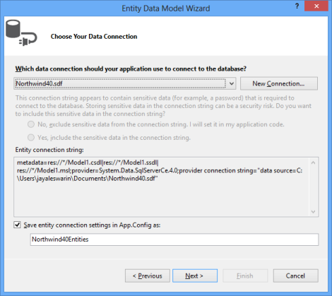

_Choose Your Data Connection Page_

12. Click New Connection.

_Connection Properties Wizard_

13. Click Change button to create your database. You can get list of available services.

_Change Data Source Wizard_

1. You can use Browse to select your Database. 
2. Click on Test Connection to make the connection successful.

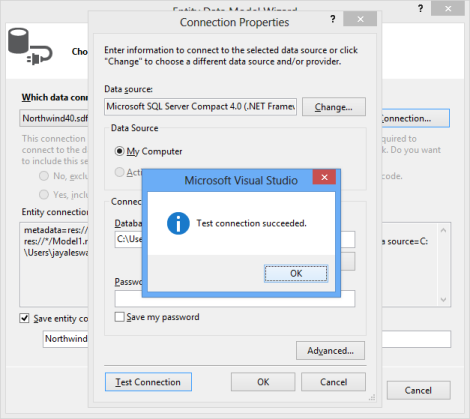

_Connection Properties Page_

3. Then click Next in the Wizard. Dialogue box that contains add Database file to your current project appears. Click Yes
4. Choose Your Database Objects and settings page appears. 
5. Expand Table node.
6. You can select multiple tables using check boxes.
7. Now Check Order Details to select that.

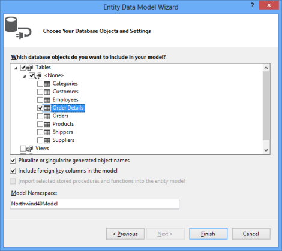

_Entity Data Model Wizard_

Here, Database connection using EntityFramework is completed. EntityBindingFramework.edmx file is added to your application, with your Entity diagram of Order_detail. 

##### To Create View Model



[C#]

public class ViewModel

{

    public ViewModel()

    {

        Northwind40Entities northWind = new Northwind40Entities();

        OrderDetails = (List<Order_Detail>)(from data in northWind.Order_Details

                        select data).ToList();

    }

    private List<Order_Detail> orderdetails;

    public List<Order_Detail> OrderDetails

    {

        get { return orderdetails; }

        set { orderdetails = value; }

    }

}



##### Binding ItemsSource to Grid

Add required assemblies to your WPF application to use SfDataGrid.



[XAML]

<Window x:Class="EntityBinding.MainWindow"

        xmlns="http://schemas.microsoft.com/winfx/2006/xaml/presentation"

        xmlns:x="http://schemas.microsoft.com/winfx/2006/xaml"

        xmlns:local="clr-namespace:EntityBinding"

        xmlns:syncfusion="http://schemas.syncfusion.com/wpf"

        Title="MainWindow"

        Width="525"

        Height="350">

    <Window.DataContext>

        <local:ViewModel />

    </Window.DataContext>

    <syncfusion:SfDataGrid x:Name="sfdatagrid"

                           AllowEditing="True"

                           AutoGenerateColumns="True"

                           ItemsSource="{Binding OrderDetails}" />

</Window>



   Now you can execute the code example to render the following output.

   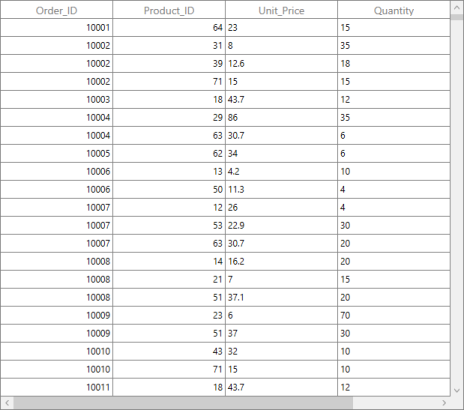

_Data Grid with Entity Framework_

##### Save Back to Database

You can save the data back to Database. You can validate using RowValidating event and then do changes in Database. You can add the following code example in RowValidating event. 



[C#]

sfdatagrid.RowValidated +=sfdatagrid_RowValidated;

void sfdatagrid_RowValidated(object sender, Syncfusion.UI.Xaml.Grid.RowValidatedEventArgs args)

{

    // TO Update Data

    Order_Detail newRecord = args.RowData as Order_Detail;

    Northwind40Entities northWind = new Northwind40Entities();

    Order_Detail order = northWind.Order_Details.First(i => i.Order_ID == newRecord.Order_ID);

    order.Order_ID = newRecord.Order_ID;

    order.Product_ID = newRecord.Product_ID;

    order.Quantity = newRecord.Quantity;

    order.Unit_Price = newRecord.Unit_Price;

    order.Discount = newRecord.Discount;

    northWind.Entry(order).State = System.Data.EntityState.Modified;

    northWind.SaveChanges();            

}


After adding, when you edit the value, it gets updated in Database.

#### Linq to SQL – How to bind and Save the data back to Database

This section explains you how to bind data using Linq to SQL step by step. To use Linq to SQL, you can create a WPF application with Linq to SQL Classes

##### To Create a WPF Application

1. In Visual Studio Select New Project from menu File > Add menu items
2. In Add New Project wizard, select WPF Application.
3. In Name text box enter name.
4. Select Add option to create project.

 

5.Right-click on your WPF application. 
6.Select Add option.    
7.Select Add New ItTo create Linq to SQL Classes  em, the Add New Item wizard opens.  
8.Select “LINQ to SQL Classes”   
9.Enter Northwind in Name text box.  
10.Then Select Add button.  

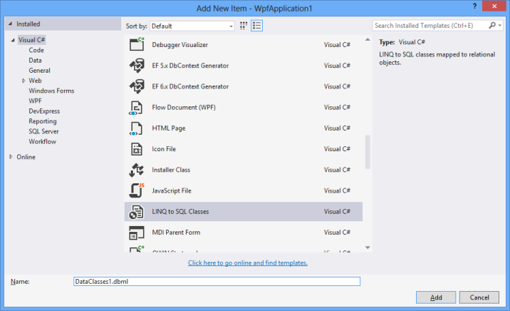

_Add New Item Wizard_

1. After adding this class to your project, create Northwind.dbml file that opens in a design view. 
2. Now you can drag the items.
3. Click Server Explorer.

_Design View_

* You can add new Database connection by clicking add icon button in Server explorer.  

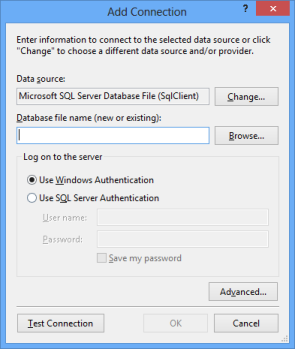

_Add Connection Wizard_

* You can change your DataSource.

_Change Data Source Page_

* Select your DataSource and Provider. You can refresh the AddConnection wizard to select your server name. 

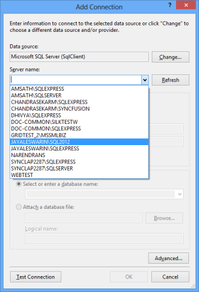

_Add Connection Wizard_

* Select your Database name.

_Add Connection Wizard_

* Check whether the connection is successfull or not.

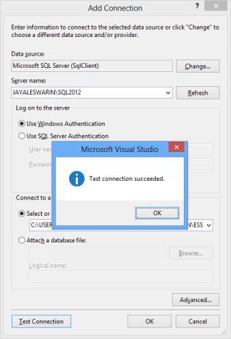

_Add Connection Wizard with Test connection succeeded pop up_

* When connection is successful, you can add table to use. 
* Then you can drag table to work space .dbml from server explorer. Drag Shippers table to design view.

_Server Explorer_

* After you drop the table to Northwind.dbml you can get a Entity model diagram of that table.

##### To Create a View Model



[C#]

public class ViewModel

{

    public ViewModel()

    {

        NorthwindDataContext northWind = new NorthwindDataContext();

        shippers = (from data in northWind.Shippers

                    select data).ToList();

    }

    private List<Shipper> shippers;

    public List<Shipper> Shippers

    {

        get { return shippers; }

        set { shippers = value; }

    }

}


NorthwindDataContext is from Northwind.Designer.cs file (it is from the file that is added with Linq to SQL). Shippers are selected table from Database. 

##### Binding ItemsSource

1. You can design your user interface with SfDataGrid.
2. Add required assemblies to your application. 



[XAML]

<Window x:Class="LinqToSql.MainWindow"

        xmlns="http://schemas.microsoft.com/winfx/2006/xaml/presentation"

        xmlns:x="http://schemas.microsoft.com/winfx/2006/xaml"

        xmlns:local="clr-namespace:LinqToSql"

        xmlns:syncfusion="http://schemas.syncfusion.com/wpf"

        Title="MainWindow"

        Width="525"

        Height="350">

    <Window.DataContext>

        <local:ViewModel />

    </Window.DataContext>

    <syncfusion:SfDataGrid x:Name="sfdatagrid"

                           AllowEditing="True"

                           AutoGenerateColumns="True"

                           ItemsSource="{Binding Shippers}" />

</Window>



3.The following screenshot displays the output.

_Data Grid with Data from Linq to SQL_

##### Save Back to Database

You can save the data back to Database. You can validate using RowValidating event and then do changes in Database. You can add the following code example in RowValidating event. 



[C#]

sfdatagrid.RowValidated += sfdatagrid_RowValidated;

void sfdatagrid_RowValidated(object sender, Syncfusion.UI.Xaml.Grid.RowValidatedEventArgs args)

{           

    NorthwindDataContext northWind = new NorthwindDataContext();

    Shipper newRecord = args.RowData as Shipper;

    Shipper shipper = (from data in northWind.Shippers

                            where data.ShipperID == newRecord.ShipperID

                            select data).First() as Shipper;

    shipper.CompanyName = newRecord.CompanyName;

    shipper.Phone = newRecord.Phone;

    northWind.SubmitChanges();                       

}



After adding, when you edit the value, it gets updated in Database.