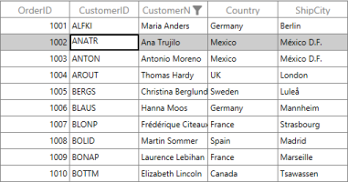
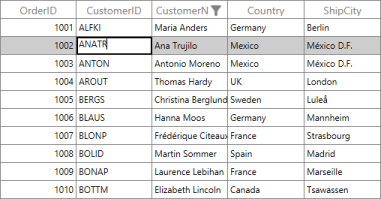
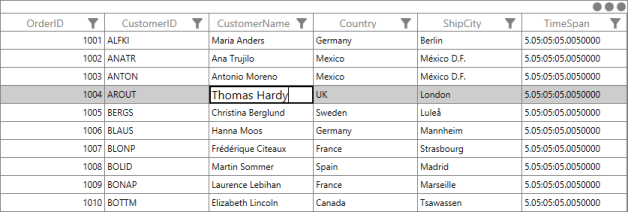

# Editing

This section explains you about editing on data, events and properties that participates in editing. DataGrid is intended for both displaying and modifying the data from the data source. 

## Overview

When you set AllowEditing to ‘True’, you can edit the current cell in the DataGrid. In Edit Mode, you can commit the changes by pressing the Enter or Tab key, or by just clicking outside the current cell.  You can also revert back to its original value by pressing the ESC key.



<syncfusion:SfDataGrid x:Name="grid"

                       AllowEditing="True"

                       AutoGenerateColumns="False"

                       ColumnSizer="Star"

                       ItemsSource="{Binding OrdersListDetails}"

                       NavigationMode="Cell" />





sfdatagrid.AllowEditing = true;


DataGrid with AllowEditing set to ‘True’
{:.caption}
N> It is mandatory to set the NavigationMode to Cell to enable current cell navigation and editing in the DataGrid control.

You are also allowed to control the behavior when the current cell is allowed to enter into Edit Mode by using the EditTriggers property. EditTriggers include the following two modes:

* OnTap - When EditTriggers is set as OnTap, the GridCell enters into Edit Mode when you single tap the application.
* OnDoubleTap - When EditTriggers is set as OnDoubleTap, the GridCell enters into Edit Mode when you double tap the application.

N> You can switch between Edit Mode and View Mode by pressing the F2 key.

The DataGrid control also provides the following properties in Grid Columns to support editing.

Editing property table

<table>
<tr>
<th>
Property</th><th>
Type</th><th>
Description</td><td>
Default Value</td></tr>
<tr>
<td>
SfDataGrid.AllowEditing</td><td>
Boolean</td><td>
This property specifies whether the appication is editable or not.</td><td>
False</td></tr>
<tr>
<td>
SfDataGrid.AllowFocus</td><td>
Boolean</td><td>
Gets or sets a value indicating whether the Grid Cell is focusable or not.</td><td>
True</td></tr>
</table>

When SfDataGrid.AllowFocus is set to ‘false’, neither the current cell nor the selection is allowed for the GridColumn. The cells are not editable in the specified GridColumn, even when SfDataGrid.AllowEditing is set to ‘true’. In following code example AllowFocus is set to ‘false’ for OrderID column.



<Window x:Class="SimpleApplication.MainWindow"

        xmlns="http://schemas.microsoft.com/winfx/2006/xaml/presentation"

        xmlns:x="http://schemas.microsoft.com/winfx/2006/xaml"

        xmlns:local="clr-namespace:SimpleApplication"

        xmlns:syncfusion="http://schemas.syncfusion.com/wpf"

        Title="MainWindow"

        Width="525"

        Height="350">

    <Window.DataContext>

        <local:OrderInfoRepositiory />

    </Window.DataContext>

    <syncfusion:SfDataGrid x:Name="sfdatagrid"

                           AllowEditing="True"

                           AllowFiltering="True"

                           AutoGenerateColumns="True"

                           AutoGenerateColumnsMode="Reset"

                           ColumnSizer="Star"

                           ItemsSource="{Binding OrderInfoCollection}">

        <syncfusion:SfDataGrid.Columns>

            <syncfusion:GridTextColumn AllowFocus="False" MappingName="OrderID" />

        </syncfusion:SfDataGrid.Columns>

    </syncfusion:SfDataGrid>

</Window>


DataGrid with AllowFocus property set to ‘false’
{:.caption}
When you select OrderID column’s cell, it is not selected or edited. Since AllowFocus is set to ‘false’.

## EditorSelectionBehavior

EditorSelectionBehavior is dependency property that is used to set selection for EditElement. It decides whether to select all content from UIElement or to move cursor to last position. Available values are

* SelectAll (Default)
* MoveLast.

The following code example illustrates the selection behavior while editing. 



<syncfusion:SfDataGrid x:Name="sfdatagrid"

                       AllowEditing="True"

                       AutoGenerateColumns="True"

                       ColumnSizer="Star"

                       EditorSelectionBehavior="MoveLast"

                       ItemsSource="{Binding OrderInfoCollection}"                                        

                       LiveDataUpdateMode="AllowDataShaping" />



The following screenshot illustrates the output.

DataGrid with Selection behavior while editing
{:.caption}
### Methods

Methods available under Editing are dependent on the current cell. DataGrid offers following public Methods in regard with Editing.

* SfDataGrid.SelectionController.BeginEdit: Causes the DataGrid to enter editing mode for the current cell, unless the DataGrid is already in editing mode.
* SfDataGrid.SelectionController.EndEdit: Causes the DataGrid to exit editing mode.

### Events

The edit events exist to support editing process. The following table provides the List of Events in regard to DataGrid for Editing. They occur when the current cell in the DataGrid is about to be edited or is being edited by you.

### CurrentCellActivating Event

This event occurs when the current cell is activated in the DataGrid. The CurrentCellActivating event handler receives two arguments, namely sender that handles SfDataGrid and CurrentCellActivatingEventArgs as objects. The CurrentCellActivatingEventArgs object contains the following properties:

* Cancel: When this property is set to ‘true’, the event is cancelled and the current cell is not activated.
* CurrentRowColumnIndex: Gets the value of CurrentRowColumnIndex.
* PreviousRowColumnIndex: Gets the value of PreviousRowColumnIndex.
* ActivationTrigger: Gets the value of the current cell that is activated.

### CurrentCellActivated Event

This event occurs when the current cell is activated. The event handler receives two arguments, namely sender that handles SfDataGrid and CurrentCellActivatedEventArgs as objects. The CurrentCellActivatedEventArgs object contains the following properties:

* CurrentRowColumnIndex: Gets the value of the CurrentRowColumnIndex.
* PreviousRowColumnIndex: Gets the value of the PreviousRowColumnIndex.
* ActivationTrigger: Gets the value of the current cell that is activated.

### CurrentCellBeginEdit Event

This Event occurs when the current cell enters into Edit Mode. The Event Handler receives the two arguments namely sender that handles SfDataGrid and CurrentCellBeginEditEventArgs as objects. The CurrentCellBeginEditEventArgs object contains the following properties:

* Cancel: When set to ‘true’, the event is cancelled and the current cell does not enter into edit mode. 
* RowColumnIndex: Gets the current row column index of the DataGrid.
* Column: Gets the Grid Column of the DataGrid.

### CurrentCellEndEdit Event

This event occurs when the current cell exits the Edit Mode. The event handler receives two arguments, namely sender that handles SfDataGrid and CurrentCellEndEditEventArgs as objects. A CurrentCellEndEditEventArgs object contains the following properties:

RowColumnIndex: Gets the value for the current row column index.

### CurrentCellValueChanged Event

This event occurs whenever a value changes in GridColumns that supports editing such as GridTextColumn, GridNumericColumn, GridCurrencyColumn, GridPercentColumn, GridCheckBoxColumn, GridDateTimeColumn, GridTimeSpanColumn, GridMaskColumn, and so on. The event handler receives two arguments namely sender that handles SfDataGrid and CurrentCellValueChangedEventArgs as objects.

### The CurrentCellValueChangedEventArgs object contains the following property:

RowColumnIndex: Gets the value of the current RowColumnIndex.

### CurrentCellDropDownSelectionChanged Event

This event occurs whenever a selected item is changed in DropDownColumns such as GridMultiColumnDropDownList and GridComboBoxColumn. The event handler receives two arguments namely sender that handles SfDataGrid and CurrentCellDropDownSelectionChangedEventArgs as objects.

The CurrentCellDropDownSelectionChangedEventArgs object contains the following properties:

* RowColumnIndex: Gets the value of the current RowColumnIndex.
* SelectedIndex: Gets the selected index from the DropDown control.
* SelectedItem: Gets the selected item from the DropDown control.

The following code example illustrates about this event.



sfdatagrid.CurrentCellBeginEdit += sfdatagrid_CurrentCellBeginEdit;

…

void sfdatagrid_CurrentCellBeginEdit(object sender, CurrentCellBeginEditEventArgs args)

{

    args.Cancel = true;

}




<syncfusion:SfDataGrid x:Name="sfdatagrid"

                       AllowEditing="True"

                       AutoGenerateColumns="True"

                       AutoGenerateColumnsMode="Reset"

                       ColumnSizer="Star"

                       CurrentCellBeginEdit="sfdatagrid_CurrentCellBeginEdit"

                       ItemsSource="{Binding OrderInfoCollection}">

    <syncfusion:SfDataGrid.Columns>

        <syncfusion:GridTextColumn AllowFocus="False" MappingName="OrderID" />

    </syncfusion:SfDataGrid.Columns>

</syncfusion:SfDataGrid>


Other than core properties, methods and events participate in editing.SfDataGrid has some properties and supports an interface to describe update time, update mode, and row level updating.

* GridColumn.ValueBinding.
* GridColumn.UpdateTrigger
* SfDataGrid.LiveDataUpdateMode
* IEditableObject.

The data that you edit in loaded EditElement is the bound value from the ValueBinding property. The following code example illustrates how to use it.



<syncfusion:SfDataGrid x:Name="sfdatagrid"

                       AllowEditing="True"

                       AutoGenerateColumns="True"

                       AutoGenerateColumnsMode="Reset"

                       ColumnSizer="Star"

                       CurrentCellBeginEdit="sfdatagrid_CurrentCellBeginEdit"

                       ItemsSource="{Binding OrderInfoCollection}">

    <syncfusion:SfDataGrid.Columns>

        <syncfusion:GridTextColumn DisplayBinding="{Binding OrderID}" ValueBinding="{Binding CustomerID}" />

    </syncfusion:SfDataGrid.Columns>

</syncfusion:SfDataGrid>



The following screenshot illustrates the output. The OrderID is View Mode and CustomerID value is in EditMode.

OrderID in View Mode and CustomerID value in Edit Mode
{:.caption}
You can update the edited values, like Default, PropertyChanged, LostFocus and Explicit. For more information about UpdateSourceTrigger you can [ClickHere](http://msdn.microsoft.com/en-us/library/system.windows.data.updatesourcetrigger(v=vs.110).aspx). In the following code example, whenever the value of CustomerID is changed instantly the underlying collection also changes. Since UpdateTrigger is given as PropertyChanged.



<syncfusion:SfDataGrid x:Name="sfdatagrid"

                       AllowEditing="True"

                       AutoGenerateColumns="True"

                       AutoGenerateColumnsMode="Reset"

                       ColumnSizer="Star"

                       CurrentCellBeginEdit="sfdatagrid_CurrentCellBeginEdit"

                       ItemsSource="{Binding OrderInfoCollection}">

    <syncfusion:SfDataGrid.Columns>

        <syncfusion:GridTextColumn ValueBinding="{Binding OrderID}" />

        <syncfusion:GridTextColumn MappingName="CustomerID" UpdateTrigger="PropertyChanged" />

    </syncfusion:SfDataGrid.Columns>

</syncfusion:SfDataGrid>



When you need an instant update that happened on DataSource to view, SfDataGrid provides a property LiveDataUpdateMode. AllowDataShaping is the one of enum value of LiveDataUpdateMode that is used to shape the data after editing. Add this code example and execute it.

1. Execute the code.
2. Sort any column.
3. Now edit the value to be sorted.

It gets arranged according to its sort direction.

The same way, you can achieve it for Editing with Grouping and Editing with Filtering.



<syncfusion:SfDataGrid x:Name="sfdatagrid"

                       AllowEditing="True"

                       AutoGenerateColumns="True"

                       ColumnSizer="Star"

                       ItemsSource="{Binding OrderInfoCollection}"                        

                       LiveDataUpdateMode="AllowDataShaping" />



## IEditableObject support

SfDataGrid supports to revert changes when you press Esc key at row level by implementing IEditableObject interface. The BeginEdit method stores the actual values before start edit. When you press Esc key, CancelEdit is called and it stores the old values to the corresponding filed. EndEdit method is called to commit the values.

For more information about IEditableObject you can [ClickHere](http://msdn.microsoft.com/en-us/library/system.componentmodel.ieditableobject(v=vs.110).aspx). The following code example illustrates how to override methods from IEditableObject interface. 



public class NotificationObject : INotifyPropertyChanged

{

    public void RaisePropertyChanged(string propName)

    {

        if (this.PropertyChanged != null)

            this.PropertyChanged(this, new PropertyChangedEventArgs(propName));

    }

    public event PropertyChangedEventHandler PropertyChanged;

}

public class Employee : NotificationObject, IEditableObject

{    

    private string _Name;   

    private int _ContactID;    

    private int _EmployeeID;

    protected Dictionary<string, object> BackUp()

    {

        var dict = new Dictionary<string, object>();

        var itemProperties = this.GetType().GetTypeInfo().DeclaredProperties;

        foreach (var pDescriptor in itemProperties)

        {

            if (pDescriptor.CanWrite)

                dict.Add(pDescriptor.Name, pDescriptor.GetValue(this));

        }

        return dict;

    }

    public string Name

    {

        get { return this._Name; }

        set

        {

            this._Name = value;

            this.RaisePropertyChanged("Name");

        }

    }    

    public int ContactID

    {

        get { return this._ContactID; }

        set

        {

            this._ContactID = value;

            this.RaisePropertyChanged("ContactID");

        }

    }

    private int _EmployeeID;

    public int EmployeeID

    {

        get { return this._EmployeeID; }

        set

        {

            this._EmployeeID = value;

            this.RaisePropertyChanged("EmployeeID");

        }

    }

    private Dictionary<string, object> storedValues;

    public void BeginEdit()

    {

        this.storedValues = this.BackUp();

    }

    public void CancelEdit()

    {

        if (this.storedValues == null)

            return;

        foreach (var item in this.storedValues)

        {

            var itemProperties = this.GetType().GetTypeInfo().DeclaredProperties;

            var pDesc = itemProperties.FirstOrDefault(p => p.Name == item.Key);

            if (pDesc != null)

                pDesc.SetValue(this, item.Value);

        }

    }

    public void EndEdit()

    {

        if (this.storedValues != null)

        {

            this.storedValues.Clear();

            this.storedValues = null;

        }

    }

}


## How To

### How to Programmatically Edit the Cell?

SfDataGrid allows you to edit the cell programmatically by calling BeginEdit() method. Initially you can set CurrentCell’s row and column index where you can make use of public structure of RowColumnIndex. 

Pass that created rowColumnIndex to MoveCurrentCell(RowColumnIndex rowColumnIndex) method. The method moves current cell to passed rowColumnIndex. You can call BeginEdit () method now to edit the cell in CurrentCellManager. 

The following code example illustrates that.



sfdatagrid.Loaded += sfdatagrid_Loaded;

…

void sfdatagrid_Loaded(object sender, RoutedEventArgs e)

{

    RowColumnIndex rowColumnIndex = new RowColumnIndex();

    rowColumnIndex.ColumnIndex = 2;

    rowColumnIndex.RowIndex = 2;

    sfdatagrid.MoveCurrentCell(rowColumnIndex);

    sfdatagrid.SelectionController.CurrentCellManager.BeginEdit();

}



The same way, you can call EndEdit () method to stop edting a cell.



void sfdatagrid_Loaded(object sender, RoutedEventArgs e)

{

    RowColumnIndex rowColumnIndex = new RowColumnIndex();

    rowColumnIndex.ColumnIndex = 2;

    rowColumnIndex.RowIndex = 2;

    sfdatagrid.MoveCurrentCell(rowColumnIndex);

    sfdatagrid.SelectionController.CurrentCellManager.EndEdit();

}



Both methods need current cell to starts or ends editing on cell.   

### Cancel Editing in Cells

In some cases, you may not want a particular cell to enter into Edit mode. To achieve this, you have to cancel the CurrentCellBeginEdit event to cancel cell editing.  

Consider a example where you do not want the cell (2, 2) to enter into Edit mode. After handling the event, check for the RowColumnIndex and then cancel the event. This is illustrated in the following code example.



<syncfusion:SfDataGrid x:Name="syncgrid" AutoGenerateColumns="True"

AllowEditing="True" CurrentCellBeginEdit="syncgrid_CurrentCellBeginEdit"

ItemsSource="{Binding ProductDetails}"/>





void syncgrid_CurrentCellBeginEdit(object sender, CurrentCellBeginEditEventArgs args)

{

//Cancels the editing for the RowColumnIndex (2,2).

if (args.RowColumnIndex == new RowColumnIndex(2,2))

args.Cancel = true;

}



### Update Changes made in a DataGrid Column to other Columns

The changes made in a cell can also be reflected in other Grid cells. This special-case scenario is handled by using the EndEdit event. In the EndEdit event, the RowColumnIndex of the edited cell is used to compute values for other items in the GridColumns.

In this scenario, consider the properties for discount and price from the data source. Whenever you change the value of the discount in the GridColumn, the price for the item also changes. The following code example shows how to get the record from the CurrentCellIndex and compute the Price property.



<syncfusion:SfDataGrid x:Name="syncgrid"

                       AllowEditing="True"

                       AutoGenerateColumns="True"

                       CurrentCellEndEdit="syncgrid_CurrentCellEndEdit"

                       ItemsSource="{Binding ProductDetails}" />





void syncgrid_CurrentCellEndEdit(object sender, CurrentCellEndEditEventArgs args)

{

var rowIndex = this.syncgrid.ResolveToRecordIndex(args.RowColumnIndex.RowIndex);

var record = (this.syncgrid.View.Records[rowIndex]).Data as ProductInfo;

//Check to see if you are editing the discount column.

if (args.RowColumnIndex.ColumnIndex == 4)

{

//Computes the price from the discount property.

if (record != null)

record.Price = record.Price - record.Discount;

}

}



### How to change FontSize for Edit element?

This topic explains you how to change the FontSize for EditElement. TextBlock is loaded in non-edit mode and TextBox is loaded in edit mode as content to the GridCell.

You can achieve this by applying style directly to TextBox. By defining corresponding TextBoxstyle inside the SfDataGrid.Resources, you can show the same font while cell is in edit mode. The following code example illustrates this,



<syncfusion:SfDataGrid.Resources>

    

</syncfusion:SfDataGrid.Resources>


You can see that in edit mode the font size is changed compared to display mode UIElement.

Font size of Editing element changed
{:.caption}