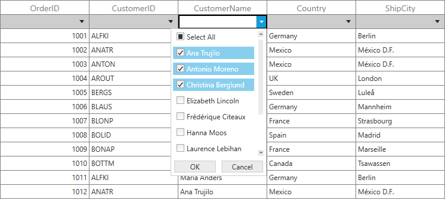
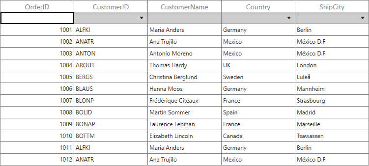
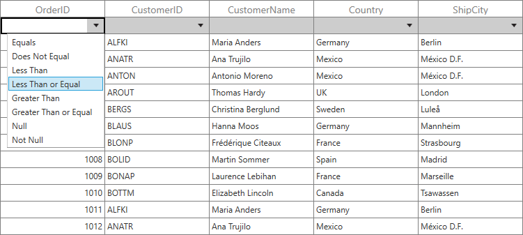
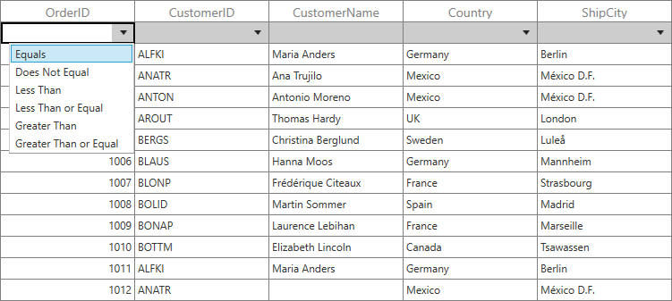
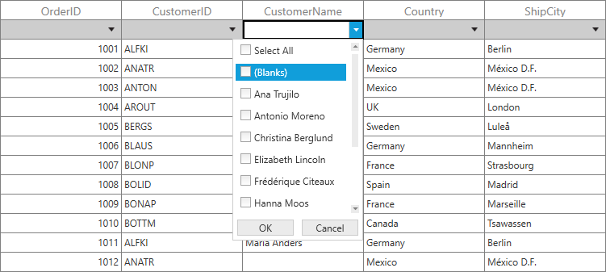
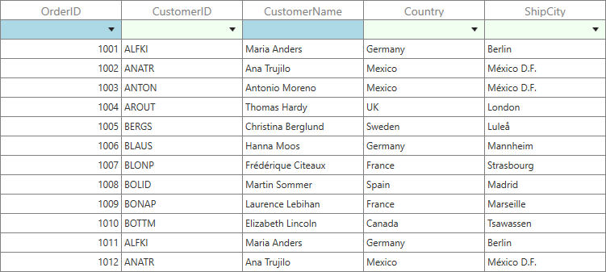
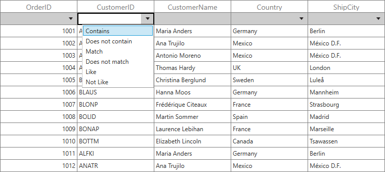
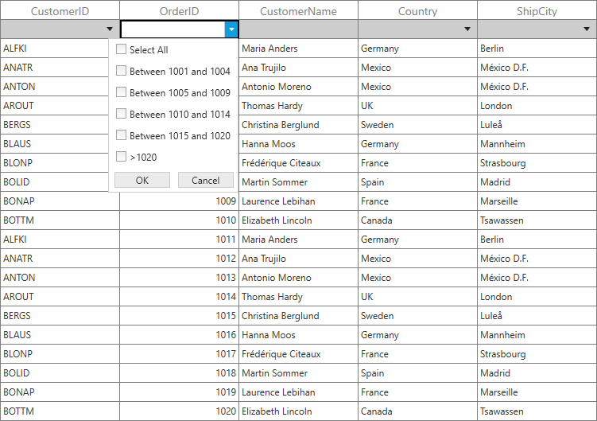
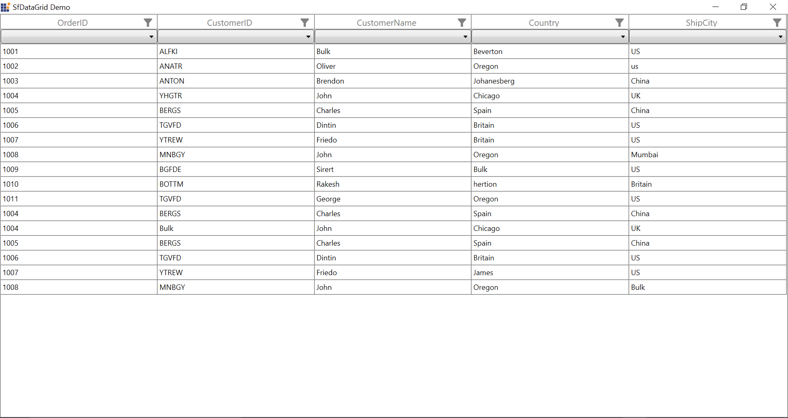

# Filter Row 
SfDataGrid provides built-in row (called FilterRow) to filter the records. You can enable the FilterRow by specifying the position where it should be displayed by setting [SfDataGrid.FilterRowPosition](http://help.syncfusion.com/cr/cref_files/wpf/Syncfusion.SfGrid.WPF~Syncfusion.UI.Xaml.Grid.FilterRowPosition.html) property.



<syncfusion:SfDataGrid x:Name="dataGrid"
                       FilterRowPosition="FixedTop"
                       AutoGenerateColumns="True"
                       ItemsSource="{Binding Orders}"/>


this.dataGrid.FilterRowPosition = FilterRowPosition.FixedTop;



You can get the row index of FilterRow by using the [SfDataGrid.GetFilterRowIndex ](http://help.syncfusion.com/cr/cref_files/wpf/Syncfusion.SfGrid.WPF~Syncfusion.UI.Xaml.Grid.GridIndexResolver~GetFilterRowIndex.html)method.



int filterRowIndex = this.dataGrid.GetFilterRowIndex();



You can check whether the specified row index is FilterRow index, by using [SfDataGrid.IsFilterRowIndex](http://help.syncfusion.com/cr/cref_files/wpf/Syncfusion.SfGrid.WPF~Syncfusion.UI.Xaml.Grid.GridIndexResolver~IsFilterRowIndex.html) helper method.



bool isFilterRowIndex = this.dataGrid.IsFilterRowIndex(1);



**Note:**The above helper methods are available in [Syncfusion.UI.Xaml.Grid.Helpers](http://help.syncfusion.com/cr/cref_files/wpf/Syncfusion.SfGrid.WPF~Syncfusion.UI.Xaml.Grid.Helpers_namespace.html) namespace

## Built-in Editors
By default, FilterRow loads the editors based on underlying property type to filter the data easily. You can change the default editors by using [GridColumn.FilterRowEditorType](http://help.syncfusion.com/cr/cref_files/wpf/Syncfusion.SfGrid.WPF~Syncfusion.UI.Xaml.Grid.GridColumn~FilterRowEditorType.html) property.


<syncfusion:GridTextColumn MappingName="CustomerName"
                           FilterRowEditorType="MultiSelectComboBox"/>


this.dataGrid.Columns[2].FilterRowEditorType = "MultiSelectComboBox";



Below are the built-in FilterRow editor types supported in SfDataGrid. 
<table>
<tr>
<td>
{{'**FilterRowEditor Type**'| markdownify }}
</td>
<td>
{{'**Editor Control**'| markdownify }}
</td>
<td>
{{'**Renderer**'| markdownify }}
</td>
<td>
{{'**Description** '| markdownify }}
</td>
</tr>
<tr>
<td>
TextBox
</td>
<td>
TextBox
</td>
<td>
{{'[GridFilterRowTextBoxRenderer](http://help.syncfusion.com/cr/cref_files/wpf/Syncfusion.SfGrid.WPF~Syncfusion.UI.Xaml.Grid.RowFilter.GridFilterRowTextBoxRenderer.html)'| markdownify }}
</td>
<td>
Used for filtering the string values.
</td>
</tr>
<tr>
<td>
Numeric
</td>
<td>
DoubleTextBox
</td>
<td>
{{'[GridFilterRowNumericRenderer](http://help.syncfusion.com/cr/cref_files/wpf/Syncfusion.SfGrid.WPF~Syncfusion.UI.Xaml.Grid.RowFilter.GridFilterRowNumericRenderer.html)'| markdownify }}
</td>
<td>
Used for filtering the numeric values.
</td>
</tr>
<tr>
<td>
ComboBox
</td>
<td>
ComboBoxAdv
</td>
<td>
{{'[GridFilterRowComboBoxRenderer](http://help.syncfusion.com/cr/cref_files/wpf/Syncfusion.SfGrid.WPF~Syncfusion.UI.Xaml.Grid.RowFilter.GridFilterRowComboBoxRenderer.html)'| markdownify }}
</td>
<td>
Used for filtering the specific value from the drop down.
</td>
</tr>
<tr>
<td>
MultiSelectComboBox
</td>
<td>
ComboBoxAdv
</td>
<td>
{{'[GridFilterRowMultiSelectRenderer](http://help.syncfusion.com/cr/cref_files/wpf/Syncfusion.SfGrid.WPF~Syncfusion.UI.Xaml.Grid.RowFilter.GridFilterRowMultiSelectRenderer.html)'| markdownify }}
</td>
<td>
Used for filtering the multiple values from the drop down.
</td>
</tr>
<tr>
<td>
CheckBox
</td>
<td>
CheckBox
</td>
<td>
{{'[GridFilterRowCheckBoxRenderer](http://help.syncfusion.com/cr/cref_files/wpf/Syncfusion.SfGrid.WPF~Syncfusion.UI.Xaml.Grid.RowFilter.GridFilterRowCheckBoxRenderer.html)'| markdownify }}
</td>
<td>
Used for filtering the Boolean values.

</td>
</tr>
<tr>
<td>
DateTime
</td>
<td>
DateTimeEdit
</td>
<td>
{{'[GridFilterRowDateTimeRenderer](http://help.syncfusion.com/cr/cref_files/wpf/Syncfusion.SfGrid.WPF~Syncfusion.UI.Xaml.Grid.RowFilter.GridFilterRowDateTimeRenderer.html)'| markdownify }}
</td>
<td>
Used for filtering the DateTime values.
</td>
</tr>
</table>

## Filter options
Based on the editor type, FilterRowCell displays the filter conditions in dropdown where you can easily switch between the conditions to filter the data. You can disable filter options by setting [GridColumn.FilterRowOptionsVisibility](http://help.syncfusion.com/cr/cref_files/wpf/Syncfusion.SfGrid.WPF~Syncfusion.UI.Xaml.Grid.GridColumn~FilterRowOptionsVisibility.html) property.



<syncfusion:GridNumericColumn MappingName="OrderID" 
                              FilterRowOptionsVisibility="Collapsed"
                              FilterRowEditorType="Numeric"/>


this.dataGrid.Columns[0].FilterRowOptionsVisibility = System.Windows.Visibility.Collapsed;



Below are the filter conditions supported by different filter row editors in SfDataGrid.
<table>
<tr>
<td>
{{'**Numeric Editor**'| markdownify }}
</td>
<td>
{{'**TextBox Editor**'| markdownify }}
</td>
<td>
{{'**DateTime Editor**'| markdownify }}
</td>
<td>
{{'**CheckBox Editor**'| markdownify }}
</td>
<td>
{{'**ComboBox, MultiSelectComboBox Editor**'| markdownify }}
</td>
</tr>
<tr>
<td>
When integer, double, short, decimal, byte or long are bound to the {{'[GridColumn](http://help.syncfusion.com/cr/cref_files/wpf/Syncfusion.SfGrid.WPF~Syncfusion.UI.Xaml.Grid.GridColumn.html)'| markdownify }}, the Numeric editor type are loaded in FilterRowCell.

</td>
<td>
When string value is bounded to the {{'[GridColumn](http://help.syncfusion.com/cr/cref_files/wpf/Syncfusion.SfGrid.WPF~Syncfusion.UI.Xaml.Grid.GridColumn.html)'| markdownify }} or the items is dynamic, then TextBox editor type are loaded in FilterRowCell.

</td>
<td>
When DateTime type is bounded to the {{'[GridColumn](http://help.syncfusion.com/cr/cref_files/wpf/Syncfusion.SfGrid.WPF~Syncfusion.UI.Xaml.Grid.GridColumn.html)'| markdownify }}, then DateTime editor is loaded in FilterRowCell.

</td>
<td>
When Boolean type is bounded to the {{'[GridColumn](http://help.syncfusion.com/cr/cref_files/wpf/Syncfusion.SfGrid.WPF~Syncfusion.UI.Xaml.Grid.GridColumn.html)'| markdownify }}, then CheckBoxEditor is loaded in FilterRowCell
</td>
<td>
If we need the ComboBox and MultiSelectComboBox we have to set the {{'[FilterRowEditorType](http://help.syncfusion.com/cr/cref_files/wpf/Syncfusion.SfGrid.WPF~Syncfusion.UI.Xaml.Grid.GridColumn~FilterRowEditorType.html)'| markdownify }}.

</td>
</tr>
<tr>
<td>
The default filter condition is Equals, the below filter conditions are available in numeric filter.
<ol>
<li>Equals</li>
<li>Does Not Equal</li> 
<li>Null</li> 
<li>Not Null</li> 
<li>Less Than</li>
<li>Less Than or Equal</li>
<li>Greater Than</li>
<li>Greater Than or Equal</li>
</ol>
</td>
<td>
The default filter condition is Begins With, the below filter conditions are available in text filter.
<ol>
<li>Equals</li>
<li>Does Not Equal</li> 
<li>Null</li> 
<li>Not Null</li> 
<li>Begins With</li>
<li>Ends With</li>
<li>Contains</li>
<li>Empty</li>
<li>Not Empty</li> 
</ol>
</td>
<td>
The default filter condition is Equals, the below filter conditions are available in date time filter.
<ol>
<li>Equals</li>
<li>Does Not Equal</li>
<li>Null</li>
<li>Not Null</li>
<li>Before</li>
<li>Before or Equal</li>
<li>After</li>
<li>After or Equal</li>
</ol>
</td>
<td>
Always equals filter condition will be applied for filtering the CheckBox value.
</td>
<td>
Always equals or not equals filter condition will be applied based on selected items count for filtering the items.
</td>
</tr>
</table>
You can change the default FilterRow condition for a corresponding column by using [GridColumn.FilterRowCondition](http://help.syncfusion.com/cr/cref_files/wpf/Syncfusion.SfGrid.WPF~Syncfusion.UI.Xaml.Grid.GridColumn~FilterRowCondition.html) property.


<syncfusion:GridNumericColumn MappingName="OrderID" 
                              FilterRowCondition="LessThanOrEqual"
                              FilterRowEditorType="Numeric"/>


this.dataGrid.Columns[0].FilterRowCondition = FilterRowCondition.LessThanOrEqual;



## Filtering null values
You can enable or disable filtering of null values by setting [GridColumn.AllowBlankFilters](http://help.syncfusion.com/cr/cref_files/wpf/Syncfusion.SfGrid.WPF~Syncfusion.UI.Xaml.Grid.GridColumn~AllowBlankFilters.html) property. The default value is `true`.
When null value filtering is enabled, the filter options loaded with two additional options (“Null” and “Not Null”) to filter the null values. ComboBox and MultiSelectComboBox editors, loads with “Blanks” item in drop down to filter the null values. 



<syncfusion:GridNumericColumn MappingName="OrderID" 
                              AllowBlankFilters="False"
                              FilterRowEditorType="Numeric"/>


this.dataGrid.Columns[0].AllowBlankFilters = false;





<syncfusion:GridTextColumn MappingName="CustomerName"
                           AllowBlankFilters="True"
                           FilterRowEditorType="MultiSelectComboBox"/>


this.dataGrid.Columns[2].AllowBlankFilters = true;



## Instant Filtering
By default, filters are applied to the columns when moving to other cells or pressing enter key. You can apply filter when typing or selecting in editor itself by setting [GridColumn.ImmediateUpdateColumnFilter](http://help.syncfusion.com/cr/cref_files/wpf/Syncfusion.SfGrid.WPF~Syncfusion.UI.Xaml.Grid.GridColumn~ImmediateUpdateColumnFilter.html) as `true`. 


<syncfusion:GridTextColumn MappingName="CustomerName"
                           FilterRowEditorType="MultiSelectComboBox"
                           ImmediateUpdateColumnFilter="True"/>


this.dataGrid.Columns[2].ImmediateUpdateColumnFilter = true;



## Disable filtering for a particular FilterRowCell
By default, you can filter the records by editing filter row cell. You can disable this editing by using [CurrentCellBeginEdit](http://help.syncfusion.com/cr/cref_files/wpf/Syncfusion.SfGrid.WPF~Syncfusion.UI.Xaml.Grid.SfDataGrid~CurrentCellBeginEdit_EV.html) event.


this.dataGrid.CurrentCellBeginEdit += dataGrid_CurrentCellBeginEdit;

void dataGrid_CurrentCellBeginEdit(object sender, CurrentCellBeginEditEventArgs args)
{

    //Cancel the editing for filter row cell in OrderID Column

    if (args.Column.MappingName == "OrderID" && dataGrid.IsFilterRowIndex(args.RowColumnIndex.RowIndex))
        args.Cancel = true;
}


You can collapse the FilterOption button using `FilterRowOptionsVisibility` property.


<syncfusion:GridNumericColumn MappingName="OrderID" 
                              FilterRowOptionsVisibility="Collapsed"/>


## Styling

### FilterRow style
You can customize the style of filter row by writing style of TargetType [FilterRowControl](http://help.syncfusion.com/cr/cref_files/wpf/Syncfusion.SfGrid.WPF~Syncfusion.UI.Xaml.Grid.RowFilter.FilterRowControl.html).


<Window.Resources>
    
</Window.Resources>



### FilterRowCell style
You can customize the style of filter row cell by writing style of TargetType [GridFilterRowCell](http://help.syncfusion.com/cr/cref_files/wpf/Syncfusion.SfGrid.WPF~Syncfusion.UI.Xaml.Grid.RowFilter.GridFilterRowCell.html).


<local:FilterRowCellStyleConverter x:Key="filterRowCellStyleConverter"/>



public class FilterRowCellStyleConverter : IValueConverter
{
    public object Convert(object value, Type targetType, object parameter, System.Globalization.CultureInfo culture)
    {
        var filterRowCell = value as GridFilterRowCell;
        if (filterRowCell == null) return null;

        if (filterRowCell.DataColumn.GridColumn.MappingName == "OrderID" ||
            filterRowCell.DataColumn.GridColumn.MappingName == "CustomerName")
            return new SolidColorBrush(Colors.LightBlue);

        return new SolidColorBrush(Colors.Honeydew);
    }

    public object ConvertBack(object value, Type targetType, object parameter, System.Globalization.CultureInfo culture)
    {
        return value;
    }
}



## Customizing filter row cell
You can customize the filter row cell by overriding the [GridFilterRowCell](http://help.syncfusion.com/cr/cref_files/wpf/Syncfusion.SfGrid.WPF~Syncfusion.UI.Xaml.Grid.RowFilter.GridFilterRowCell.html). You have to override the GetGridCell method in [RowGenerator](http://help.syncfusion.com/cr/cref_files/wpf/Syncfusion.SfGrid.WPF~Syncfusion.UI.Xaml.Grid.RowGenerator.html) to load the customized `GridFilterRowCell`.


public class GridFilterRowCellExt : GridFilterRowCell
{

    public GridFilterRowCellExt()
        : base()
    { }
}

public class CustomRowGenerator : RowGenerator
{

    public CustomRowGenerator(SfDataGrid dataGrid)
        : base(dataGrid)
    {
    }

    /// 

    /// Return the Custom FilterRowCell
    /// 

    /// <typeparam name="T"></typeparam>
    /// <returns>GridCell</returns>

    protected override GridCell GetGridCell<T>()
    {

        //If the Cell is FilterRowCell return custom FilterRowCell

        if (typeof(T) == typeof(GridFilterRowCell))
            return new GridFilterRowCellExt();
        return base.GetGridCell<GridCell>();
    }
}

public MainWindow()
{
    InitializeComponent();
    this.dataGrid.RowGenerator = new CustomRowGenerator(this.dataGrid);
}



### Customizing filter options for particular columns 
By default, TextBox editor will display the string related conditions like Begins With, Ends With, Contains, Empty, Not Empty filter row conditions in drop down. The below code shows how to display the custom filter row conditions in TextBox editor by overriding the [OpenFilterOptionPopup](http://help.syncfusion.com/cr/cref_files/wpf/Syncfusion.SfGrid.WPF~Syncfusion.UI.Xaml.Grid.RowFilter.GridFilterRowCell~OpenFilterOptionPopup.html) method in a [GridFilterRowCell](http://help.syncfusion.com/cr/cref_files/wpf/Syncfusion.SfGrid.WPF~Syncfusion.UI.Xaml.Grid.RowFilter.GridFilterRowCell.html) class.



this.dataGrid.RowGenerator = new CustomRowGenerator(this.dataGrid);

public class GridFilterRowCellExt : GridFilterRowCell
{

    public GridFilterRowCellExt()
        : base()
    { }

    /// 

    /// Opens the FilterOptionPopup with the FilterOptionList.
    /// 

 
    public override void OpenFilterOptionPopup()
    {
        base.OpenFilterOptionPopup();
 
        if (this.DataColumn.GridColumn.MappingName != "CustomerID")
            return;
        var list = this.OptionsList();
 
        if (list.Count > 0)
            this.FilterOptionsList.ItemsSource = list;
    }

    /// 

    /// Populates the FilterOption list which will loaded in FilterOptionPopup for ShipAddress.
    /// 

    /// <returns></returns>
 
    private new ObservableCollection<string> OptionsList()
    {
        var list = new ObservableCollection<string>();
        list.Add("Contains");
        list.Add("Does not contain");
        list.Add("Match");
        list.Add("Does not match");
        list.Add("Like");
        list.Add("Not Like");
        return list;
    }
}

public class CustomRowGenerator : RowGenerator
{
    public CustomRowGenerator(SfDataGrid dataGrid)
        : base(dataGrid)
    {
    }

    /// 

    /// Return the Custom FilterRowCell
    /// 

    /// <typeparam name="T"></typeparam>
    /// <returns>GridCell</returns>
 
    protected override GridCell GetGridCell<T>()
    {
 
        //If the Cell is FilterRowCell return custom FilterRowCell
 
        if (typeof(T) == typeof(GridFilterRowCell))
            return new GridFilterRowCellExt();
        return base.GetGridCell<GridCell>();
    }
}



## Customizing FilterRow Editors

### Customizing the FilterRow Renderer 
SfDataGrid allows you to customize the filter row renderer behavior by overriding the corresponding renderer associated with the filter row cell. Each renderer have a set of virtual methods for handling the filter row behaviors. You can also create new renderers instead of overriding the existing renderer. 
You can customize the default TextBox editor behavior by overriding `GridFilterRowTextBoxRenderer` class and add the custom renderer to [FilterRowCellRenderers](http://help.syncfusion.com/cr/cref_files/wpf/Syncfusion.SfGrid.WPF~Syncfusion.UI.Xaml.Grid.SfDataGrid~FilterRowCellRenderers.html).


<syncfusion:GridTextColumn MappingName="CustomerName"
                                                     FilterRowEditorType="TextBoxExt"/>


public class GridFilterRowTextBoxRendererExt : GridFilterRowTextBoxRenderer
{

    public GridFilterRowTextBoxRendererExt()
        : base()
    {
    }
}
    
public MainWindow()
{
    InitializeComponent();
    this.dataGrid.FilterRowCellRenderers.Add("TextBoxExt", new GridFilterRowTextBoxRendererExt());
}


### Filter based on numeric interval by using the MultiSelectComboBox filter
By default you can filter the multiple data in the column by using MultiSelectComboBox filter editor type, the below code shows how to filter the data based on range of numeric values by overriding the [ProcessMultipleFilters](http://help.syncfusion.com/cr/cref_files/wpf/Syncfusion.SfGrid.WPF~Syncfusion.UI.Xaml.Grid.RowFilter.GridFilterRowCellRenderer%602~ProcessMultipleFilters.html) method in [GridFilterRowComboBoxRenderer](http://help.syncfusion.com/cr/cref_files/wpf/Syncfusion.SfGrid.WPF~Syncfusion.UI.Xaml.Grid.RowFilter.GridFilterRowComboBoxRenderer.html) class.


<syncfusion:GridNumericColumn MappingName="OrderID" 
                              FilterRowOptionsVisibility="Collapsed"
                              NumberDecimalDigits="0"
                              FilterRowEditorType="ComboBoxExt"/>


this.dataGrid.FilterRowCellRenderers.Add("ComboBoxExt", new GridFilterRowComboBoxRendererExt());

public class GridFilterRowComboBoxRendererExt : GridFilterRowComboBoxRenderer, INotifyPropertyChanged
    {
        private List<string> numericComboBoxItems;

 
        public GridFilterRowComboBoxRendererExt()
            : base()
        {
            SetNumericComboBoxItemsList();
        }
             
        /// 

        /// Generate the Items for NumericComboBox
        /// 

        /// <returns></returns>
 
        public void SetNumericComboBoxItemsList()
        {
            numericComboBoxItems = new List<string>();
            numericComboBoxItems.Add("Between 1001 and 1004");
            numericComboBoxItems.Add("Between 1005 and 1009");
            numericComboBoxItems.Add("Between 1010 and 1014");
            numericComboBoxItems.Add("Between 1015 and 1020");
            numericComboBoxItems.Add(">1020");
        }

        /// 

        /// InitializeEditBinding based on our item, set the SelectedItem and set the ItemSource.
        /// 

        /// <param name="uiElement">Corresponding UIElement</param>
        /// <param name="dataColumn">Corresponding Column</param>

        protected override void InitializeEditBinding(Syncfusion.Windows.Tools.Controls.ComboBoxAdv uiElement, DataColumnBase dataColumn)
        {
            ObservableCollection<object> selItems = new ObservableCollection<object>();

                //Generate the items for FilterRow                 
                uiElement.ItemsSource = numericComboBoxItems;

                if (dataColumn.GridColumn.FilteredFrom == FilteredFrom.FilterRow && dataColumn.GridColumn.FilterPredicates.Count > 0)
                {

                    if (numericComboBoxItems != null)
                    {
                        numericComboBoxItems.ForEach(element =>
                        {

                            //Check if the filter is already applied or not, if applied means again add the filter
                            bool needToAdd = false;

                            switch (element)
                            {

                                case "Between 1001 and 1004":
                                    needToAdd = this.NeedToAdd(dataColumn.GridColumn.FilterPredicates, "1001");
                                    break;

                                case "Between 1005 and 1009":
                                    needToAdd = this.NeedToAdd(dataColumn.GridColumn.FilterPredicates, "1005");
                                    break;

                                case "Between 1010 and 1014":
                                    needToAdd = this.NeedToAdd(dataColumn.GridColumn.FilterPredicates, "1010");
                                    break;

                                case "Between 1015 and 1020":
                                    needToAdd = this.NeedToAdd(dataColumn.GridColumn.FilterPredicates, "1015");
                                    break;

                                case ">1020":
                                    needToAdd = this.NeedToAdd(dataColumn.GridColumn.FilterPredicates, "1020");
                                    break;
                            }

                            if (needToAdd)
                                selItems.Add(element);
                        });
                    }
                }
          
            if (selItems.Count > 0)
                uiElement.SelectedItems = selItems;

            else if (uiElement.SelectedItems != null)
                uiElement.SelectedItems = null;
            uiElement.AllowMultiSelect = true;
            uiElement.AllowSelectAll = true;
            uiElement.EnableOKCancel = true;
            uiElement.IsEditable = false;
        }

        /// 

        /// Check whether the column having a FilterPredicate or not
        /// 

        /// <param name="filterPredicate">FilterPredicates for a column</param>
        /// <param name="filterValue">FilterValue for a column</param>
        /// <returns></returns>

        private bool NeedToAdd(ObservableCollection<FilterPredicate> filterPredicate, string filterValue)
        {
            bool needToAdd = false;

            foreach (var item in filterPredicate)
            {

                if ((item as FilterPredicate).FilterValue.ToString() == filterValue)
                {
                    needToAdd = true;
                    break;
                }
            }
            return needToAdd;
        }

        /// 

        /// Generate the FilterPredicates and apply the filter for a corresponding column
        /// 

        /// <param name="filterValues">Corresponding Filter Value</param>
        /// <param name="totalItems">Corresponding Filter Items</param>

        public override void ProcessMultipleFilters(List<object> filterValues, List<object> totalItems)
        {
            var selectedItems = filterValues.Cast<string>().ToList();
            var total = totalItems.Cast<string>().ToList();

            if (selectedItems == null || total == null || filterValues == null)
                return;

            if (selectedItems.Count == total.Count)
            {
                this.ApplyFilters(null, string.Empty);
                this.IsValueChanged = false;
                return;
            }
            var filterPredicates = new List<FilterPredicate>();

            if (filterValues.Count > 0)
            {
                selectedItems.ForEach(item =>
                {

                    switch (item)
                    {

                        case "Between 1001 and 1004":
                            filterPredicates.Add(GetFilterPredicates((int)1001, FilterType.GreaterThan, PredicateType.OrElse));
                            filterPredicates.Add(GetFilterPredicates((int)1004, FilterType.LessThan, PredicateType.And));
                            break;

                        case "Between 1005 and 1009":
                            filterPredicates.Add(GetFilterPredicates((int)1005, FilterType.GreaterThan, PredicateType.OrElse));
                            filterPredicates.Add(GetFilterPredicates((int)1009, FilterType.LessThan, PredicateType.And));
                            break;

                        case "Between 1010 and 1014":
                            filterPredicates.Add(GetFilterPredicates((int)1010, FilterType.GreaterThan, PredicateType.OrElse));
                            filterPredicates.Add(GetFilterPredicates((int)1014, FilterType.LessThan, PredicateType.And));
                            break;

                        case "Between 1015 and 1020":
                            filterPredicates.Add(GetFilterPredicates((int)1015, FilterType.GreaterThan, PredicateType.OrElse));
                            filterPredicates.Add(GetFilterPredicates((int)1020, FilterType.LessThan, PredicateType.And));
                            break;

                        case ">1020":
                            filterPredicates.Add(GetFilterPredicates((int)1020, FilterType.GreaterThan, PredicateType.Or));
                            break;
                    }
                });
            }
            string _filterText = string.Empty;
  
            //Creates the FilterText
  
            if (filterPredicates.Count > 0)
            {
                var selectItems = ((IList)filterValues).Cast<string>().ToList();
  
                for (int i = 0; i < selectedItems.Count; i++)
                {
                    _filterText += selectedItems[i];
  
                    if (i != selectedItems.Count - 1)
                        _filterText += " - ";
                }
             }
  
            if (filterPredicates != null)
                this.ApplyFilters(filterPredicates, _filterText);
            this.IsValueChanged = false;
        }

        /// 

        /// Generate the Filter Predicates for Strongly Typed
        /// 

        /// <param name="value"></param>
        /// <param name="filterType"></param>
        /// <param name="predType"></param>
        /// <returns></returns>
 
        private FilterPredicate GetFilterPredicates(object value, FilterType filterType, PredicateType predType)
        {
            return new FilterPredicate()
            {
                FilterBehavior = FilterBehavior.StronglyTyped,
                FilterType = filterType,
                FilterValue = value,
                IsCaseSensitive = false,
                PredicateType = predType
            };
        }
        /// 

        /// Generate the Filter Predicates for String Typed
        /// 

        /// <param name="value"></param>
        /// <param name="filterType"></param>
        /// <param name="predType"></param>
        /// <returns></returns>

        private FilterPredicate GetStringFilterPredicates(object value, FilterType filterType, PredicateType predType)
        {
            return new FilterPredicate()
            {
                FilterBehavior = FilterBehavior.StringTyped,
                FilterType = filterType,
                FilterValue = value,
                IsCaseSensitive = false,
                PredicateType = predType
            };
        }

        public event PropertyChangedEventHandler PropertyChanged;

        private void OnPropertyChanged(String prop)
        {

            if (PropertyChanged != null)
            {
                PropertyChanged(this, new PropertyChangedEventArgs(prop));
            }
        }
    }



### Numeric filter row conditions for string typed column
By default, TextBox filter is loaded when underlying property type is string which is bound to a column. The below code shows how to apply the numeric filter row conditions for that particular column using converters in [ValueBinding](http://help.syncfusion.com/cr/cref_files/wpf/Syncfusion.SfGrid.WPF~Syncfusion.UI.Xaml.Grid.GridColumnBase~ValueBinding.html) property.
You can filter the decimal value in a filter row cell by overriding the [OnInitializeEditElement](http://help.syncfusion.com/cr/cref_files/wpf/Syncfusion.SfGrid.WPF~Syncfusion.UI.Xaml.Grid.RowFilter.GridFilterRowNumericRenderer~OnInitializeEditElement.html) method in [GridFilterRowNumericRenderer](http://help.syncfusion.com/cr/cref_files/wpf/Syncfusion.SfGrid.WPF~Syncfusion.UI.Xaml.Grid.RowFilter.GridFilterRowNumericRenderer.html) class.


<syncfusion:GridTextColumn MappingName="Freight"
                           UseBindingValue="True" 
                           ValueBinding="{Binding Path=Freight, Converter={StaticResource stringToNumericConverter}}"/>


public class StringToNumericConverter : IValueConverter
{

    public object Convert(object value, Type targetType, object parameter, CultureInfo culture)
    {
        return double.Parse(value.ToString());
    }

    public object ConvertBack(object value, Type targetType, object parameter, CultureInfo culture)
    {
        throw new NotImplementedException();
    }
}

//Remove the existing renderer

if (dataGrid.FilterRowCellRenderers.ContainsKey("Numeric"))
    dataGrid.FilterRowCellRenderers.Remove("Numeric");

//Add the new custom renderer
dataGrid.FilterRowCellRenderers.Add("Numeric", new GridFilterRowNumericRendererExt());

public class GridFilterRowNumericRendererExt : GridFilterRowNumericRenderer
{

    public override void OnInitializeEditElement(DataColumnBase dataColumn, DoubleTextBox uiElement, object dataContext)
    {
        base.OnInitializeEditElement(dataColumn, uiElement, dataContext);

        //Set the NumericDecimalDigits
        uiElement.NumberDecimalDigits = 2;
    }
}



## Customizing GridFilterRowMultiSelectRenderer renderer 

By default, in SfDataGrid ComboBox is loaded while enter into edit mode in FilterRow but you can customize the GridFilterRowMultiSelectRenderer for display the combobox while FilterRow loading itself.



<Syncfusion:GridTextColumn MappingName="OrderID" HeaderText="OrderID" FilterRowEditorType="MultiSelectComboBox"/>


sfgrid.FilterRowCellRenderers.Remove("MultiSelectComboBox");
sfgrid.FilterRowCellRenderers.Add("MultiSelectComboBox", new GridMultiSelectComboBoxRendererExt());

public class GridMultiSelectComboBoxRendererExt: GridFilterRowMultiSelectRenderer
{

    public GridMultiSelectComboBoxRendererExt():base()
    {
        SupportsRenderOptimization = false;
        IsEditable = false;
    }

    protected override void OnWireEditUIElement(Syncfusion.Windows.Tools.Controls.ComboBoxAdv uiElement)
    {
        base.OnWireEditUIElement(uiElement);
        uiElement.PreviewMouseDown += uiElement_PreviewMouseDown;
    }

    void uiElement_PreviewMouseDown(object sender, MouseButtonEventArgs e)
    {

        if (this.HasCurrentCellState && this.CurrentCellRendererElement == sender)
            return;

        else
        {
            var position = e.GetPosition(DataGrid.GetVisualContainer());
            var rowColumnIndex = DataGrid.GetVisualContainer().PointToCellRowColumnIndex(position, false);
            DataGrid.SelectionController.MoveCurrentCell(rowColumnIndex, true);
        }
    }

    protected override void OnUnwireEditUIElement(Syncfusion.Windows.Tools.Controls.ComboBoxAdv uiElement)
    {
        base.OnUnwireEditUIElement(uiElement);
        uiElement.PreviewMouseDown -= uiElement_PreviewMouseDown;
    }
}



You can get the sample from [here](http://www.syncfusion.com/downloads/support/directtrac/general/ze/GridMultiselect1545001818).