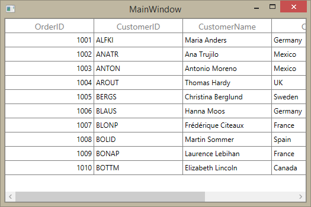
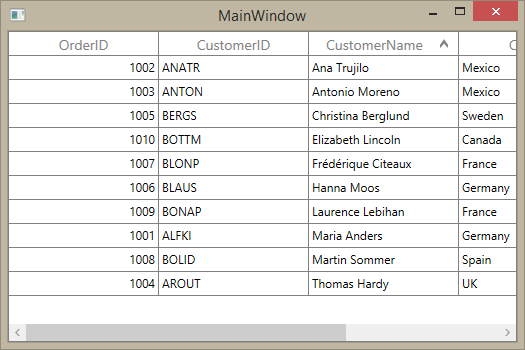
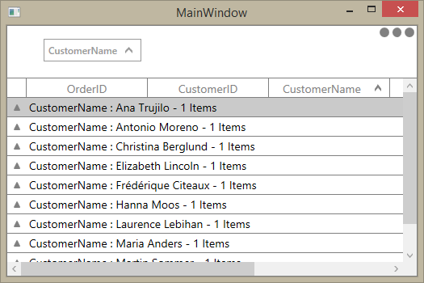
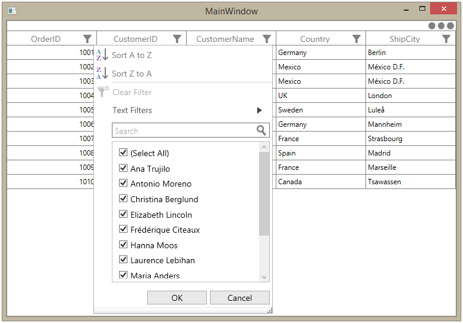

# Getting Started

This Section starts with Assemblies deployment, Subsequent sections that take you through the structure of SfDataGrid and explains how to create Simple application with SfDataGrid, how to apply grouping, sorting and filtering SfDataGrid.

## Assemblies Deployment

This topic describes assembly that is required in your WPF application when you want to use SfDataGrid.Certain assemblies are deployed in your application, whereas others that offer additional functionality like exporting is deployed optionally based on your requirements. The assemblies that are added is in same version.  

### The following is the list of assemblies.

#### _List of Assemblies_

<table>
<tr>
<td>
Demanded Assemblies</td><td>
Description</td></tr>
<tr>
<td>
Syncfusion.Data.WPF</td><td>
Covers basic data processing like sorting, grouping, paging and filtering.</td></tr>
<tr>
<td>
Syncfusion.SfGrid.WPF</td><td>
Covers SfDataGrid and other elements included. </td></tr>
<tr>
<td>
Syncfudion.Shared.WPF</td><td>
Covers editors like CurrencyTextBox, PercentEdit, and DateTimeEdit.</td></tr>
<tr>
<td>
Optional Assemblies</td><td>
Description</td></tr>
<tr>
<td>
Syncfusion.SfGridConverter.WPF</td><td>
Covers classes for exporting Grid to excel and Pdf.</td></tr>
<tr>
<td>
Syncfusion.XlsIO.Base.WPF</td><td>
Syncfusion.SfGridConverter.WPF dll refer to this dll to create and manipulate Excel data.</td></tr>
<tr>
<td>
Syncfusion.Pdf.Base</td><td>
Syncfusion.SfGridConverter.WPF dll refer to this dll to create and manipulate Pdf.</td></tr>
</table>
## Control Structure

The following screenshot displays you the elements in SfDataGrid.

### _Elements of SfDataGrid_

## Create a Simple Application with DataGrid

Following steps demonstrate how to create a DataGrid and bind data to it:

1. Create new WPF application in Visual Studio.
2. Open the Visual Studio tool box. Navigate to “Syncfusion Controls” tab, and drag the SfDataGrid toolbox item to the Designer window. Now, rename the SfDataGrid to “sfgrid”.

### _Syncfusion Control tab_

When you drag the SfDataGrid toolbox item to the window, it automatically adds the required references to the current application.

To add the SfDataGrid using code, you can add the following assemblies to the project.

* Syncfusion.Data.WPF
* Syncfusion.SfGrid.WPF
* Syncfusion.Shared.WPF
3. Now, create a simple data source as shown in the following code example. Add the following code example in a newly created class files and save it as__OrderInfo.cs file.



[C#]

public class OrderInfo

{

    int orderID;

    string customerId;

    string country;

    string customerName;

    string shippingCity;

    public int OrderID

    {

          get {   return orderID;  }

          set {   orderID = value; }

    }

    public string CustomerID

    {

          get {  return customerId; }

          set {  customerId = value; }

    }

    public string CustomerName

    {

          get {  return customerName; }

          set {  customerName = value;}

    }

    public string Country

    {

          get { return country; }

          set  {  country = value; }

    }

    public string ShipCity

    {

         get {  return shippingCity; }

         set {  shippingCity = value; }

    }

    public OrderInfo(int orderId, string customerName, string country, string     

    customerId,string shipCity)

    {

         this.OrderID = orderId;

         this.CustomerName = customerName;

         this.Country = country;

         this.CustomerID = customerId;

         this.ShipCity = shipCity;

    }

}


4. Add the following code example in a newly created class file and save it as__OrderInfoRepositiory.cs file.



[C#]

public class OrderInfoRepositiory

{

    ObservableCollection<OrderInfo> orderCollection;

    public ObservableCollection<OrderInfo> OrderInfoCollection

    {

        get { return orderCollection; }

        set { orderCollection = value; }

    }

    public OrderInfoRepositiory()

    {

        orderCollection = new ObservableCollection<OrderInfo>();

        this.GenerateOrders();

    }

    private void GenerateOrders()

    {

        orderCollection.Add(new OrderInfo(1001, "Maria Anders", "Germany", "ALFKI", "Berlin"));

        orderCollection.Add(new OrderInfo(1002, "Ana Trujilo", "Mexico", "ANATR", "México D.F."));

        orderCollection.Add(new OrderInfo(1003, "Antonio Moreno", "Mexico", "ANTON", "México D.F."));

        orderCollection.Add(new OrderInfo(1004, "Thomas Hardy", "UK", "AROUT", "London"));

        orderCollection.Add(new OrderInfo(1005, "Christina Berglund", "Sweden", "BERGS", "Luleå"));

        orderCollection.Add(new OrderInfo(1006, "Hanna Moos", "Germany", "BLAUS", "Mannheim"));

        orderCollection.Add(new OrderInfo(1007, "Frédérique Citeaux", "France", "BLONP", "Strasbourg"));

        orderCollection.Add(new OrderInfo(1008, "Martin Sommer", "Spain", "BOLID", "Madrid"));

        orderCollection.Add(new OrderInfo(1009, "Laurence Lebihan", "France", "BONAP", "Marseille"));

        orderCollection.Add(new OrderInfo(1010, "Elizabeth Lincoln", "Canada", "BOTTM", "Tsawassen"));

    }

}


5. You can add Syncfusion schema ([http://schemas.syncfusion.com/wpf](http://schemas.syncfusion.com/wpf)) or namespace (Syncfusion.UI.XAML.Grid) of SfDataGrid in XAML to create SfDataGrid. Here, your sample name space to set ViewModel as data context to Grid or to Window. 



[XAML]

<Window x:Class="SimpleApplication.MainWindow"

        xmlns="http://schemas.microsoft.com/winfx/2006/xaml/presentation"

        xmlns:x="http://schemas.microsoft.com/winfx/2006/xaml"

        xmlns:local="clr-namespace:SimpleApplication"

        xmlns:syncfusion="http://schemas.syncfusion.com/wpf">



6. You need to set data context for (Window or Grid) or you can set it using Resource also. You can bind data to DataGrid by using the SfDataGrid.ItemsSource__property. When you set it using data context then you should refer the following code example.



[XAML]

<Window.DataContext>

       <local:OrderInfoRepositiory />

</Window.DataContext>



You can bind the data using the following code example.



[XAML]

<syncfusion:SfDataGrid ColumnSizer="Auto" ItemsSource="{Binding OrderInfoCollection}" />


To set the data context using Resource, you can refer the following code example.



[XAML]

<Window.Resources>

    <local:OrderInfoRepositiory x:Key="data" />

</Window.Resources>



You can bind the data using the following code example.



[XAML]

<syncfusion:SfDataGrid ColumnSizer="Auto" ItemsSource="{Binding OrderInfoCollection, Source={StaticResource data}}" />


7. By default, the DataGrid automatically creates columns for all fields in a data source.
8. Execute the application to render the following output.

_Data Grid_

9. You can also define the columns manually by setting the SfDataGrid.AutoGenerateColumns property to ‘false’_,_ and add the GridColumn object to the SfDataGrid.Columns collection. The following code example illustrates this.



[XAML]

<syncfusion:SfDataGrid AutoGenerateColumns="False"

                       ColumnSizer="Auto"

                       ItemsSource="{Binding OrderInfoCollection}">

    <syncfusion:SfDataGrid.Columns>

        <syncfusion:GridTextColumn HeaderText="Order ID" MappingName="OrderID" />

        <syncfusion:GridTextColumn HeaderText="Customer ID" MappingName="CustomerID" />

        <syncfusion:GridTextColumn HeaderText="Ship Country" MappingName="ShipCountry" />

        <syncfusion:GridTextColumn HeaderText="Ship City" MappingName="ShipCity" />

    </syncfusion:SfDataGrid.Columns>

</syncfusion:SfDataGrid>


10. Execute the application to render the following output.

#### _Data Grid_

11. SfDataGrid allows you to group its data by dragging a column and drop it in GroupDropArea. To apply grouping with mouse pointer, you can enable ShowGroupDropArea and AllowGrouping.  The following code example illustrates this.



[XAML]

<syncfusion:SfDataGrid ColumnSizer="Star"

                       AllowGrouping="True"

                       ItemsSource="{Binding OrderInfoCollection,

                                     Source={StaticResource data}}"

                       ShowGroupDropArea="True" />


12. Execute the application and drag Order ID Column and drop it in GroupDropAreaarea. It displays the following output.

#### _DataGrid with ShowGroupDropArea and AllowGrouping enabled_

13. SfDataGrid allows you to apply sorting on its data by setting AllowSorting to ‘true. Following code example illustrates this.



[XAML]

<syncfusion:SfDataGrid AllowSorting="True"

                       ColumnSizer="Star"

                       ItemsSource="{Binding OrderInfoCollection,                                  

                                             Source={StaticResource data}}" />


14. Execute the application and click header cell to sort the data and the following output is displayed.

#### _DataGrid with AllowSorting property set to true_

15. SfDataGrid provides support for Excel inspired UI for filtering. You can enable this AllowFiltering property to ‘true’. 



[XAML]

<syncfusion:SfDataGrid AllowFiltering="True"

                       ColumnSizer="Star"

                       ItemsSource="{Binding OrderInfoCollection,

                                             Source={StaticResource data}}" />


16. Execute the application; you can see that Header loaded with filter toggle button. 

#### _DataGrid Header loaded with filter toggle button_

17. When you click filter toggle button, you can get a filter pop-up window as displayed in the following screenshot. Now you can filter the data like in Excel.

_Filter pop-up window_

## Create Master-Details view DataGrid

Master-Detail view also called as Hierarchical or Nested Grid can be used to display master-details relationship and collection properties in Business model in hierarchical (Tree) structure.  This section explains you simple steps to create Master-Details View DataGrid to display Collection properties present in Business Model.

1. Create New WPF Project in Visual Studio.
2. Add required assemblies as mentioned in Getting Started section.
3. Now, create Data Source. 
* Create a business model with Collection property. This value is displayed in seperate Grid under the parent record in Grid. 
* In the following code example, OrderInfo business class directly bounds to SfDataGrid ans it has ProductDetails property of type List<ProductInfo>. ProductDetails are not displayed in Grid like other property. You can display ProductDetails property collection in seperate Grid under OrderInfo record in Grid using NestedGrid.

### Add the following code example in a newly created class file and save it as OrderInfo.C#



[C#]

public class OrderInfo

{

    int orderID;

    string customerId;

    string country;

    string customerName;

    string shippingCity;

    List<ProductInfo> productDetails;

    public int OrderID

    {

        get { return orderID; }

        set { orderID = value; }

    }

    public string CustomerID

    {

        get { return customerId; }

        set { customerId = value; }

    }

    public string CustomerName

    {

        get { return customerName; }

        set { customerName = value; }

    }

    public string Country

    {

        get { return country; }

        set { country = value; }

    }

    public string ShipCity

    {

        get { return shippingCity; }

        set { shippingCity = value; }

    }

    public List<ProductInfo> ProductDetails

    {

        get { return productDetails; }

        set { productDetails = value; }

    }

    public OrderInfo(int orderId, string customerName, string country, string

    customerId, string shipCity, List<ProductInfo> productdetails)

    {

        this.OrderID = orderId;

        this.CustomerName = customerName;

        this.Country = country;

        this.CustomerID = customerId;

        this.ShipCity = shipCity;

        this.ProductDetails = productdetails;

    }

}


The ProductDetails property is a List of ProductInfo type. Here you can find the class information of ProductInfo class. You can add the following code example in a newly created class file and save it as ProductInfo.cs file



[C#]    

public class ProductInfo

{

    int orderId;

    string productName;

    public int OrderID

    {

        get { return orderId; }

        set { orderId = value; }

    }

    public string ProductName

    {

        get { return productName; }

        set { productName = value; }

    }

}



4. Now create data to bind to SfDataGrid. Add the following code example in a newly created class file and save it as OrderInfoRepositiory.cs file_._



[C#]

public class OrderInfoRepositiory

{

    ObservableCollection<OrderInfo> orderCollection;        

    public ObservableCollection<OrderInfo> OrderInfoCollection

    {

        get { return orderCollection; }

        set { orderCollection = value; }

    }

    public OrderInfoRepositiory()

    {

        orderCollection = new ObservableCollection<OrderInfo>();

        this.GenerateProducts();

        OrderInfoCollection = GenerateOrders();            

    }

    public ObservableCollection<OrderInfo> GenerateOrders()

    {

        ObservableCollection<OrderInfo> orders = new ObservableCollection<OrderInfo>();

        orders.Add(new OrderInfo(1001, "Maria Anders", "Germany", "ALFKI", "Berlin", getorder(1001)));

        orders.Add(new OrderInfo(1002, "Ana Trujilo", "Mexico", "ANATR", "México D.F.", getorder(1002)));

        orders.Add(new OrderInfo(1003, "Antonio Moreno", "Mexico", "ANTON", "México D.F.", getorder(1003)));

        orders.Add(new OrderInfo(1004, "Thomas Hardy", "UK", "AROUT", "London", getorder(1004)));

        orders.Add(new OrderInfo(1005, "Christina Berglund", "Sweden", "BERGS", "Luleå", getorder(1005)));

        orders.Add(new OrderInfo(1006, "Hanna Moos", "Germany", "BLAUS", "Mannheim", getorder(1006)));

        orders.Add(new OrderInfo(1007, "Frédérique Citeaux", "France", "BLONP", "Strasbourg", getorder(1007)));

        orders.Add(new OrderInfo(1008, "Martin Sommer", "Spain", "BOLID", "Madrid", getorder(1008)));

        orders.Add(new OrderInfo(1009, "Laurence Lebihan", "France", "BONAP", "Marseille", getorder(1009)));

        orders.Add(new OrderInfo(1010, "Elizabeth Lincoln", "Canada", "BOTTM", "Tsawassen", getorder(1010)));

        return orders;

    }

    List<ProductInfo> prod = new List<ProductInfo>();

    public void GenerateProducts()

    {

        prod.Add(new ProductInfo() { OrderID = 1001, ProductName = "Bike1" });

        prod.Add(new ProductInfo() { OrderID = 1001, ProductName = "Bike2" });

        prod.Add(new ProductInfo() { OrderID = 1001, ProductName = "Bike2" });

        prod.Add(new ProductInfo() { OrderID = 1002, ProductName = "Bike2" });

        prod.Add(new ProductInfo() { OrderID = 1002, ProductName = "Bike1" });

        prod.Add(new ProductInfo() { OrderID = 1002, ProductName = "Bike3" });

        prod.Add(new ProductInfo() { OrderID = 1003, ProductName = "Bike2" });

        prod.Add(new ProductInfo() { OrderID = 1003, ProductName = "Bike1" });

        prod.Add(new ProductInfo() { OrderID = 1004, ProductName = "Bike2" });

        prod.Add(new ProductInfo() { OrderID = 1004, ProductName = "Bike2" });

        prod.Add(new ProductInfo() { OrderID = 1005, ProductName = "Bike3" });

        prod.Add(new ProductInfo() { OrderID = 1005, ProductName = "Bike4" });

        prod.Add(new ProductInfo() { OrderID = 1005, ProductName = "Bike5" });

        prod.Add(new ProductInfo() { OrderID = 1006, ProductName = "Bike1" });

        prod.Add(new ProductInfo() { OrderID = 1006, ProductName = "Bike2" });

        prod.Add(new ProductInfo() { OrderID = 1007, ProductName = "Bike1" });

        prod.Add(new ProductInfo() { OrderID = 1008, ProductName = "Bike4" });

        prod.Add(new ProductInfo() { OrderID = 1008, ProductName = "Bike6" });

        prod.Add(new ProductInfo() { OrderID = 1008, ProductName = "Bike7" });

    }

    public List<ProductInfo> getorder(int i)

    {

        List<ProductInfo> product = new List<ProductInfo>();

        foreach (var or in prod)

            if (or.OrderID == i)

                product.Add(or);

        return product;

    }

}


5. Now open XAML page in your application. Add names space for SfDataGrid and create simple application with SfDataGrid.
6. SfDataGrid.DetailsViewDefinition in SfDataGrid creates Master-Detail DataGrid and RelationalColumn property in GridViewDefinition creates ItemsSource for associate ChildGrid from Parent Grid Data. 
7. Create Details-View Grid as in the following code example. There are some limitations for Details-View Grid that is refered using Master-Details View Section.



[XAML]

<Window x:Class="SimpleApplication.MainWindow"

        xmlns="http://schemas.microsoft.com/winfx/2006/xaml/presentation"

        xmlns:x="http://schemas.microsoft.com/winfx/2006/xaml"

        xmlns:local="clr-namespace:SimpleApplication"

        xmlns:syncfusion="http://schemas.syncfusion.com/wpf"

        Title="MainWindow"

        Width="525"

        Height="350">

    <Window.DataContext>

        <local:OrderInfoRepositiory />

    </Window.DataContext>

    <Grid>

        <syncfusion:SfDataGrid AutoGenerateColumns="True"

                               ColumnSizer="Star"

                               ItemsSource="{Binding OrderInfoCollection}">

            <syncfusion:SfDataGrid.DetailsViewDefinition>

                <syncfusion:GridViewDefinition RelationalColumn="ProductDetails" />

            </syncfusion:SfDataGrid.DetailsViewDefinition>

        </syncfusion:SfDataGrid>

    </Grid>

</Window>



8. Execute the application; Grid is loaded with Master Details Grid. Click the first record’s expander to render the following output.

#### _Master-Details view DataGrid_

