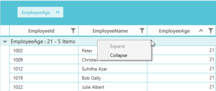
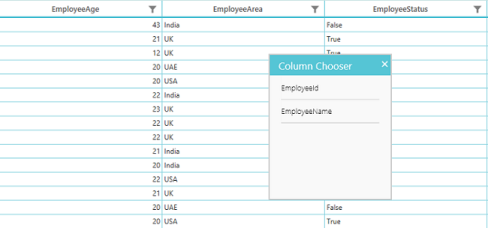
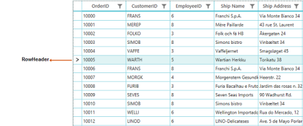
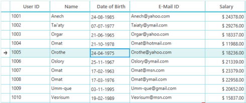
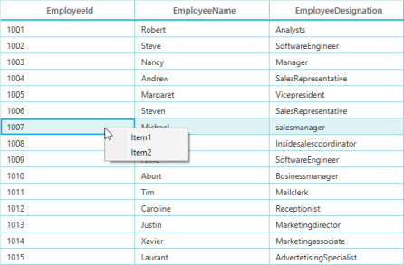
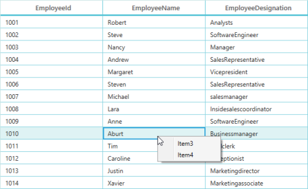

# Interactive Features

This section explains you how to use context menu, Column Chooser window and Rowheader in SfDatagrid. You can also see the different types of available API, methods and events for contextmenu, Column Chooser window and for row header.

## Context Menu

### Overview

ContextMenu in SfDataGrid is entirely customizable menu for the extensible functionalities of Grid. ContextMenu is enabled for various parts of the Grid with the appropriate APIs. SfDataGrid has a set of APIs that allows access to context menu in various parts of Grid. The APIs are as follows:

* HeaderContextMenu: Gets or sets the context menu for the Header.
* GroupDropAreaContextMenu: Gets or sets the context menu for Group Drop Area.
* GroupDropItemContextMenu: Gets or sets the context menu for Group Drop Area Item.
* RecordContextMenu: Gets or sets the context menu for Records.
* GroupSummaryContextMenu: Gets or sets the context menu for Group Summary.
* TotalSummaryContextMenu: Gets or sets the context menu for Table Summary.
* GroupCaptionContextMenu: Gets or sets the context menu for Group Captions.

All Context Menu APIs are of the type of Context menu, and are easily customized similar to the default context menu.

### Data Context for Context Menu

The ContextMenu in SfDataGrid is applied to different DataContext according to the type of the context menu. The DataContext are as follows:

* GridColumnContextMenuInfo: DataContext for HeaderContextMenu and GroupDropItemContextMenu
* Column: Contains information about the column.
* DataGrid: Contains the instance of DataGrid.
* GridRecordContextMenuInfo: DataContext for RecordContextMenu, GroupSummaryContextMenu, TableSummaryContextMenu and CaptionSummaryContextMenu.
* Record: Contains the corresponding record of the context menu.
* DataGrid: Contains the instance of DataGrid.
* GridGroupDropAreaContextMenuInfo: DataContext for GroupDropAreaContextMenu
* DataGrid: Contains the instance of DataGrid.

### Events for Context Menu

The GridContextMenuOpening event in SfDataGrid is raised when the context menu is opened. The GridContextMenuOpening event handler has two parameters namely sender that handles SfDataGrid and the other GridContextMenuEventArgs. The properties for these EventArgs are as follows:

* ContextMenu: Gets or sets the corresponding context menu.
* ContextMenuInfo: Gets the context menu info (DataContext) for the corresponding context menu.
* RowColumnIndex: Gets the RowColumnIndex for the context menu that is opened. Row column is updated only for Record context menu; and for the remaining it is left empty.
* ContextMenuType: Gets the type of context menu (Header, Record, GroupDropArea, and other types).
* Handled: Gets or sets a value that indicates whether the GridContextMenuOpening event is handled.

The following code example illustrates context menu usage with GroupCaptionContextMenu to expand or collapse the group by using command bindings.



<syncfusion:SfDataGrid.GroupCaptionContextMenu>

<ContextMenu>

<MenuItem Command="{Binding Source={x:Static Member=local:ContextMenuCommands.Expand}}" CommandParameter="{Binding}" Header="Expand" />

<MenuItem Command="{Binding Source={x:Static Member=local:ContextMenuCommands.Collapse}}" CommandParameter="{Binding}" Header="Collapse" />

</ContextMenu>

</syncfusion:SfDataGrid.GroupCaptionContextMenu>




public static class ContextMenuCommands

{

        #region Expand

        static BaseCommand expand;

        public static BaseCommand Expand

        {

            get

            {

                if (expand == null)

                    expand = new BaseCommand(OnExpandClicked, CanExpandClicked);

                return expand;

            }

        }

        private static void OnExpandClicked(object obj)

        {

            if (obj is GridRecordContextMenuInfo)

            {

                var grid = (obj as GridRecordContextMenuInfo).DataGrid;

                var group = (obj as GridRecordContextMenuInfo).Record as Group;

                grid.ExpandGroup(group);

            }

        }

        private static bool CanExpandClicked(object obj)

        {

            if (obj is GridRecordContextMenuInfo)

            {

                var grid = (obj as GridRecordContextMenuInfo).DataGrid;

                var group = (obj as GridRecordContextMenuInfo).Record as Group;

                return !group.IsExpanded;

            }

            return false;

        }

        #endregion

        #region Collapse

        static BaseCommand collapse;

        public static BaseCommand Collapse

        {

            get

            {

                if (collapse == null)

                    collapse = new BaseCommand(OnCollapseClicked, CanCollapseClicked);

                return collapse;

            }

        }

        private static void OnCollapseClicked(object obj)

        {

            if (obj is GridRecordContextMenuInfo)

            {

                var grid = (obj as GridRecordContextMenuInfo).DataGrid;

                var group = (obj as GridRecordContextMenuInfo).Record as Group;

                grid.CollapseGroup(group);

            }

        }

        private static bool CanCollapseClicked(object obj)

        {

            if (obj is GridRecordContextMenuInfo)

            {

                var grid = (obj as GridRecordContextMenuInfo).DataGrid;

                var group = (obj as GridRecordContextMenuInfo).Record as Group;

                return group.IsExpanded;

            }

            return false;

        }

        #endregion

}


Context menu usage with GroupCaptionContextMenu
{:.caption}
### Limitations:

You can not open your custom context menu when you are in edit mode. When you right-click on any record cell, customRecordContextMenu is displayed.                               

When you enter into edit mode and right-click on the cell, the default Microsoft context menu is displayed. This is the default behavior of SfDataGrid.

## Column Chooser 

ColumnChooser allows you to add or remove columns dynamically from the current Grid view using drag-and-drop operations. You can enable a Column Chooser in an application by creating an instance for ColumnChooser and GridColumnChooserController class, and then assign the GridColumnChooserController’s instance to GridColumnDragDropController. 

The following code example illustrates how to add a default ColumnChooser in an application.


ColumnChooser chooserWindow;

void MainWindow_Loaded(object sender, RoutedEventArgs e)

 {

    chooserWindow = new ColumnChooser(this.datagrid);

    chooserWindow.Resources.MergedDictionaries.Clear();

    chooserWindow.ClearValue(ColumnChooser.StyleProperty);

    chooserWindow.Resources.MergedDictionaries.Add(this.datagrid.Resources.MergedDictionaries[0]);

    this.datagrid.GridColumnDragDropController = new GridColumnChooserController(this.datagrid, chooserWindow);

     chooserWindow.Show();

     chooserWindow.Owner = this;

 }


The following screenshot illustrates aDefault Column Chooser window.

Default Column Chooser window
{:.caption}
N> The default Column Chooser displays the empty window when there is no hidden column initially.

### Customizing Column Chooser

Customization of ColumnChooser is achieved in the following two ways such as:

* UI Customization
* Drag and Drop Customization

### UI Customization:

Instead of using default ColumnChooser window, you can also select any other panel as column chooser’s window. You can achieve using IColumnChooser interface.

Default ColumnChooser is implemented with this interface for drag-and-drop operation.

### Methods in IColumnChooser:

IColumnChooser method table

<table>
<tr>
<th>
Method</th><th>
Prototype</th><th>
Description</th></tr>
<tr>
<td>
AddChild</td><td>
AddChild(GridColumn column)</td><td>
Adds a child in the Column Chooser window</td></tr>
<tr>
<td>
RemoveChild</td><td>
RemoveChild(GridColumn column)</td><td>
Removes a child from the Column Chooser window.</td></tr>
<tr>
<td>
GetControlRect</td><td>
GetControlRect()</td><td>
Returns the Rect structure of the Column Chooser window.</td></tr>
</table>

The following code example illustrates how to add and remove a child from Custom Column Chooser panel.



  #region IColumnChooser methods

  public class CustomChooser : IColumnChooser

    {

        public CustomChooser(SfDataGrid dataGrid, Panel chooserPanel)

        {

            this.DataGrid = dataGrid;

            this.chooserPanel = chooserPanel as StackPanel;

        }

        StackPanel chooserPanel;

        List<GridColumn> intialChildren = new List<GridColumn>();

   /// 

        /// Adds the field to the column chooser whenever the column is hidden.

        /// 

        /// <param name="column"></param>

        /// <remarks>

        /// chooserPanel is a Panel present in the MainPage of the App

        /// CustomColumnChooserItem is a control that adds or removes the chooserPanel

        /// </remarks>

        public void AddChild(GridColumn column)

        {

            if (chooserPanel == null)

            {

                intialChildren.Add(column);

                return;

            }

            if (this.chooserPanel.Children.Cast <CustomColumnChooserItem>().All(item => (item as 		          	 		    CustomColumnChooserItem).Column.MappingName != column.MappingName) && this.DataGrid.View != null)

            {

               var chooserItem = new CustomColumnChooserItem(column,DataGrid) 

               { 

               Height = 40, 

               Background=Brushes.Blue,

               Foreground=Brushes.White, 

               Width = 200,

               Content=column.HeaderText,

               BorderBrush = new SolidColorBrush(Color.FromArgb(0xFF, 0xAD, 0xAD, 0xAD)),                

                 BorderThickness = new Thickness(0, 0, 0, 1) };

                 chooserItem.Controller = this.DataGrid.GridColumnDragDropController;

                 chooserItem.ColumnName = column.HeaderText;

                 this.chooserPanel.Children.Add(chooserItem);

            }

        }

        /// 

        /// Remove the Child for the column chooser whenever the column gets Unhide

        /// 

        /// <param name="column"></param>

        /// <remarks>

        /// chooserPanel is a Panel present in the MainPage of the App

        /// CustomColumnChooserItem is a control that adds or removes to the chooserPanel

        /// </remarks>

        public void RemoveChild(GridColumn column)

        {

           if (this.chooserPanel != null && this.chooserPanel.Children.Count > 0)

            {

              var element = this.chooserPanel.Children.Cast <CustomColumnChooserItem>().FirstOrDefault(item => (item as 													CustomColumnChooserItem).Column.MappingName == column.MappingName);

                if (element != null)

                    this.chooserPanel.Children.Remove(element);

            }

        }

        /// 

        /// Returns the Rect of the ColumnChooserControl

        /// 

        /// <returns></returns>

        /// <remarks></remarks>

        public Rect GetControlRect()

        {

        Point locationfromWindow =this.chooserPanel.TranslatePoint(new Point(0, 0),  Application.Current.MainWindow);

         Point locationfromScreen = this.chooserPanel.PointToScreen(locationfromWindow);

          return new Rect((locationfromScreen.X - locationfromWindow.X), (locationfromScreen.Y - locationfromWindow.Y), this.chooserPanel.ActualWidth, this.chooserPanel.ActualHeight);

        }

        #endregion


The following screenshot illustrates a Custom Column Chooser.

Custom Column Chooser
{:.caption}
### Drag and Drop Customization:

By default, column drag-and-drop operations are handled by GridColumnDragDropController class. You can achieve drag-and-drop customization by overriding the methods in GridColumnDragDropController class.

GridColumnDragDropController virtual methods table

<table>
<tr>
<th>
Method</th><th>
Prototype</th><th>
Description</th></tr>
<tr>
<td>
CanShowPopup</td><td>
CanShowPopup(GridColumn column)</td><td>
Returns whether the column shows pop-up for its header or not.</td></tr>
<tr>
<td>
OnColumnHiddenChanged</td><td>
OnColumnHiddenChanged(GridColumn column)</td><td>
Occurs when GridColumn’s Hidden property value changes. </td></tr>
<tr>
<td>
OnPopupContentDropped</td><td>
OnPopupContentDropped(Point point)</td><td>
Occurs when the dragged pop-up is dropped.</td></tr>
<tr>
<td>
OnPopupContentPositionChanged</td><td>
OnPopupContentPositionChanged(double HorizontalDelta, double VerticalDelta, Point mousePoint, Point mousePointOverGrid)</td><td>
Occurs when pop-up position changes while dragging.</td></tr>
<tr>
<td>
PointToGridRegion</td><td>
PointToGridRegion(Point point)</td><td>
Called to find the GridRegion at a given point.</td></tr>
<tr>
<td>
CreatePopupContent </td><td>
CreatePopupContent(GridColumn column)</td><td>
Called when pop-up content is created.</td></tr>
<tr>
<td>
PopupContentDroppedOnGroupDropArea</td><td>
PopupContentDroppedOnGroupDropArea(GridColumn column)</td><td>
Called when a draggable pop-up is dropped on a GroupDropArea part</td></tr>
<tr>
<td>
PopupContentDroppedOnHeaderRow</td><td>
PopupContentDroppedOnHeaderRow(int oldIndex, int newColumnIndex)</td><td>
Called when a draggable pop-up is dropped on HeaderRow part</td></tr>
<tr>
<td>
PopupContentDroppedOnGrid</td><td>
PopupContentDroppedOnGrid(Point point)</td><td>
Called when a draggable pop-up is dropped on Grid part</td></tr>
</table>

### GridColumnChooserController:

GridColumnChooserController class plays a vital role in Column Chooser drag-and-drop operation. You can achieve drag-and-drop customization by overriding the GridColumnChooserController methods.

### Properties and Methods in GridColumnChooserController:

Property table

<table>
<tr>
<th>
Property</th><th>
Type</th><th>
Description</th><th>
Default Value</th></tr>
<tr>
<td>
AllowHidingForLastColumn</td><td>
Boolean</td><td>
Returns whether to add last column in the view of Column Chooser or not</td><td>
True</td></tr>
</table>

Method table

<table>
<tr>
<th>
Method</th><th>
Prototype</th><th>
Description</th></tr>
<tr>
<td>
Show</td><td>
Show(int colIndex, MouseEventArgs e)</td><td>
Called to display the pop-up to enable drag operation.> {{ '_Note: This method shows pop-up in handling pointer events._' | markdownify }}> </td></tr>
</table>

## RowHeader 

RowHeader is a special Column used to indicate the row status like CurrentRow, Editing status, Errors in row and etc. You can enable or disable RowHeader using ShowRowHeader property in SfDataGrid. 

The following code example displays you how to enable RowHeader in DataGrid.



<Window.DataContext>

<local:ViewModel/>

</Window.DataContext>

<syncfusion:SfDataGrid x:Name="dataGrid"

                       ItemsSource="{Binding Path=OrdersDetails}"

                       ShowRowHeader="True"/>


The following screenshot displays a DataGrid with a RowHeader:

DataGrid with a RowHeader
{:.caption}
### RowHeader Width:

By default, the RowHeader width value is set to ’45’ (Data Type: double).you can customize the width by setting any desired width as a numeric value to RowHeaderWidth property in SfDataGrid.



<Window.DataContext>

<local:ViewModel/>

</Window.DataContext>

<syncfusion:SfDataGrid x:Name="dataGrid"

                       ItemsSource="{Binding Path=OrdersDetails}"

                       ShowRowHeader="True"

                       RowHeaderWidth="100"/>



### RowHeader Indicators:

The following table lists the different RowHeader indicators.

RowHeader indicators table

<table>
<tr>
<th>
Row Indicator</th><th>
Description</th></tr>
<tr>
<td>
{{ '' | markdownify }}

</td><td>
Indicates the current row item.</td></tr>
<tr>
<td>
{{ '' | markdownify }}

</td><td>
Indicates the row is in edit mode.</td></tr>
<tr>
<td>
{{ '' | markdownify }}

</td><td>
Indicates adding a new row.</td></tr>
<tr>
<td>
{{ '' | markdownify }}

</td><td>
Indicates the row has errors. Error is shown when the Model is derived from IDataErrorInfo or INotifyDataErrorInfo.</td></tr>
<tr>
<td>
{{ '' | markdownify }}

</td><td>
Indicates that the current row has errors.</td></tr>
</table>

N> Using IDataErrorInfo, you can retrieve the error string from Error Field, whereas using INotifyDataErrorInfo the error is retrieved when the HasError Field value is ‘true’.

### Customizing Row Header:

RowHeader provides customization support, either by using Styles or by overriding Control Template. It is easily customized by editing the visual states in the default control template.

### Editing Current Row Indicator

The following code example shows you how to edit current row indicator in row header.



<Window.Resources>         

            

    </Window.Resources>



The following image displays the output of the RowHeader with customized current row indicator.

RowHeader with customized current row indicator
{:.caption}
## ToolTip

The ToolTip provides support to show the pop-up window that displays information when the mouse hovers over the cells in the DataGrid. The following properties in the GridColumn enable and customize the ToolTip support in the SfDataGrid.

Properties in the GridColumn

<table>
<tr>
<th>
Properties</th><th>
Type</th><th>
Description</th><th>
Default Value</th></tr>
<tr>
<td>
ShowToolTip</td><td>
Boolean</td><td>
Gets or sets whether the ToolTip should show when mouse is over the GridCell.</td><td>
False</td></tr>
<tr>
<td>
ShowHeaderToolTip</td><td>
Boolean</td><td>
Gets or sets whether the ToolTip should show when mouse is over the GridHeaderCellControl.</td><td>
False</td></tr>
<tr>
<td>
SetCellBoundToolTip</td><td>
Boolean</td><td>
The DataContext for the ToolTip is set based on this property. When it is false, then it sets Record as DataContext. Otherwise, it sets DataContextHelper as DataContext. DataContextHelper has Value and Record properties where the Value is set based on the MappingName of the column. </td><td>
False</td></tr>
<tr>
<td>
HeaderToolTipTemplate</td><td>
DataTemplate</td><td>
Gets or sets the data template used to display the content of ToolTip for the GridHeaderCellControl.</td><td>
Null</td></tr>
<tr>
<td>
ToolTipTemplate</td><td>
DataTemplate</td><td>
Gets or sets the data template used to display the content of the ToolTip for the GridCell.</td><td>
Null</td></tr>
<tr>
<td>
ToolTipTemplateSelector</td><td>
DataTemplateSelector</td><td>
Gets or sets the DataTemplateSelector and applies the defined template to the tool tip when mouse hovers on the GridCell.</td><td>
Null</td></tr>
</table>

### Default ToolTip

You can enable the ToolTip for columns by setting the GridColumn.ShowToolTip property as given in the following code. 



<syncfusion:SfDataGrid AutoGenerateColumns="False"                

                       ItemsSource="{Binding OrderList}"

                       LiveDataUpdateMode="AllowDataShaping"

                       ShowRowHeader="True">

    <syncfusion:SfDataGrid.Columns>

        <syncfusion:GridTextColumn HeaderText="Customer ID"

                                   MappingName="CustomerID"

                                   ShowHeaderToolTip="True"

                                   ShowToolTip="True" />

        <syncfusion:GridTextColumn HeaderText="Contact Number"

                                   MappingName="ContactNumber"/>         

        <syncfusion:GridNumericColumn HeaderText="Quantity"

                                      MappingName="UnitPrice"/>

    </syncfusion:SfDataGrid.Columns>

</syncfusion:SfDataGrid> 


The following screenshot shows the default ToolTip of a cell with text in the Popup.

Default ToolTip of a cell with text in the Popup
{:.caption}
Likewise, you can enable the default ToolTip for the Header by setting the GridColumn.ShowHeaderToolTip property. 

Default ToolTip for the Header
{:.caption}
### ToolTip customization

You can customize the ToolTip in the following ways:

* Style Customization.
* By using the GridColumn.ToolTipTemplate.
* By using the GridColumn.ToolTipTemplateSelector.

### Style Customization

You can customize the default style of the ToolTip to be shown on the GridCell or the GridHeaderCell control by using the following code.



<!-- Style Customization For ToolTip Control.-->



The following screenshot shows the customized default ToolTip of the SfDataGrid.

Customized default ToolTip
{:.caption}
### By using the ToolTipTemplate

You can customize the default ToolTip by loading the Data Template as its content by setting the GridColumn.ToolTipTemplate. The DataContext for the ToolTipTemplate is set based on the GridColumn.SetCellBoundToolTip. When the SetCellBoundToolTip is false, the underlying record is the DataContext for the ToolTipTemplate. Otherwise, the DataContextHelper continues to be the DataContext for the ToolTipTemplate.



<!-- Need to add this code in Resources.     Defines the DataTemplate with Key – For GridCellControl-->
<DataTemplate x:Key="customToolTip">   
 <Image Width="100" Height="100" Source="{Binding CustomerID,Converter={StaticResource stringToImageConverter}}" />
 </DataTemplate>
 <!-- Need to add this code in Resources.     Defines the DataTemplate with Key - GridHeaderCellControl.-->
 <DataTemplate x:Key="headerCustomToolTip">  
 <Grid>        
 <Grid.ColumnDefinitions>            
 <ColumnDefinition Width="*" />            
 <ColumnDefinition Width="Auto" />       
 </Grid.ColumnDefinitions>        
 <Image Width="20"  Height="20"  Source="App.ico" />        
 <TextBlock Grid.Column="1" Text="{Binding MappingName}" />   
 </Grid>
 </DataTemplate>
 <!-- Defines Grid ColumnsUse the key to column’s ToolTipTemplate property via binding in a 
 StaticResource to show ToolTip on GridCell.     Use the key to column’s HeaderToolTipTemplate property via binding in a 
 StaticResource to show ToolTip on GridHeaderCell.-->
 <syncfusion:SfDataGrid AutoGenerateColumns="False"  ItemsSource="{Binding OrderList}" LiveDataUpdateMode="AllowDataShaping"    
 ShowRowHeader="True">    
 <syncfusion:SfDataGrid.Columns>        
 <syncfusion:GridTextColumn HeaderText="Customer ID"  MappingName="CustomerID"  ShowHeaderToolTip="True"  
 HeaderToolTipTemplate="{StaticResource headerCustomToolTip}" ToolTipTemplate="{StaticResource customToolTip }"             
 ShowToolTip="True" />        <syncfusion:GridTextColumn HeaderText="Contact Number"   MappingName="ContactNumber"/>         
 <syncfusion:GridNumericColumn HeaderText="Quantity"   MappingName="UnitPrice"/>    
 </syncfusion:SfDataGrid.Columns></syncfusion:SfDataGrid>

 

The following screenshot shows the customized ToolTip loaded with image control in the Popup.

ToolTip loaded with image
{:.caption}
The following screenshot shows the customized ToolTip of the Header loaded in the Popup.

ToolTip of Header with image
{:.caption}
### By using the ToolTipTemplateSelector

You can customize the default ToolTip by loading different DataTemplates based on the DataContext by setting the GridColumn.ToolTipTemplateSelector. It provides a way to select the DataTemplate based on the data object and the data-bound element. The DataContext for the ToolTip via the ToolTipTemplateSelector is set based on the GridColumn.SetCellBoundToolTip. When the SetCellBoundToolTip is false, underlying record is the DataContext for the Tooltip. Otherwise, the DataContextHelper is the DataContext for the ToolTip.

The following XAML has two DataTemplates defined to set for the ToolTip.



<!-- Need to add this code snippet in Resources

     Defines the DataTemplate with Key – For GridCellControl

     ToolTipTemplateSelector is supported for GridCell alone.

-->

<DataTemplate x:Key="ToolTip1">

    <Grid>

        <Rectangle Fill="Transparent"/>

        <TextBlock Text="{Binding UnitPrice}" FontWeight="Bold"/>

    </Grid>

</DataTemplate>

<DataTemplate x:Key="ToolTip2">

    <Grid>

        <Rectangle Fill="Transparent"/>

        <TextBlock Text="{Binding UnitPrice}" FontStyle="Italic"/>

    </Grid>

</DataTemplate>


The following ToolTipTemplateSelector derived from the DataTemplateSelector returns the ToolTip based on the Record.



public class ToolTipTemplateSelector : DataTemplateSelector

{

    private DataTemplate _defaultTemplate;

    /// 

    /// Gets or sets DefaultTemplate.

    /// 

    public DataTemplate DefaultTemplate

    {

        get { return _defaultTemplate; }

        set { _defaultTemplate = value; }

    }

    private DataTemplate _alternateTemplate;

    /// 

    /// Gets or Sets AlternateTemplate.

    /// 

    public DataTemplate AlternateTemplate

    {

        get { return _alternateTemplate; }

        set { _alternateTemplate = value; }

    }

    public override System.Windows.DataTemplate SelectTemplate(object item, System.Windows.DependencyObject container)

    {

        //The item that comes from ToolTipTemplate is DataContextHelper. When set SetCellBoundValue to true, it sets DataContextHelper as DataContext to DataTemplate. Refer property section of CellTemplate.

        OrderInfo dataUnit = item  as OrderInfo;

        if (dataUnit == null) return this.DefaultTemplate;

        //use reflection to retrieve property

        Type type = dataUnit.GetType();

        PropertyInfo property = type.GetProperty("UnitPrice");

        //To see what template needs to be select according to the specified property value.

        if (property.GetValue(dataUnit, null).ToString().Contains('9') 

            ||

            property.GetValue(dataUnit, null).ToString().Contains('4')

            ||

            property.GetValue(dataUnit, null).ToString().Contains('1')

            )

            return this.AlternateTemplate;

        else

            return this.DefaultTemplate;    

    }

}


The above template selector sets the GridColumn.ToolTipTemplateSelector.



<!-- Defines Grid Columns

     Use the key to column’s ToolTipTemplateSelector property’s Templates 

     via binding in a StaticResource to show ToolTip on GridCell.  

-->

<syncfusion:SfDataGrid AutoGenerateColumns="False"                

                       ItemsSource="{Binding OrderList}"

                       LiveDataUpdateMode="AllowDataShaping"

                       ShowRowHeader="True">

    <syncfusion:SfDataGrid.Columns>

        <syncfusion:GridTextColumn HeaderText="Customer ID"

                                   MappingName="CustomerID"/>

        <syncfusion:GridTextColumn HeaderText="Contact Number"

                                   MappingName="ContactNumber"/>         

        <syncfusion:GridNumericColumn HeaderText="Quantity"

                                      ShowToolTip="True"

                                      MappingName="UnitPrice">                             

           <syncfusion:GridNumericColumn.ToolTipTemplateSelector>

                      <local:ToolTipTemplateSelector  

                            AlternateTemplate="{StaticResource ToolTip2}"  

                            DefaultTemplate="{StaticResource ToolTip1}" />                             

           </syncfusion:GridNumericColumn.ToolTipTemplateSelector>

        </syncfusion:GridNumericColumn>

    </syncfusion:SfDataGrid.Columns>

</syncfusion:SfDataGrid>



The following screenshot shows the different ToolTips of the cells.

Different ToolTip with ToolTipTemplateSelector
{:.caption}
### How to use the same DataTemplate for all the columns and display the ToolTip based on Record and Cell value?

When you are defining the GridColumn.ToolTipTemplate, do not define the DataTemplate for each column separately when you want to display based on the CellValue or the GridColumn.MappingName, in other words. 

When the GridColumn.SetCellBoundToolTip property is set to true, that sets the DataContextHelper as a content to the ToolTip. The DataContextHelper has the Record and Value properties. By using the DataContextHelper.Record and DataContextHelper.Value, you can define the DataTemplateto display the content based on record/value and you can set this DataTemplate to all the columns in the SfDataGrid.  You have to set the GridColumn.SetCellBoundToolTip also to true for all the columns. 

In the following XAML code, the same DataTemplate is set to all the columns to display CellValue with the help of the GridColumn.SetCellBoundToolTip and GridColumn.ToolTipTemplate.



<!-- Need to add this code snippet in Resources

     Define the DataTemplate with Key.-->

<DataTemplate x:Key="genericToolTip">

    <Grid>

        <Rectangle Fill="Transparent"/>

        <TextBlock Text="{Binding Path=Value}"/>

    </Grid>

</DataTemplate>

<!-- Define Grid Columns,

     Use the key to column’s ToolTipTemplate property via binding in a                   

     StaticResource and enable SetCellBoundToolTip. -->

 <syncfusion:SfDataGrid AutoGenerateColumns="False"                

                       ItemsSource="{Binding OrderList}"

                       LiveDataUpdateMode="AllowDataShaping"

                       ShowRowHeader="True">

    <syncfusion:SfDataGrid.Columns>

        <syncfusion:GridTextColumn HeaderText="Customer ID"

                                   MappingName="CustomerID"                                                       

                                   SetCellBoundToolTip="True"                                                       

                                   ToolTipTemplate="{StaticResource genericToolTip}"

                                   ShowToolTip="True" />

        <syncfusion:GridTextColumn HeaderText="Contact Number"

                                   MappingName="ContactNumber"

                                   SetCellBoundToolTip="True"                                                       

                                   ToolTipTemplate="{StaticResource genericToolTip}"

                                   ShowToolTip="True" />         

        <syncfusion:GridNumericColumn HeaderText="Quantity"

                                      MappingName="UnitPrice"

                                      SetCellBoundToolTip="True"                                                       

                                      ToolTipTemplate="{StaticResource genericToolTip}"

                                      ShowToolTip="True" />

    </syncfusion:SfDataGrid.Columns>

</syncfusion:SfDataGrid>



Same ToolTip style for all the columns
{:.caption}
In the image, when the mouse hovers on any cell, the tool tip style is the same for all the columns.

## How To

### How to change the context menu item at Execute time

You can use the GridContextMenuOpening event to change the contextmenu at Execute time. This event argument carries necessary information to work with the contextmenu of Grid.

By default, the contextmenu of Grid does not have any instance, and it is initialized with the contextmenu as illustrated in the following code example.



<Window.DataContext>

<local:ViewModel/>

</Window.DataContext>

<syncfusion:SfDataGrid x:Name="datagrid" ColumnSizer="Star"

GridContextMenuOpening="datagrid_GridContextMenuOpening"

ItemsSource="{Binding GDCSource}">

<syncfusion:SfDataGrid.RecordContextMenu>

<ContextMenu />

</syncfusion:SfDataGrid.RecordContextMenu>

<syncfusion:SfDataGrid.Columns>

<syncfusion:GridTextColumn MappingName="EmployeeId" />

<syncfusion:GridTextColumn MappingName="EmployeeName" />

<syncfusion:GridTextColumn MappingName="EmployeeDesignation" />

<syncfusion:GridTextColumn MappingName="EmployeeArea" />

<syncfusion:GridTextColumn MappingName="EmployeeGender" />

</syncfusion:SfDataGrid.Columns>

</syncfusion:SfDataGrid>



In the following code example, the Headercontextmenu and Recordcontextmenu are initialized, and also the GridContextMenuOpening event is declared. 



MenuItem menu1 = new MenuItem() { Header = "Item1" };

MenuItem menu2 = new MenuItem() { Header = "Item2" };

MenuItem menu3 = new MenuItem() { Header = "Item3" };

MenuItem menu4 = new MenuItem() { Header = "Item4" };

private void datagrid_GridContextMenuOpening(object sender, Syncfusion.UI.Xaml.Grid.GridContextMenuEventArgs e)

{

     e.ContextMenu.Items.Clear();

     if (e.ContextMenuType == ContextMenuType.Header || e.ContextMenuType == ContextMenuType.RecordCell)

     {

          if (e.RowColumnIndex.ColumnIndex % 2 == 0)

          {

              e.ContextMenu.Items.Add(menu1);

              e.ContextMenu.Items.Add(menu2);

          }

          else

          {

              e.ContextMenu.Items.Add(menu3);

              e.ContextMenu.Items.Add(menu4);

          }

     }

     else

          e.Handled = true;

}



The Menu Items are changed at Execute time according to the column position.

Menu Items changed at Execute time according to column position
{:.caption}

Menu Items changed at Execute time according to column position
{:.caption}

### How to display row index in row header

You can also display row index in the row header instead of indicating the status of the row. To display the row index, you have to edit the control template of the GridRowHeaderCell, as shown in the following code example.



 

<Window.Resources>

</Window.Resources>



The following screenshot displays a row index in row header.

Row index in row header
{:.caption}