# Interactive Features

## ContextMenu

SfDataGrid provides an entirely customizable menu to expose the functionality on user interface. You can create context menus for different rows in an efficient manner. 

The below code example shows the context menu with command bindings.




<ContextMenu Style="{x:Null}">
    <MenuItem Command="{Binding CopyCommand,Source={StaticResource employeeInfoViewModel}}" 
          CommandParameter="{Binding}" Header="Copy">
    </MenuItem>
</ContextMenu>






public class BaseCommand : ICommand
{

    #region Fields
    readonly Action<object> _execute;
    readonly Predicate<object> _canExecute;
    #endregion

    #region Constructors
    /// 

    /// Creates a new command that can always execute.
    /// 

    /// <param name="execute">The execution logic.</param>

    public BaseCommand(Action<object> execute)
        : this(execute, null)
    {
    }

    /// 

    /// Creates a new command.
    /// 

    /// <param name="execute">The execution logic.</param>
    /// <param name="canExecute">The execution status logic.</param>

    public BaseCommand(Action<object> execute, Predicate<object> canExecute)
    {

        if (execute == null)
        throw new ArgumentNullException("execute");
        _execute = execute;
        _canExecute = canExecute;
    }
    #endregion
    
    #region ICommand Members

    public bool CanExecute(object parameter)
    {
        return _canExecute == null ? true : _canExecute(parameter);
    }
    
    public event EventHandler CanExecuteChanged
    {
        add { CommandManager.RequerySuggested += value; }
        remove { CommandManager.RequerySuggested -= value; }
    }

    public void Execute(object parameter)
    {
        _execute(parameter);
    }
    
    #endregion
}

public class EmployeeInfoViewModel : INotifyPropertyChanged
{

    public EmployeeInfoViewModel()
    {
        CopyCommand = new ContextMenuDemo.BaseCommand(ShowMessage);
    }
    
    private ICommand copyCommand

    public ICommand CopyCommand
    {
        get
        {
            return copyCommand;
        }
        set
        {
            copyCommand = value;
        }
    }
    
    public void ShowMessage(object obj)
    {

        if (obj is GridRecordContextMenuInfo)
        {
            var grid = (obj as GridRecordContextMenuInfo).DataGrid;
            grid.GridCopyPaste.Copy();
        }
    }
}




### ContextMenu based on rows

You can set different context menu for SfDataGrid based on rows.

#### ContextMenu for Records

You can set the context menu for the data rows by using [SfDataGrid.RecordContextMenu](https://help.syncfusion.com/cr/cref_files/wpf/sfdatagrid/Syncfusion.SfGrid.WPF~Syncfusion.UI.Xaml.Grid.SfGridBase~RecordContextMenu.html) property. 




<syncfusion:SfDataGrid.RecordContextMenu>
    <ContextMenu>
        <MenuItem x:Name="Cut" Header="Cut" />
        <MenuItem x:Name="Copy" Header="Copy"  />
        <MenuItem x:Name="Paste" Header="Paste" />
        <MenuItem x:Name="Delete" Header="Delete" />
    </ContextMenu>
</syncfusion:SfDataGrid.RecordContextMenu>





this.dataGrid.RecordContextMenu = new ContextMenu();
this.dataGrid.RecordContextMenu.Items.Add(new MenuItem() { Header = "Cut" });
this.dataGrid.RecordContextMenu.Items.Add(new MenuItem() { Header = "Copy" });
this.dataGrid.RecordContextMenu.Items.Add(new MenuItem() { Header = "Paste" });
this.dataGrid.RecordContextMenu.Items.Add(new MenuItem() { Header = "Delete" });




While binding the menu item using CommandBinding you can get the command parameter as `GridRecordContextMenuInfo` which contains the record of the corresponding row.




<syncfusion:SfDataGrid.RecordContextMenu>
    <MenuItem Command="{Binding Source={x:Static Member=local:ContextMenuCommands.Copy}}"
              CommandParameter="{Binding}"
              Header="Copy">
    </MenuItem>
</syncfusion:SfDataGrid.RecordContextMenu>





private static void OnCopyClicked(object obj)
{

    if (obj is GridRecordContextMenuInfo)
    {
        var grid = (obj as GridRecordContextMenuInfo).DataGrid;
        var record = (obj as GridRecordContextMenuInfo).Record;
        grid.GridCopyPaste.Copy();
    }
}




#### ContextMenu for Header

You can set the context menu for the header by using [SfDataGrid.HeaderContextMenu](https://help.syncfusion.com/cr/cref_files/wpf/sfdatagrid/Syncfusion.SfGrid.WPF~Syncfusion.UI.Xaml.Grid.SfGridBase~HeaderContextMenu.html) property. 



<syncfusion:SfDataGrid.HeaderContextMenu>
    <ContextMenu>
        <MenuItem x:Name=" SortAscending " Header="SortAscending" />
        <MenuItem x:Name=" SortDescending " Header="SortDescending" />
        <MenuItem x:Name=" ClearSorting " Header="ClearSorting" />
        <MenuItem x:Name=" ClearFiltering " Header="ClearFiltering" />
        <MenuItem x:Name=" Group by this column " Header="Group by this column" />
        <MenuItem x:Name=" Expand/Collapse Group Drop Area " Header="Expand/Collapse Group Drop Area" />
        <MenuItem x:Name=" BestFit " Header="BestFit" />
    </ContextMenu>
</syncfusion:SfDataGrid.HeaderContextMenu>





this.dataGrid.HeaderContextMenu = new ContextMenu();
this.dataGrid.HeaderContextMenu.Items.Add(new MenuItem() { Header = "SortAscending" });
this.dataGrid.HeaderContextMenu.Items.Add(new MenuItem() { Header = "SortDescending" });
this.dataGrid.HeaderContextMenu.Items.Add(new MenuItem() { Header = "ClearSorting" });
this.dataGrid.HeaderContextMenu.Items.Add(new MenuItem() { Header = " ClearFiltering " });
this.dataGrid.HeaderContextMenu.Items.Add(new MenuItem() { Header = "Group by this column" });
this.dataGrid.HeaderContextMenu.Items.Add(new MenuItem() { Header = "Expand/Collapse Group Drop Area" });
this.dataGrid.HeaderContextMenu.Items.Add(new MenuItem() { Header = "BestFit" });




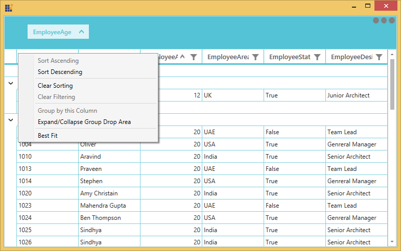

While binding the menu item using CommandBinding you can get the parameter as `GridColumnContextMenuInfo` which contains the particular GridColumn.




<syncfusion:SfDataGrid.HeaderContextMenu>
    <MenuItem Command="{Binding Source={x:Static Member=local:ContextMenuCommands.SortAscending}}"
              CommandParameter="{Binding}"
              Header="Sort Ascending">
    </MenuItem>
</syncfusion:SfDataGrid.HeaderContextMenu>





private static void OnSortAscendingClicked(object obj)
{

    if (obj is GridColumnContextMenuInfo)
    {
        var grid = (obj as GridContextMenuInfo).DataGrid;
        var column = (obj as GridColumnContextMenuInfo).Column;
        grid.SortColumnDescriptions.Clear();
        grid.SortColumnDescriptions.Add(new SortColumnDescription() { ColumnName = column.MappingName, SortDirection = ListSortDirection.Ascending });
    }
}




#### ContextMenu for GroupDropArea

You can set the context menu for the GroupDropArea by using [SfDataGrid.GroupDropAreaContextMenu](http://help.syncfusion.com/cr/cref_files/wpf/sfdatagrid/Syncfusion.SfGrid.WPF~Syncfusion.UI.Xaml.Grid.SfDataGrid~GroupDropAreaContextMenu.html) property. 




<syncfusion:SfDataGrid.GroupDropAreaContextMenu>
    <ContextMenu>
        <MenuItem x:Name=" ExpandAll " Header="ExpandAll" />
        <MenuItem x:Name=" CollapseAll " Header="CollapseAll" />
        <MenuItem x:Name=" ClearGroups " Header="ClearGroups" />
    </ContextMenu>
</syncfusion:SfDataGrid.GroupDropAreaContextMenu>





this.dataGrid.GroupDropAreaContextMenu = new ContextMenu();
this.dataGrid.GroupDropAreaContextMenu.Items.Add(new MenuItem() { Header = "ExpandAll" });
this.dataGrid.GroupDropAreaContextMenu.Items.Add(new MenuItem() { Header = "CollapseAll" });
this.dataGrid.GroupDropAreaContextMenu.Items.Add(new MenuItem() { Header = "ClearGroups" });




While binding the menu item using CommandBinding you can get the parameter as `GroupDropAreaContextMenuInfo`. 




<syncfusion:SfDataGrid.GroupDropAreaContextMenu>
    <MenuItem Command="{Binding Source={x:Static Member=local:ContextMenuCommands.ExpandAll}}"
              CommandParameter="{Binding}"
              Header="Expand All">
    </MenuItem>
</syncfusion:SfDataGrid.GroupDropAreaContextMenu>





private static void OnFullExpandClicked(object obj)
{
 
    if (obj is Syncfusion.UI.Xaml.Grid.GridContextMenuInfo)
    {
        var grid = (obj as Syncfusion.UI.Xaml.Grid.GridContextMenuInfo).DataGrid;
        grid.ExpandAllGroup();
    }
}




#### ContextMenu for GroupDropItem

You can set the context menu for the group drop item by using [SfDataGrid.GroupDropItemContextMenu](http://help.syncfusion.com/cr/cref_files/wpf/sfdatagrid/Syncfusion.SfGrid.WPF~Syncfusion.UI.Xaml.Grid.SfDataGrid~GroupDropItemContextMenu.html) property. 




<syncfusion:SfDataGrid.GroupDropItemContextMenu>
    <ContextMenu>
        <MenuItem x:Name=" ExpandAll " Header="ExpandAll" />
        <MenuItem x:Name=" CollapseAll " Header="CollapseAll" />
        <MenuItem x:Name=" SortAscending " Header="SortAscending" />
        <MenuItem x:Name=" SortDescending " Header="SortDescending" />
        <MenuItem x:Name=" ClearGroup " Header="ClearGroup" />
        <MenuItem x:Name=" ClearSorting " Header="ClearSorting" />
    </ContextMenu>
</syncfusion:SfDataGrid.GroupDropItemContextMenu>





this.dataGrid.GroupDropItemContextMenu = new ContextMenu();
this.dataGrid.GroupDropItemContextMenu.Items.Add(new MenuItem() { Header = "ExpandAll" });
this.dataGrid.GroupDropItemContextMenu.Items.Add(new MenuItem() { Header = "CollapseAll" });
this.dataGrid.GroupDropItemContextMenu.Items.Add(new MenuItem() { Header = "SortAscending" });
this.dataGrid.GroupDropItemContextMenu.Items.Add(new MenuItem() { Header = "SortDescending" });
this.dataGrid.GroupDropItemContextMenu.Items.Add(new MenuItem() { Header = "ClearGroup" });
this.dataGrid.GroupDropItemContextMenu.Items.Add(new MenuItem() { Header = "ClearSorting" });




While binding the menu item using CommandBinding you can get the parameter as `GridColumnContextMenuInfo` which contains the particular GridColumn.




<syncfusion:SfDataGrid.GroupDropItemContextMenu>                            
    <MenuItem Command="{Binding Source={x:Static Member=local:ContextMenuCommands.CollapseAll}}"
              CommandParameter="{Binding}"
              Header="Collapse All">
    </MenuItem>
</syncfusion:SfDataGrid.GroupDropItemContextMenu>





private static void OnFullCollapseClicked(object obj)
{

    if (obj is GridContextMenuInfo)
    {
        var grid = (obj as GridContextMenuInfo).DataGrid;
        grid.CollapseAllGroup();
    }
}




#### ContextMenu for GroupCaptionSummaryRow

You can set the context menu for the group caption by using [SfDataGrid.GroupCaptionContextMenu](http://help.syncfusion.com/cr/cref_files/wpf/sfdatagrid/Syncfusion.SfGrid.WPF~Syncfusion.UI.Xaml.Grid.SfDataGrid~GroupCaptionContextMenu.html) property. 




<syncfusion:SfDataGrid.GroupCaptionContextMenu>
    <ContextMenu>
        <MenuItem x:Name=" Expand " Header="Expand" />
        <MenuItem x:Name=" Collapse " Header="Collapse" />
    </ContextMenu>
</syncfusion:SfDataGrid.GroupCaptionContextMenu>





this.dataGrid.GroupCaptionContextMenu = new ContextMenu();
this.dataGrid.GroupCaptionContextMenu.Items.Add(new MenuItem() { Header = "Expand" });
this.dataGrid.GroupCaptionContextMenu.Items.Add(new MenuItem() { Header = "Collapse" });




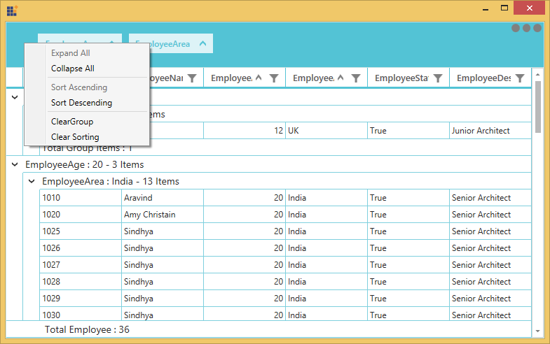

While binding the menu item using CommandBinding you can get the command parameter as `GridRecordContextMenuInfo` which contains the record of the corresponding row.




<syncfusion:SfDataGrid.GroupCaptionContextMenu>
    <MenuItem Command="{Binding Source={x:Static Member=local:ContextMenuCommands.Expand}}"
              CommandParameter="{Binding}"
              Header="Expand" />
</syncfusion:SfDataGrid.GroupCaptionContextMenu>





private static void OnExpandClicked(object obj)
{
 
    if (obj is GridRecordContextMenuInfo)
    {   
        var grid = (obj as GridRecordContextMenuInfo).DataGrid;
        var group = (obj as GridRecordContextMenuInfo).Record as Group;
        grid.ExpandGroup(group);
    }
}




#### ContextMenu for GroupSummaryRow

You can set the context menu for the group summary by using [SfDataGrid.GroupSummaryContextMenu](http://help.syncfusion.com/cr/cref_files/wpf/sfdatagrid/Syncfusion.SfGrid.WPF~Syncfusion.UI.Xaml.Grid.SfDataGrid~GroupSummaryContextMenu.html) property. 




<syncfusion:SfDataGrid.GroupSummaryContextMenu>
    <ContextMenu>
        <MenuItem x:Name="ClearSummary" Header="ClearSummary" />
    </ContextMenu>
</syncfusion:SfDataGrid.GroupSummaryContextMenu>





this.dataGrid.GroupSummaryContextMenu = new ContextMenu();
this.dataGrid.GroupSummaryContextMenu.Items.Add(new MenuItem() { Header = "ClearSummary" });




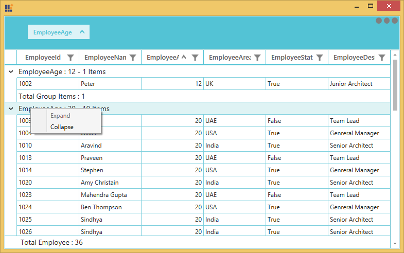

While binding the menu item using CommandBinding you can get the command parameter as `GridRecordContextMenuInfo` which contains the record of the corresponding row.




<syncfusion:SfDataGrid.GroupSummaryContextMenu>
    <MenuItem Command="{Binding Source={x:Static Member=local:ContextMenuCommands.ClearSummary}}"
              CommandParameter="{Binding}"
              Header="Clear Summary">
    </MenuItem>
</syncfusion:SfDataGrid.GroupSummaryContextMenu>





private static void OnClearSummaryClicked(object obj)
{
 
    if (obj is GridRecordContextMenuInfo)
    {
        var grid = (obj as GridRecordContextMenuInfo).DataGrid;
  
        if (grid.GroupSummaryRows.Any())
        grid.GroupSummaryRows.Clear();
    }
}




#### ContextMenu for TableSummaryRow

You can set the context menu for the table summary by using [SfDataGrid.TableSummaryContextMenu](http://help.syncfusion.com/cr/cref_files/wpf/sfdatagrid/Syncfusion.SfGrid.WPF~Syncfusion.UI.Xaml.Grid.SfDataGrid~TableSummaryContextMenu.html) property. 




<syncfusion:SfDataGrid.TableSummaryContextMenu>
    <ContextMenu>
        <MenuItem x:Name="TableSummaryCount" Header="Count" />
        <MenuItem x:Name="TableSummaryMax" Header="Max" />
        <MenuItem x:Name="TableSummaryMin" Header="Min" />
        <MenuItem x:Name="TableSummaryMin" Header="Average" />
        <MenuItem x:Name="TableSummaryMin" Header="Sum" />
    </ContextMenu>
</syncfusion:SfDataGrid.TableSummaryContextMenu>





this.dataGrid.TableSummaryContextMenu = new ContextMenu();
this.dataGrid.TableSummaryContextMenu.Items.Add(new MenuItem() { Header = "Count" });
this.dataGrid.TableSummaryContextMenu.Items.Add(new MenuItem() { Header = "Max" });
this.dataGrid.TableSummaryContextMenu.Items.Add(new MenuItem() { Header = "Min" });
this.dataGrid.TableSummaryContextMenu.Items.Add(new MenuItem() { Header = "Average" });
this.dataGrid.TableSummaryContextMenu.Items.Add(new MenuItem() { Header = "Sum" });




While binding the menu item using CommandBinding you can get the command parameter as `GridRecordContextMenuInfo` which contains the record of the corresponding row.




<syncfusion:SfDataGrid.TableSummaryContextMenu>
    <MenuItem Command="{Binding Source={x:Static Member=local:ContextMenuCommands.TotalSummaryCount}}"
              CommandParameter="{Binding}"
              Header="Count">
    </MenuItem>
</syncfusion:SfDataGrid.TableSummaryContextMenu>





private static void OnTotalSummaryCountClicked(object obj)
{

    if (obj is GridRecordContextMenuInfo)
    {
        var grid = (obj as GridRecordContextMenuInfo).DataGrid;
        var record = (obj as GridRecordContextMenuInfo).Record as SummaryRecordEntry;

        if (record != null)
        {
            var summaryRow = new GridSummaryRow() { Name = "totalGroupSummaryRow", Title = "{totalSummary}", ShowSummaryInRow = true };
            summaryRow.SummaryColumns.Add(new GridSummaryColumn() { Name = "totalSummary", MappingName = "EmployeeId", SummaryType = SummaryType.CountAggregate, Format = "Total Employee Count : {Count}" });
            grid.TableSummaryRows.Clear();
            grid.TableSummaryRows.Add(summaryRow);
        }
    }
}




### Events

#### GridContextMenuOpening

[GridContextMenuOpening](http://help.syncfusion.com/cr/cref_files/wpf/sfdatagrid/Syncfusion.SfGrid.WPF~Syncfusion.UI.Xaml.Grid.SfDataGrid~GridContextMenuOpening_EV.html) event occurs while opening the context menu in SfDataGrid. 

[GridContextMenuEventArgs](http://help.syncfusion.com/cr/cref_files/wpf/sfdatagrid/Syncfusion.SfGrid.WPF~Syncfusion.UI.Xaml.Grid.GridContextMenuEventArgs.html) has the following members which provides the information about `GridContextMenuOpening` event.

[ContextMenu](http://help.syncfusion.com/cr/cref_files/wpf/sfdatagrid/Syncfusion.SfGrid.WPF~Syncfusion.UI.Xaml.Grid.GridContextMenuEventArgs~ContextMenu.html) – Gets the corresponding context menu.

[ContextMenuInfo](http://help.syncfusion.com/cr/cref_files/wpf/sfdatagrid/Syncfusion.SfGrid.WPF~Syncfusion.UI.Xaml.Grid.GridContextMenuEventArgs~ContextMenuInfo.html) – Returns the context menu info based on the row which opens the context menu.

[ContextMenuType](http://help.syncfusion.com/cr/cref_files/wpf/sfdatagrid/Syncfusion.SfGrid.WPF~Syncfusion.UI.Xaml.Grid.GridContextMenuEventArgs~ContextMenuType.html) – Returns the type of context menu.

[RowColumnIndex](http://help.syncfusion.com/cr/cref_files/wpf/sfdatagrid/Syncfusion.SfGrid.WPF~Syncfusion.UI.Xaml.Grid.GridContextMenuEventArgs~RowColumnIndex.html) – RowColumnIndex of the context menu which is currently going to open. RowColumnIndex is updated only for the RecordContextMenu and remains left empty.

[Handled](http://help.syncfusion.com/cr/cref_files/wpf/sfdatagrid/Syncfusion.SfGrid.WPF~Syncfusion.UI.Xaml.Grid.GridHandledEventArgs~Handled.html) – Indicates whether the `GridContextMenuOpening` event is handled or not.

### Customization of context menu

#### Change the menu item when the context menu opening.

You can use the GridContextMenuOpening event to change the menu item when the context menu opening.




<syncfusion:SfDataGrid.RecordContextMenu>
    <ContextMenu>
        <MenuItem Command="{Binding Source={x:Static Member=local:ContextMenuCommands.Cut}}"
                  CommandParameter="{Binding}"
                  Header="Cut">
        </MenuItem>
        <MenuItem Command="{Binding Source={x:Static Member=local:ContextMenuCommands.Copy}}"
                  CommandParameter="{Binding}"
                  Header="Copy">
        </MenuItem>
        <MenuItem Command="{Binding Source={x:Static Member=local:ContextMenuCommands.Paste}}"
                  CommandParameter="{Binding}"
        Header="Paste">
        </MenuItem>
    </ContextMenu>
</syncfusion:SfDataGrid.RecordContextMenu>





this.dataGrid.GridContextMenuOpening += dataGrid_GridContextMenuOpening;

void dataGrid_GridContextMenuOpening(object sender, GridContextMenuEventArgs e)
{
    e.ContextMenu.Items.Clear();

    if(e.ContextMenuType == ContextMenuType.RecordCell)
    {
        e.ContextMenu.Items.Add(new MenuItem() { Header="Record"});
        e.ContextMenu.Items.Add(new MenuItem() { Header = "Data" });
    }
}



       

#### Changing background to the ContextMenu

You can change the appearance of the context menu by customizing the style with TargetType as ContextMenu.




<ContextMenu>
    <MenuItem x:Name="Cut" Header="Cut" />
    <MenuItem x:Name="Copy" Header="Copy" />
    <MenuItem x:Name="Paste" Header="Paste" />
</ContextMenu>




## ColumnChooser

SfDataGrid allows you to show and hide the Columns from the view at runtime via drag and drop using ColumnChooser. You can enable a column chooser in an application by creating an instance for GridColumnChooserController and assign to SfDataGrid.GridColumnDragDropController.

While dropping columns in ColumnChooser window, the particular column will hided by setting GridColumn.IsHidden as true.




ColumnChooser chooserWindow;

void MainWindow_Loaded(object sender, RoutedEventArgs e)
{
    chooserWindow = new ColumnChooser(this.dataGrid);
    chooserWindow.Resources.MergedDictionaries.Clear();
    chooserWindow.ClearValue(ColumnChooser.StyleProperty);

    //Resources has been added to the Merged Dictionaries     
    chooserWindow.Resources.MergedDictionaries.Add(this.MainGrid.Resources.MergedDictionaries[0]);
    this.dataGrid.GridColumnDragDropController = new GridColumnChooserController(this.dataGrid, chooserWindow);

    //ColumnChooser Window will open
    chooserWindow.Show();
    chooserWindow.Owner = this;
}




### Custom ColumnChooser

You can create custom UI for the column chooser and you can enable this view manually like below code example. You need to maintain separate collection in ViewModel to maintain the hidden columns which will bound to custom view.




<syncfusion:ChromelessWindow >    
    <Grid>
        <Grid.RowDefinitions>
            <RowDefinition Height="*" />
            <RowDefinition Height="50" />
        </Grid.RowDefinitions>
        <ListBox x:Name="listBox"
                 Grid.Row="0"
                 Margin="0,5"
                 HorizontalAlignment="Stretch"
                 BorderThickness="0"
                 ItemContainerStyle="{StaticResource ListBoxItemStyle1}"
                 ItemsSource="{Binding ColumnCollection}">
            <ListBox.ItemTemplate>
                <StaticResource ResourceKey="MyDataTemplate" />
            </ListBox.ItemTemplate>
        </ListBox>
        <StackPanel Grid.Row="1" Margin="20,0,0,0"
                    VerticalAlignment="Stretch"
                    Background="Transparent"
                    Orientation="Horizontal">
            <Button Margin="5"
                    Click="OKButton_Click"
                    Content="OK"
                    Style="{StaticResource ButtonStyle}" />
            <Button Margin="5"
                    Content="Cancel"
                    IsCancel="True"
                    Style="{StaticResource ButtonStyle}" />
        </StackPanel>
    </Grid>
    <syncfusion:ChromelessWindow.Resources>
        
        <SolidColorBrush x:Key="Item.MouseOver.Background" Color="#1F26A0DA" />
        <SolidColorBrush x:Key="Item.MouseOver.Border" Color="#a826A0Da" />
        <SolidColorBrush x:Key="Item.SelectedInactive.Background" Color="#3DDADADA" />
        <SolidColorBrush x:Key="Item.SelectedInactive.Border" Color="#FFDADADA" />
        <SolidColorBrush x:Key="Item.SelectedActive.Background" Color="#3D26A0DA" />
        <SolidColorBrush x:Key="Item.SelectedActive.Border" Color="#FF26A0DA" />
        
        //ListBoxItem is Customized through the DataTemplate
        
    </syncfusion:ChromelessWindow.Resources>
</syncfusion:ChromelessWindow>







var visibleColumns = this.AssociatedObject.dataGrid.Columns;
ObservableCollection<ColumnChooserItems> totalColumns = GetColumnsDetails(visibleColumns);
CustomColumnChooserViewModel chooserViewModel = new CustomColumnChooserViewModel(totalColumns);
CustomColumnChooser ColumnChooserView = new CustomColumnChooser(chooserViewModel);
ColumnChooserView.Owner = Application.Current.MainWindow;
chooserWindow.Visibility = System.Windows.Visibility.Collapsed;

if ((bool)ColumnChooserView.ShowDialog())
    ClickOKButton(chooserViewModel.ColumnCollection, this.AssociatedObject.dataGrid);
viewModel.ShowColumnChooser = false;

//This will add or remove the Columns from the SfDataGrid

public void ClickOKButton(ObservableCollection<ColumnChooserItems> ColumnCollection, SfDataGrid dataGrid)
{

    foreach (var item in ColumnCollection)
    {
        var column = dataGrid.Columns.FirstOrDefault(v => v.MappingName == item.Name);

        if (column != null)
        {

            if (item.IsChecked == false && !column.IsHidden)
            column.IsHidden = true;

            else if (item.IsChecked == true && column.IsHidden == true)
            {

                if (column.Width == 0)
                    column.Width = 150;
                column.IsHidden = false;
            }
        }
    }
viewModel.ShowColumnChooser = false;
}




### Appearance Customization

You can change the default appearance of the column chooser window by customizing the style of ColumnChooser. You can directly change the Title and WaterMarkText like the below code example.




ColumnChooser chooserWindow;

void MainWindow_Loaded(object sender, RoutedEventArgs e)
{
    chooserWindow = new ColumnChooser(this.dataGrid);
    chooserWindow.Resources.MergedDictionaries.Clear();
    chooserWindow.ClearValue(ColumnChooser.StyleProperty);            
    chooserWindow.Resources.MergedDictionaries.Add(this.MainGrid.Resources.MergedDictionaries[0]);
    this.dataGrid.GridColumnDragDropController = new GridColumnChooserController(this.dataGrid, chooserWindow);
    chooserWindow.Title = "Columns";
    chooserWindow.WaterMarkText = "Drag the columns";
    chooserWindow.Show();
    chooserWindow.Owner = this;
}




## RowHeader

RowHeader is a special type of column used to indicate the currently focused row, editing status, and validation status. You can enable the RowHeader by setting [SfDataGrid.ShowRowHeader](http://help.syncfusion.com/cr/cref_files/wpf/sfdatagrid/Syncfusion.SfGrid.WPF~Syncfusion.UI.Xaml.Grid.SfGridBase~ShowRowHeader.html) property to true. 




<syncfusion:SfDataGrid x:Name="dataGrid"
ShowRowHeader="True"
ItemsSource="{Binding Orders}"  />





dataGrid.ShowRowHeader = true;




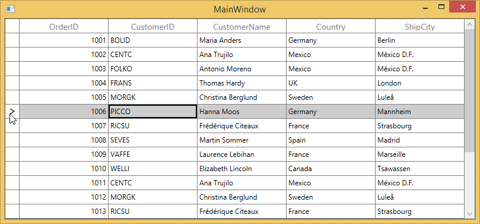

You can change the default width of the RowHeader by using [SfDataGrid.RowHeaderWidth](http://help.syncfusion.com/cr/cref_files/wpf/sfdatagrid/Syncfusion.SfGrid.WPF~Syncfusion.UI.Xaml.Grid.SfGridBase~RowHeaderWidth.html) property.



<syncfusion:SfDataGrid x:Name="dataGrid"
                       ShowRowHeader="True"
                       RowHeaderWidth="50"
                       ItemsSource="{Binding Orders}"  />



dataGrid.RowHeaderWidth = 50;



### Customizing RowHeader 

#### Display the RowIndex to the RowHeaderCell

You can display the corresponding row index in each RowHeader, by customizing the ControlTemplate of GridRowHeaderCell. You have to bind the RowIndex property to TextBlock.Text like the below code example.







You can get the sample from [here](http://www.syncfusion.com/downloads/support/directtrac/general/ze/WPF-13678149272112665828.zip).

#### Change the CurrentRow Indicator

You can change the CurrentRowIndicator in the RowHeader by customizing the control template of GridRowHeaderCell.







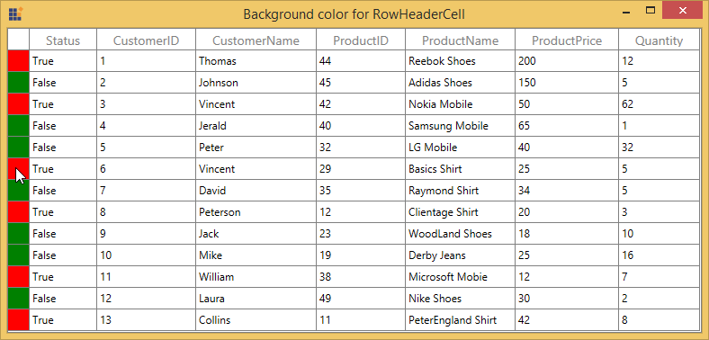

You can get the sample from [here](http://www.syncfusion.com/downloads/support/directtrac/general/ze/ChangingCurrentRowIndicator257326168.zip).

#### Change the BackGround of the RowHeader 

You can change the background color of the RowHeader by customizing the style of the GridRowHeaderCell. You can change the background color with the converter based on the underlying collection.




<Application.Resources>       
    <local:CustomConverter x:Key="converter"/>
    <!--Customizing the RowHeader style--> 
    
</Application.Resources>





public class CustomConverter:IValueConverter
{
 
    public object Convert(object value, Type targetType, object parameter, System.Globalization.CultureInfo culture)
    {

        //Type casting the value as Data class(Business logic)
        var data = value as Data;

        //The Red color is applied to RowHeader if the status value is true otherwise the white color is applied 

        if (data.Status == true)
            return Brushes.Red;

        else
            return Brushes.Green;
    }
    
    public object ConvertBack(object value, Type targetType, object parameter, System.Globalization.CultureInfo culture)
    {
        throw new NotImplementedException();
    }
}




You can get the sample from [here](http://www.syncfusion.com/downloads/support/directtrac/general/ze/BackgroundColorForRowHeader_WPF18250214901515913833.zip).

## ToolTip

ToolTip provides the support to show the pop-up window that displays the information when the mouse hovers in cells of SfDataGrid. You can enable the ToolTip for the GridCell by setting the [SfDataGrid.ShowToolTip](http://help.syncfusion.com/cr/cref_files/wpf/sfdatagrid/Syncfusion.SfGrid.WPF~Syncfusion.UI.Xaml.Grid.SfGridBase~ShowToolTip.html) as true.




<syncfusion:SfDataGrid x:Name="dataGrid" 
                       AutoGenerateColumns="True"
                       ShowToolTip="True"
                       ItemsSource="{Binding Orders}" >
</syncfusion:SfDataGrid>





this.dataGrid.ShowToolTip = true;




You can enable the ToolTip for the particular column by setting the [GridColumn.ShowToolTip](http://help.syncfusion.com/cr/cref_files/wpf/sfdatagrid/Syncfusion.SfGrid.WPF~Syncfusion.UI.Xaml.Grid.GridColumnBase~ShowToolTip.html) as true.




<syncfusion:SfDataGrid.Columns>
    <syncfusion:GridTextColumn HeaderText="Order ID" ShowToolTip="True" MappingName="OrderID" />
    <syncfusion:GridTextColumn HeaderText="CustomerID" ShowToolTip="True" MappingName="CustomerID" />
</syncfusion:SfDataGrid.Columns>





this.dataGrid.Columns["OrderID"].ShowToolTip = true;




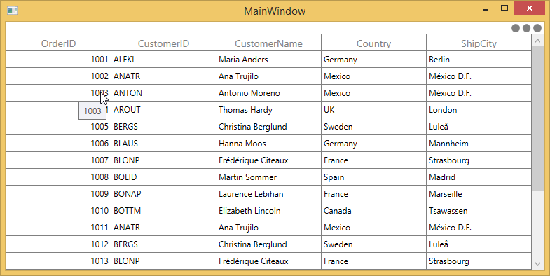

N> takes higher priority than [SfDataGrid.ShowToolTip](http://help.syncfusion.com/cr/cref_files/wpf/sfdatagrid/Syncfusion.SfGrid.WPF~Syncfusion.UI.Xaml.Grid.SfGridBase~ShowToolTip.html).

You can enable the ToolTip for the header cell by setting the [GridColumn.ShowHeaderToolTip](http://help.syncfusion.com/cr/cref_files/wpf/sfdatagrid/Syncfusion.SfGrid.WPF~Syncfusion.UI.Xaml.Grid.GridColumnBase~ShowHeaderToolTip.html) as true.




<syncfusion:SfDataGrid.Columns>
<syncfusion:GridTextColumn HeaderText="Order ID" ShowHeaderToolTip="True" MappingName="OrderID" />
</syncfusion:SfDataGrid.Columns>





this.dataGrid.Columns["OrderID"].ShowHeaderToolTip = true;




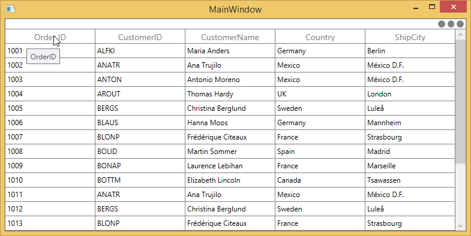

### ToolTip Customization

You can change the appearance of the ToolTip by customizing the style with TargetType as ToolTip.




<Window.Resources>
    
</Window.Resources>

<syncfusion:SfDataGrid.Columns>
    <syncfusion:GridTextColumn HeaderText="Order ID"  ShowToolTip="True" MappingName="OrderID" />
</syncfusion:SfDataGrid.Columns>




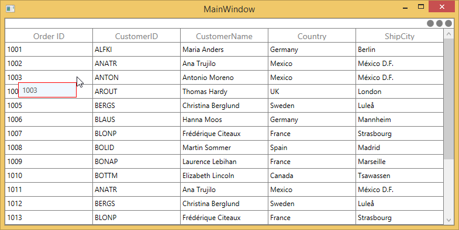

You can customize the template of ToolTip by using the [GridColumn.ToolTipTemplate](http://help.syncfusion.com/cr/cref_files/wpf/sfdatagrid/Syncfusion.SfGrid.WPF~Syncfusion.UI.Xaml.Grid.GridColumnBase~ToolTipTemplate.html) and [GridColumn.ToolTipTemplateSelector](http://help.syncfusion.com/cr/cref_files/wpf/sfdatagrid/Syncfusion.SfGrid.WPF~Syncfusion.UI.Xaml.Grid.GridColumnBase~ToolTipTemplateSelector.html) properties. 

#### Customize the ToolTip using ToolTipTemplate

You can customize the appearance of the ToolTip for particular column by setting `GridColumn.ToolTipTemplate`. And you can also customize the appearance of header ToolTip for particular column by [GridColumn.HeaderToolTipTemplate](http://help.syncfusion.com/cr/cref_files/wpf/sfdatagrid/Syncfusion.SfGrid.WPF~Syncfusion.UI.Xaml.Grid.GridColumnBase~HeaderToolTipTemplate.html) property.




<Window.Resources>
    <local:StringToImageConverter x:Key="ImageConverter" />        
    <DataTemplate x:Key="TemplateToolTip">
        <Image Height="100" Width="100" Source="{Binding CustomerID,Converter={StaticResource ImageConverter}}" />
    </DataTemplate>
</Window.Resources>

<syncfusion:SfDataGrid.Columns>
    <syncfusion:GridTextColumn HeaderText="Order ID"  ShowToolTip="True" MappingName="OrderID" />
    <syncfusion:GridTextColumn HeaderText="CustomerID" ToolTipTemplate="{StaticResource TemplateToolTip}" ShowToolTip="True" MappingName="CustomerID" />
</syncfusion:SfDataGrid.Columns>




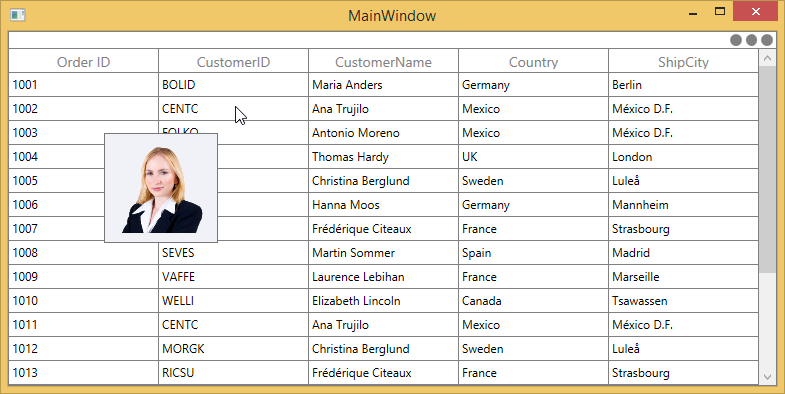

You can get the sample from [here](http://www.syncfusion.com/downloads/support/directtrac/general/ze/ToolTipTemplateSample-904850425.zip). 

#### Customize the ToolTip with ToolTipTemplateSelector

The different ToolTip template can be loaded in a same column conditionally based on data by setting `GridColumn.ToolTipTemplateSelector`




<Window.Resources>
    <DataTemplate x:Key="ToolTip1">
        <Grid>
            <Rectangle Fill="Transparent"/>
            <TextBlock Text="{Binding OrderID}" FontWeight="Bold" Background="LightPink"/>
        </Grid>
    </DataTemplate>
    <DataTemplate x:Key="ToolTip2">
        <Grid>
            <Rectangle Fill="Transparent"/>
            <TextBlock Text="{Binding OrderID}" FontStyle="Italic" Background="LightGreen"/>
        </Grid>
    </DataTemplate>
</Window.Resources>

<syncfusion:SfDataGrid.Columns>
    <syncfusion:GridTextColumn HeaderText="Order ID" ShowToolTip="True" MappingName="OrderID" >
        <syncfusion:GridTextColumn.ToolTipTemplateSelector>
            <local:ToolTipTemplateSelector  
                   AlternateTemplate="{StaticResource ToolTip2}"  
                   DefaultTemplate="{StaticResource ToolTip1}" />
        </syncfusion:GridTextColumn.ToolTipTemplateSelector>
    </syncfusion:GridTextColumn>
</syncfusion:SfDataGrid.Columns>







public class ToolTipTemplateSelector : DataTemplateSelector
{
    private DataTemplate _defaultTemplate;
    
    /// 

    /// Gets or sets DefaultTemplate.
    /// 

 
    public DataTemplate DefaultTemplate
    {
        get { return _defaultTemplate; }
        set { _defaultTemplate = value; }
    }

    private DataTemplate _alternateTemplate;
    
    /// 

    /// Gets or Sets AlternateTemplate.
    /// 

    public DataTemplate AlternateTemplate
    {
        get { return _alternateTemplate; }
        set { _alternateTemplate = value; }
    }

    public override System.Windows.DataTemplate SelectTemplate(object item, System.Windows.DependencyObject container)
    {

        //The item that comes from ToolTipTemplate is DataContextHelper. When set SetCellBoundValue to true, it sets DataContextHelper as DataContext to DataTemplate. Refer property section of CellTemplate.
        OrderInfo dataUnit = item as OrderInfo;

        if (dataUnit == null) return this.DefaultTemplate;

        //use reflection to retrieve property
        Type type = dataUnit.GetType();
        PropertyInfo property = type.GetProperty("OrderID");

        //To see what template needs to be select according to the specified property value.

        if (property.GetValue(dataUnit, null).ToString().Contains('9') || property.GetValue(dataUnit, null).ToString().Contains('4'))
            return this.AlternateTemplate;

        else
            return this.DefaultTemplate;
    }
}




The below image refers the DefaultTemplate which is applied through ToolTipTemplateSelector.

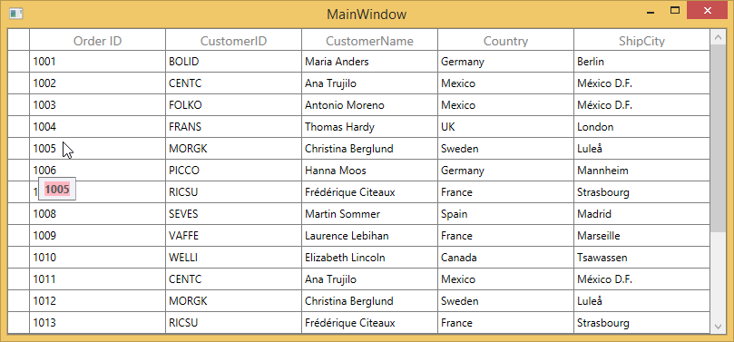

The below image refers the AlternateTemplate which is applied through ToolTipTemplateSelector.

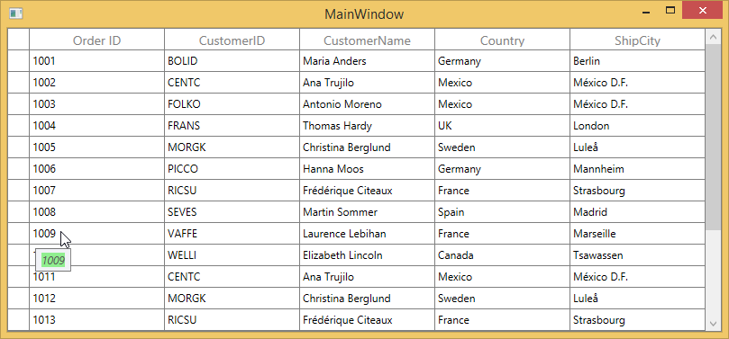

You can get the sample from [here](http://www.syncfusion.com/downloads/support/directtrac/general/ze/IEnumerableBinding_Demo-1708191985.zip).

## Drag and Drop Rows

SfDataGrid don’t have the direct support for the row drag and drop. You can achieve this drag and drop by overriding the SelectionController class. The dragging will be initiated in ProcessPointerPressed method and the PopupContentControl is used to show the dragging record information.
You can drag and drop records between two groups which is done through DragAndDropWhenGroup method. You can use SfDataGrid.AutoScroller to scroll the grid while dragging the record.




public class GridSelectionControllerExt : GridSelectionController
{
    #region Fields
    public Popup popup;
    public Popup upArrowIndicator;
    public Popup downArrowIndicator;
    public DraggablePopupContentControl draggablePopupContentControl = null;

    NodeEntry _draggingRecordEntry = null;
    private bool _isDragging;
        
    int previousRowIndex = -1;
    #endregion

    #region Properties

    public bool IsDragging
    {
        get { return _isDragging; }
        set { _isDragging = value; }
    }

    public VisualContainer visualContainer = null;

    #endregion

    #region ctr

    public GridSelectionControllerExt(SfDataGrid sfDataGrid)
        : base(sfDataGrid)
    {
        this.DataGrid.Loaded += DataGrid_Loaded;
    }

    void DataGrid_Loaded(object sender, RoutedEventArgs e)
    {
        visualContainer = this.DataGrid.GetVisualContainer();
        this.DataGrid.AutoScroller = new AutoScrollerExt();
        UpdateAutoScroller();
    }

    #endregion

    #region Overrides

    protected override void ProcessPointerPressed(MouseButtonEventArgs args, RowColumnIndex rowColumnIndex)
    {
        base.ProcessPointerPressed(args, rowColumnIndex);
   
        if (rowColumnIndex.RowIndex >= this.DataGrid.ResolveStartIndexBasedOnPosition() && rowColumnIndex.ColumnIndex == 0)
        {
            _draggingRecordEntry = DataGrid.GetNodeEntry(rowColumnIndex.RowIndex);
   
            if (_draggingRecordEntry.IsGroups)
                this.DataGrid.View.TopLevelGroup.ResetCache = true;
   
            if (!_draggingRecordEntry.IsRecords)
            {
                _draggingRecordEntry = null;
                return;
            }
            _isDragging = true;
            InitializePopupControl();

            // Get the exact position where this mouse pointer is pressed
            var p = args.GetPosition(this.visualContainer);                

            var gridRect = this.GetControlRect(this.DataGrid);

            // Set the Horizontal and Vertical offset for popup screen
            popup.HorizontalOffset = p.X;
            popup.VerticalOffset = p.Y;

            //Show the Drag indicator            
            this.ShowDragIndication(gridRect, p);
            popup.IsOpen = true;
            this.SuspendAutoScrolling = true;
            draggablePopupContentControl.CaptureMouse();
        }
    }
    
    #endregion

    #region Events of DraggablePopupContentControl

    private void OnDrop(object sender, MouseButtonEventArgs e)
    {
    
        if (!this.IsDragging || this.popup == null)
            return;

        if (_draggingRecordEntry.Parent != null)
            DragAndDropWhenGroup(e);
    
        else
            DragAndDropWithRecord(e);

        _isDragging = false;
        popup.IsOpen = false;
        upArrowIndicator.IsOpen = false;
        downArrowIndicator.IsOpen = false;
        this.DataGrid.AutoScroller.AutoScrolling = AutoScrollOrientation.None;
    }

    private void DragOver(object sender, MouseEventArgs e)
    {            

        if (!IsDragging || this.popup == null || !(sender is DraggablePopupContentControl))
            return;
        this.draggablePopupContentControl.CaptureMouse();
        var p = e.GetPosition(this.visualContainer);            

        if (!IsPointInsideSfDataGrid(p))
        {
            var pointToContentControl = draggablePopupContentControl.PointToScreen(e.GetPosition(draggablePopupContentControl));
            popup.HorizontalOffset = p.X;
            popup.VerticalOffset = p.Y;
            upArrowIndicator.IsOpen = downArrowIndicator.IsOpen = false;
            var visual = this.DataGrid.GetVisualContainer();
            this.SuspendAutoScrolling = true;
            this.DataGrid.AutoScroller.AutoScrolling = AutoScrollOrientation.Vertical;
        }

        else
        {

            // Set the Horizontal and Vertical offset for popup screen
            popup.HorizontalOffset = p.X;
            popup.VerticalOffset = p.Y;
            this.ShowDragIndication(this.GetControlRect(this.DataGrid), p);
            popup.IsOpen = true;
        }
        (this.DataGrid.AutoScroller as AutoScrollerExt).MousePoint = e.GetPosition(this.DataGrid);
        e.Handled = true;
    }

    #endregion

    #region Methods

    void UpdateAutoScroller()
    {
        this.DataGrid.AutoScroller.VisualContainer = this.visualContainer;
        this.DataGrid.AutoScroller.AutoScrollBounds = this.visualContainer.GetClipRect(ScrollAxisRegion.Header, ScrollAxisRegion.Footer);
        this.DataGrid.AutoScroller.IntervalTime = new TimeSpan(0, 0, 0, 0, 40);
        this.DataGrid.AutoScroller.InsideScrollMargin = new Size(0, 0);
    }

    private void InitializePopupControl()
    {

        if (this.popup != null)
        {
            draggablePopupContentControl.DataContext = _draggingRecordEntry;
            return;
        }

        //Initialize Popup, UpArrow, DownArrow and DraggablePopupContentControl
        popup = new Popup();
        upArrowIndicator = new Popup();
        downArrowIndicator = new Popup();
        draggablePopupContentControl = new DraggablePopupContentControl(this.DataGrid) { DataContext = _draggingRecordEntry };

        //Set width and Height of popup
        popup.Height = 110;
        popup.Width = 250;

        //Set the placement target for popup ,UpArrowIndicator and DownArrowIndicator
        popup.Placement = PlacementMode.Relative;
        popup.PlacementTarget = this.visualContainer;
        popup.AllowsTransparency = true;

        upArrowIndicator.Placement = PlacementMode.Relative;
        upArrowIndicator.PlacementTarget = this.visualContainer;
        upArrowIndicator.AllowsTransparency = true;

        downArrowIndicator.Placement = PlacementMode.Relative;
        downArrowIndicator.PlacementTarget = this.visualContainer;
        downArrowIndicator.AllowsTransparency = true;

        popup.Child = draggablePopupContentControl;
        upArrowIndicator.Child = new UpIndicatorContentControl();
        downArrowIndicator.Child = new DownIndicatorContentControl();

        draggablePopupContentControl.PreviewMouseMove += DragOver;
        draggablePopupContentControl.PreviewMouseLeftButtonUp += OnDrop;
    }

    private void ShowDragIndication(Rect gridRect, Point mousePoint)
    {
        var currentRowColumnIndex = visualContainer.PointToCellRowColumnIndex(Mouse.GetPosition(visualContainer));

        if (currentRowColumnIndex.IsEmpty || currentRowColumnIndex.RowIndex < this.DataGrid.ResolveStartIndexBasedOnPosition())
            return;

        int currentRecordIndex = this.DataGrid.ResolveToRecordIndex(currentRowColumnIndex.RowIndex);
 
        if (currentRecordIndex == -1)
            return;

        var rowGenerator = this.DataGrid.GetRowGenerator();
        var nodeEntry = DataGrid.GetNodeEntry(currentRowColumnIndex.RowIndex);

        if (!nodeEntry.IsRecords)
            return;
        var recordUnderMouse = nodeEntry as RecordEntry;
        var dataRow = rowGenerator.Items.FirstOrDefault(row => (row.RowType != RowType.HeaderRow && (row.RowData as Orders) == recordUnderMouse.Data as Orders)) as DataRowBase;
 
        //Get the WholeRowElement for DataRow
        var wholeRowElement = dataRow.GetType().GetField("WholeRowElement", BindingFlags.NonPublic | BindingFlags.Instance).GetValue(dataRow) as VirtualizingCellsControl;
 
        //Get the mouse point position on the VirtualizingCellsControl
        var mousePointOnVirtualizingCellsControl = Mouse.GetPosition(wholeRowElement);
 
        //Set the Horizontal and Vertical Offset for UpArrowIndicator and DownArrowIndicator
        upArrowIndicator.HorizontalOffset = DataGrid.RowHeaderWidth;
        downArrowIndicator.HorizontalOffset = DataGrid.RowHeaderWidth;

        //Check whether the mouse point is on the top or end of the Row element 
 
        if (currentRecordIndex != previousRowIndex || (currentRecordIndex == previousRowIndex && mousePointOnVirtualizingCellsControl.Y < this.DataGrid.RowHeight / 2))
        {
            previousRowIndex = currentRecordIndex;

            upArrowIndicator.VerticalOffset = mousePoint.Y - mousePointOnVirtualizingCellsControl.Y;
            downArrowIndicator.VerticalOffset = mousePoint.Y - (mousePointOnVirtualizingCellsControl.Y + 22);
        }
 
        else if (currentRecordIndex == previousRowIndex && mousePointOnVirtualizingCellsControl.Y > this.DataGrid.RowHeight / 2)
        {
            upArrowIndicator.VerticalOffset = mousePoint.Y + (this.DataGrid.RowHeight - mousePointOnVirtualizingCellsControl.Y);
            downArrowIndicator.VerticalOffset = mousePoint.Y + (this.DataGrid.RowHeight - mousePointOnVirtualizingCellsControl.Y) - 22;
        }

        upArrowIndicator.IsOpen = true;
        downArrowIndicator.IsOpen = true;
    }

    private void DragAndDropWhenGroup(MouseButtonEventArgs e)
    {
        var point = e.GetPosition(visualContainer);
        var rowColumnIndex = visualContainer.PointToCellRowColumnIndex(point);
        bool isSameGroup = false;

        if (!_isDragging)
            return;

        // Get the droppingRecordEntry using RowIndex            
        var droppingRecordEntry = DataGrid.GetNodeEntry(rowColumnIndex.RowIndex);

        if (droppingRecordEntry == null)
            return;

        if (!droppingRecordEntry.IsRecords)
            return;

        if (droppingRecordEntry.Parent == _draggingRecordEntry.Parent)
            isSameGroup = true;

        if (_draggingRecordEntry == droppingRecordEntry)
        {
            return;
        }
        var draggingGroup = _draggingRecordEntry.Parent as Group;
        draggingGroup.RemoveRecord(_draggingRecordEntry as RecordEntry, true);
        draggingGroup.SetDirty();
        int indexOfDroppingRecord = (droppingRecordEntry.Parent as Group).Records.IndexOf(droppingRecordEntry as RecordEntry);
 
        if (!isSameGroup)
        {
            _draggingRecordEntry.Parent = null;
        }
        _draggingRecordEntry.Parent = droppingRecordEntry.Parent;
        (droppingRecordEntry.Parent as Group).InsertRecord(indexOfDroppingRecord, _draggingRecordEntry as RecordEntry, true);
        this.DataGrid.View.TopLevelGroup.ResetCache = true;
        this.DataGrid.View.TopLevelGroup.SetDirty();
        this.DataGrid.GetGridModel().RefreshView(true);
        this.DataGrid.SelectedItem = ((_draggingRecordEntry.Parent as Group).Records[indexOfDroppingRecord] as RecordEntry).Data;
    }

    private void DragAndDropWithRecord(MouseButtonEventArgs e)
    {            
        var point = e.GetPosition(visualContainer);
        var upArrowPoint = new Point(upArrowIndicator.HorizontalOffset, upArrowIndicator.VerticalOffset- 22 );
        var downArrowPoint = new Point(downArrowIndicator.HorizontalOffset, downArrowIndicator.VerticalOffset + 22);            
        var rowColumnIndex = visualContainer.PointToCellRowColumnIndex(point);
        var currentRowIndex = DataGrid.ResolveToRowIndex(_draggingRecordEntry);

        point = rowColumnIndex.RowIndex >  currentRowIndex ? upArrowPoint : downArrowPoint;
        
        rowColumnIndex = visualContainer.PointToCellRowColumnIndex(point);
 
        if (!_isDragging)
            return;
 
        if (!(this.DataGrid is DetailsViewDataGrid))
        {
            var vm = DataGrid.DataContext as ViewModel;
 
            if (!rowColumnIndex.IsEmpty)
            {
 
                // Get the RecordIndex using RowIndex
                var index = DataGrid.ResolveToRecordIndex(rowColumnIndex.RowIndex);
 
                if (index != -1)
                {
                    var dragRecord = (_draggingRecordEntry as RecordEntry).Data as Orders;
 
                    // Remove the Selected Row Data from Source
                    vm.OrderDetails.Remove(dragRecord);
 
                    // Add the removed Selected Row Data to Source based on RecordIndex
                    vm.OrderDetails.Insert(index, dragRecord);
 
                    // Selected Item is reset with new data
                    DataGrid.SelectedItem = vm.OrderDetails[index];
                }
 
                else
                {
                    var dragRecord = (_draggingRecordEntry as RecordEntry).Data as Orders;
 
                    // Remove the Selected Row Data from Dragging SfDataGrid 
                    vm.OrderDetails.Remove(dragRecord);
 
                    // Insert the Selected row data to specified index position of dropping SfDataGrid
                    vm.OrderDetails.Insert(index + 1, dragRecord);
 
                    // Selected Item is reset with new dropped row data
                    DataGrid.SelectedItem = (_draggingRecordEntry as RecordEntry).Data;
                    this.MoveCurrentCell(new RowColumnIndex(rowColumnIndex.RowIndex + 1, 1));
                }
            }
 
            else
            {
                return;
            }
        }
    }
    #endregion

    #region HelperMethods

    internal Rect GetControlRect(FrameworkElement control)
    {
        var locationFromWindow = control.TranslatePoint(new Point(0, 0), control);
        var locationFromScreen = locationFromWindow;
        return new Rect((locationFromScreen.X - locationFromWindow.X),
                            (locationFromScreen.Y - locationFromWindow.Y),
                            control.ActualWidth, control.ActualHeight);
    }

    private bool IsPointInsideSfDataGrid(Point point)
    {
        return this.GetControlRect(this.DataGrid).Contains(point);
    }

    public override void Dispose()
    {
        base.Dispose();
        if (draggablePopupContentControl == null) return;
        draggablePopupContentControl.PreviewMouseMove -= DragOver;
        draggablePopupContentControl.PreviewMouseLeftButtonUp -= OnDrop;
        draggablePopupContentControl.Dispose();
    }
    #endregion
}




You can get the sample from [here](http://www.syncfusion.com/downloads/support/directtrac/general/ze/DragAndDropDemo-1353683226.zip). In the sample you can get the Popup for the drag and drop rows.

