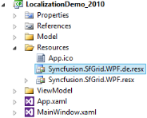
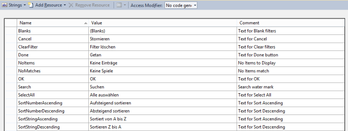

# Localization

This section explains you how to integrate Localization in your application. You can also see the available properties for the Localization in DataGrid.

### Overview

Localization is the process of making your application in different language depending on your culture. The culture is defined as combination of language and location .For example En-US is the culture for English spoken in United States. 

DataGrid allows you to set custom resource using Resx file. You can define your string values in resource file for a specific culture and set the culture in your application.The given string value is set to the Grid.

The following steps illustrate how to implement the Localization support in your application.

* Create WPF application and add the SfDataGrid to it.
* Create folder names as ‘Resources’ in your application,
* Create Resx(resource) file and name it as Syncfusion.SfGrid.WPF<your culture info name>.resx. For example, Syncfusion.SfGrid.WPF.de.resx.
* Add default Resx (resource) file in the Resource folder named as Syncfusion.SfGrid.WPF.resx.

_Adding default resource file in resource folder_

* Enter the Name and Value in Resource file. 

_Entering Name and Value in Resource file_

### Set Culture Information in Application:

The CultureInformation is set in the Application before the InitializeComponent() method is called. Now, the Application is set to the German Culture info. The following code example explains the implementation of this,



[C#]

public partial class MainWindow :Window

 {

    public MainWindow()

    {

     System.Threading.Thread.CurrentThread.CurrentUICulture =new System.Globalization.CultureInfo("de");

            InitializeComponent();

    }

 }


The following screenshot displays the output.

_Culture Information in Application_

Properties:

_Property Table_

<table>
<tr>
<td>
Property</td><td>
Value</td><td>
Descriptions</td></tr>
<tr>
<td>
AddNewRowText</td><td>
Click here to add a new row</td><td>
Add new row watermark text.</td></tr>
<tr>
<td>
AdvancedFiltersButtonText</td><td>
Advanced Filters</td><td>
Text for Advanced Filters button</td></tr>
<tr>
<td>
After</td><td>
After</td><td>
Text for After</td></tr>
<tr>
<td>
AfterOrEqual</td><td>
After Or Equal</td><td>
Text for AfterOrEqual</td></tr>
<tr>
<td>
AND</td><td>
And</td><td>
Text for AND Operator</td></tr>
<tr>
<td>
Before</td><td>
Before</td><td>
Text for Before</td></tr>
<tr>
<td>
BeforeOrEqual</td><td>
Before Or Equal</td><td>
Text for BeforeOrEqual</td></tr>
<tr>
<td>
BeginsWith</td><td>
BeginsWith</td><td>
Text for BeginsWith</td></tr>
<tr>
<td>
Blanks</td><td>
(Blanks)</td><td>
Text for Blank filters</td></tr>
<tr>
<td>
Cancel</td><td>
Cancel</td><td>
Text for Cancel</td></tr>
<tr>
<td>
ClearFilter</td><td>
Clear Filter</td><td>
Text for Clear filters</td></tr>
<tr>
<td>
ColumnChooserTitle</td><td>
Column Chooser</td><td>
Column Chooser Window Title</td></tr>
<tr>
<td>
ColumnChooserWaterMark</td><td>
(No Fields Available)</td><td>
Empty Column Chooser Water Mark Text</td></tr>
<tr>
<td>
Contains</td><td>
Contains</td><td>
Text for Contains</td></tr>
<tr>
<td>
DateFilters</td><td>
Date Filters</td><td>
Text for DateFilters</td></tr>
<tr>
<td>
Done</td><td>
Done</td><td>
Text for Done button</td></tr>
<tr>
<td>
Empty</td><td>
Empty</td><td>
Text for Empty</td></tr>
<tr>
<td>
EndsWith</td><td>
EndsWith</td><td>
Text for EndsWith</td></tr>
<tr>
<td>
EnterValidFilterValue</td><td>
Enter Valid Filter Value</td><td>
Text for EnterValidFilterValue</td></tr>
<tr>
<td>
Equalss</td><td>
Equals</td><td>
Text for Equals</td></tr>
<tr>
<td>
GreaterThan</td><td>
Greater Than</td><td>
Text for GreaterThan</td></tr>
<tr>
<td>
GreaterThanorEqual</td><td>
Greater Than or Equal</td><td>
Text for GreaterThanorEqual</td></tr>
<tr>
<td>
GroupDropAreaText</td><td>
Drag a column header here to group by that column</td><td>
Text for GroupDropArea</td></tr>
<tr>
<td>
LessThan</td><td>
Less Than</td><td>
Text for Less Than</td></tr>
<tr>
<td>
LessThanorEqual</td><td>
Less Than or Equal</td><td>
Text for LessThanorEqual</td></tr>
<tr>
<td>
NoItems</td><td>
No Items</td><td>
No Items to Display</td></tr>
<tr>
<td>
NoMatches</td><td>
No Matches</td><td>
No Items match </td></tr>
<tr>
<td>
NotContains</td><td>
NotContains</td><td>
Text for NotContains</td></tr>
<tr>
<td>
NotEmpty</td><td>
NotEmpty</td><td>
Text for NotEmpty</td></tr>
<tr>
<td>
NotEquals</td><td>
NotEquals</td><td>
Text For NotEquals</td></tr>
<tr>
<td>
NotNull</td><td>
NotNull</td><td>
Text for NotNull</td></tr>
<tr>
<td>
Null</td><td>
Null</td><td>
Text for Null</td></tr>
<tr>
<td>
NumberFilters</td><td>
Number Filters</td><td>
Text for NumberFilters</td></tr>
<tr>
<td>
OK</td><td>
OK</td><td>
Text for OK</td></tr>
<tr>
<td>
OR</td><td>
Or</td><td>
Text for OR Operator</td></tr>
<tr>
<td>
Print</td><td>
Print</td><td>
Text for Print</td></tr>
<tr>
<td>
PrintPreview</td><td>
Print Preview</td><td>
Text for PrintPreview</td></tr>
<tr>
<td>
QuickPrint</td><td>
Quick Print</td><td>
Text for Quick Print</td></tr>
<tr>
<td>
RowErrorMessage</td><td>
Row Containing Error</td><td>
Error Indication by INotifyDataErrorInfo</td></tr>
<tr>
<td>
Search</td><td>
Search</td><td>
Search water mark</td></tr>
<tr>
<td>
SelectAll</td><td>
(Select All)</td><td>
Text for Select All</td></tr>
<tr>
<td>
ShowRowsWhere</td><td>
Show rows where:</td><td>
Text for show rows Textblock in AdvancedFilter</td></tr>
<tr>
<td>
SortDateAscending</td><td>
Sort Oldest to Newest</td><td>
Text for Sort Ascending</td></tr>
<tr>
<td>
SortDateDescending</td><td>
Sort Newest to Oldest</td><td>
Text for Sort Descending</td></tr>
<tr>
<td>
SortNumberAscending</td><td>
Sort Smallest to Largest</td><td>
Text for Sort Ascending</td></tr>
<tr>
<td>
SortNumberDescending</td><td>
Sort Largest to Smallest</td><td>
Text for Sort Descending</td></tr>
<tr>
<td>
SortStringAscending</td><td>
Sort A to Z</td><td>
Text for Sort Ascending</td></tr>
<tr>
<td>
SortStringDescending</td><td>
Sort Z to A</td><td>
Text for Sort Descending</td></tr>
<tr>
<td>
TextFilters</td><td>
Text Filters</td><td>
Text for TextFilters</td></tr>
</table>
