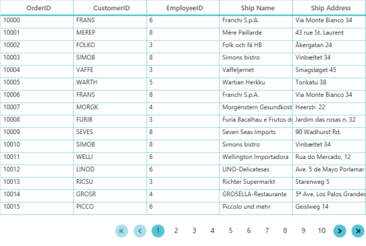

# Paging

This section explains you how to use Paging in SfDataGrid and you can see the types of Paging and available properties and methods in Paging.

## Overview:

The DataGrid control provides interactive support to manipulate the data using the SfDataPager control. It provides 
many features. Therefore, you can easily manage the DataPaging.To learn more about the SfDataPager control, you can 
[click here](http://help.syncfusion.com/wpf/sfdatapager).

There are two different modes in Data Paging as follows,

NormalPaging:__NormalPaging loads the entire data collection to the DataPager.

OnDemandPaging:__OnDemandPaging loads the data to current page dynamically in DataPager.

## Normal Paging:

You can page the data in DataGrid using SfDataPager control. You can refer the following steps to enable Paging in DataGrid control.

* Create a new DataPager and bind the data collection to the Source property in SfDataPager.
* You can set the PageSize property. DataPager splits the data into separate pages depending on the PageSize value.
* Bind the PagedSource property of the DataPager to the ItemsSource property of DataGrid.

The following code example illustrates using DataPager with the SfDataGrid control.



<Window.DataContext>

<local:ViewModel/>

</Window.DataContext>

<Grid>

<Grid.RowDefinitions>

<RowDefinition Height=”*” />

<RowDefinition Height=”Auto” />

</Grid.RowDefinitions>

<sfgrid:SfDataGrid AutoGenerateColumns=”True” 

                   ColumnSizer=”Star”

                   ItemsSource=”{Binding ElementName=sfDataPager, Path=PagedSource}”/>

<datapager:SfDataPager x:Name=”sfDataPager” 

                         Grid.Row=”1” 

                         AccentBackground=”DodgerBlue” 

                         NumericButtonCount=”10” 

                         PageSize=”15”

                               Source=”{Binding OrdersDetails}” />

</Grid>



The following screenshot displays the output. 

DataPager with the SfDataGrid control
{:.caption}
## OnDemandPaging:

In normal Paging, data collection is entirely loaded initially to the DataPager. However, SfDataPager allows you to load the data for the current page item dynamically in OnDemandPaging. To enable OnDemandPaging, you can set UseOnDemandPaging to ‘true’ in SfDataPager control.

To load current page item dynamically you can hook OnDemandLoading event. In the OnDemandLoading event, use the LoadDynamicItems method to load the data for the corresponding page in DataPager.

The OnDemandLoading event is triggered when the pager moves to the corresponding page. The OnDemandLoading event contains the following event arguments:

* StartIndex: Corresponding page start index.
* PageSize: Number of items to be loaded for that page.

N> In OnDemand paging, you cannot assign a value for the Source property in SfDataPager.

The following code example illustrates defining DataPager for OnDemandPaging:



<Window.DataContext>

<local:ViewModel/>

</Window.DataContext>

<Grid>

        <Grid.RowDefinitions>

            <RowDefinition Height="*" />

            <RowDefinition Height="Auto" />

        </Grid.RowDefinitions>

<syncfusion:SfDataGrid x:Name="dataGrid"

                         AllowResizingColumns="True"

                         ColumnSizer="Star"

                         ItemsSource="{Binding                       Path=PagedSource,ElementName=sfDataPager}">

<datapager:SfDataPager x:Name="sfDataPager"

                         AccentBackground="DodgerBlue"

                         NumericButtonCount="10"

                         PageCount="50"

                         PageSize="18"

                         UseOnDemandPaging="True" />

</Grid>



The following code example illustrates how to load data for the DataPager control dynamically.



private void OnDemandPageLoading(object sender, OnDemandLoadingEventArgs  args)

{         sfDataPager.LoadDynamicItems(args.StartIndex,source.Skip(args.StartIndex).Take(args.PageSize));

}


The following screenshot displays the output.

DataPager for OnDemand Paging
{:.caption}
When you use OnDemandPaging,PagedSource loads only the current page data. When you navigate to another page, OnDemandLoading event is fired and loads another set of data and it maintains the previous page data also. When you navigate to previous page again, OnDemandLoading event is not fired and load the previously maintained data to the corresponding page. When you don’t want to maintain the previous page data, you can call PagedCollectionView.ResetCache() in OnDemandLoading event. ResetCache method call resets the cache except current page.

The following code example illustrates how to use ResetCache method,



private void OnDemandPageLoading(object sender, OnDemandLoadingEventArgs  args)

{         sfDataPager.LoadDynamicItems(args.StartIndex,source.Skip(args.StartIndex).Take(args.PageSize));

(sfDataPager.PagedSource as PagedCollectionView).ResetCache();

}


## How to

### Export All Pages to Excel

DataGrid allows you to export to Excel when Paging is enabled. PagedSource exports only the first page by default. By setting ExcelExportOptions.ExportAllPages to true, you can export all pages to Excel.

ExportAllPages_:_ Specifies whether the method exports all pages for PagedSource. By default, it exports the first page only.To know more about ExportOptions, you can ClickHere.

The following code example illustrates how to use page options in DataGrid.



 //Setting the Exporting Options by craeting a instance for ExcelExportingOptions.

ExcelExportingOptions exportingOptions = new ExcelExportingOptions();

exportingOptions.ExportAllPages = true;            

//following code exports datagrid to excel and returns Excel Engine.

var excelEngine = dataGrid.ExportToExcel(dataGrid.View, exportingOptions);



### Export Pages to Different sheets

Datagrid allows you to export PagedSource to different sheets or to single sheet by using ExportPageOptions with two different modes as follows,

ExportPageOptions.ExportToDifferentSheets_:_ You can export each page in different sheets.

ExportPageOptions.ExportToSingleSheet_:_ You can export all the pages in single sheet.

The following code example illustrate how to use ExportPageOptions in DataGrid.



 //Setting the Exporting Options by craeting a instance for ExcelExportingOptions.

ExcelExportingOptions exportingOptions = new ExcelExportingOptions();

exportingOptions.ExportPageOptions = ExportPageOptions.ExportToDifferentSheets;

//following code exports datagrid to excel and returns Excel Engine.

var excelEngine = dataGrid.ExportToExcel(dataGrid.View, exportingOptions);


