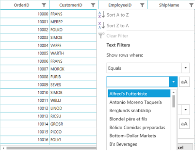

# Performance

This Section explains you the high Performance of WPF application using SfDataGrid control when you load large amount of data. 

* Data Virtualization
* Summary Calculation Optimization
* Batch Update
* Filter Popup Performance

## Data Virtualization

When you have large amount of data in SfDataGrid, it may have a slow performance.For small collection of basic data objects, the memory consumption is not significant; however for large collections, the memory consumption is very significant. To overcome this, you can use the concept of Data Virtualization_._ You can use GridVirtualizingCollectionView to load any number records within few milliseconds in SfDataGrid. 

Refer the DataVirtualization sections for more information.

## Summary Calculation Optimization

Summary Calculation Optimization is a technique that improves the performance of summary calculation in Grid. This technique considers only the data for recalculation instead of all data objects. You can see the performance in summary calculation, when you use large amount of data. In small amount of data objects, you can not see any changes in performance.

Optimization is achieved under the following scenarios:

* Adding a record.
* Removing record.
* Property change in a record.

### Adding Record:

When you add a record, instead of recalculating the summary for entire rows, Optimization logic considers only the added item value and the current summary value.

### Removing a Record:

When you remove a record, instead of recalculating the summary for entire rows, Optimization logic considers only the removed item value and the current summary value.

### Property Change in a record:

The value corresponds to the summary from the changed value record. The changed value is aggregated with the current summary value.

To enable Property Change Optimization, Data Model implements the INotifyPropertyChanging and INotifyPropertyChanged interface.

The following code example illustrates how to implement the INotifyPropertyChanging and INotifyPropertyChanged interface:



public class EmployeeData : INotifyPropertyChanged, INotifyPropertyChanging

{

    private int _EmployeeID;

    public int EmployeeID

    {

        get { return this._EmployeeID; }

        set

        {

            this.RaisePropertyChanging("EmployeeID");

            this._EmployeeID = value;

            this.RaisePropertyChanged("EmployeeID");

        }

    }

   public void RaisePropertyChanged(string propName)

    {

        if (this.PropertyChanged != null)

     this.PropertyChanged(this, new PropertyChangedEventArgs(propName));

    }

    public event PropertyChangedEventHandler PropertyChanged;

    public void RaisePropertyChanging(string propName)

    {

     if (this.PropertyChanging != null)

      this.PropertyChanging(this, new PropertyChangingEventArgs(propName));

    }

    public event PropertyChangingEventHandler PropertyChanging;

}



To disable Optimization, you can set EnableSummaryOptimization property in CollectionViewAdv to ‘false’ as shown in the following code example:



  (dataGrid.View as CollectionViewAdv).EnableSummaryOptimization = false;



## Batch Update

BatchUpdate allows you to obtain high performance when you are updating more data to View at a time with AllowDataShaping. The public methods such as DataGrid.View.BeginInit () and DataGrid. View.EndInit () are used in batch update. The following code example displays how to use these methods.



this.datagrid.View.BeginInit();

UpdateRows(noOfUpdates);

this.datagrid.View.EndInit();

private void UpdateRows(int count)

{

    // Update record properties

}


### BeginInit() & EndInit()

When using AllowDataShaping in the real time data update, the sequential data updation can decrease the performance of Datagrid when more updates come to the Grid. Performing sequential Sorting, Grouping, adding and removing the records slows down the performance. 

To prevent this, you can wrap all the data updation within BeginInit () and EndInit () methods. BeginInit () method suspends all updates until EndInit () is called. After EndInit () is called, shaping occurs according to the updated items.

## Filter Popup Performance

When you have large amount of data, the filter pop-up opening time becomes slow. It loads all unique items in AdvanceFilterComboBox and it takes time to load the items. To overcome this, you can avoid loading the unique items in AdvancedFilterCombobox.

You can improve the filter pop-up opening time by setting CanGenerateUniqueItems property value to ‘False’.A textbox is loaded instead of AdvancedFilterComboBox that allows you to manually enter text for filtering. This increases GridFilterControl’s loading performance.

> Note: You can achieve this, only when you are using AdvanedFilter withoutn CheckBox filter.



<Window.Resources>

 

</Window.Resources>



The following screenshot displays the AdvancedFiltering with CanGenerateUniqueItems when setto‘True’.

_AdvancedFiltering with CanGenerateUniqueItems set to ‘True’._

The following screenshot displays the AdvancedFiltering with CanGenerateUniqueItems when setto‘False’.

_AdvancedFiltering with CanGenerateUniqueItems set to ‘False’_

The above screenshot does not load the AdvancedFiltering combo box item, so it automatically increases the GridFilterControl performance.
