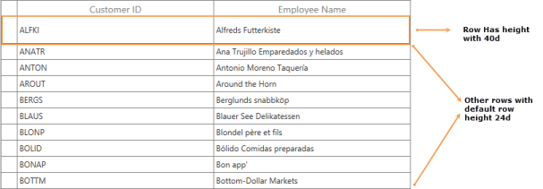

# Row Height Customization

This section explains you how to customize the height of the row OnDemand based on all columns data or certain columns data.

## QueryRowHeight

QueryRowHeight is the event that returns row heights in demand. This is raised for the row that comes to view.  Refer to the following code example for the QueryRowHeight event.  



//Hooks event for the SfDataGrid.

syncgrid.QueryRowHeight += syncgrid_QueryRowHeight;

/// 

/// The event sets the height of the row OnDemand.

/// 

/// <param name="sender">Gets the object that raising this event</param>    

/// <param name="e">QueryRowHeightEventArgs</param>   

void syncgrid_QueryRowHeight(object sender, QueryRowHeightEventArgs e)

{

}  


This event receives two arguments namely the sender that handles the SfDataGrid and the QueryRowHeightEventArgs. The QueryRowHeightEventArgs has the following properties.

* RowIndex: The property RowIndex helps you identify the particular row’s index.
* Height: This property sets and returns the row height in demand. Default line size of the row         

height is 24d.

* Handled: This property decides whether the specified height can be set to row or not. Default value is false. When this event is not handled, the decided height is not set to the row. 

The following is the code example of the QueryRowHeight event.



<syncfusion:SfDataGrid x:Name="syncgrid"

                       AutoGenerateColumns="False"

                       ColumnSizer="Star"

                       NavigationMode="Cell"

                       AllowEditing="True"

                       ShowRowHeader="True"

                       AutoExpandGroups="True"

                       AllowResizingColumns="True"

                       ShowGroupDropArea="True"

                       ItemsSource="{Binding CustomerDetails}">

<syncfusion:SfDataGrid.Columns>

    <syncfusion:GridTextColumn HeaderText="Customer ID" MappingName="CustomerID"/>

    <syncfusion:GridTextColumn HeaderText="Employee Name" MappingName="CompanyName" />

</syncfusion:SfDataGrid.Columns>

</syncfusion:SfDataGrid>





// Hooks event for the SfDataGrid.

syncgrid.QueryRowHeight += syncgrid_QueryRowHeight;

void syncgrid_QueryRowHeight(object sender, QueryRowHeightEventArgs e)

{

    if(e.RowIndex == 1) //Sets Height to the first row.

    {

        e.Height = 40;

        e.Handled = true;

    }

}  


The following screenshot displays the output.

_Query Row Height event_

## AutoRowHeight

By default, the RowHeight is not adjusted based on the text located in the GridCell. When large text in collection is loaded to the SfDataGrid and columns have defined TextWrapping with wrap, it looks like the content is wrapped and clipped with the default row height. 

SfDataGrid enables fitting the height of the row based on its content on-demand based for all columns or certain columns of SfDataGrid by calling GetAutoRowHeight method in QueryRowHeight event.  This improves the readability of the content and occurs on-demand basics and does not affect the loading performance of the Grid.

### GetAutoRowHeight

The GetAutoRowHeight method returns true or false by which the row height can be calculated. It returns false for 
index that does not belong to the recorded rows. This method is specifically implemented in the [GridColumnSizer](http://docs.syncfusion.com/wpf/sfdatagrid/columns)class. 

It calculates height by the column that has large data. The following are the parameters for calculation of height.

1. RowIndex: The index of the row for which the height is to be resized based on record.
2. GridRowSizingOptions: This option allows you to customize the row height calculation based on the following properties:  
1. ExcludeColumns.
2. CanIncludeHiddenColumns.

ExcludeColumns: This is a type of string collection. Apart from the ExcludeColumns from the ItemsSource, all other columns added in the list of string collection are not taken for calculation. The ExcludeColumns helps you reduce the count of loop run for height calculation. By default GetAutoRowHeight method calculates row height based on all columns data. You can calculate height for a row, based on the column you choose.

CanIncludeHiddenColumns: This is the Boolean parameter and the default value is false. If you enable this property it allows the hidden column to calculate the resizing of rows. 

3. rowHeight: You can get the calculated height from the out rowHeight parameter. The returned height is based on the large data in columns for the queried row.  

You can get the calculated height of rows through the out parameter (rowHeight) of GetAutoRowHeight method and then assign it to the Height property of QueryRowHeightEventArgs in the QueryRowHeight event.

The following code example explains how to use the GetAutoRowHeight method in the QueryRowHeight event.



<syncfusion:SfDataGrid x:Name="syncgrid"

                       AutoGenerateColumns="False"                       

                       NavigationMode="Cell"

                       AllowEditing="True"

                       ShowRowHeader="True"

                       AutoExpandGroups="True"

                       AllowResizingColumns="True"

                       ShowGroupDropArea="True"

                       ItemsSource="{Binding CustomerDetails}">

<syncfusion:SfDataGrid.Columns>

    <syncfusion:GridTextColumn HeaderText="Customer ID" MappingName="CustomerID" TextWrapping="Wrap" />

    <syncfusion:GridTextColumn HeaderText="Employee Name" MappingName="CompanyName" TextWrapping="Wrap"/>

    <syncfusion:GridTextColumn HeaderText="Contact Name" MappingName="ContactName" TextWrapping="Wrap" />

    <syncfusion:GridTextColumn HeaderText="Nationality ID" MappingName="ContactTitle" TextWrapping="Wrap"/>

</syncfusion:SfDataGrid.Columns>

</syncfusion:SfDataGrid>            


As a result of TextWrapping, the text is wrapped but the height is not increased as illustrated in the following screenshot.

_Text wrap_

By adding the following code example, you can improve the readability of the content.



public partial class MainWindow 

{

// The option that decides Calculation of all the columns or certain columns, with or without Hidden columns.

GridRowSizingOptions gridRowResizingOptions = new GridRowSizingOptions();

// Gets the calculated height from GetAutoRowHeight method.    

double Height = double.NaN;    

    public MainWindow()

    {

        InitializeComponent();

        // Hooks event for the SfDataGrid.

        syncgrid.QueryRowHeight += syncgrid_QueryRowHeight;

    }

    void syncgrid_QueryRowHeight(object sender, QueryRowHeightEventArgs e)

    {

        if (this.syncgrid.GridColumnSizer.GetAutoRowHeight(e.RowIndex, gridRowResizingOptions, out Height))

        {

          // This code is run when the row index passes for record alone.

                e.Height = Height;

                e.Handled = true;            

        }

    }       

}


Now, you can see that the height of the row is resized based on the large text content in the following output.

_Output_

The height of the row is calculated based on all the column values. With the GridRowSizingOptions, you can restrict the calculation to only a few columns that have large data instead of doing it for all the columns. You can also improve the performance of row height calculation with the GridRowSizingOptions.

The following code example explains how to use the GridRowSizingOptions. 



<syncfusion:SfDataGrid x:Name="syncgrid"

                       AutoGenerateColumns="False"                       

                       NavigationMode="Cell"

                       AllowEditing="True"

                       ShowRowHeader="True"

                       AutoExpandGroups="True"

                       AllowResizingColumns="True"

                       ShowGroupDropArea="True"

                       ItemsSource="{Binding CustomerDetails}">

<syncfusion:SfDataGrid.Columns>

    <syncfusion:GridTextColumn HeaderText="Customer ID" MappingName="CustomerID" TextWrapping="Wrap" />

    <syncfusion:GridTextColumn HeaderText="Employee Name" MappingName="CompanyName" IsHidden="True" TextWrapping="Wrap"/>

    <syncfusion:GridTextColumn HeaderText="Contact Name" MappingName="ContactName" TextWrapping="Wrap" />

    <syncfusion:GridTextColumn HeaderText="Nationality ID" MappingName="ContactTitle" TextWrapping="Wrap"/>

</syncfusion:SfDataGrid.Columns>

</syncfusion:SfDataGrid>            



The columns that need not be included in the calculation of height can be added to the ExcludeColumns list of the GridRowSizingOptions. 



public partial class MainWindow 

{

// The options that decide Calculation by all columns or certain columns, with or without Hidden columns.

GridRowSizingOptions gridRowResizingOptions = new GridRowSizingOptions();

//To get the calculated height from the GetAutoRowHeight method.    

double Height = double.NaN;  

// The list contains the column names that will excluded from the height calculation in the GetAutoRowHeight method.

List<string> excludeColumns = new List<string>();         

    public MainWindow()

    {

        InitializeComponent();

// Hooks event for the SfDataGrid.

        syncgrid.QueryRowHeight += syncgrid_QueryRowHeight;

        excludeColumns.Add("CustomerID");

        excludeColumns.Add("ContactName");

        excludeColumns.Add("ContactTitle");

// The above columns are excluded from calculation.

        gridRowResizingOptions.ExcludeColumns = excludeColumns;

// Hidden columns are also included in the height calculation.

        gridRowResizingOptions.CanIncludeHiddenColumns = true;

    }

    void syncgrid_QueryRowHeight(object sender, QueryRowHeightEventArgs e)

    {

        if (this.syncgrid.GridColumnSizer.GetAutoRowHeight(e.RowIndex, gridRowResizingOptions, out Height))

        {

          // This code is run when the row index is passed for record alone.

                e.Height = Height;

                e.Handled = true;            

        }

    }       

}



In the above code example, CustomerID, ContactName and ContactTitle are excluded from the calculation and only the CompanyName is taken into account. When the CompanyName column is hidden and when you want the hidden column also to participate in the Height calculation, you can set the CanIncludeHiddenColumns to true. The following display depicts the output of above codes. In the following image, the row is resized even though the column is hidden. 

_Hidden column with Height calculation_

## How to Customize the Height of the Header Row

The SfDataGrid provides support to customize the height of the Header row also. You can achieve this by the following ways:

1. By using HeaderRowHeight Property

   The SfDataGrid control provides direct property to set height for the header row. You have to enable the HeaderRowHeight property in the SfDataGrid definition. 

			<syncfusion:SfDataGrid x:Name="syncgrid"

								   AutoGenerateColumns="False"                       

								   NavigationMode="Cell"

								   AllowEditing="True"

								   ShowRowHeader="True"

								   HeaderRowHeight="40"

								   AllowResizingColumns="True"                      

								   ItemsSource="{Binding CustomerDetails}"/>

2. By using QueryRowHeight Event

   By using QueryRowHeight event, you can match the RowIndex from QueryRowHeightEventArgs with GetHeaderIndex () helper method that returns index of the Header. You can refer to the following link to get more [resolver](http://docs.syncfusion.com/wpf) methods of the SfDataGrid.

   N> Need to add Syncfusion.UI.Xaml.Grid.Helper namespace to use GetHeaderIndex () method.

   The following code example explains how to customize the header rowHeight.

			<syncfusion:SfDataGrid x:Name="syncgrid"

								   AutoGenerateColumns="False"                       

								   NavigationMode="Cell"

								   AllowEditing="True"

								   ShowRowHeader="True"

								   AllowResizingColumns="True"                      

								   ItemsSource="{Binding CustomerDetails}"/>

			// Hooks event for the SfDataGrid.

			syncgrid.QueryRowHeight += syncgrid_QueryRowHeight;

			void syncgrid_QueryRowHeight(object sender, QueryRowHeightEventArgs e)

			{

			// GetHeaderIndex returns the index of the header row.

				if (syncgrid.GetHeaderIndex() == e.RowIndex)

				{

					e.Height = 40;

					e.Handled = true;

				}

			}

   The following screenshot displays the output.

   

   _Increased Header Row Height_

   {:.prettyprint}

## How the row height can auto grow with the text length 

When you utilize the special feature AutoRowHeight support of the SfDataGrid control, the row height can grow automatically with the text length you type. You need to raise the QueryRowHeight event and invalidate the row when you complete the editing.

If you want the row to be resized with text that you have typed after editing, you can call InValidateRowHeight (int RowIndex) method in the [CurrentCellEndEdit](http://docs.syncfusion.com/wpf/sfdatagrid/editing#currentcellendedit) event of the SfDataGrid and it resets the row height internally. 

Then call the InvalidateMeasureInfo method in VisualContainer to refresh the view. The QueryRowHeight event is called again for that row alone and it resizes the row based on the edited content.  This measures the row again and arrange it for you.

When you pass the row index to the InValidateRowHeight method, that specific row Index is added to the Dictionary as a reference to calculate the height of that row again when the InvalidateMeasureInfo is called. Then it raises the QueryRowHeight event for row index that you have invalidated.

N> Need to add this Syncfusion.UI.Xaml.Grid.Helpers namespace to use the InvalidateMeasuerInfo method.



// The options that decides the Calculation by all columns or certain columns, with or without the Hidden columns.

GridRowSizingOptions gridRowResizingOptions = new GridRowSizingOptions();

// Gets the calculated height from the GetAutoRowHeight method.    

double Height = double.NaN;  

// Hooks event for the SfDataGrid.

syncgrid.CurrentCellEndEdit += syncgrid_CurrentCellEndEdit;

void syncgrid_CurrentCellEndEdit(object sender, CurrentCellEndEditEventArgs args)

{

    syncgrid.InvalidateRowHeight(args.RowColumnIndex.RowIndex);

    syncgrid.GetVisualContainer().InvalidateMeasureInfo();     

}

void syncgrid_QueryRowHeight(object sender, QueryRowHeightEventArgs e)

{

    if (this.syncgrid.GridColumnSizer.GetAutoRowHeight(e.RowIndex, gridRowResizingOptions, out Height))

    {

          // This code is run when the row index passes for record alone.

         e.Height = Height;

         e.Handled = true;            

    }

}       



Run the above code example. Edit with large text and complete editing. Press Tab or Enter key to end the edit mode. The following screenshot displays the output.

_AutoRowHeight_

N> If the InvalidateMeasuerInfo method is not called, grid does not refresh automatically. You need to explicitly refresh the grid though this method.

## How to customize the Height of the TableSummaryRow control

The SfDataGrid control provides support to customize the height of the Table summary row. By utilizing the QueryRowHeight event, you can check whether the RowIndex is a table summary index from the QueryRowHeightEventArgs by using helper method IsTableSummaryIndex in GridIndexResolver class. You can refer to the following link to get more [resolver](http://docs.syncfusion.com/wpf) methods of the SfDataGrid.

N> Need to use the namespace Syncfusion.UI.Xaml.Grid.Helper. 

The following code example explains you how to customize the Height of TableSummaryRow control in the QueryRowHeight event. 



// Hooks event for the SfDataGrid.

syncgrid.QueryRowHeight += syncgrid_QueryRowHeight;

void syncgrid_QueryRowHeight(object sender, QueryRowHeightEventArgs e)

{

// IsTableSummaryIndex returns true or false for a RowIndex. If it is true, the assigned height is applied to the header.

   if(syncgrid.IsTableSummaryIndex(e.RowIndex))

   {

     e.Height = 40;

     e.Handled = true;

   }

}


The following screenshot displays the output of customized TableSummaryRow control Height.

_Customized TableSummaryRow_

### Limitations

1. Details View is not supported with QueryRowHeight event. If you have Details View with the QueryRowHeight event, the event does not raise any record row. If you have TableSummary with Details View, then you can resize the TableSummary alone.
2. As of now there is no support for Printing.
3. The column width expands based on the content when you try to fit that column, but it does not wrap the text in view. If you refresh the Grid also, the row is not resized.
