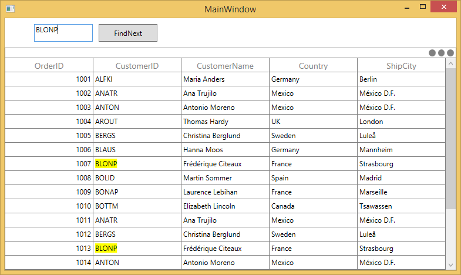
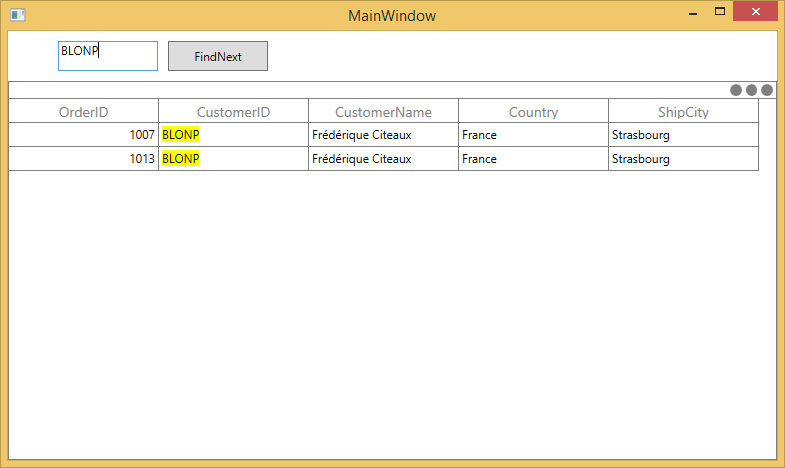
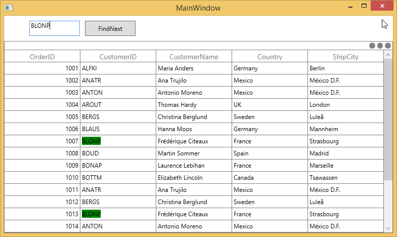
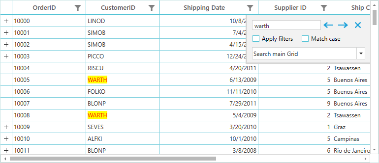
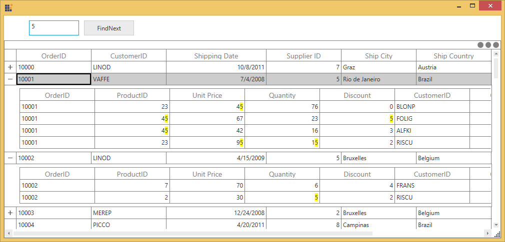
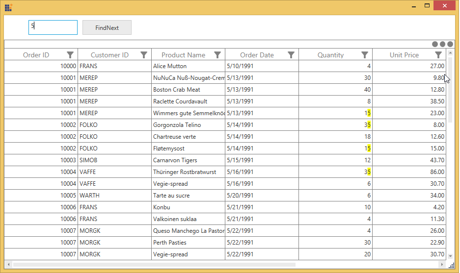

# Search

SfDataGrid control allows you to search the data displayed in the SfDataGrid. You can search the data by using [SearchHelper.Search](http://help.syncfusion.com/cr/cref_files/wpf/Syncfusion.SfGrid.WPF~Syncfusion.UI.Xaml.Grid.SearchHelper~Search.html) method.




this.dataGrid.SearchHelper.Search(TextBox.Text);




### Filtering

You can enable filter based on search by setting [SearchHelper.AllowFiltering](http://help.syncfusion.com/cr/cref_files/wpf/Syncfusion.SfGrid.WPF~Syncfusion.UI.Xaml.Grid.SearchHelper~AllowFiltering.html) property to true.




this.dataGrid.SearchHelper.AllowFiltering = true;
this.dataGrid.SearchHelper.Search(TextBox.Text);




You can search the data with the case-sensitivity by setting [SearchHelper.AllowCaseSensitiveSearch](http://help.syncfusion.com/cr/cref_files/wpf/Syncfusion.SfGrid.WPF~Syncfusion.UI.Xaml.Grid.SearchHelper~AllowCaseSensitiveSearch.html) property.




this.dataGrid.SearchHelper.AllowCaseSensitiveSearch = true;




### Changing Search Highlight Background

In SfDatagrid, you can change the search text highlighting color by setting [SearchHelper.SearchBrush](http://help.syncfusion.com/cr/cref_files/wpf/Syncfusion.SfGrid.WPF~Syncfusion.UI.Xaml.Grid.SearchHelper~SearchBrush.html) property. 




this.dataGrid.SearchHelper.SearchBrush = Brushes.Green;
this.dataGrid.SearchHelper.Search(TextBox.Text);




### Changing Search Highlight Foreground

In SfDatagrid, you can change the search text foreground color by setting [SearchHelper.SearchForegroundBrush](https://help.syncfusion.com/cr/wpf/Syncfusion.SfGrid.WPF~Syncfusion.UI.Xaml.Grid.SearchHelper~SearchForegroundBrush.html) property. 




this.dataGrid.SearchHelper.SearchForegroundBrush = Brushes.Red;    




## Navigating cells based on search text

You can navigate to the cells contains the SearchText using [SearchHelper.FindNext](http://help.syncfusion.com/cr/cref_files/wpf/Syncfusion.SfGrid.WPF~Syncfusion.UI.Xaml.Grid.SearchHelper~FindNext.html) and [SearchHelper.FindPrevious](http://help.syncfusion.com/cr/cref_files/wpf/Syncfusion.SfGrid.WPF~Syncfusion.UI.Xaml.Grid.SearchHelper~FindPrevious.html) methods.




this.dataGrid.SearchHelper.FindNext("SearchText");
this.dataGrid.SearchHelper.FindPrevious("SearchText");




You can highlight the currently navigated search text using [SearchHelper.SearchHighlightBrush](http://help.syncfusion.com/cr/cref_files/wpf/Syncfusion.SfGrid.WPF~Syncfusion.UI.Xaml.Grid.SearchHelper~SearchHighlightBrush.html) property.




this.dataGrid.SearchHelper.SearchHighlightBrush = Brushes.Red;
this.dataGrid.SearchHelper.FindNext("TextBox.Text ");




You can highlight the currently navigated search text foreground color by using [SearchHelper.SearchForegroundHighlightBrush](https://help.syncfusion.com/cr/wpf/Syncfusion.SfGrid.WPF~Syncfusion.UI.Xaml.Grid.SearchHelper~SearchForegroundHighlightBrush.html) property.




this.dataGrid.SearchHelper.SearchForegroundHighlightBrush = Brushes.Red;




## Move CurrentCell when FindNext and FindPrevious

You can move the current cell along with FindNext and FindPrevious operation using [MoveCurrentCell](http://help.syncfusion.com/cr/cref_files/wpf/Syncfusion.SfGrid.WPF~Syncfusion.UI.Xaml.Grid.SfDataGrid~MoveCurrentCell.html) method in selection controller. 




this.dataGrid.SearchHelper.FindNext("BLONP");            
this.dataGrid.SelectionController.MoveCurrentCell(this.dataGrid.SearchHelper.CurrentRowColumnIndex);




## Clear Search

You can clear the search by calling the [SearchHelper.ClearSearch](http://help.syncfusion.com/cr/cref_files/wpf/Syncfusion.SfGrid.WPF~Syncfusion.UI.Xaml.Grid.SearchHelper~ClearSearch.html) method. 




this.dataGrid.SearchHelper.ClearSearch();




## Search operation on Master-Details View

Master-details view allows you to search the data by using [SearchHelper.Search](http://help.syncfusion.com/cr/cref_files/wpf/Syncfusion.SfGrid.WPF~Syncfusion.UI.Xaml.Grid.SearchHelper~Search.html) method in the [ViewDefinition.DataGrid](http://help.syncfusion.com/cr/cref_files/wpf/Syncfusion.SfGrid.WPF~Syncfusion.UI.Xaml.Grid.GridViewDefinition~DataGrid.html).




(this.datagrid.DetailsViewDefinition[0] as GridViewDefinition).DataGrid.SearchHelper.Search(TextBox.Text);




### Navigating cells based on search text in DetailsViewDataGrid

You can navigate to the cells contains the SearchText using [SearchHelper.FindNext](http://help.syncfusion.com/cr/cref_files/wpf/Syncfusion.SfGrid.WPF~Syncfusion.UI.Xaml.Grid.SearchHelper~FindNext.html) and [SearchHelper.FindPrevious](http://help.syncfusion.com/cr/cref_files/wpf/Syncfusion.SfGrid.WPF~Syncfusion.UI.Xaml.Grid.SearchHelper~FindPrevious.html) methods in [ViewDefinition.DataGrid](http://help.syncfusion.com/cr/cref_files/wpf/Syncfusion.SfGrid.WPF~Syncfusion.UI.Xaml.Grid.GridViewDefinition~DataGrid.html).




(this.datagrid.DetailsViewDefinition[0] as GridViewDefinition).DataGrid.SearchHelper.FindNext(SearchBox.Text);
(this.datagrid.DetailsViewDefinition[0] as GridViewDefinition).DataGrid.SearchHelper.FindPrevious(SearchBox.Text);



You can get the sample from [here](http://www.syncfusion.com/downloads/support/directtrac/general/ze/MasterDetailsViewSearch-140489943.zip).

N> It is not possible to Navigate with the two DataGrid at a time.

## Search customization

SfDataGrid process the search operations in [SearchHelper](http://help.syncfusion.com/cr/cref_files/wpf/Syncfusion.SfGrid.WPF~Syncfusion.UI.Xaml.Grid.SearchHelper.html) class. You can change the default search behaviors by overriding `SearchHelper` class and set to `SfDataGrid.SearchHelper`.




this.dataGrid.SearchHelper = new SearchHelperExt(this.dataGrid);
public class SearchHelperExt : SearchHelper
{

    public SearchHelperExt(SfDataGrid datagrid)
        : base(datagrid)
    {
    }
}




### Search only selected columns

You can search only selected columns by overriding `SearchCell` method of `SearchHelper`. In the `SearchCell` method, based on MappingName you can skip the columns that you don’t want to search. 

In the below code, except `Quantity` column other columns are gets excluded from search. 




this.sfgrid.SearchHelper = new SearchHelperExt(this.sfgrid);
this.sfgrid.SearchHelper.Search("5");

public class SearchHelperExt : SearchHelper
{

    public SearchHelperExt(SfDataGrid datagrid)
        : base(datagrid)
    {
    }

    protected override bool SearchCell(DataColumnBase column, object record, bool ApplySearchHighlightBrush)
    {

        if (column.GridColumn.MappingName == "Quantity")
            return base.SearchCell(column, record, ApplySearchHighlightBrush);
        return false;
    }
}




### Select the record based on the SearchText

You can select the records which contains the search text by using GetSearchedRecord method. 




this.dataGrid.SelectedItems.Clear();
this.dataGrid.SearchHelper.Search("SearchText"); 
var list = this.dataGrid.SearchHelper.GetSearchRecords();
int recordIndex = this.dataGrid.ResolveToRecordIndex(this.dataGrid.ResolveToRowIndex(list[0].Record));
this.dataGrid.SelectedIndex = recordIndex;




### Search with the GridComboBoxColumn

You can search the data in SfDataGrid with all the GridColumns which loads TextBlock as display element. To perform the search operation in the [GridComboBoxColumn](http://help.syncfusion.com/cr/cref_files/wpf/Syncfusion.SfGrid.WPF~Syncfusion.UI.Xaml.Grid.GridComboBoxColumn.html) you need to customize the `GridComboBoxColumn`.  As it loads the ContentControl in display mode. 



public class ComboBoxColumnExt : GridComboBoxColumn
{

    public ComboBoxColumnExt()
    {
        SetCellType("ComboBoxExt");
    }
    
    protected override Freezable CreateInstanceCore()
    {
        return new ComboBoxColumnExt();
    }
}




You can change the display element of each column by creating new renderer for the particular column and assign to corresponding cell type in SfDataGrid.CellRenderers.



public class ComboBoxRendererExt : GridVirtualizingCellRenderer<TextBlock, ComboBox>
{
 
    public ComboBoxRendererExt()
    {
    }
    
    public override object GetControlValue()
    {
 
        if (!HasCurrentCellState)
            return null;
        return CurrentCellRendererElement.GetValue(IsInEditing ? Selector.SelectedValueProperty : TextBlock.TextProperty);
    }

    // Creates the binding to the Edit-element
 
    private void InitializeEditBinding(ComboBox uiElement, GridColumn column)
    {
        var comboBoxColumn = (GridComboBoxColumn)column;
        var source = comboBoxColumn.ValueBinding as Binding;
 
        // Creates the bind element to the edit-element.
        var bind = new Binding
        {
            Mode = BindingMode.TwoWay,
            Path = source.Path,
            StringFormat = source.StringFormat,
            TargetNullValue = source.TargetNullValue,
            UpdateSourceTrigger = UpdateSourceTrigger.PropertyChanged,
            ValidatesOnExceptions = source.ValidatesOnExceptions,
            AsyncState = source.AsyncState,
            BindingGroupName = source.BindingGroupName,
            IsAsync = source.IsAsync,
            NotifyOnSourceUpdated = source.NotifyOnSourceUpdated,
            NotifyOnTargetUpdated = source.NotifyOnTargetUpdated,
            UpdateSourceExceptionFilter = source.UpdateSourceExceptionFilter,
            XPath = source.XPath
        };
        
        uiElement.SetBinding(ComboBox.SelectedValueProperty, bind);
 
        // Binding the ItemSource to the GridComboBox.
        var itemsSourceBinding = new Binding { Path = new PropertyPath("ItemsSource"), Mode = BindingMode.TwoWay, Source = comboBoxColumn };
        uiElement.SetBinding(ComboBox.ItemsSourceProperty, itemsSourceBinding);
        var displayMemberBinding = new Binding { Path = new PropertyPath("DisplayMemberPath"), Mode = BindingMode.TwoWay, Source = comboBoxColumn };
        uiElement.SetBinding(ComboBox.DisplayMemberPathProperty, displayMemberBinding);
        var selectedValuePathBinding = new Binding { Path = new PropertyPath("SelectedValuePath"), Mode = BindingMode.TwoWay, Source = comboBoxColumn };
        uiElement.SetBinding(ComboBox.SelectedValuePathProperty, selectedValuePathBinding);
        var staysOpenOnEditBinding = new Binding { Path = new PropertyPath("StaysOpenOnEdit"), Mode = BindingMode.TwoWay, Source = comboBoxColumn };
        uiElement.SetBinding(ComboBox.StaysOpenOnEditProperty, staysOpenOnEditBinding);
        var isEditableBinding = new Binding { Path = new PropertyPath("IsEditable"), Mode = BindingMode.TwoWay, Source = comboBoxColumn };
        uiElement.SetBinding(ComboBox.IsEditableProperty, isEditableBinding);                       
        var itemTemplateBinding = new Binding { Path = new PropertyPath("ItemTemplate"), Mode = BindingMode.TwoWay, Source = comboBoxColumn };
        uiElement.SetBinding(ComboBox.ItemTemplateProperty, itemTemplateBinding);
    }

    // This will be invoke when the editing is triggered.
 
    public override void OnInitializeEditElement(DataColumnBase dataColumn, ComboBox uiElement, object dataContext)
    {
        GridColumn column = dataColumn.GridColumn;
        InitializeEditBinding(uiElement, column);
        var textAlignment = new Binding { Path = new PropertyPath("TextAlignment"), Mode = BindingMode.OneWay, Source = column, Converter = new TextAlignmentToHorizontalAlignmentConverter() };
        uiElement.SetBinding(Control.HorizontalContentAlignmentProperty, textAlignment);
        var verticalAlignment = new Binding { Path = new PropertyPath("VerticalAlignment"), Mode = BindingMode.TwoWay, Source = column };
        uiElement.SetBinding(Control.VerticalContentAlignmentProperty, verticalAlignment);           
    }

    // Display Element initialized for required properties

    public override void OnInitializeDisplayElement(Syncfusion.UI.Xaml.Grid.DataColumnBase dataColumn, TextBlock uiElement, object dataContext)
    {
        var column = dataColumn.GridColumn;
        var gridColumn = column as GridComboBoxColumn;
        uiElement.SetBinding(TextBlock.TextProperty, column.DisplayBinding);
        var textAlignment = new Binding { Path = new PropertyPath("TextAlignment"), Mode = BindingMode.OneWay, Source = column, Converter = new TextAlignmentToHorizontalAlignmentConverter() };
        uiElement.SetBinding(Control.HorizontalAlignmentProperty, textAlignment);
        var verticalAlignment = new Binding { Path = new PropertyPath("VerticalAlignment"), Mode = BindingMode.TwoWay, Source = column };
        uiElement.SetBinding(Control.VerticalAlignmentProperty, verticalAlignment);
        uiElement.Margin = new Thickness(3,0,1,0);
    }

    // This Display Binding has to be set with the TextBlock.TextProperty.
 
    private static void SetDisplayBinding(TextBlock element, GridColumn column, object dataContext)
    {
        var customColumn = (ComboBoxColumnExt)column;
        var binding = new Binding
        {
            Path = new PropertyPath(customColumn.MappingName),
            Mode = BindingMode.TwoWay,
            UpdateSourceTrigger = UpdateSourceTrigger.PropertyChanged,
        };
        element.SetBinding(TextBlock.TextProperty, binding);
    }
}



