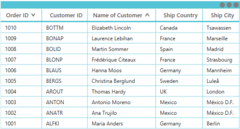
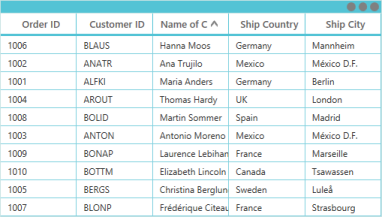
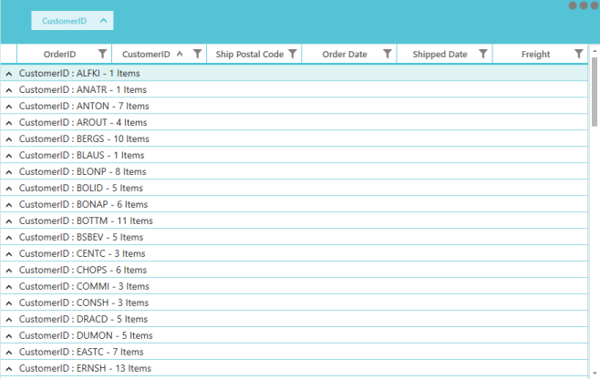
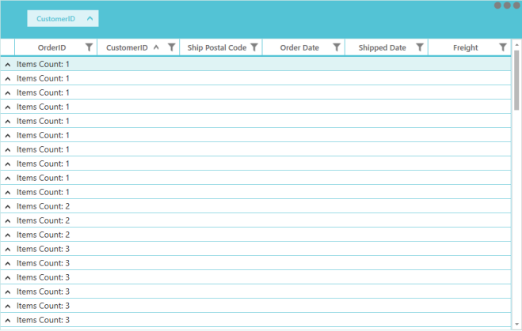

# Sorting

This section explains you about Sorting on DataGrid data. Different properties and events that participate in Sorting are discussed in this section.

## Overview

DataGrid control allows you to sort the table data against one or more columns. The number of columns by which the data sorted is unlimited. When sorting is applied, the Grid rearranges the data to match with the current sort criteria ascending or descending order.

DataGrid provides following properties for Sorting.

_Sorting property table_

<table>
<tr>
<th>
Property</th><th>
Type</th><th>
Description</th><th>
Default Value</th></tr>
<tr>
<td>
SfDataGrid.AllowSorting</td><td>
Boolean</td><td>
Enables or disables a value to AllowSorting property indicating whether the DataGrid is resorted by clicking on a column header.</td><td>
True</td></tr>
<tr>
<td>
SfDataGrid.SortColumnDescriptions</td><td>
ObservableCollection&lt;SortColumnDescription&gt;</td><td>
Columns that are added to this collection are allowed to be sorted. </td><td>
</td></tr>
<tr>
<td>
SfDataGrid.AllowTristateSorting</td><td>
Boolean</td><td>
Enables or disables tristate sorting for a Grid. (Ascending, descending and initial data order.)</td><td>
False</td></tr>
<tr>
<td>
SfDataGrid.ShowSortNumbers</td><td>
Boolean</td><td>
You can get the order of sorting in columns header during multi sorting.</td><td>
False </td></tr>
<tr>
<td>
GridColumn.AllowSorting</td><td>
Boolean</td><td>
Enables or disables a value to AllowSorting property indicating whether the GridColumn is resorted by clicking on a column header.</td><td>
True</td></tr>
</table>

N> When SfDataGrid.AllowSorting property is set to’ true’, GridColumn.AllowSorting property gets more priorities to sort the columns.

## Apply Sorting

There is a couple of ways to apply sorting to the DataGrid.

* You can click the column header by which the column is sorted. Once the sorting is applied, the Grid shows a sort icon in the respective column headers indicating the direction of sorting.
* You can also perform sorting using the code. This requires you to define a number of SortColumnDescription objects to be added to SfDataGrid.SortColumnDescriptions collection. SortColumnDescription object holds following two properties:
* ColumnName: Name of the sorted column
* SortDirection: an object of type ListSortDirection defines the soring direction

The following code example illustrates this.



<syncfusion:SfDataGrid x:Name="datagrid"

                       AllowSorting="True"

                       ColumnSizer="Auto"

                       ItemsSource="{Binding OrderInfoCollection}">

    <syncfusion:SfDataGrid.SortColumnDescriptions>

        <syncfusion:SortColumnDescription ColumnName="OrderID" SortDirection="Descending" />

    </syncfusion:SfDataGrid.SortColumnDescriptions>

</syncfusion:SfDataGrid>




sfdatagrid.AllowSorting = true;

sfdatagrid.SortColumnDescriptions.Add(new SortColumnDescription() { ColumnName = "OrderID", SortDirection = System.ComponentModel.ListSortDirection.Descending }); 


The following screenshot displays the output.

_Sorted DataGrid_

## Events

The DataGrid provides you the following Events for the sorting functionality:

* SfDataGrid.SortColumnChanging: This Event is raised while sorting the column in code or at Execute time that helps to cancel the sorting action. When you sort the column, DataGrid scrolls based on Selected Item. By setting SortColumnChangingEventArgs.CancelScroll property to ‘true’, you can prevent the scrolling while sorting.
* SfDataGrid.SortColumnChanged: This Event is raised after the column is sorted.

The following code example explains you how to hook those events.



<syncfusion:SfDataGrid x:Name="sfdatagrid"

                       AllowSorting="True"

                       AutoGenerateColumns="True"

                       ColumnSizer="Star"

                       ItemsSource="{Binding OrderInfoCollection,

                                                Source={StaticResource data}}"

                       SortColumnsChanged="sfdatagrid_SortColumnsChanged"

                       SortColumnsChanging="sfdatagrid_SortColumnsChanging" />





sfdatagrid.SortColumnsChanging += sfdatagrid_SortColumnsChanging;

sfdatagrid.SortColumnsChanged += sfdatagrid_SortColumnsChanged;

void sfdatagrid_SortColumnsChanged(object sender, GridSortColumnsChangedEventArgs e)

{            

}

void sfdatagrid_SortColumnsChanging(object sender, GridSortColumnsChangingEventArgs e)

{

}



##  Tristate Sorting

By default DataGrid allows you to sort the column in ascending and descending order only. SfDataGrid.AllowTristateSorting allows you to sort the column in the following three orders:

* Ascending order
* Descending order
* Initial data order

The following code example illustrates that. 



<syncfusion:SfDataGrid x:Name="sfdatagrid"

                       AllowSorting="True"

                       AllowTriStateSorting="True"

                       AutoGenerateColumns="True"

                       ColumnSizer="Star"

                       ItemsSource="{Binding OrderInfoCollection,

                                                Source={StaticResource data}}" />



## Multi Column Sorting

DataGrid control allows you to sort the multiple columns. To apply sorting for multiple columns, you can click the desired column headers by pressing the CTRL key.

The following screenshot illustrates the MultiColumnSorting in DataGrid.

_DataGrid with Multi Column Sorting_

In the above screenshot, “OrderID” column is sorted first in the descending order. After you sort the “_Name of Customer_”, the sorting of column in any direction happens against OrderID column and previous sorting is maintained.amu.

N> When you add columns to SortColumnDescription, SortColumnChanging event is not raised.

## Sort Numbers

SfDataGrid.ShowSortNumbers__property enables the visibility of sorting order of the column at the top right corner of Column HeaderCell.

The following code example illustrates that.



<syncfusion:SfDataGrid x:Name="sfdatagrid"

                       AllowSorting="True"

                       AutoGenerateColumns="True"

                       ColumnSizer="Star"

                       ItemsSource="{Binding OrderInfoCollection,

                                                Source={StaticResource data}}"

                       ShowSortNumbers="True" />



The following screenshot illustrates the SortNumbers in DataGrid.

_DataGrid with Sorted Numbers_

 In the above screenshot DataGrid shows the sort order numbers in column header. OrderId column is sorted first in ascending order. Then you can apply multi sort to Name of Customer and ShipCountry column. Now the DataGrid shows sort numbers in column header, based on column sorting order.

## Custom Sorting

Custom Sorting feature enables you to implement custom sorting criteria. For each column, you can apply different sorting criteria.  To perform the custom sorting you have to add SortComparer object to SfDataGrid.SortComparersCollection.

### A SortComparer object__has the following properties:

* PropertyName: Gets or sets the column Mapping Name that applies custom sorting.
* Comparer: Gets or sets the custom comparer. CustomComparer implements the IComparer and ISortDirection interfaces.

In the below example, the column is sorted based on string.Length by using custom comparer. The following code example illustrates how to perform the custom sorting for Customer Name column according to the string length of the names.



<Window x:Class="SimpleApplication.MainWindow"

        xmlns="http://schemas.microsoft.com/winfx/2006/xaml/presentation"

        xmlns:x="http://schemas.microsoft.com/winfx/2006/xaml"

        xmlns:Linq="clr-namespace:Syncfusion.Data;assembly=Syncfusion.Data.WPF"

        xmlns:local="clr-namespace:SimpleApplication"

        xmlns:syncfusion="http://schemas.syncfusion.com/wpf"

        Title="MainWindow"

        Width="525"

        Height="200">

    <Window.Resources>

        <local:OrderInfoRepositiory x:Key="data" />

        <local:CustomerInfo x:Key="Comparer" />

    </Window.Resources>

    <syncfusion:SfDataGrid x:Name="sfdatagrid"

                           AllowSorting="True"

                           AllowTriStateSorting="True"

                           AutoGenerateColumns="True"

                           ColumnSizer="Star"

                           ItemsSource="{Binding OrderInfoCollection,

                                                 Source={StaticResource data}}"

                           ShowGroupDropArea="True"

                           ShowSortNumbers="True">

        <syncfusion:SfDataGrid.SortComparers>

            <Linq:SortComparer Comparer="{StaticResource Comparer}" PropertyName="CustomerName" />

        </syncfusion:SfDataGrid.SortComparers>

    </syncfusion:SfDataGrid>

</Window>



The following code example illustrates the Custom Comparer.



  

public class CustomerInfo : IComparer<Object>, ISortDirection

{
     public int Compare(object x, object y)
     {
          int namX;
          int namY;

        //For Customers Type data

        if (x.GetType() == typeof(Customers))
        {

        //Calculating the length of CustomerName if the object type is Customers
            namX = ((Customers)x).CustomerName.Length;
            namY = ((Customers)y). CustomerName.Length;

        }

        //For Group type Data                                   
        else if (x.GetType() == typeof(Group))
        {

        //Calculating the group key length
            namX = ((Group)x).Key.ToString().Length;
            namY = ((Group)y).Key.ToString().Length;
        }
        else
        {
            namX = x.ToString().Length;
            namY = y.ToString().Length;
        }

        // Objects are compared and return the SortDirection
        if (namX.CompareTo(namY) > 0)
            return SortDirection == ListSortDirection.Ascending ? 1 : -1;
        else if (namX.CompareTo(namY) == -1)
            return SortDirection == ListSortDirection.Ascending ? -1 : 1;
        else
            return 0; 

     }

     //Get or Set the SortDirection value
     private ListSortDirection _SortDirectioon;
     public ListSortDirection SortDirection
     {
     get  {   return _SortDirectioon;  }
     set  {  _SortDirection = value;    }
     }

}


The following screenshot displays the output.

_DataGrid with Custom Sorting_

In the preceding screenshot, Name of Customer column is sorted based on string.Length value.

## Sort groups based on summary

When you group data by any column, the records are grouped by identical values of the particular column. By default, each grouped record sorted by column’s key value as shown in the following screenshot.

_Sorting groups based on summary_

Now you can sort the grouped records based on key values of the column. You can sort the records based on Caption Summary value that is achieved by using SummaryGroupComparer property in DataGrid.

Following are the steps to create comparer to sort the record based on Caption Summary value of the group,

* Create the Comparer class by implementing two interfaces IComparer<Group> to compare the summary values of two groups and ISortDirection that has the SortDirection property.
* In compare method, get the summary values of two groups by GetSummaryValue method and return the compared result based on SortDirection property (member of ISortDirection interface).

The following code example illustrates how to create a GroupComparer class that sorts the grouped records based on Count Aggregate.



public class SummaryGroupComparer : IComparer<Group>, ISortDirection

{

    public ListSortDirection SortDirection { get; set; }

    public int Compare(Group x, Group y)

    {

        int cmp = 0;

        var xgroupSummarry = Convert.ToInt32((x as Group).GetSummaryValue(x.SummaryDetails.SummaryRow.SummaryColumns[0].MappingName, "Count"));

        var ygroupSummarry = Convert.ToInt32((y as Group).GetSummaryValue(x.SummaryDetails.SummaryRow.SummaryColumns[0].MappingName, "Count"));

        cmp = ((IComparable)xgroupSummarry).CompareTo(ygroupSummarry);

        if (this.SortDirection == ListSortDirection.Descending)

            cmp = -cmp;

        return cmp;

    }

}


Group Comparer class is assigned to _S_ummaryGroupComparer property of DataGrid. This is attained by defining the class as a Resource.



<Window.Resources>

    <local:SummaryGroupComparer x:Key="groupComparer" />

</Window.Resources>

<Grid>

    <syncfusion:SfDataGrid x:Name="syncgrid"

                           AutoGenerateColumns="True"

                           ColumnSizer="Star"

                           ItemsSource="{Binding EmployeeDetails}"

                           ShowColumnWhenGrouped="True"

                           ShowGroupDropArea="True"

                           SummaryGroupComparer="{StaticResource groupComparer}">

        <syncfusion:SfDataGrid.CaptionSummaryRow>

            <syncfusion:GridSummaryRow Title="Items Count: {IdCount}" ShowSummaryInRow="True">

                <syncfusion:GridSummaryRow.SummaryColumns>

                    <syncfusion:GridSummaryColumn Name="IdCount"

                                                  Format="'{Count}'"

                                                  MappingName="CustomerID"

                                                  SummaryType="CountAggregate" />

                </syncfusion:GridSummaryRow.SummaryColumns>

            </syncfusion:GridSummaryRow>

        </syncfusion:SfDataGrid.CaptionSummaryRow>

    </syncfusion:SfDataGrid>

</Grid>


Now the group rows are automatically sorted by their summary values. You can sort group rows by summary values by clicking the grouped column header.

_Sorted groups based on summary_

The above screenshot shows the output for sort by summary value example.