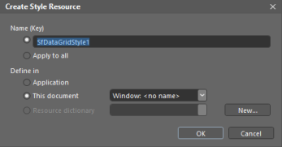
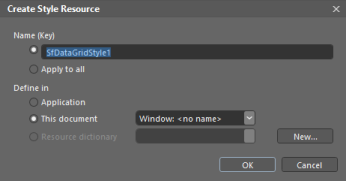
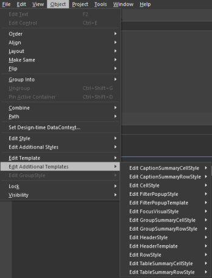
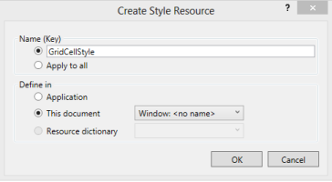
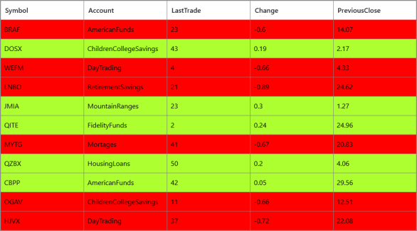
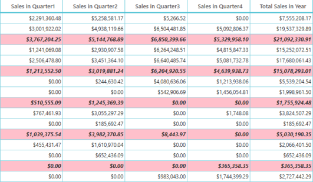

# Styles and Templates 

WPF Styling and Templating refer to a suite of features (styles and templates) that allow developers and designers to create visually compelling effects and consistent appearance for their products.

## Overview

This section elaborates the information about changing the visual appearance of the DataGrid and its elements. In addition, you can edit the structure of DataGrid and its elements using Blend and visual studio that helps you to customize their appearance. This section includes the following topics:

* Visual Elements
* Blend Style Editing
* Visual Style Editing
* Styling Cells
* Styling Rows
* Style Selectors
* Header Template
* Template Selectors
* Conditional Formatting for Cells
* Alternating Row Style

## Visual Elements

The following screenshot displays the elements present in the DataGrid.

Elements of DataGrid Control
{:.caption}
A DataGrid comprises of the following elements:

* GridCell - Displays the data in cell corresponding to the column.
* GridHeaderCellControl - Displays the column name, Sort indication and Filter                                                                                                funnel.
* GridStackedHeaderCellControl - Displays the Stacked header informations.
* GridCaptionSummaryCell - Displays the group caption and caption summary value.
* GridTableSummaryCell - Displays the table summary values.
* GridGroupSummaryCell - Displays the group summary values.
* HeaderRowControl - Container for GridHeaderCellControl and GridStackedHeaderCellControl collection.
* VirtualizingCellsControl - Container for GridCell control Collection
* TableSummaryRowControl - Container for Collection of GridTableSummaryCell.
* CaptionSummaryRowControl - Represents the Group Row header. Container for GridCaptionSummarycell.  
* GroupSummaryRowContro l - Container for collection of GridGroupSummaryCell.
* GroupDropArea - Shows grouped columns in the DataGrid   control.
* GroupDropAreaItem - Represents the grouped columns in GroupDropArea.

## Blend Style Editing

DataGrid allows you to edit the styles of DataGrid and its elements in Expression blend, as your requirement.

### Edit DataGrid Style in Expression Blend

The section explains you how to edit a SfDataGrid style in ExpressionBlend. To Edit the control style in ExpressionBlend follow the steps,

* Open your application in Expression Blend.
* In Object and Timeline Pane select SfDataGrid control.

Object and Timeline Pane
{:.caption}
* From the menu bar select Object > EditStyle.

Selecting EditStyle from Object in Menu Bar
{:.caption}
You can see two options in submenu,

* Edit a Copy –Edits a copy of the default style. When you select this option, a new dialog window is opened as follows.

Create Style Resources dialog box
{:.caption}
The Create Style Resources dialog prompts you to enter the name or change the name for your style, also you can select the location where your style is defined.

* Create Empty- Creates an empty style for the SfDataGrid. When you select this option, the same Create style Resources dialog is opened. You can enter the name or change the name of style and select the location where your style is defined.

Creating empty style for SfDataGrid
{:.caption}
Click OK, Expression Blend generates the style of the SfDatagrid control in the Resource section. The properties available for the style are loaded in the ‘Properties’ pane and you can modify its default values. You can also edit the generated XAML in the XAML view or in VisualStudio.

### Edit DataGrid Elements in Expression Blend

You can also edit the Datagrid elements in ExpressionBlend. To edit the SfDatagrid elements in ExpressionBlend follow the steps,

* Open your application in Expression Blend.
* In Object and Timeline Pane select SfDataGrid control.

Object and Timeline Pane
{:.caption}
* From menu bar select the Object > Edit Additional Templates.

Selecting Edit Additional Styles from Object in Menu Bar
{:.caption}
You can select the available DataGrid element templates that you can modify the style. For example when you select EditCellStyle, you have following two options.

* Edit a Copy _–_Edits a Copy of the default style. When you select this option, a new dialog window is opened.

Create Style Resources dialog box
{:.caption}
The Create Style Resources dialog prompts you to enter the name or change the name for your style. Also you can select the location where your style is defined.

* Create Empty_-_ creates an empty style for the SfDataGrid. When you select this same option, the same Create Style Resources dialog is opened. You can enter the name or change the name of style and select the location where your style is defined.

Creating empty style for SfDataGrid
{:.caption}
Click OK, Expression Blend generates the style of the GridCell in the Resource section. The properties available for the styles are loaded in the Properties pane and you can modify their default values. You can also edit the generated XAML in the XAML view or in VisualStudio.

You can also edit the style of the following Datagrid elements in Expression Blend.

* CaptionSummaryCellStyle.
* CaptionSummaryRowStyel.
* FilterPopupStyle.
* FilterPopupTemplate.
* GroupSummaryCellStyle.
* GroupSummaryRowStyle.
* HeaderStyle
* HeaderTemplate
* RowStyle
* TableSummaryCellStyle
* TableSummaryRowStyle.

## Visual Style Editing

DataGrid allows you to edit the styles of DataGrid and its elements in Visual studio as your requirement.

N> Visual Style Editing option is availble in Visual Studio 2012 and higher versions only.

### Edit DataGrid in Visual Studio Design View.

This section explains you how to edit a SfDataGrid style in VisualStudioDesingView. To Edit the control style in Visual studio follow the steps.

* Open your application in Visual Studio.
* Open Designview>>Right-click on the designview. Menu options are displayed.
* Click EditTemplates, you can see the following two options. 

Designview in Visual Studio
{:.caption}
* Edit a Copy –Edits a copy of the default style. When you select this option, a new dialog window is opened.

Create style Resources dialog box
{:.caption}
The Create style Resources dialog prompts you to enter the name or change the name of style. Also you can select the location where your style is defined.

* Create Empty- creates an empty style for the SfDataGrid. When you select this option, the same Create style Resources dialog is opened. You can enter name or change the name of style and select the location where your style is defined.

Creating empty style for SfDataGrid
{:.caption}
Click OK, Visual Studio generates the style of DataGrid in the Resource section.The style of the DataGrid control is loaded in the XAML.  You can also edit the generated XAML in the XAML view.

### Edit DataGrid Elements in VisualStudio Desing View

This section explains you how to edit a SfDataGrid elements style in VisualStudioDesingView. To Edit the DataGrid element style in Visual Studio follow the steps,

* Open your application in Visual Studio.
* Open Designview>>Right-click on the designview. Menu options are displayed.
* Click EditAdditionalTemplates>>EditCellStyle, you can have the following two menu options.

Selecting EditCellStyle from EditAdditionalTemplates in Designview
{:.caption}
* Edit a Copy –Edits a copy of the default style. When you select this option, a new dialog window is opened.

Create style Resources dialog box
{:.caption}
The Create style Resources dialog prompts you to enter the name or change the name of style.Also you can select the location where your style is defined.

* Create Empty- creates an empty style for the GridCell. When you select this option, the same Create style Resources dialog is opened. You can enter the name or change the name of style and select the location where your style is defined.

Creating empty style for SfDataGrid
{:.caption}
Click OK, Visual Studio generates the style of GridCell in the Resource section.The style of the GridCell is loaded in the XAML  You can also edit the generated XAML in the XAML view.

You can also edit the style of the following DataGrid elements in Visual Studio.

* CaptionSummaryCellStyle.
* CaptionSummaryRowStyel.
* FilterPopupStyle.
* FilterPopupTemplate.
* GroupSummaryCellStyle.
* GroupSummaryRowStyle.
* HeaderStyle
* HeaderTemplate
* RowStyle
* TableSummaryCellStyle
* TableSummaryRowStyle.

## Styling Cells

DataGrid control offers the following properties to apply custom styling for cells.

Styling cells property table

<table>
<tr>
<th>
Property</th><th>
Description</th><th>
Target Element Type</th><th>
DataContext</th></tr>
<tr>
<td>
SfDataGrid.CellStyle,GridColumn.CellStyle</td><td>
Applies styles to GridCell</td><td>
GridCell</td><td>
Business object</td></tr>
<tr>
<td>
SfDataGrid.CaptionSummaryCellStyle</td><td>
Applies styles to Group Caption Summary Cell</td><td>
GridCaptionSummaryCell</td><td>
Group</td></tr>
<tr>
<td>
SfDataGrid.GroupSummaryCellStyle</td><td>
Applies styles to Group Summary Cell</td><td>
GridGroupSummaryCell</td><td>
SummaryRecordEntry</td></tr>
<tr>
<td>
SfDataGrid.TableSummaryCellStyle</td><td>
Applies styles to Table Summary Cell</td><td>
GridTableSummaryCell</td><td>
SummaryRecordEntry</td></tr>
<tr>
<td>
SfDataGrid.HeaderStyle,GridColumn.HeaderStyle</td><td>
Applies styles to Column Header</td><td>
GridHeaderCellControl</td><td>
Null</td></tr>
</table>

### SfDataGrid.CellStyle

DataGrid displays all the column values in cells. GridCell is base type for all the cells in the Grid.  These cells are styled by creating appropriate style for the cells and setting that to SfDataGrid.CellStyle property.

The following code example illustrates applying styles for cells.



<!--  Grid Cell Style  -->

<Window.Resources>

</Window.Resources>

<syncfusion:SfDataGrid  x:Name="datagrid" 

                        ItemsSource="{Binding ItemsSource}"

                        CellStyle="{StaticResource customCellStyle}" />



N> DataGrid control also allows you to apply the style for the cells in the particular column by using GridColumn.CellStyle property.

### SfDataGrid.CaptionSummaryCellStyle

Group caption row displays the data i.e. Group caption text and caption summary values in GridCaptionSummaryCell. You can apply custom style for GridCaptionSummaryCell using this property.

The following code example illustrates this.



<Window.Resources>

</Window.Resources>

<syncfusion:SfDataGrid   x:Name="datagrid" 

                           AllowSorting="True"           

                           CaptionSummaryCellStyle="{StaticResource captionSummaryCellStyle}" 

                           ItemsSource="{Binding OrdersDetails}" />



### SfDataGrid.GroupSummaryCellStyle

GroupSummary row displays all the summary values in GroupSummaryCells. You can apply the style for GroupSummaryCell using this property. The following code example illustrates this.



<Window.Resources>

</Window.Resources>

<syncfusion:SfDataGrid x:Name="datagrid" 

                         AllowSorting="True"

                         GroupSummaryCellStyle="{StaticResource groupSummaryCellStyle}"

                         ItemsSource="{Binding OrdersDetails}" />



### SfDataGrid.TableSummaryCellStyle

All the table summary values are displayed in GridTableSummaryCell. DataGrid enables you to apply style for GridTableSummaryCell using this property. The following code example illustrates this.



<Window.Resources>

</Window.Resources>

<syncfusion:SfDataGrid x:Name="datagrid" AllowSorting="True"

TableSummaryCellStyle="{StaticResource tableSummaryCellStyle}"

ItemsSource="{Binding OrdersDetails}" />



### SfDataGrid.HeaderStyle

DataGrid displays the column header in GridHeaderCellControl that displays the column header text and shows the sorting icon when you sort the column. By using this property, you can apply style for GridHeaderCellControl. The following code example illustrates this.



<Window.Resources>

</Window.Resources>

<syncfusion:SfDataGrid x:Name="datagrid" 

                         AllowSorting="True"

                         HeaderStyle="{StaticResource headerCellStyle}"

                         ItemsSource="{Binding OrdersDetails}">


## Styling Rows

The DataGrid control offers the following properties for Styling the different type of rows in Grid

Styling Rows property table

<table>
<tr>
<th>
Property</th><th>
Description</th><th>
Target Element</th><th>
Data Context</th></tr>
<tr>
<td>
SfDataGrid.RowStyle</td><td>
Applies styles to Rows.</td><td>
VirtualizingCellsControl</td><td>
Business object</td></tr>
<tr>
<td>
SfDataGrid.AlternatingRowStyle</td><td>
Applies styles for AlternateRow</td><td>
VirtualizingCellsControl</td><td>
Business object</td></tr>
<tr>
<td>
SfDataGrid.CaptionSummaryRowStyle</td><td>
Applies styles to Caption Summary Rows.</td><td>
CaptionSummaryRowControl</td><td>
Group </td></tr>
<tr>
<td>
SfDataGrid.GroupSummaryRowStyle</td><td>
Applies styles to Group Summary Rows.</td><td>
GroupSummaryRowControl</td><td>
SummaryRecordEntry</td></tr>
<tr>
<td>
SfDataGrid.TableSummaryRowStyle</td><td>
Applies styles to Table Summary Rows.</td><td>
TableSummaryRowControl</td><td>
SummaryRecordEntry</td></tr>
</table>

### SfDataGrid.RowStyle

All the rows in the DataGrid are of VirtualizingCellsControl type that contains the RowData as data context. SfDataGrid.RowStyle property helps to apply styles for the row.

The following code example illustrates how to set the row style for DataGrid.



<Window.Resources>       

<Window.Resources>

<syncfusion:SfDataGrid x:Name="datagrid" 

                         RowStyle="{StaticResource rowStyle}"

                         ItemsSource="{Binding OrdersDetails}" />



### SfDataGrid.AlternatingRowStyle

The property helps you to apply style for alternate row in SfDataGrid. It is the type of VirtualizingCellsControl that contains the RowData as data context. SfDataGrid.AlternatingRowStyle property helps to apply styles for the alternate row.

The following code example illustrates how to set the alternate row style for DataGrid.



<Window.Resources>       

<Window.Resources>

<syncfusion:SfDataGrid x:Name="datagrid" 

                         AlternatingRowStyle="{StaticResource AlternaterowStyle }"

                         ItemsSource="{Binding OrdersDetails}" />



### SfDataGrid.CaptionSummaryRowStyle

This property helps to apply styling for Group caption row (refer the visual elements figure). Group caption row is a type of CaptionSummaryRowControl that inherits from VirtualizingCellsControl containing the Group data as DataContext. 

The following code example illustrates applying styles for Group caption row.



<Window.Resources>

<Window.Resources>

<syncfusion:SfDataGrid x:Name="datagrid" 

                         AllowSorting="True"

                         CaptionSummaryRowStyle="{StaticResource captionSummaryRowStyle}"

                         ItemsSource="{Binding OrdersDetails}">



### SfDataGrid.GroupSummaryRowStyle

Group summary is displayed at the bottom of all groups when you add GridSummaryRow object to SfDataGrid.GroupSummaryRows collection. You can apply style to them by editing the GroupSummaryRowControl style.

The following code example illustrates styling of Group Summary rows.



<Window.Resources>

<Window.Resources>

<syncfusion:SfDataGrid x:Name="datagrid" 

                         AllowSorting="True"

                         GroupSummaryRowStyle="{StaticResource groupSummaryRowStyle}"

                         ItemsSource="{Binding OrdersDetails}">



### SfDataGrid.TableSummaryRowStyle

DataGrid displays all the Table summary values in TableSummaryRow. By default, table summary row is present at the bottom of DataGrid. TableSummaryRow is of a type TableSummaryRowControl. You can apply styling for TableSummaryRowControl by creating custom style and setting that style to SfDataGrid.TableSummaryRowStyle property.

The following code example displays the styling of TableSummaryRow.



<Window.Resources>

<Window.Resources>

<syncfusion:SfDataGrid x:Name="datagrid" 

                         AllowSorting="True"

                         TableSummaryRowStyle="{StaticResource tableSummaryRowStyle}"

                         ItemsSource="{Binding OrdersDetails}">



## Style Selectors

DataGrid provides extensive support for StyleSelectors that helps to apply custom style for cells and rows. To know more about the StyleSelectors you can check the following MSDN link: [http://msdn.microsoft.com/en-us/library/system.windows.controls.styleselector.aspx](http://msdn.microsoft.com/en-us/library/system.windows.controls.styleselector.aspx).

N> By default, Silverlight does not support StyleSelectors hence DataGrid too._

### Cell Style Selectors

DataGrid control offers following StyleSelector properties to set the style for cells.

<table>
<tr>
<th rowspan = "2">
Property</th><th rowspan = "2">
Description</th><th colspan = "2">
Parameters</th></tr>
<tr>
<td>
Item</td><td>
Container</td></tr>
<tr>
<td>
SfDataGrid.CellStyleSelector</td><td>
Gets or sets a value that applies the style for GridCell based on a custom condition</td><td>
Corresponding row data.</td><td>
GridCell</td></tr>
<tr>
<td>
SfDataGrid.CaptionSummaryCellStyleSelector</td><td>
Gets or sets a value that applies the style for GridCaptionSummaryCell based on a custom condition</td><td>
Corresponding row data.</td><td>
GridCaptionSummaryCell</td></tr>
<tr>
<td>
SfDataGrid.GroupSummaryCellStyleSelector</td><td>
Gets or sets a value that applies the style for GridGroupSummaryCell based on a custom condition</td><td>
Corresponding row data.</td><td>
GridGroupSummaryCell</td></tr>
<tr>
<td>
SfDataGrid.TableSummaryCellStyleSelector</td><td>
Gets or sets a value that applies the style for GridTableSummaryCell based on a custom condition</td><td>
Corresponding row data.</td><td>
GridTableSummaryCell</td></tr>
</table>

### Row Style Selectors

DataGrid also offers following StyleSelector properties for applying styles to rows. 

<table>
<tr>
<th rowspan = "2">
Property</th><th rowspan = "2">
Description</th><th colspan = "2">
Parameters</th></tr>
<tr>
<td>
Item</td><td>
Container</td></tr>
<tr>
<td>
SfDataGrid.RowStyleSelector</td><td>
Gets or sets a value that applies the style for VirtualizingCellsControl based on a custom condition</td><td>
DataRowBase</td><td>
VirtualizingCellsControl</td></tr>
<tr>
<td>
SfDataGrid.AlternatingRowStyleSelector</td><td>
Gets or sets a value that applies the style for VirtualizingCellsControl based on a custom condition</td><td>
DataRowBase</td><td>
VirtualizingCellsControl</td></tr>
<tr>
<td>
SfDataGrid.CaptionSummaryRowStyleSelector</td><td>
Gets or sets a value that applies the style for CaptionSummaryRowControl based on a custom condition</td><td>
DataRowBase</td><td>
CaptionSummaryRowControl</td></tr>
<tr>
<td>
SfDataGrid.GroupSummaryRowStyleSelector</td><td>
Gets or sets a value that applies the style for GroupSummaryRowControl based on a custom condition</td><td>
DataRowBase</td><td>
GroupSummaryRowControl</td></tr>
<tr>
<td>
SfDataGrid.TableSummaryRowStyleSelector</td><td>
Gets or sets a value that applies the style for TableSummaryRowControl based on a custom condition</td><td>
DataRowBase</td><td>
TableSummaryRowControl</td></tr>
</table>

### Example

In the following example, you can set the different row background for DataGrid by using SfDataGrid.RowStyleSelector property.



//Custom Style 

<Application.Resources>

      

      

</Application.Resources>




// Custom Style Selector.

public class CustomRowStyleSelector : StyleSelector

{

public override Style SelectStyle(object item, DependencyObject container)

{

var row = item as DataRowBase;

// Applying alternating background for rows.

              if (row.RowIndex % 2 != 0)

                return App.Current.Resources["rowStyle1"] as Style;

              else

  return App.Current.Resources["rowStyle2"] as Style;

return base.SelectStyle (item, container);

}

}





</Window.Resources>

<local:CustomRowStyleSelector x:Key="rowStyleSelector" />

</Window.Resources>

<syncfusion:SfDataGrid x:Name="datagrid" 

                         AllowSorting="True"

                         RowStyleSelector="{StaticResource rowStyleSelector}"

                         ItemsSource="{Binding OrdersDetails}"/>



The following screenshot displays the output.

Customized rows with background
{:.caption}
## Header Template

### GridColumn.HeaderTemplate

DataGrid provides the extensive support to apply template for column header. By using the following property, you can template the particular column header.

Property Table

<table>
<tr>
<th>
Property Name</th><th>
Description</th><th>
Data Context</th></tr>
<tr>
<td>
GridColumn.HeaderTemplate</td><td>
Gets or sets a value that applies template for corresponding column header.</td><td>
Null</td></tr>
</table>

The following code example illustrates how to use HeaderTemplate in DataGrid Column.



<Window.Resources>

<DataTemplate x:Key="headerTemplate">

<Grid>

<Grid.ColumnDefinitions>

                  <ColumnDefinition Width="Auto" />

                  <ColumnDefinition Width="*" />

</Grid.ColumnDefinitions>

<TextBlock Grid.Column="0" VerticalAlignment="Center"

                  Foreground="White" Text="{Binding}" />

                  <Image Source="/Assets/Icon.jpg" Grid.Column="1" />

</Grid>

</DataTemplate>

</Window.Resources>

<syncfusion:SfDataGrid x:Name="datagrid" 

                         AutoGenerateColumns="False"

                         ColumnSizer="Star" 

                         ItemsSource="{Binding GDCSource}">

<syncfusion:SfDataGrid.Columns>

<syncfusion:GridTextColumn MappingName="EmployeeName"

HeaderTemplate="{StaticResource headerTemplate}" />

<syncfusion:GridTextColumn MappingName="EmployeeDesignation" />

<syncfusion:GridTextColumn MappingName="EmployeeAge"  />

<syncfusion:GridTextColumn MappingName="EmployeeGender" />

<syncfusion:GridTextColumn MappingName="EmployeeArea" />

<syncfusion:GridTextColumn MappingName="EmployeeSalary" />

</syncfusion:SfDataGrid.Columns>

</syncfusion:SfDataGrid>



N> DataGrid control also provides the support to apply DataTemplateSelector for a particular column using GridTemplateColumn.CelltemplateSelector property. For more information about this, you can refer_ ColumnType _topic.

## Template Selectors

DataGrid provides extensive support for DataTemplateSelectors that helps to apply custom style for cells and rows, based on a custom condition. To know more about the DataTemplateSelectors, you can check the following MSDN link:

[http://msdn.microsoft.com/en-us/library/system.windows.controls.datatemplateselector.aspx](http://msdn.microsoft.com/en-us/library/system.windows.controls.datatemplateselector.aspx).

N> By default, Silverlight does not support TemplateSelectors hence DataGrid too.

DataGrid offers the following DataTemplateSelector property to apply custom templates for cells based on a custom condition.

DataTemplateSelector property table

<table>
<tr>
<th rowspan = "2">
Property</th><th rowspan = "2">
Description</th><th colspan = "2">
Parameters</th></tr>
<tr>
<td>
Item</td><td>
Container</td></tr>
<tr>
<td>
SfDataGrid.CellTemplateSelector</td><td>
Gets or sets DataTemplateSelectors value that applies custom template for the cells based on a custom condition.It applies for all TemplateColumn.</td><td>
Corresponding row data</td><td>
GridCell</td></tr>
<tr>
<td>
GridColumn.CellTemplateSelector</td><td>
Gets or sets DataTemplateSelectors value that applies custom template for the cells based on a custom condition.It applies for particular column.</td><td>
Corresponding row data</td><td>
GridCell</td></tr>
</table>

### SfDataGrid.CellTemplateSelector

By using this property, you can apply custom templates for cells based on a custom condition. It applies for all template column defined in DataGrid. The following code example illustrates applying template selector for DataGrid Template column.



class GridCellTemplateSelector : DataTemplateSelector 

{

  public override DataTemplate SelectTemplate(object item, DependencyObject container)

    {

      var data = item as SalesByYear;

      if (data.QS2 ==0)

       return Application.Current.Resources["CellTemplate1"] as DataTemplate;

      else

       return Application.Current.Resources["CellTemplate2"] as DataTemplate;               

    }

}




<Application.Resources>

    <DataTemplate x:Key="CellTemplate1">

       <TextBlock Foreground="Blue" Text="{Binding Name}" />

    </DataTemplate>

    <DataTemplate x:Key="CellTemplate2">

        <TextBlock Foreground="Red" Text="{Binding Name}" />

    </DataTemplate>

</Application.Resources>

</Window.Resources>

<local:GridCellTemplateSelector x:Key="templateselector"/> 

</Window.Resources>

<syncfusion:SfDataGrid x:Name="datagrid" 

                         ItemsSource="{Binding ItemsSource}">

                         CellTemplateSelector="{StaticResource templateselector}"

</syncfusion:SfDataGrid>    


The following screenshot displays the output.

Template selector for DataGrid Template column
{:.caption}
###h GridColumn.CellTemplateSelector

By using this property, you can apply custom templates for cells based on a custom condition. The following code example illustrates applying template selector for DataGrid Template column.



class GridCellTemplateSelector : DataTemplateSelector

{

public override DataTemplate SelectTemplate(object item, DependencyObject container)

{

var record = item as GridDataControlStylingDemo.ModelData;

if (record != null && record.Gender == "Male")

return Application.Current.Resources["maleCellTemplate"] as DataTemplate;

else if (record != null && record.Gender == "Female")

return Application.Current.Resources["femaleCellTemplate"] as DataTemplate;

else

return base.SelectTemplate(item, container);

}

}




<Application.Resources>

<DataTemplate x:Key="maleCellTemplate">

<Image Source="/Assets/male.jpg" />

</DataTemplate>

<DataTemplate x:Key="femaleCellTemplate">

<Image Source="/Assets/female.jpg" />

</DataTemplate>

</Application.Resources>

<syncfusion:SfDataGrid x:Name="datagrid" 

                         ItemsSource="{Binding ItemsSource}">

            <syncfusion:SfDataGrid.Columns>

              <syncfusion:GridTextColumn MappingName="EmployeeId" />

              <syncfusion:GridTextColumn MappingName="EmployeeName" />

              <syncfusion:GridTextColumn MappingName="EmployeeDesignation" />

              <syncfusion:GridTemplateColumn  

                   CellTemplateSelector="{StaticResource cellSelector}"   

                   MappingName="EmployeeGender" />

              </syncfusion:SfDataGrid.Columns>

</syncfusion:SfDataGrid>  



The following screenshot displays the output.

Template selector for Grid Template column
{:.caption}
## Conditional Formatting for Cells

DataGrid allows you to format the styles of cells and rows based on certain conditions. This is achieved by defining styling and template properties of DataGrid. To know more about styling and template properties you can refer the following topics:

* Styling Cells
* Styling Row
* Style Selectors
* Template Selectors

### Applying Conditional Formatting to Cells

### Example

In this example you can see how to apply styles, based on conditions for cells in “Change” column using CellTemplate. When the change value is less than zero, then Red color foreground is applied to that cell, else Green color Foreground is applied.

Following steps illustrate how to apply conditional formatting to the Cells in Grid:

1. Create a converter and specify the criteria to apply conditional formatting to the cells.



   //Color Converters

				public class ForegroundColorConverter : IValueConverter

				{

				public object Convert(object value, Type targetType, object parameter, string language)

				{

				var data = value as double?;

				if (data != null && data > 0)

				return new SolidColorBrush(Colors.Green);

				else

				return new SolidColorBrush(Colors.Red);

				}

				public object ConvertBack(object value, Type targetType, object parameter, string language)

				{

				throw new NotImplementedException();

				}

				}



2. Create a CellTemplate for “Change” column and apply the above Foreground converter to the TextBlock inside the Template.



			</Window.Resources>

			<local:ForegroundColorConverter x:Key="changeForegroundConverter"/> 

			</Window.Resources>

			<syncfusion:SfDataGrid x:Name="datagrid" 

									 AutoGenerateColumns="False" 

									 ItemsSource="{Binding Stocks}">

			<syncfusion:SfDataGrid.Columns>

			<syncfusion:GridTextColumn MappingName="Symbol" />

			<syncfusion:GridTemplateColumn MappingName="Account" />

			<syncfusion:GridTextColumn MappingName="LastTrade" />

			<syncfusion:GridTemplateColumn MappingName="Change">

			<syncfusion:GridTemplateColumn.CellTemplate>

			<DataTemplate>

			<TextBlock x:Name="changeValue" HorizontalAlignment="Center" FontSize="24" FontWeight="Light" Foreground="{Binding Change, Converter={StaticResource changeForegroundConverter}}"                                                                          Text="{Binding Change}" />

			</DataTemplate>

			</syncfusion:GridTemplateColumn.CellTemplate>

			</syncfusion:GridTemplateColumn>

			<syncfusion:GridTextColumn MappingName="PreviousClose" />

			<syncfusion:GridTextColumn MappingName="Open" />

			</syncfusion:SfDataGrid.Columns>

			</syncfusion:SfDataGrid>

			


   The following screenshot displays the output.

   

   Conditional formatting to the Cells in Grid
   {:.caption}
   
### Applying Conditional Formatting for Rows

### Example

In this example, you can see how to apply style, based on conditions for rows using SfDataGrid.RowStyleSelector. When the “Change” column value is less than zero, then Red color foreground is applied to that Row, else Green color foreground is applied.

Following steps illustrate how to apply conditional formatting to the Rows in Grid:

1. Create a StyleSelector and specify the criteria to apply conditional formatting to the rows.



			public class CustomRowStyleSelector : StyleSelector

			{

			public override Style SelectStyle(object item, DependencyObject container)

			{

			var row = item as DataRowBase;

			var data = row.RowData as StockData;

			if (data != null)

			{

			if(data.Change<0)

			return App.Current.Resources["redRowStyle"] as Style;

			else

			return App.Current.Resources["greenRowStyle"] as Style;

			}

			return base.SelectStyle (item, container);

			}

			}



2. Assign that custom StyleSelector object to SfDataGrid.RowStyleSelector property. The following code example illustrates this.



			</Window.Resources>

			<local:CustomRowStyleSelector x:Key="rowStyleSelector "/> 

			</Window.Resources>

			<syncfusion:SfDataGrid x:Name="datagrid" 

									 AutoGenerateColumns="True"

									 ColumnSizer="Star" 

									 RowStyleSelector="{StaticResource rowStyleSelector}"

							ItemsSource="{Binding Stocks}" />



   The following screenshot displays the output.

   

   Conditional formatting to the Rows in Grid
   {:.caption}
   N> StyleSelectors & TemplateSelectors are not supported by Silverlight

   

## Alternating Row Style

You can set the Alternative RowStyle in DataGrid by using SfDataGrid.AlternatingRowStyle__property. 

DataGrid allows you to set AlternativeRowCount.By default, AlternatingRowStyle is applied for every alternative second row.To change the alternative row count, you can change it by using AlternationCount property.

The following code example illustrates how to use AlternatingRowStyle in DataGrid.



<Window.Resources>

</Window.Resources>

<syncfusion:SfDataGrid Name="grid"

                           AlternationCount="3"

                           AlternatingRowStyle="{StaticResource alternateRowstyle}"  



The following screenshot displays the output.

AlternatingRowStyle in DataGrid
{:.caption}
