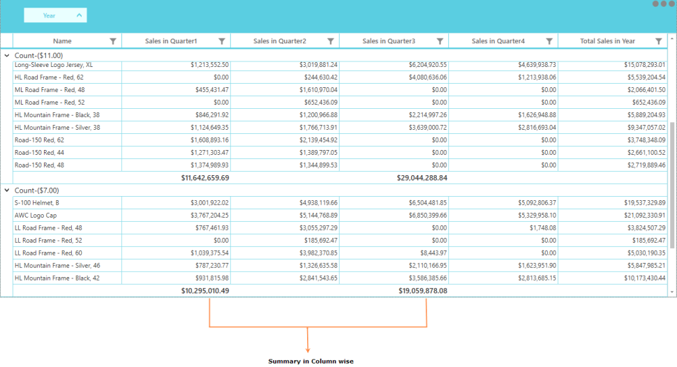
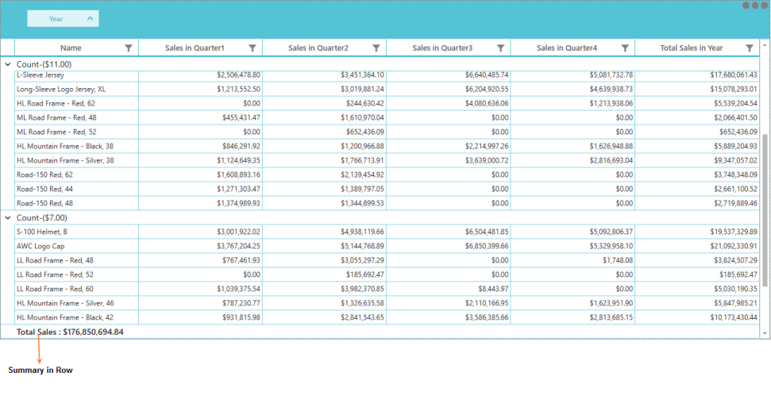

# Summaries

This section explains you how to show concise information about Grouped Data from DataGrid data in rows or columns. 

## Overview

SfDataGrid control allows you to display summaries for each Group or Table. You can derive additional information from your data like Sum, Average, Maximum, Minimum and Count using summaries. DataGrid control supports three types of summaries.

* Table Summary
* Group Summary
* Caption Summary

These summary values are computed for Groups using GridSummaryRow and GridSummaryColumn that implements ISummaryRow and ISummaryColumn interface.

## GridSummaryRow

All the summaries are represented by GridSummaryRow that contains the following important properties.

<table>
<tr>
<th>
Property</th><th>
Type</th><th>
Description</th><th>
Default Value</th></tr>
<tr>
<td>
GridSummaryRow.ShowSummaryInRow</td><td>
Boolean</td><td>
Indicates whether the summary value is displayed in specific column or row.</td><td>
True</td></tr>
<tr>
<td>
GridSummaryRow.Title</td><td>
String</td><td>
Displays summary with title (with Statement) while ShowSummaryInRow is set to ‘true’.</td><td>
Null</td></tr>
<tr>
<td>
GridSummaryRow.SummaryColumns</td><td>
Collection</td><td>
Gets or sets a value that stores the collection of GridSummaryColumns to calculate the summaries.</td><td>
</td></tr>
<tr>
<td>
GridSummaryRow.Name</td><td>
String</td><td>
Gets or sets a value that indicates the name of GridSummaryRow.</td><td>
Null</td></tr>
</table>

DataGrid control enables you to display more than one summary (i.e. GroupSummary and TableSummary) by defining more than one GridSummaryRows. Group summaries are stored in SfDataGrid.GroupSummaryRows collection and Table summaries are stored in SfDataGrid.TableSummaryRows collection.

## GridSummaryColumn

GridSummaryColumn is the object of GridSummaryRow.SummaryColumns collection that contains the following important properties:

* MappingName: The corresponding column name that is used for the summary calculation.
* SummaryType: It is the SummaryType (enum) property that helps to define the aggregate type for the summary calculation. DataGrid control provides the following predefined aggregates. 
* CountAggregate.
* Int32Aggregate. 
* DoubleAggregate.
* Custom (used with custom summaries).
* Format: String property that formats the summary value and displays it.Format property contains two parts that is separated by colon (:) symbol. 
* First part denotes the aggregate function name and second part denotes display format of the summary value.

For example when you declare the format as “{Sum:c}”, the keyword “Sum” denotes the aggregate function name. Every aggregate type has some built-in aggregate function. The aggregate function names in built-in aggregate types as follows:

1. CountAggregate: Count
2. Int32Aggregate: Count,Max,Min,Average and Sum
3. DoubleAggregate: Count, Max, Min, Average and Sum
4. You can use these function names only when you define the Format property.

Second part denotes the format. The key word “c” denotes the string format that defines how the summary value is displayed. 

To know more about the string format values, you can refer the following MSDN link: [http://msdn.microsoft.com/en-us/library/dwhawy9k.aspx](http://msdn.microsoft.com/en-us/library/dwhawy9k.aspx).

* Name: Defines name of the GridSummaryColumn that helps to denote the GridSummaryColumn in GridSummaryRow with Title.
* CustomAggregate: Defines the customaggregate class object when the summary type is set as Custom that calculates the custom summaries.

### Examples

Show column wise summary values

DataGrid provides exclusive support to show column wise summary values. To show the summary values in column wise you can set GridSummaryRow.ShowSummaryInRow property as ‘false’.

The following code example illustrates this.



<syncfusion:SfDataGrid AllowFrozenGroupHeaders="True"

                       AutoExpandGroups="True"

                       AutoGenerateColumns="False"

                       ColumnSizer="Star"

                       GroupCaptionTextFormat="Sales details in {ColumnName} : {Key}"

                       ItemsSource="{Binding YearlySalesDetails}"

                       NavigationMode="Row"

                       ShowColumnWhenGrouped="False">

    <syncfusion:SfDataGrid.GroupColumnDescriptions>

        <syncfusion:GroupColumnDescription ColumnName="Year" />

    </syncfusion:SfDataGrid.GroupColumnDescriptions>

    <syncfusion:SfDataGrid.Columns>

        <syncfusion:GridTextColumn MappingName="Name" />

        <syncfusion:GridTextColumn DisplayBinding="{Binding Path=QS1,

                                                        StringFormat='{}{0:C}'}"

                                   HeaderText="Sales in Quarter1"

                                   MappingName="QS1"

                                   TextAlignment="Right" />

        <syncfusion:GridTextColumn DisplayBinding="{Binding Path=QS2,

                                                        StringFormat='{}{0:C}'}"

                                   HeaderText="Sales in Quarter2"

                                   MappingName="QS2"

                                   TextAlignment="Right" />

        <syncfusion:GridTextColumn DisplayBinding="{Binding Path=QS3,

                                                        StringFormat='{}{0:C}'}"

                                   HeaderText="Sales in Quarter3"

                                   MappingName="QS3"

                                   TextAlignment="Right" />

        <syncfusion:GridTextColumn DisplayBinding="{Binding Path=QS4,

                                                        StringFormat='{}{0:C}'}"

                                   HeaderText="Sales in Quarter4"

                                   MappingName="QS4"

                                   TextAlignment="Right" />

        <syncfusion:GridTextColumn DisplayBinding="{Binding Path=Total,

                                                        StringFormat='{}{0:C}'}"

                                   HeaderText="Total Sales in Year"

                                   MappingName="Total"

                                   TextAlignment="Right" />

        <syncfusion:GridTextColumn MappingName="Year" />

    </syncfusion:SfDataGrid.Columns>

    <syncfusion:SfDataGrid.TableSummaryRows>

        <syncfusion:GridSummaryRow ShowSummaryInRow="False">

            <syncfusion:GridSummaryRow.SummaryColumns>

                <syncfusion:GridSummaryColumn Name="TQS1"

                                              Format="'{Sum:c}'"

                                              MappingName="QS1"

                                              SummaryType="DoubleAggregate" />

                <syncfusion:GridSummaryColumn Name="TQS4"

                                              Format="'{Sum:c}'"

                                              MappingName="QS4"

                                              SummaryType="DoubleAggregate" />

            </syncfusion:GridSummaryRow.SummaryColumns>

        </syncfusion:GridSummaryRow>

    </syncfusion:SfDataGrid.TableSummaryRows>

</syncfusion:SfDataGrid>



The following screenshot displays the output of the above code.

Column wise Summary values
{:.caption}
In the above screenshot, summary values are showed at the bottom of corresponding column that are mapped to the GridSummaryColumn.

N> Summary values are displayed based on the GridSummaryColumn.Format value, when the summaries are displayed in column wise.

### Show the summaries in row

When you declare the summaries as default,DataGrid shows the values in the row. The following code example illustrates how to declare the summaries for DataGrid.



<syncfusion:SfDataGrid AllowFrozenGroupHeaders="True"

                       AutoExpandGroups="True"

                       AutoGenerateColumns="False"

                       ColumnSizer="Star"

                       GroupCaptionTextFormat="Sales details in {ColumnName} : {Key}"

                       ItemsSource="{Binding YearlySalesDetails}"

                       NavigationMode="Row"

                       ShowColumnWhenGrouped="False">

    <syncfusion:SfDataGrid.GroupColumnDescriptions>

        <syncfusion:GroupColumnDescription ColumnName="Year" />

    </syncfusion:SfDataGrid.GroupColumnDescriptions>

    <syncfusion:SfDataGrid.Columns>

        <syncfusion:GridTextColumn MappingName="Name" />

        <syncfusion:GridTextColumn DisplayBinding="{Binding Path=QS1,

                                                            StringFormat='{}{0:C}'}"

                                   HeaderText="Sales in Quarter1"

                                   MappingName="QS1"

                                   TextAlignment="Right" />

        <syncfusion:GridTextColumn DisplayBinding="{Binding Path=QS2,

                                                            StringFormat='{}{0:C}'}"

                                   HeaderText="Sales in Quarter2"

                                   MappingName="QS2"

                                   TextAlignment="Right" />

        <syncfusion:GridTextColumn DisplayBinding="{Binding Path=QS3,

                                                            StringFormat='{}{0:C}'}"

                                   HeaderText="Sales in Quarter3"

                                   MappingName="QS3"

                                   TextAlignment="Right" />

        <syncfusion:GridTextColumn DisplayBinding="{Binding Path=QS4,

                                                            StringFormat='{}{0:C}'}"

                                   HeaderText="Sales in Quarter4"

                                   MappingName="QS4"

                                   TextAlignment="Right" />

        <syncfusion:GridTextColumn DisplayBinding="{Binding Path=Total,

                                                            StringFormat='{}{0:C}'}"

                                   HeaderText="Total Sales in Year"

                                   MappingName="Total"

                                   TextAlignment="Right" />

        <syncfusion:GridTextColumn MappingName="Year" />

    </syncfusion:SfDataGrid.Columns>

    <syncfusion:SfDataGrid.TableSummaryRows>

        <syncfusion:GridSummaryRow Title="Total Sales : {TotalSales}" ShowSummaryInRow="True">

            <syncfusion:GridSummaryRow.SummaryColumns>

                <syncfusion:GridSummaryColumn Name="TotalSales"

                                              Format="'{Sum:c}'"

                                              MappingName="Total"

                                              SummaryType="DoubleAggregate" />

            </syncfusion:GridSummaryRow.SummaryColumns>

        </syncfusion:GridSummaryRow>

    </syncfusion:SfDataGrid.TableSummaryRows>

</syncfusion:SfDataGrid>



The following screenshot displays the output of the above code.

Row wise Summary values
{:.caption}
In the above screenshot, summary values are showed in row because GridSummaryRow.ShowSummaryInRow is set as ‘true’. In GridSummaryRow.Title property, you are denoting the GridSummaryColumns by the name of the corresponding GridSummaryColumn.

When the summary values are showed in row, summary values are displayed in the format that is defined in GridSummaryRow.Title.

N> Default value of GridSummaryRow.ShowSummaryInRow is true.

## Group Summaries

This section explains you about GroupSummaries and how to display it. The Group Summary is associated with every group in DataGrid control. DataGrid control provides support to add multiple group summaries, i.e., you can have more than one summary row for every group. The following code example illustrates how to set the group summary for DataGrid control.



<syncfusion:SfDataGrid.GroupSummaryRows>

    <syncfusion:GridSummaryRow Title="Total Sales in Year for {ProductCount} Products : {YearSales}" ShowSummaryInRow="True">

        <syncfusion:GridSummaryRow.SummaryColumns>

            <syncfusion:GridSummaryColumn Name="YearSales"

                                          Format="'{Sum:c}'"

                                          MappingName="Total"

                                          SummaryType="DoubleAggregate" />

            <syncfusion:GridSummaryColumn Name="ProductCount"

                                          Format="'{Count:d}'"

                                          MappingName="Name"

                                          SummaryType="CountAggregate" />

        </syncfusion:GridSummaryRow.SummaryColumns>

    </syncfusion:GridSummaryRow>

</syncfusion:SfDataGrid.GroupSummaryRows>



The following screenshot displays the output of the above code.

DataGrid with Group Summary
{:.caption}
To show the Group Summaries in column basis you can set the GridSummaryRow.ShowSummaryInRow property to ‘false’. The following code example illustrates this.



<syncfusion:SfDataGrid.GroupSummaryRows>

    <syncfusion:GridSummaryRow ShowSummaryInRow="False">

        <syncfusion:GridSummaryRow.SummaryColumns>

            <syncfusion:GridSummaryColumn Name="SQS1"

                                          Format="'{Sum:c}'"

                                          MappingName="QS1"

                                          SummaryType="DoubleAggregate" />

            <syncfusion:GridSummaryColumn Name="SQS4"

                                          Format="'{Sum:c}'"

                                          MappingName="QS4"

                                          SummaryType="DoubleAggregate" />

        </syncfusion:GridSummaryRow.SummaryColumns>

    </syncfusion:GridSummaryRow>

</syncfusion:SfDataGrid.GroupSummaryRows>


The following screenshot displays the output of the above code.

DataGrid with Group Summaries in column basis
{:.caption}
## Table Summaries

This section explains you about TableSummary and how to display it. The TableSummary is associated with the entire Grid table. DataGrid also provides the support to show the multiple table summary rows.



<syncfusion:SfDataGrid.TableSummaryRows>

    <syncfusion:GridSummaryRow Title="Total Sales : {tableSummary}" ShowSummaryInRow="True">

        <syncfusion:GridSummaryRow.SummaryColumns>

            <syncfusion:GridSummaryColumn Name="tableSummary"

                                          Format="'{Sum:c}'"

                                          MappingName="Total"

                                          SummaryType="DoubleAggregate" />

        </syncfusion:GridSummaryRow.SummaryColumns>

    </syncfusion:GridSummaryRow>

</syncfusion:SfDataGrid.TableSummaryRows>


The following screenshot displays the TableSummary at the bottom of the Grid.

Table Summary at the bottom of the Grid
{:.caption}

TableSummary has another dependency property Position that displays Table Summary values at Top or Bottom position. The following code example illustrates that.



<syncfusion:SfDataGrid.TableSummaryRows>

    <syncfusion:GridTableSummaryRow Position="Top" ShowSummaryInRow="False">

        <syncfusion:GridTableSummaryRow.SummaryColumns>

            <syncfusion:GridSummaryColumn Name="TQS1"

                                          Format="'{Sum:c}'"

                                          MappingName="QS1"

                                          SummaryType="DoubleAggregate" />

            <syncfusion:GridSummaryColumn Name="TQS2"

                                          Format="'{Sum:c}'"

                                          MappingName="QS2"

                                          SummaryType="DoubleAggregate" />

            <syncfusion:GridSummaryColumn Name="TQS3"

                                          Format="'{Sum:c}'"

                                          MappingName="QS3"

                                          SummaryType="DoubleAggregate" />

            <syncfusion:GridSummaryColumn Name="TQS4"

                                          Format="'{Sum:c}'"

                                          MappingName="QS4"

                                          SummaryType="DoubleAggregate" />

        </syncfusion:GridTableSummaryRow.SummaryColumns>

    </syncfusion:GridTableSummaryRow>

    <syncfusion:GridSummaryRow Title="Total Sales : {TotalSales}" ShowSummaryInRow="True">

        <syncfusion:GridSummaryRow.SummaryColumns>

            <syncfusion:GridSummaryColumn Name="TotalSales"

                                          Format="'{Sum:c}'"

                                          MappingName="Total"

                                          SummaryType="DoubleAggregate" />

        </syncfusion:GridSummaryRow.SummaryColumns>

    </syncfusion:GridSummaryRow>

</syncfusion:SfDataGrid.TableSummaryRows>



The following screenshot displays the output of the above code.

Table Summary at the top of the Grid
{:.caption}
## Caption Summaries

DataGrid provides built-in support for caption summaries, where the summary values are displayed in the group caption summary cells. You can have only one caption summary row for Group. SfDataGrid.CaptionSummaryRow__property customizes the caption summary.



<syncfusion:SfDataGrid.CaptionSummaryRow>

    <syncfusion:GridSummaryRow Title="Total Items : {CaptionSummary}" ShowSummaryInRow="False">

        <syncfusion:GridSummaryRow.SummaryColumns>

            <syncfusion:GridSummaryColumn Name="CaptionSummary"

                                          Format="Count-({Count:c})"

                                          MappingName="Name"

                                          SummaryType="CountAggregate" />

        </syncfusion:GridSummaryRow.SummaryColumns>

    </syncfusion:GridSummaryRow>

</syncfusion:SfDataGrid.CaptionSummaryRow>



The following screenshot displays the caption summary.

DataGrid with Caption Summary
{:.caption}
## Custom Summaries

CustomSummaries feature enables you to implement your own aggregate functions. You can achieve CustomSummaries by implementing the ISummaryAggregate interface to define the custom logic, and associating this custom logic to the GridSummaryColumn.CustomAggregate property. The ISummaryAggregate interface helps to build user-defined logic for summary calculation.

 The following steps illustrate the functions of the ISummaryAggregate interface:

1. Initially you can define a custom property to get and set the summary value.
2. Then you can implement the CalculateAggregateFunc interface method and inside a function, you can write your own logic of calculating the summary value. It returns a System.Action<T1, T2, T3> delegate for the aggregate, where T1 represents the source list of items where the summary is calculated, T2 specifies the property (summary column) and T3 is the Property Descriptor of the custom aggregate class itself. The CalculateAggregateFunc calculates the summary value using these parameters, and assigns the final summary value to the Custom property defined in the first step.

#### Example

This example uses the Stock Portfolio collection that has a column ‘Change’ that shows the rate of change of market value of the stocks.

For example, you can display the Standard Deviation of the values of the ‘Change’ column, industry-wise using a group summary as the Grid is already grouped by the Industry.

Since the built-in summaries do not support this type of calculation, you can create customsummaries and set custom code to calculate the standard deviation values.

The following code example illustrates how to set the Customaggregate to calculate custom summary.



public class CustomAggregate : ISummaryAggregate

    {

        public CustomAggregate()

        {

        }

        public double StdDev { get; set; }

        Action<IEnumerable, string, PropertyDescriptor> ISummaryAggregate.CalculateAggregateFunc()

        {

            return (items, property, pd) =>

            {

                var enumerableItems = items as IEnumerable<OrderInfo>;

                if (pd.Name == "StdDev")

                {

                    this.StdDev = enumerableItems.StdDev<OrderInfo>(q => q.OrderID);

                }

            };

            // TODO: Implement this method

        }

    }

public static class LinqExtensions

{

public static double StdDev<T>(this IEnumerable<T> values, Func<T, double?> selector)

{

double ret = 0;

var count = values.Count();

if (count > 0)

{

// Compute the Average

double? avg = values.Average(selector);

// Perform the Sum of (value-avg)^2

double sum = values.Select(selector).Sum(d =>

{

if (d.HasValue)

{

return Math.Pow(d.Value - avg.Value, 2);

}

return 0.0;

});

// Put it all together

ret = Math.Sqrt((sum) / (count - 1));

}

return ret;

}

}




<syncfusion:SfDataGrid.GroupSummaryRows>

    <syncfusion:GridSummaryRow Title="Total Sum - {groupSummary}" ShowSummaryInRow="True">

        <syncfusion:GridSummaryRow.SummaryColumns>

            <syncfusion:GridSummaryColumn Name="groupSummary"

                                          CustomAggregate="{StaticResource customAggregate}"

                                          Format="'{StdDev:d}'"

                                          MappingName="Change"

                                          SummaryType="Custom" />

        </syncfusion:GridSummaryRow.SummaryColumns>

    </syncfusion:GridSummaryRow>

</syncfusion:SfDataGrid.GroupSummaryRows>


N> When you use Title for GridSummaryRow; you need to concentrate on name of GridSummaryColumn. The name that you used in GridSummaryColumn and Title should match.

## How To

### How to format Caption summary row using GroupCaptionText?

The DataGrid enables you to customize the GroupCaption text format. By default, GroupCaption text is displayed in “{ColumnName}: {Key} - {ItemsCount} Items”__format.

* ColumnName: Displays the grouped column name.
* Key: Displays the group key value.
* ItemsCount: Displays the number of items in group.

The following code example displays only group key and items count in Caption summary row.



<syncfusion:SfDataGrid x:Name="datagrid"

                       AllowGrouping="True"

                       ColumnSizer="Star"

                       GroupCaptionTextFormat=" {Key} - {ItemsCount} Items"

                       ItemsSource="{Binding OrdersDetails}"

                       ShowGroupDropArea="True">

    <syncfusion:SfDataGrid.GroupColumnDescriptions>

        <syncfusion:GroupColumnDescription ColumnName="Country"/>

    </syncfusion:SfDataGrid.GroupColumnDescriptions>

</syncfusion:SfDataGrid>


The following screenshot displays the output of the above code.

Group key and items count in Caption summary row
{:.caption}