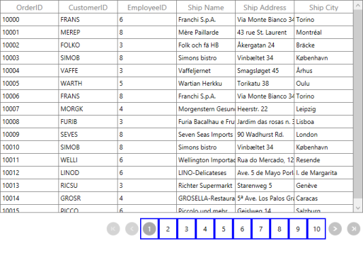

# Appearance

SfDataPager supports appearance styles by using the following properties.

* AutoEllipsisMode
* AccentBrush
* DisplayMode
* Orientation

## AutoEllipsisMode

The AutoEllipsis button is displayed when the page count is greater than numeric button count. The SfDataPager control allows you to define the AutoEllipsis button by using the AutoEllipsisMode property which is the Enum type. 

* AutoEllipsisMode – This Property is used to set the AutoEllipsisMode. By default, it is set to None.
* AutoEllipsisText– This property is used to change the AutoEllipsisButton Text.

The following table explains the different AutoEllipsisModes.

<table>
<tr>
<th>
 Enum Values</th><th>
Description</th></tr>
<tr>
<td>
 After</td><td>
Displays the ellipsis button after the numeric buttons.{{''|markdownify}}

</td></tr>
<tr>
<td>
 Before</td><td>
Displays the ellipsis button before the numeric buttons.{{''|markdownify}}

</td></tr>
<tr>
<td>
 Both</td><td>
Displays the ellipsis button before and after the numeric buttons.{{''|markdownify}}

</td></tr>
<tr>
<td>
None</td><td>
It does not display the AutoEllipsisButton.</td></tr>
</table>

N> By Default AutoEllipsisMode is set to None.

The following code example explains how to change the AutoEllipsisbuttontext.


<Window.DataContext>

<local:ViewModel/>

</Window.DataContext>

<Grid>

        <Grid.RowDefinitions>

            <RowDefinition Height="*" />

            <RowDefinition Height="Auto" />

        </Grid.RowDefinitions>

<sfgrid:SfDataGrid AutoGenerateColumns="True" 

                   ItemsSource="{Binding ElementName=sfDataPager,

                   Path=PagedSource}"/>

<datapager:SfDataPager x:Name="sfDataPager" 

                         AutoEllipsisMode="After"

                         NumericButtonCount="10"

                         AutoEllipsisText="...etc" 

                         PageSize="16" 

                         Source="{Binding OrdersDetails}" />

<Grid>



The following screenshot displays the output for AutoEllipsisText changed as …etc.

## AccentBrush

AccentBrush properties are used to decorate the SfDataPager control with a solid color. There are two AccentBrush properties in the SfDataPager control:

* AccentBackground – Property that is applied to the background color for NavigationButtons and current selected numeric page button. By default, it set to DarkGray.
* AccentForeground – Property that is applied to the foreground color for the current selected numeric page button. By default, it set to White.
* NumericButtonStyle – Property that is applied to the Style of Numeric Button. This is the Style type property. By default, it set to Null.

The following code example explains how to apply the AccentBackground and AccentForeground properties for the SfDataPager control.



<Window.DataContext>

  <local:Viewmodel/>

</Window.DataContext>

<sfgrid:SfDataGrid AutoGenerateColumns="True" 

                   ItemsSource="{Binding ElementName=sfDataPager,

                   Path=PagedSource}"/>

<datapager:SfDataPager x:Name="sfDataPager"

                         AccentBackground="#FF8CBF26"

                         AccentForeground="White" 

                         NumericButtonCount="10"      

                         PageSize="16"

                         Source="{Binding OrdersDetails}" />



The following screenshot displays the output for AccentBackground and AccentForeGround applied to the SfDatapager.

The following code example explains how to use NumericButtonStyle in SfDataPager.



<Window.DataContext>

  <local:Viewmodel/>

</Window.DataContext>

<Window.Resources>

</Window.Resources>

<sfgrid:SfDataGrid AutoGenerateColumns="True" 

                   ItemsSource="{Binding ElementName=sfDataPager,

        Path=PagedSource}"/>

<datapager:SfDataPager x:Name="sfDataPager" 

                         AutoEllipsisMode="Both"

                         AccentBackground="DodgerBlue"  

                         NumericButtonCount="10" PageCount="16

                         Source="{Binding OrdersDetails}" />



The following screenshot displays the output of NumericButtonStyle.

## Display Modes

The SfDataPager control allows you to choose the elements that are visible in the control. This can be achieved by using the DisplayMode property.The following table explains the PageDisplayMode enum values.

<table>
<tr>
<th>
Enum Values</th><th>
Description</th></tr>
<tr>
<td>
FirstLastPreviousNextNumeric</td><td>
Displays all the navigation buttons and numeric page buttons.{{''|markdownify}}

</td></tr>
<tr>
<td>
FirstLastNumeric</td><td>
Displays the first page, last page navigation button and numeric page buttons.{{''|markdownify}}

</td></tr>
<tr>
<td>
PreviousNextNumeric</td><td>
Displays the previous, next page navigation buttons and numeric page buttons.{{''|markdownify}}

</td></tr>
<tr>
<td>
FirstLastPreviousNext</td><td>
Displays only the page navigation buttons. Numeric page buttons are not displayed.{{''|markdownify}}

</td></tr>
<tr>
<td>
FirstLast</td><td>
Displays only the first and last page navigation buttons.{{''|markdownify}}

</td></tr>
<tr>
<td>
PreviousNext</td><td>
Displays only the previous and next page navigation buttons.{{''|markdownify}}

</td></tr>
<tr>
<td>
Numeric</td><td>
Displays only the numeric page buttons.{{''|markdownify}}

</td></tr>
<tr>
<td>
First</td><td>
Displays only the first page navigation button.{{''|markdownify}}

</td></tr>
<tr>
<td>
Last</td><td>
Displays only the last page navigation button.{{''|markdownify}}

</td></tr>
<tr>
<td>
Previous</td><td>
Displays only the previous page navigation button.{{''|markdownify}}

</td></tr>
<tr>
<td>
Next</td><td>
Displays only the next page navigation button.{{''|markdownify}}

</td></tr>
<tr>
<td>
None</td><td>
It does not display anything</td></tr>
</table>

N> By Default, DisplayMode is set to FirstLastPreviousNextNumeric.

## Orientation

SfDataPager allows you to arrange the child elements either horizontally or vertically.  This can be achieved by using the Orientation Property. Orientation is an Enum type.  The following table describes the Orientation enum values.

<table>
<tr>
<th>
Enum Value</th><th>
Description</th></tr>
<tr>
<td>
Horizontal</td><td>
This is the default enum value for Orientation.  Arranges all the Navigation Buttons and Numeric Buttons Horizontally.{{''|markdownify}}

</td></tr>
<tr>
<td>
Vertical</td><td>
Arranges all the Navigation Buttons and Numeric Buttons Vertically.{{''|markdownify}}

</td></tr>
</table>
