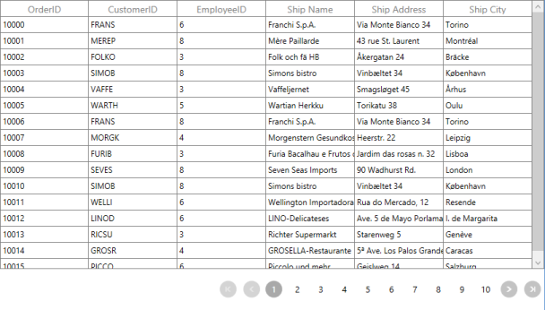
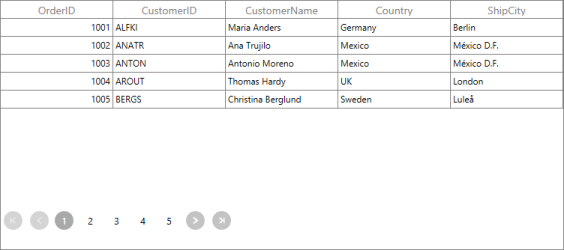
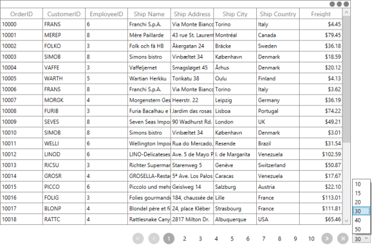
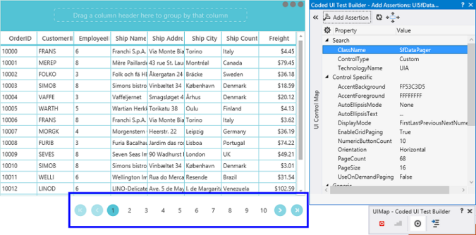

## Features

This section explains the key Features of SfDataPager.

* DataBinding
* Appearance
* PageNavigation
* On DemandPaging
* UIAutomation
### DataBinding

Databinding is the master feature of SfDataPager. SfDataPager is bound to an external data source to display the data. 

#### Source and PagedSource

SfDataPager exposes the Source property, where you can pass your collection of data for Paging. SfDataPager automatically wrap the collection in the PagedCollectionView and exposes to the PagedSource property. You can pass the PagedSource property to any ItemsControl’s ItemsSource property.

The following code example explains how to use the Source and PagedSource property.

[XAML]

&lt;Window.DataContext&gt;

  &lt;local:Viewmodel/&gt;

&lt;/Window.DataContext&gt;

&lt;Grid&gt;

        &lt;Grid.RowDefinitions&gt;

            &lt;RowDefinition Height="*" /&gt;

            &lt;RowDefinition Height="Auto" /&gt;

        &lt;/Grid.RowDefinitions&gt;

        <sfgrid:SfDataGrid AutoGenerateColumns="True" 

                                         ItemsSource="{Binding ElementName=sfDataPager,

                                                                   Path=PagedSource}"/>

         <datapager:SfDataPager x:Name="sfDataPager" 

                                                     Grid.Row="1"

                                                     NumericButtonCount="10"

                                                     PageSize="16" 

                                                     Source="{Binding OrdersDetails}" />

&lt;/Grid&gt;

The following screenshot displays the output of the above code.

PageIndex

{  | markdownify }
{:.image }

SfDataPager exposes the PageIndex property. It contains the index of the currently selected page.You can use this property to set or get the current page of the SfDataPager. 

Events

<table>
<tr>
<td>
Event</td><td>
Parameters</td><td>
Description</td></tr>
<tr>
<td>
PageIndexChanging</td><td>
 OldPageIndex  NewPageIndex Cancel</td><td>
Event is triggered when the current page index is changing. By using this event, you can cancel the page navigation operation by setting Cancel{{ '__' | markdownify }}to true.</td></tr>
<tr>
<td>
PageIndexChanged</td><td>
 OldPageIndex NewPageIndex</td><td>
Event is triggered after the current page index is changed.</td></tr>
</table>
##### How to bind the PageCollection to the other controls?

SfDataPager automatically wraps the collection in PagedCollectionView and exposes to the PagedSource property. You can pass the PagedSource property to any ItemsControl’s ItemsSource property. Here, the PagesSource property is binded to the ListBox.

The following code explains how to use Source and PagedSource property in ListBox.

[XAML]

&lt;Window.DataContext&gt;

  &lt;local:Viewmodel/&gt;

&lt;/Window.DataContext&gt;

&lt;Grid&gt;

        &lt;Grid.RowDefinitions&gt;

            &lt;RowDefinition Height="*" /&gt;

            &lt;RowDefinition Height="Auto" /&gt;

        &lt;/Grid.RowDefinitions&gt;

         <ListBox ItemsSource="{Binding ElementName=sfDataPager,

                                       Path=PagedSource}" />

         <datapager:SfDataPager x:Name="sfDataPager" 

                                                     Grid.Row="1"

                                                     NumericButtonCount="10"

                                                     PageSize="10" 

                                                     Source="{Binding OrdersDetails}" />

&lt;/Grid&gt;

The following screenshot displays the output for ListView binded with PagedCollection.

{  | markdownify }
{:.image }

#### On DemandPaging

In normal paging, the entire data collection is initially loaded into the SfDataPager control. However, the SfDataPager control allows you to load the data for the current page dynamically. To enable on demand paging, set UseOnDemandPaging to true.__

On DemandPaging can be achieved by using the OnDemandLoading event and LoadDynamicItems method.

The OnDemandLoading event is triggered when the pager moves to the corresponding page. The OnDemandLoading event contains the following event arguments,

* StartIndex: Corresponding page start index.
* PageSize: Number of items to be load for that page.

In an OnDemandLoading event, you can use the LoadDynamicItems method to load the data for the corresponding page.

> _Note: In OnDemand paging, you cannot assign a value for the Source property._

The following steps help you to achieve an onDemand loading with the SfDataPager control.

1. Set the UseOnDemandPaging property to true.
2. Set the PageCount value for the SfDataPager control.

[XAML]

&lt;Window.DataContext&gt;

&lt;local:ViewModel/&gt;

&lt;/Window.DataContext&gt;

&lt;Grid&gt;

        &lt;Grid.RowDefinitions&gt;

            &lt;RowDefinition Height="*" /&gt;

            &lt;RowDefinition Height="Auto" /&gt;

        &lt;/Grid.RowDefinitions&gt;

<syncfusion:SfDataGrid x:Name="dataGrid"

                         AllowResizingColumns="True"

                         ColumnSizer="Star"

                         ItemsSource="{Binding                       Path=PagedSource,ElementName=sfDataPager}">

<datapager:SfDataPager x:Name="sfDataPager" 

                         OnDemandLoading="OnDemandDataLoading" 

                         PageCount="50"

                         PageSize="16" 

                         UseOnDemandPaging="True" />

3. Wire up the OnDemandLoading event of SfDataPager.

[C#]

private void OnDemandPageLoading(object sender, OnDemandLoadingEventArgs  args)

{           sfDataPager.LoadDynamicItems(args.StartIndex,source.Skip(args.StartIndex).Take(args.PageSize));

}

The following screenshot displays the output for OnDemandPaging,

{  | markdownify }
{:.image }

#### Page Size

SfDataPager splits the data into separate pages based on the PageSize. In order to specify the size of the page, you can use the PageSize property. By defaults, it is set to 0 and all the data is displayed in a single page.

The following code example explains how to use PageSize property in SfDataPager.

[XAML]

&lt;Window.DataContext&gt;

  &lt;local:Viewmodel/&gt;

&lt;/Window.DataContext&gt;

&lt;Grid&gt;

        &lt;Grid.RowDefinitions&gt;

            &lt;RowDefinition Height="*" /&gt;

            &lt;RowDefinition Height="Auto" /&gt;

        &lt;/Grid.RowDefinitions&gt;

        <sfgrid:SfDataGrid AutoGenerateColumns="True" 

                           ItemsSource="{Binding ElementName=sfDataPager,

        Path=PagedSource}"/>

        <datapager:SfDataPager x:Name="sfDataPager" Grid.Row="1"

                                 PageSize="5" 

                                 Source="{Binding OrdersDetails}" />

&lt;/Grid&gt;

The following screenshot displays the output for PageSize set as 5.

{  | markdownify }
{:.image }

##### How To

###### How to change the PageSize in Runtime

In general, the size of the page is defined in the PageSize property. In some cases, you may want to change it during the run time. The following code example explains how to change the size of the page during runtime for a ComboBox.

[XAML]

&lt;Window.DataContext&gt;

&lt;local:ViewModel/&gt;

&lt;/Window.DataContext&gt;

&lt;Grid&gt;

                &lt;Grid.RowDefinitions&gt;

                    &lt;RowDefinition Height="*" /&gt;

                    &lt;RowDefinition Height="Auto" /&gt;

                &lt;/Grid.RowDefinitions&gt;

                &lt;Grid.ColumnDefinitions&gt;

                    &lt;ColumnDefinition Width="*" /&gt;

                    &lt;ColumnDefinition Width="Auto" /&gt;

                &lt;/Grid.ColumnDefinitions&gt;

 &lt;StackPanel Grid.Column="1" Grid.Row="1" Height="20" Margin="3,0" Orientation="Horizontal"&gt;

   &lt;ComboBox Name="combobox"  SelectedIndex="0" ItemsSource="{Binding ComboBoxitem}" /&gt;

 &lt;/StackPanel&gt;

<sfgrid:SfDataGrid AutoGenerateColumns="True" 

                   ItemsSource="{Binding ElementName=sfDataPager,

                   Path=PagedSource}"/>

<datapager:SfDataPager x:Name="sfDataPager" 

                         AccentBackground="DodgerBlue"

                         NumericButtonCount="10"

                         Grid.Row="1"

                         PageSize="{Binding 

                         Path=SelectedValue,ElementName=combobox}"

                         Source="{Binding OrdersDetails}" />

&lt;Grid&gt;

The following screenshot displays the output for changing the PagSize value during runtime. 

{  | markdownify }
{:.image }

### Appearance

SfDataPager supports appearance styles by using the following properties.

* AutoEllipsisMode
* AccentBrush
* DisplayMode
* Orientation
#### AutoEllipsisMode

The AutoEllipsis button is displayed when the page count is greater than numeric button count. The SfDataPager control allows you to define the AutoEllipsis button by using the AutoEllipsisMode property which is the Enum type. 

* AutoEllipsisMode – This Property is used to set the AutoEllipsisMode. By default, it is set to None.
* AutoEllipsisText– This property is used to change the AutoEllipsisButton Text.

The following table explains the different AutoEllipsisModes.

<table>
<tr>
<td>
 Enum Values</td><td>
Description</td></tr>
<tr>
<td>
 After</td><td>
Displays the ellipsis button after the numeric buttons.
{:.image }
</td></tr>
<tr>
<td>
 Before</td><td>
Displays the ellipsis button before the numeric buttons.
{:.image }
</td></tr>
<tr>
<td>
 Both</td><td>
Displays the ellipsis button before and after the numeric buttons.
{:.image }
</td></tr>
<tr>
<td>
None</td><td>
It does not display the AutoEllipsisButton.</td></tr>
</table>

> _Note: By Default AutoEllipsisMode is set to None._

The following code example explains how to change the AutoEllipsisbuttontext.

[XAML]

&lt;Window.DataContext&gt;

&lt;local:ViewModel/&gt;

&lt;/Window.DataContext&gt;

&lt;Grid&gt;

        &lt;Grid.RowDefinitions&gt;

            &lt;RowDefinition Height="*" /&gt;

            &lt;RowDefinition Height="Auto" /&gt;

        &lt;/Grid.RowDefinitions&gt;

<sfgrid:SfDataGrid AutoGenerateColumns="True" 

                   ItemsSource="{Binding ElementName=sfDataPager,

                   Path=PagedSource}"/>

<datapager:SfDataPager x:Name="sfDataPager" 

                         AutoEllipsisMode="After"

                         NumericButtonCount="10"

                         AutoEllipsisText="...etc" 

                         PageSize="16" 

                         Source="{Binding OrdersDetails}" />

&lt;Grid&gt;

The following screenshot displays the output for AutoEllipsisText changed as …etc.

{  | markdownify }
{:.image }

#### AccentBrush

AccentBrush properties are used to decorate the SfDataPager control with a solid color. There are two AccentBrush properties in the SfDataPager control:

* AccentBackground – Property that is applied to the background color for NavigationButtons and current selected numeric page button. By default, it set to DarkGray.
* AccentForeground – Property that is applied to the foreground color for the current selected numeric page button. By default, it set to White.
* NumericButtonStyle – Property that is applied to the Style of Numeric Button. This is the Style type property. By default, it set to Null.

The following code example explains how to apply the AccentBackground and AccentForeground properties for the SfDataPager control.

[XAML]

&lt;Window.DataContext&gt;

  &lt;local:Viewmodel/&gt;

&lt;/Window.DataContext&gt;

<sfgrid:SfDataGrid AutoGenerateColumns="True" 

                   ItemsSource="{Binding ElementName=sfDataPager,

                   Path=PagedSource}"/>

<datapager:SfDataPager x:Name="sfDataPager"

                         AccentBackground="#FF8CBF26"

                         AccentForeground="White" 

                         NumericButtonCount="10"      

                         PageSize="16"

                         Source="{Binding OrdersDetails}" />

The following screenshot displays the output for AccentBackground and AccentForeGround applied to the SfDatapager.

{  | markdownify }
{:.image }

The following code example explains how to use NumericButtonStyle in SfDataPager.

[XAML]

&lt;Window.DataContext&gt;

  &lt;local:Viewmodel/&gt;

&lt;/Window.DataContext&gt;

&lt;Window.Resources&gt;

&lt;Style TargetType="datapager:NumericButton"&gt;

      &lt;Setter Property="BorderBrush" Value="Blue"/&gt;

      &lt;Setter Property="BorderThickness" Value="2"/&gt;

&lt;/Style&gt;

&lt;/Window.Resources&gt;

<sfgrid:SfDataGrid AutoGenerateColumns="True" 

                   ItemsSource="{Binding ElementName=sfDataPager,

        Path=PagedSource}"/>

<datapager:SfDataPager x:Name="sfDataPager" 

                         AutoEllipsisMode="Both"

                         AccentBackground="DodgerBlue"  

                         NumericButtonCount="10" PageCount="16

                         Source="{Binding OrdersDetails}" />

The following screenshot displays the output of NumericButtonStyle.

{  | markdownify }
{:.image }

#### Display Modes

The SfDataPager control allows you to choose the elements that are visible in the control. This can be achieved by using the DisplayMode property.The following table explains the PageDisplayMode enum values.

<table>
<tr>
<td>
Enum Values</td><td>
Description</td></tr>
<tr>
<td>
FirstLastPreviousNextNumeric</td><td>
Displays all the navigation buttons and numeric page buttons.
{:.image }
</td></tr>
<tr>
<td>
FirstLastNumeric</td><td>
Displays the first page, last page navigation button and numeric page buttons.
{:.image }
</td></tr>
<tr>
<td>
PreviousNextNumeric</td><td>
Displays the previous, next page navigation buttons and numeric page buttons.
{:.image }
</td></tr>
<tr>
<td>
FirstLastPreviousNext</td><td>
Displays only the page navigation buttons. Numeric page buttons are not displayed.
{:.image }
</td></tr>
<tr>
<td>
FirstLast</td><td>
Displays only the first and last page navigation buttons.
{:.image }
</td></tr>
<tr>
<td>
PreviousNext</td><td>
Displays only the previous and next page navigation buttons.
{:.image }
</td></tr>
<tr>
<td>
Numeric</td><td>
Displays only the numeric page buttons.
{:.image }
</td></tr>
<tr>
<td>
First</td><td>
Displays only the first page navigation button.
{:.image }
</td></tr>
<tr>
<td>
Last</td><td>
Displays only the last page navigation button.
{:.image }
</td></tr>
<tr>
<td>
Previous</td><td>
Displays only the previous page navigation button.
{:.image }
</td></tr>
<tr>
<td>
Next</td><td>
Displays only the next page navigation button.
{:.image }
</td></tr>
<tr>
<td>
None</td><td>
It does not display anything</td></tr>
</table>

_Note: By Default, DisplayMode is set to FirstLastPreviousNextNumeric._

#### Orientation

SfDataPager allows you to arrange the child elements either horizontally or vertically.  This can be achieved by using the Orientation Property. Orientation is an Enum type.  The following table describes the Orientation enum values.

<table>
<tr>
<td>
Enum Value</td><td>
Description</td></tr>
<tr>
<td>
Horizontal</td><td>
This is the default enum value for Orientation.  Arranges all the Navigation Buttons and Numeric Buttons Horizontally.
{:.image }
</td></tr>
<tr>
<td>
Vertical</td><td>
Arranges all the Navigation Buttons and Numeric Buttons Vertically.
{:.image }
</td></tr>
</table>

### PageNavigation

SfDataPager allows you to move from the current Page to various Pages.For example, when you want to move the CurrentPage to the last page directly, you can use the method MoveToLastPage() . When this method is called, the current page moves to the last page. 

SfDataPager provides the following methods for page navigations.

<table>
<tr>
<td>
Method</td><td>
Prototype</td><td>
Description</td></tr>
<tr>
<td>
MoveToFirstPage</td><td>
MoveToFirstPage()</td><td>
This method moves the current page index to the first page and displays the first page data.</td></tr>
<tr>
<td>
MoveToLastPage</td><td>
MoveToLastPage()</td><td>
This method moves the current page index to the last page and displays the last page data.</td></tr>
<tr>
<td>
MoveToNextPage</td><td>
MoveToNextPage()</td><td>
This method moves the current page index to the next page and displays the next page data. </td></tr>
<tr>
<td>
MoveToPreviousPage</td><td>
MoveToPreviousPage()</td><td>
This method moves the current page index to the previous page and displays the previous page data.</td></tr>
<tr>
<td>
MoveToPage</td><td>
MoveToPage(int pageIndex)</td><td>
This method moves the current page index to the corresponding page index that is passed as an argument.</td></tr>
</table>

#### How To

##### How to Interact with User before Page Changes

When you are working with Paging, you may be in Edit mode or in CurrentPage. In this case, you can stop navigating the Paging by using the PageIndexChanging event before changing the page.

The following example displays the MessageBox before the PageChanging,

[XAML]

&lt;Window.DataContext&gt;

&lt;local:ViewModel/&gt;

&lt;/Window.DataContext&gt;

&lt;Grid&gt;

        &lt;Grid.RowDefinitions&gt;

            &lt;RowDefinition Height="*" /&gt;

            &lt;RowDefinition Height="Auto" /&gt;

        &lt;/Grid.RowDefinitions&gt;

<sfgrid:SfDataGrid AutoGenerateColumns="True" 

                   ItemsSource="{Binding ElementName=sfDataPager,

                   Path=PagedSource}"/>

<datapager:SfDataPager x:Name="sfDataPager" 

                         NumericButtonCount="10"

                         PageSize="16" 

                         PageIndexChanging="sfDataPager_PageIndexChanging"

                         Source="{Binding OrdersDetails}" />

&lt;Grid&gt;

[C#]

void sfDataPager_PageIndexChanging(object sender, PageIndexChangingEventArgs args)

  {       

     MessageBoxResult result = MessageBox.Show("Do you want to change the page?", "Confirm", MessageBoxButton.YesNo);

         if (result == MessageBoxResult.No)

         {

           args.Cancel = true;

         }

  }

### UIAutomation

SfDataPager supports the following UIAutomation,

* CodedUI
* Quick Test Proffessional
#### CodedUI

SfDataPager supports CodedUITest automation that helps you to create an automation test with SfDataPager elements and record the sequence of actions.

There are three levels of support in CodedUITest for SfDataPager

{  | markdownify }
{:.image }

<table>
<tr>
<th>
Levels</th><th>
Description</th></tr>
<tr>
<th>
Level – 1</th><th>
Record and Detects the UI Elements when the actions in the Control is performed.</th></tr>
<tr>
<th>
Level – 2</th><th>
Provides custom properties for UI elements when you drag the Cross hair to any UI element.</th></tr>
<tr>
<th>
Level – 3</th><th>
CodedUITest Builder generates code from the recorded session and you need to implement custom class to access custom properties, so the generated code is simplified.</th></tr>
</table>

To know more about CodedUITest, refer to the [link](http://help.syncfusion.com/ug/wpf/Documents/codeduitest.htm).

The following screenshot displays the SfDataPager properties when you drag the crosshair to the SfDataPager

{  | markdownify }
{:.image }

The following table describes the properties of SfDataPager.

<table>
<tr>
<td>
  UI Element</td><td>
Properties</td></tr>
<tr>
<td>
SfDataPager</td><td>
* AccentBackground* AccentForeground* AutoEllipsisMode* AutoEllipsisText* DisplayMode* EnableGridPaging* NumericButtonCount* Orientation* PageCount* PageSize* UseOnDemandPaging</td></tr>
</table>

#### Quick Test Professional

SfDataPager supports QTP test. You can record the actions perfomed in the control by the corresponding method name with Syncfusion namespace. To know more about QTPtest, refer to the [link](http://help.syncfusion.com/ug/wpf/Documents/quicktestprofessionalqtp.htm)

The following screenshot displays the QTP Test for SfDataPager

{  | markdownify }
{:.image }

The following table describe the methods of SfDataPager.

<table>
<tr>
<th>
Method</th><th>
Description</th><th>
Parameters </th><th>
Return Type </th></tr>
<tr>
<th>
void SetCurrentPage(int pageIndex</th><th>
To set the current page in SfDataPager</th><th>
 Int pageIndex</th><th>
Void</th></tr>
</table>

